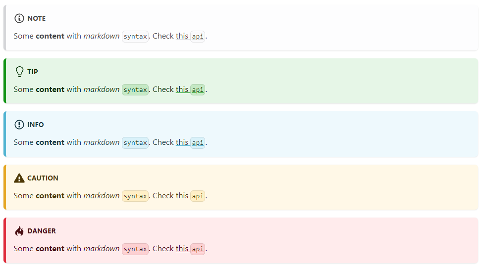

# Naviga Analytics Docs


This website is built using [Docusaurus 2](https://docusaurus.io/), a modern static website generator.

## Assets in Docs

Anything you store in the **docs** directory can be accessed either by using markdown syntax or html.  This means that you can create an images directory to store your images in and a videos directory to store videos in.  For downloadable files you will want to use the Static method of storage.

All files other than **Markdown** or **MDX** will be **hashed** and copied to the assets directory in the build folder.  The other file types (images, pdfs, etc) will be stored in folders that Docusaurus deems appropriate.  For example, *mp4* files will be stored in a `media `directory, *tgz/zip* files will be stored in a `files` directory.  We don't have to worry about where it stores the files as it will resolve that when building our HTML.

> When referencing items always using a forward slash "/" to separate directories.  If you deploy on Linux, "\\" will cause issues.

**Markdown**

The below will create a link to the pdf file

`[ebook.pdf](pdfs/ebook.pdf)`

> NOTE: If there is a space in the filename enclose in angle brackets! `<space in file.pdf>`

**HTML**

`<a  target="_blank"  href={require('./pdfs/ebook.pdf').default}>  Download this PDF in pdf folder</a>`

> NOTE: Any files in the assets folders will be copied to the assets folder once build and **hashed** and stored in a folder appropriate to its type.  This means that the filename will be different than what you referenced in your markdown (usually with a hash code appended to the name).  For images, this is fine, but you may not want this for downloadable files.
> For files you do not want hashed, you will use the **Static** method of storing and accessing the files.


### Images

There is an `informer` directory in the `docs` folder. The `images`directory in the informer directory will contain images used in the docs:

`docs/informer/images`

To access these within your markdown files use following:
``

### Video Files

You should copy your video files into the `docs/informer/videos/` folder also.

```html
<div>
  <video width="800px" controls>
  <source src={require('./videos/video=file-name.mp4').default}/>
</video>
</div>
```

### Static or Downloadable Files

For other files that you want to retain their filenames (i.e. not be hashed), usually these will be files that you want users to be able to download, you will want to store in the `static` directory that is at the root of your Docusaurus project.

Currently, there is a `downloads` folder where all downloadable content is stored.

`naviga-analytics-docs/static/downloads`

To access these files you will use the following syntax in your Markdown files:

`<a  target="_blank"  href="/folder-name-in-static-dir/downloadtest.zip">Download this Zip</a>`

I have found that if you try and create a download link using **Markdown** syntax, docusaurus will hash the file and copy it to the `assets `directory once built.

`[download tgz](./folder-name-in-static-dir/job-status.tgz)` ❌ Not recommended.

## Admonitions Markdown Syntax

[Docusaurus docs](https://docusaurus.io/docs/markdown-features/admonitions)

Admonitions allow you to highlight important information.  Within Markdown and MDX files you have the following available:



The following syntax will give you the default titles as shown above:

```markdown
:::note

Some **content** with _markdown_ `syntax`. Check [this `api`](#).

:::
```

The available options are:

- :::note
- :::tip
- :::info
- :::caution
- :::danger

If you want to replace the default title with your own, simply follow the admonition type with your title:

```markdown
:::danger Important!
Some **Important** content!
:::
```


