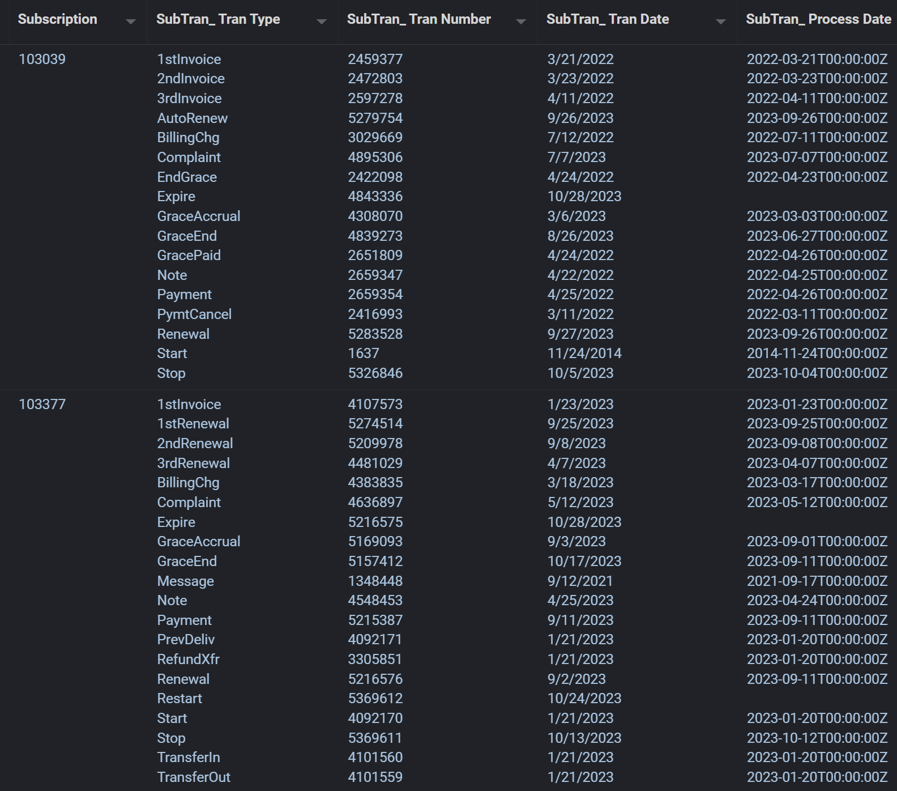
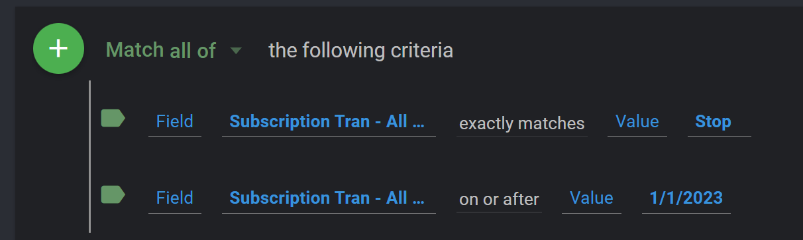
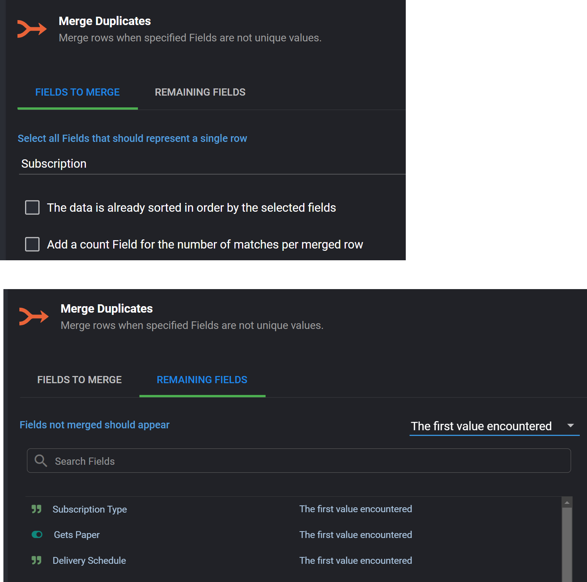
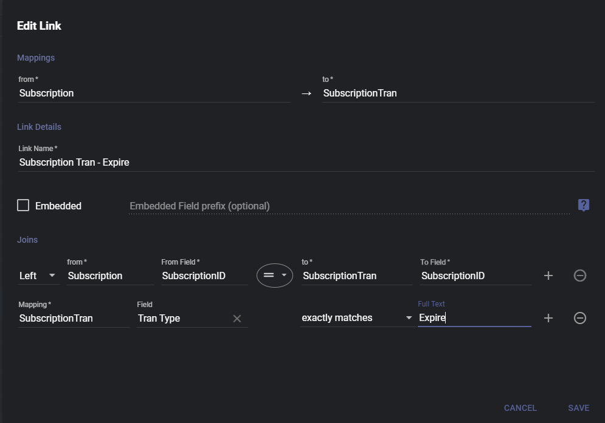

## Working Datasets

### Using Native SQL

It seems that we need to have the most recent **Subscription Tran** record for each **Tran Type ID**.  

To accomplish this I've created a dataset called **[SQL]-Sub Tran Most Recent**.  It is a *Native SQL* Dataset whose query reads the **SubscriptionTran** table grouping by the SubscriptionId and the TranTypeID to get the Max Tran Date for each SubscriptionId and TranTypeID.  We can then join this as an inline table back to the SubscriptionTran table to get all of the other values for that row.

```sql
SELECT st.*
FROM   (SELECT subscriptionid,
               trantypeid,
               Max(tranNumber) as MaxTranNumber
        FROM   pub.subscriptiontran
        GROUP  BY subscriptionid,
                  trantypeid) AS subTable,
       pub.subscriptiontran st
WHERE  subTable.subscriptionid = st.subscriptionid
       AND subTable.trantypeid = st.trantypeid     
       AND subTable.MaxTranNumber = st.trannumber   
       
-- NOT USED BELOW
-- This query is NOT used.  It is using the Max TranDate to determine the LAST one
-- Lynn W. mentioned that using teh TranNumber would be better since there will be
-- trantypeids that have teh same TranDate.
SELECT st.*
FROM   (SELECT subscriptionid,
               trantypeid,
               Max(trandate) AS MaxTranDate
        FROM   pub.subscriptiontran
        GROUP  BY subscriptionid,
                  trantypeid) AS subTable,
       pub.subscriptiontran st
WHERE  subTable.subscriptionid = st.subscriptionid
       AND subTable.trantypeid = st.trantypeid
       AND subTable.maxtrandate = st.trandate 
```

This table would be **loaded every morning** as it would be joined into to other datasets.

#### Example Usage

I have created the dataset -> **[SQL]-Churn and Stop Dataset** as an example.

Its base mapping is the **Subscription** table.  I then use the Flow Steps and use the "Fields from another Dataset" to link in the **[SQL]-Sub Tran Most Recent** dataset data.  The key to understand is that when doing this, we will get an array of SubscriptionTran records for the subscription.  To be exact, we will get the the most recent record for each trantypeId.

Here is an example of what it will look like:



:::tip

NOTE: You can get any field you need from the **SubscriptionTran** table, in the above example I'm just pulling a couple of fields needed for the calculating the Subscription Status field.

:::

The array of values is not useful and normalizing is also not useful.  It seems to me that we need to know these values at the subscription ID level.  To do that, we can iterate through these array values and pull our the information that is needed.

Here is an example Powerscript that does gets the information needed to calculate the Subscription status.  It does this by looping through the TranTypeId and checking what that Id is and then creating a new column for the fields needed.

```js
$record['subTranTranTypeId'].forEach((el, index) => {
    if (el === "Stop") {
        $record.lastStopDate = $record['subTranTranDa
                                       te'][index]
        $record.lastStopReasonCode = $record['subTranReasonCode'][index]
    }
    
    if (el === "Start") {
        $record.lastStartDate = $record['subTranTranDate'][index]
        $record.lastStartProcessDate = $record['subTranProcessDate'][index]
    }
    
    if (el === "Expire") {
        $record.lastExpireDate = $record['subTranTranDate'][index]
    }    
})
```

Based on those fields, we can calculate the **Subscription Status**

```js
//--------------------------
//--Calculate Sub Status ---
// GetsPaper | Subscriber 
// TRUE      | TRUE      => Active UNLESS DaysUntilExpire<0  => In Grace
// FALSE     | FALSE     => Former
// FALSE     | TRUE      => Temp Stop
// If Temp Stop Then need to check -> SubscriptionTran where SubscriptionTran.SubscriptionID = Subscription.SubscriptionID and
//                               SubscriptionTran.TranType = ‘Start’ and
//                               SubscriptionTran.ProcessDate = null
//      THEN -> Not Started Status
//----------------------------------------
isActive = $record['getsPaper'] && $record['subscriber']
isFormer = !$record['getsPaper'] && !$record['subscriber']
isTempStop = !$record['getsPaper'] && $record['subscriber']

$record.subStatus = "Unknown"

daysUntilExpire = moment($record['lastExpireDate']).diff(moment(),  "days")
if (isActive) {
  $record.subStatus = "Active" 
  if (daysUntilExpire < 0) {
    $record.subStatus = "In Grace"
  }   
}

if (isFormer) {
    $record.subStatus = $record['lastStopReasonCode'] === "NonRenew" ? "Perm Stop":  "Former"
}

if (isTempStop) {
  $record.subStatus = $record['lastStartProcessDate'] ? "Temp Stop" : "Not Started"
} 
```

#### Criteria Issues

We also want to be able to limit the data via the criteria so that we do not load all the data and then have to limit it in the Flow steps.

If we need to add criteria from the Subscription Tran table, we can do that, however,  I found it to cause **duplicates** in the data. 

For example, if I want to limit to only the Stops that have a tran date > 01/01/2023, I can do this, using the mapping relationship between the Subscription table and the Subscription Tran table.



However, this will cause duplicates.  This is because Informer creates a query that looks like this:

```sql
FROM   "PUB"."subscription" t0_0
       LEFT OUTER JOIN "PUB"."address" t1_0
                    ON t0_0."addressid" = t1_0."addressid"
       LEFT OUTER JOIN "PUB"."autorenewsubscription" t2_0
                    ON t0_0."subscriptionid" = t2_0."subscriptionid"
                       AND t2_0."enddate" IS NULL
       LEFT OUTER JOIN "PUB"."routesubscription" t3_0
                    ON t0_0."subscriptionid" = t3_0."subscriptionid"
                       AND t3_0."enddate" IS NULL
       LEFT OUTER JOIN "PUB"."occupant" t4_0
                    ON t0_0."occupantid" = t4_0."occupantid"
       LEFT OUTER JOIN "PUB"."subscriptiontran" t5_0
                    ON t0_0."subscriptionid" = t5_0."subscriptionid"
WHERE  ( t5_0."trantypeid" = ?
         AND t5_0."trandate" >= ? ) 
```

The LEFT OUTER JOIN will return multiple rows if the Subscription ID matches multiple rows in SubscriptionTran, which we do expect it to.

To mitigate this, you can add a Merge duplicates as the first Flow Step, merging on the Subscription ID and the **only** taking the **First value** from the other columns:




## Questions

- 

- Route Info - Subscription.SubscriptionId = RouteSubscription.SubscriptionId AND RouteSubscriptionEndDate is NULL??

  

- 


Tran Type - Grace, Payment

## Subscription Status

There is no "status" field, it needs to be calculated.  The following are the fields needed:

- **Subscription** -> **GetsPaper**
- **Subscription** -> **Subscriber**

| Subscriber | GetsPaper | STATUS    | Exception                           | Exception True |
| ---------- | --------- | --------- | ----------------------------------- | -------------- |
| TRUE       | TRUE      | Active    | Unless DaysUntilExpire < 0          | In Grace       |
| FALSE      | FALSE     | Former    |                                     |                |
| TRUE       | FALSE     | Temp Stop | Unless Start has not been Processed | Not Started    |

Given the above chart, we will get **5** Subscription Status values:

- **Active** - **Subscriber=true**, **GetsPaper=true** , **DaysUntilExpire NOT < 0**
- **In Grace** - **Subscriber=true**, **GetsPaper=true** , **DaysUntilExpire < 0**
- **Former**  - **Subscriber=false**, **GetsPaper=false**  
- **Temp Stop**  - **Subscriber=true**, **GetsPaper=false** , **Start ProcessedDate NOT Null**
- **Not Started**  - **Subscriber=true**, **GetsPaper=false** , **Start ProcessedDate IS Null**

**Days Until Expire**

You will need to look at the SubscriptionTran table's expire record for the subscription.  This is not easy in Informer.  Our current tactic is to create a relationship to the Subscription Tran and force only the proper Expire transactions to show in our link:



Then we use the following code to get the Days until Expire:

```js
daysUntilExpire = moment($record['subscription_tran_expire_tranDate']).diff(moment(),  "days")
```

**Start Processed Date**

The logic/joins for this information is as follows.

```sql
SubscriptionTran where SubscriptionTran.SubscriptionID = Subscription.SubscriptionID
   and SubscriptionTran.TranType = ‘Start’ 
   and SubscriptionTran.ProcessDate = null
```

However, the best way to isolate the Start trans will be to create a mapping relationship from the Subscription table:


The full code for this is:

```javascript
//--------------------------
//--Calculate Sub Status ---
// GetsPaper | Subscriber 
// TRUE      | TRUE      => Active UNLESS DaysUntilExpire<0  => In Grace
// FALSE     | FALSE     => Former
// FALSE     | TRUE      => Temp Stop
// If Temp Stop Then need to check -> SubscriptionTran where SubscriptionTran.SubscriptionID = Subscription.SubscriptionID and
//                               SubscriptionTran.TranType = ‘Start’ and
//                               SubscriptionTran.ProcessDate = null
//      THEN -> Not Started Status
//----------------------------------------
isActive = $record['getsPaper'] && $record['subscriber']
isFormer = !$record['getsPaper'] && !$record['subscriber']
isTempStop = !$record['getsPaper'] && $record['subscriber']

$record.subStatus = "Unknown"
daysUntilExpire = moment($record['subscription_tran_expire_tranDate']).diff(moment(),  "days")
if (isActive) {
  $record.subStatus = "Active" 
  if (daysUntilExpire < 0) {
    $record.subStatus = "In Grace"
  }   
}


if (isFormer) $record.subStatus = "Former"
if (isTempStop) {
  $record.subStatus = $record['subscription_tran_3_processDate'] ? "Temp Stop" : "Not Started"
} 
```

## Stops

