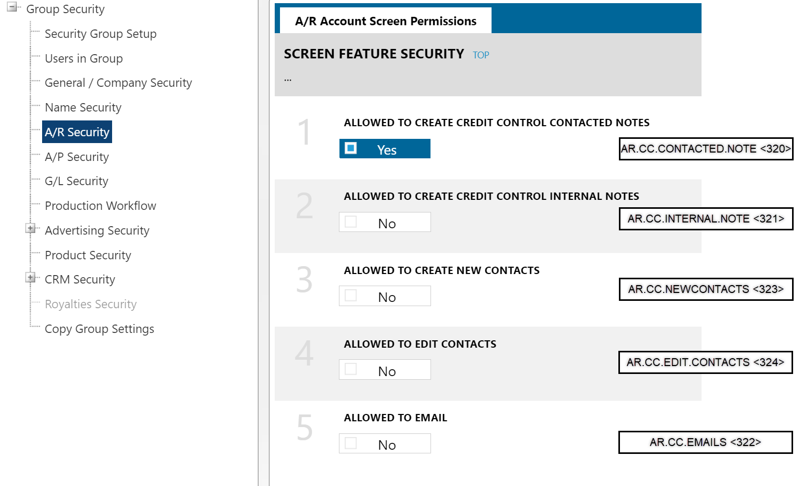
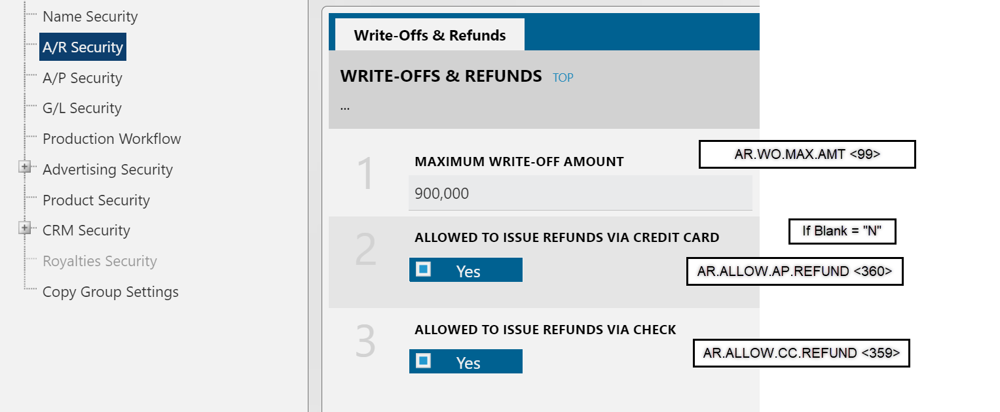

## Flexible Revenue Dataset

**Main Dataset**

- [**[NAVIGA]-AD Internet Orders With GL FLEXIBLE**](https://hnpbi.navigahub.com/datasets/2849bbb5-c7d1-4222-a657-887f18ad01a7)

**Dependencies**

- [**[JOIN]-GL To External GL**](https://hnpbi.navigahub.com/datasets/0e56cd6b-b005-4449-a9c7-5659be127559) - Joins on the **GL Code** and returns the External GL Code
- [**[JOIN]-Campaigns Journal Entries**](https://hnpbi.navigahub.com/datasets/f2662e21-b346-4e0f-b62a-34302d7302a1) - Joins on the **Campaign Id** and **Line Id** and returns revenue side of the journal entry.

:::info

Be sure to include the above dependencies in the refresh job for the Main dataset.

:::

## GEN Security Mapping

Working through documenting this mapping

### AR Settings

**Screen**

## Emails

### Weekly vs Monthly Posting

**Stasi**

We were thinking that if we did weekly billing/posting to GL that our PRINT based flexible campaigns would get ‘locked’ on a weekly basis. Let’s say we have a campaign that spans all the Sundays in September. We were hoping that after the first week the first Sunday would have a posted date of 9/5 (Monday when we post the previous week). Second Sunday would have a post date of 9/12, 3rd 9/19 and 9/26.

What Jeanne discovered is that when you do your first posting on 9/5, it posts the entire campaign. So we would be locking down revenue for the entire September schedule on 9/6.

This makes sense since you can only post “through” a period not a date. For some reason we just didn’t realize that we would end up with future ‘locked’ revenue.

So all of our September flex revenue will be locked on the first Monday in September. Same goes for every month after. Just something we need to keep in mind. Very different from the way we operate today.

**Russell**

Yes, all the Revenue for one Period is on the same Journal Entry. When the JE gets posted, all included GL Lines are posted. However, last week we were talking about NOT exporting the Naviga GL Posting until the end of each month. Instead, the Informer report would be used to determine what amounts get locked each week. It would be based not just on the Posted Date, but also on the Line-Item Date, so BOTH would have to be on/before 09/05 to lock that amount.

There is *something* you can do about it *in* Naviga, but it is very not practical. While you should (almost) never edit a JE generated by a Campaign, you can create other JE to manage the GL amounts in finer detail. For example, “I.xxxx.2” posts 4 Line Items for Sept. as you mentioned. User opens that JE for viewing and clicks the Reverse button to create “I.xxxx.2REV” then edits that JE to remove the GL Lines for 09/05 (which you want to post, so don’t reverse). Then the next week, user would open “I.xxxx.2REV” and click the Reverse button to create “I.xxxx.2REVREV” then edit so that only the GL Lines for 09/12 are included – reversing the prior removal is equal to posting it. Then repeat for 09/19 and 09/26.

### Suspense Accounts not showing on Missing GL report

We noticed when we ran our trial balance report that we had tons of suspense accounts which surprised me because our ‘Missing GL’ informer report has only had 1 GL in the past few weeks.

The reason the informer report doesn’t show a missing GL is because it uses the logic of get product, get GL type, find GL number from gl override. For these GLs, the overrides exist, therefore no issues according to our report.

In the system these same campaigns are actually showing the suspense GL. For the single campaign I looked at today (446), I know the GL override has been there since before that campaign was created, so how is it that it got the suspense account?  It is definitely possible that a campaign could get the suspense GL and someone could immediately notice and go add the GL override but not fix the campaign. This would be a problem because we want our report to catch these campaigns prior to invoicing.

How can we be sure the informer report is matching what is in the system. I thought the GL wasn’t saved anywhere and that’s why we had to derive it with supposedly the same logic used by the system. That is clearly not the case. Wonder if there is a way we see that 446 is going to the suspense account? 

### Derive Period from End Date

**Stasi**

We are afraid to play with this setting in our HNPTEST system because we don’t want to end up with a bunch of campaign that suddenly don’t follow the rules we’ve been following all throughout testing but we want to understand the impact.  It controls that period in which we would recognize revenue, correct?

If we set it to use end date then the period we see on the revenue allocation tab would be set using the Hearst fiscal period in which the END date of the campaign Line Item falls in for both performance and flexible campaigns, correct?   Today is sept 26, P10 Hearst fiscal period.   Using start date, our sept digital campaigns would recognize revenue in P9.  Using end date, our sept digital campaigns would recognize revenue in P10.

It doesn’t change anything for print since they are set to SPLIT LINES; so our start date = stop date for every line. 

For performance now you would recognize the revenue in the same period that it qualifies for billing (based off month end).
For flexible, you could potentially bill the campaign before you ever recognize the revenue, since you can bill anytime but would rev rec at month end.

What other things would be impacted by switching that setting?  Do we have the big picture?

**Russell**

Overall, that is my understanding as well. I am not aware of it having an effect other than Revenue Recognition (RevRec), because that is where Financial Period becomes relevant.

Note that it is possible to have Digital Products that are Date-based/Issue-based. In those cases, the Revenue Period is defined in the Issue Configuration rather than derived from the run dates.

Also, the potential billing issue as you describe it is the same for Performance and Flexible – the service dates (Performance) and Billing Schedule dates (Flexible) just give the user criteria for when it is supposed to be billed. Those dates criteria can be used to pull up the Orders and actually bill them at any time. What you might be trying to describe is that each Billing Date of a Flexible Campaign technically bills a portion of every Line Item for that Campaign, and some of those Line Items may not be having their RevRec until later (it may even be in later Periods, not just “this” Period defined by end-of-month).
