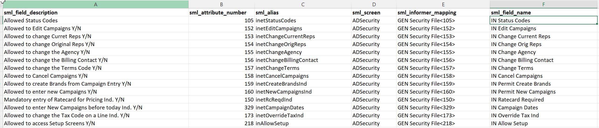
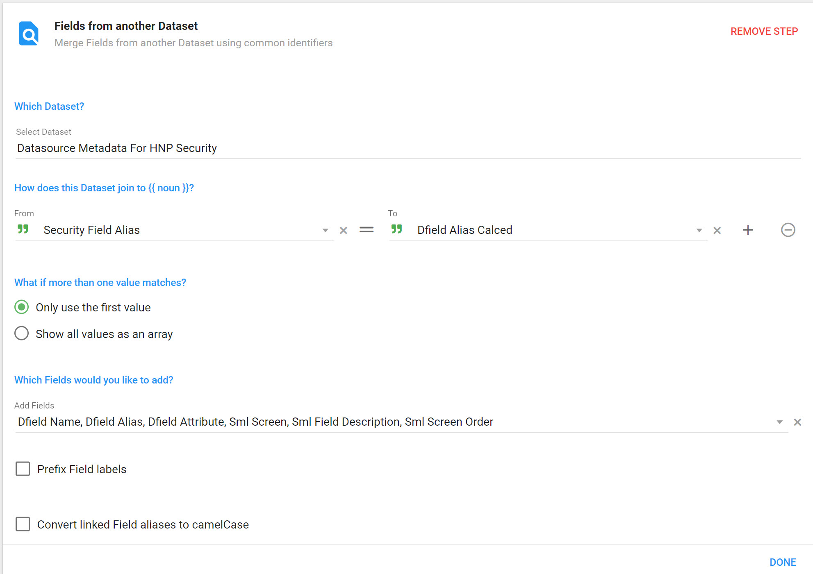
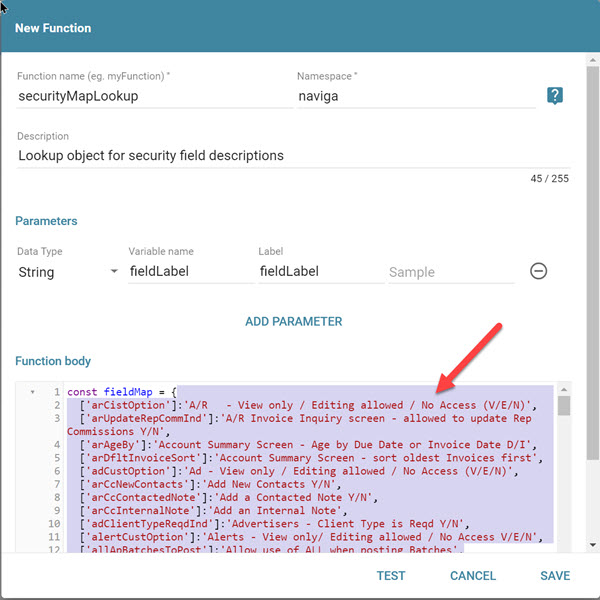
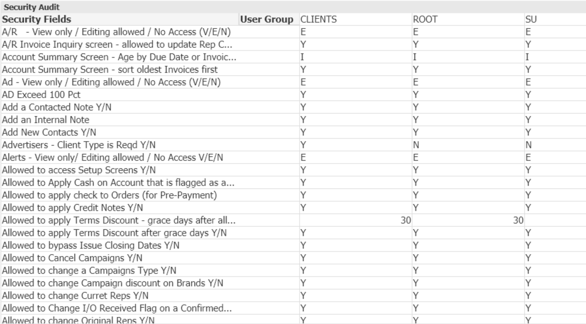
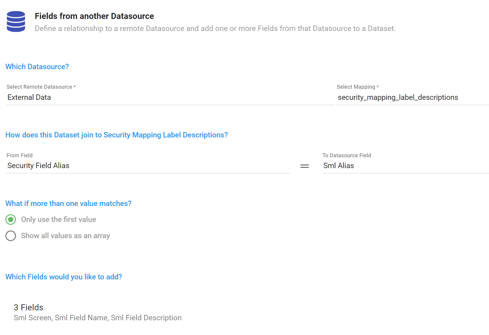

## Flexible Revenue Dataset

**Main Dataset**

- [**[NAVIGA]-AD Internet Orders With GL FLEXIBLE**](https://hnpbi.navigahub.com/datasets/2849bbb5-c7d1-4222-a657-887f18ad01a7)

**Dependencies**

- [**[JOIN]-GL To External GL**](https://hnpbi.navigahub.com/datasets/0e56cd6b-b005-4449-a9c7-5659be127559) - Joins on the **GL Code** and returns the External GL Code
- [**[JOIN]-Campaigns Journal Entries**](https://hnpbi.navigahub.com/datasets/f2662e21-b346-4e0f-b62a-34302d7302a1) - Joins on the **Campaign Id** and **Line Id** and returns revenue side of the journal entry.

:::info

Be sure to include the above dependencies in the refresh job for the Main dataset.

:::

## GEN Security Mapping

### Dynamic Report Final Version

:::info

The **Security** folder in the Dataset area holds the Security Reports.

**Sample files**

**<a  target="_blank"  href="/downloads/hnp-security-dev-crosstab-unwind-columns.tgz">Security Crosstab with Columns Sample Dataset</a>** - ***Dependent on*** Datasrouce MetaData for HNP Security

**<a  target="_blank"  href="/downloads/datasource-metadata-for-hnp-security.tgz">Datasource Metadata For HNP Security</a>** - ***Dependent on*** Security Mapping Spreadsheet

**<a  target="_blank"  href="/downloads/SecurityMappingLabelDescriptions.csv">Security Mapping Spreadsheet</a>**

:::

**Dynamic Building of Report**

Greg has made a spreadsheet that maps out the field alias, field attribute number and field description from the **GEN Security File** mapping. I then converted his format into a more "importable" format, which is the *Security Mapping Spreadsheet* above.

The thought is to use this spreadsheet in conjunction with metadata from Informer to build a mapping object that will pair the mapping field alias with a description.  Then, via Powerscript, "unwind" the table so that is appears more like this:

| User Group | Security Field Name          | Security Field Value |
| ---------- | ---------------------------- | -------------------- |
| ROOT       | Advertisers - Client type... | Y                    |
| ROOT       | Allowed to apply...          | N                    |
| ...        |                              |                      |
| CLIENT     | Advertisers - Client type... | N                    |
| CLIENT     | Allowed to apply...          | N                    |
| ...        |                              |                      |

We will then need to take the above format and create new fields for each **User Group** so that we can get a format like the image below:


#### Setup For Building Dataset

**Step 1 Create Upload spreadsheet**

Using Greg's spreadsheet that has descriptions for some of the fields in the GEN Security mapping, create a spreadsheet that has the following fields.  We will use the **attribute number** to join to the Metadata and the **Field Description** to build our new label.

The only fields we use in this version of the report are:

- sml_field_description
- sml_attribute_number
- sml_screen

:::tip

All other fields are for informational purposes.  If you find they are difficult to get into the spreadsheet, you can omit them.

:::



:::danger Important

Once you have created this file, you will upload it into a Workspace -> **Security Mapping Label Descriptions**

If you make any changes in the spreadsheet, you MUST upload and replace the data in the Workspace!

:::

**Step 2 "Datasource Metadata For HNP Security" Dataset**

The next step is to get Metadata for the GEN Security File mapping.  This dataset was created to get that information:

 [https://hnpbi.navigahub.com/datasets/MARK.MCCOID:datasource-metadata-for-hnp-security](https://hnpbi.navigahub.com/datasets/MARK.MCCOID:datasource-metadata-for-hnp-security)

If anything has changed in the Spreadsheet from Step 1 and you have uploaded it into the Workspace, you first need to refresh this dataset. 

Once refreshed, you can export it to excel for reference.  The fields of interest are:

- **Field Label Expression** - Used in the HNP Security dataset to update the label of fields with descriptions.
- **Condense Multi Valued Expression** - Used in the HNP Security dataset to convert multivalued fields to a string of values
- **Object Map Pair** - --NO LONGER NEEDED-- The key/value pairs *was* extracted and used to create a lookup object in the **naviga.securityMapLookup** saved function
- **SML Screen** - Informational value identifying which Naviga Screen this field comes from

*However*, the fields that contain the information you need for the Powerscripts in the final dataset can simply be **copied and pasted from the dataset.**  These are:

- **Final Field Label Expression** - NOT USED in the final dataset, but for informational purposes, you could use this code to **update the label of fields** with descriptions.
- **Final Object Map Pair** - --NO LONGER NEEDED-- The key/value pairs will be extracted and used to create a lookup object in the **naviga.securityMapLookup** saved function
- **Final Condense Multi Valued Expression** - Used in the HNP Security dataset to convert multivalued fields to a string of values.  
- **Final Alias Array** - Used in the HNP Security dataset to the field array will tell us the fields in the mapping to process.

#### Build the Final Dataset

To transform a dataset with 300+ columns to the above we will need to 

- The following arrays will be created:
  - UserGroup - will be the @id (User Group) field
  - SecurityFieldLabel - will be the column name
  - SecurityFieldValue - will be the column value
  - SecurityFieldAlias - used to join to the Dataset-> **Datasource Metadata For HNP Security**

We continue to push values onto these arrays (in the $local object so that they persist between rows) for every row.  

**Step 1**

Create a Dataset pointed to the GEN Security File mapping and then grab ALL of the fields.  

**ADD** *Criteria* 

- WHERE Group Name is Not Empty
  

**Step 2 - Flow Step Powerscript** 

In this Powerscript, we are defining the `$local.fieldsToLoop` array. This array is defined in the **Final Alias Array** field in the **Datasource Metadata For HNP Security** dataset.  Just copy and paste it after the "="

*Assign FieldsToLoop Local Array*

```javascript
// Create Array of field aliases that we will loop through and "unwind"
$local.fieldsToLoop = ['adClientTypeReqdInd',...,'adCustOption']
```


**Step 3 - Flow Step Powerscript**

This script can be modified to meet your needs.  Initially, there are many multivalued fields and if you are not sure how to handle them, it is best to simply convert the multiple values into a delimited string list.  The fun part is knowing which fields are multivalued.  Luckily, there is the **Datasource Metadata For HNP Security** dataset.  Simply run this dataset and copy the **Final Condense Multi Valued Expression** field.  It will contain the code that you need to convert all of the MV fields to string delimited.

As an example, the moduleAccessCombined code is showing that you can do custom edits with MV fields if needed.  the genWebModuleAccess and genWebModuleCodes are two MV fields that are associated and so, we added them into a single field.

:::caution

If you create a new field with values as we have done with **$record.moduleAccessCombined**, you will need to add that field name to the array **$local.fieldsToLoop** defined in Step 2 above.

:::

*Deal with MV Fields*

```javascript
// Deal with Multivalued fields
//-------------------------------
// Custom coversion of a multivalued field
moduleAccessCombined = $record['genWebModuleAccess'].map((el, index) => {
    return `${$record['genWebModuleCodes'][index]} = ${el}`
})

// Since we are creating a new field IT MUST be added to the fieldsToLoop array in the previous powerscript
$record.moduleAccessCombined = naviga.multiValuedToString(moduleAccessCombined, ", ", true)
//-------------------------------

// Convert all multivalued fields to strings - code from "Datasource Metadata For HNP Security" dataset
$record["inClientAccessCodes"] = naviga.multiValuedToString($record["inClientAccessCodes"], ",", false)
$record["inetStatusCodes"] = naviga.multiValuedToString($record["inetStatusCodes"], ",", false)
...
$record["incentiveAutoAdjustCodes"] = naviga.multiValuedToString($record["incentiveAutoAdjustCodes"], ",", false)
```


**Step 4 - Flow Step Powerscript**

Here is the script where we start the process of "unwinding" the fields.  This is done by creating 4 arrays for each of the final fields that we want. 

*Field Mapping*

```javascript
// GEN Security File Field Mapping
//-- Initialize the $local arrays
$local.UserGroup = $local.UserGroup || []
$local.SecurityFieldLabel = $local.SecurityFieldLabel || []
$local.SecurityFieldValue = $local.SecurityFieldValue || []
$local.SecurityFieldAlias = $local.SecurityFieldAlias || []


loopFields = $local.fieldsToLoop
// Loop through the field alias array and build three arrays that will be 
// the final three fields in the table
for (let i=0; i < loopFields.length; i++) {
    fieldName = loopFields[i]
    // Make sure field exists in dataset
    if ($fields[fieldName]) {
        $local.UserGroup.push($record['id']) 
        $local.SecurityFieldLabel.push($fields[fieldName].label + "_ZZZ")
        $local.SecurityFieldValue.push($record[fieldName])
        $local.SecurityFieldAlias.push(fieldName)
    }
}
```

**Step 5 - Flow Step Flush**

We need a flush step because we want to process all of the above steps before proceeding to the next Powerscript.

**Step 6 - Flow Step Powerscript**

*Local To Records*

```javascript
// Copy all of our $local persistant arrays that were created to
// records.  NOTE: These will be 4 large arrays.
// ALSO, since we only need ONE value (hence one row), we delete all other rows
// as we have aggregated the information we need into the below local arrays
if (!$local.firstTime) {
    $record.UserGroup = $local.UserGroup
    $record.SecurityFieldLabel = $local.SecurityFieldLabel
    $record.SecurityFieldValue = $local.SecurityFieldValue  
    $record.SecurityFieldAlias = $local.SecurityFieldAlias
    $local.firstTime = true
} else {
    $omit()
}
```

**Step 7 Flow Step Normalize**

Next we need to normalize on the four new fields we created above.

Add the Normalize Flow step and choose 

- UserGroup
- SecurityFieldLabel
- SecurityFieldValue
- SecurityFieldAlias

**Step 8 Flow Step Field from Another Dataset**

There is some information in our Datasource Metadata For HNP Security dataset that we need.

Join the **Security Field Alias** to the **Dfield Alias** and then pull in the following fields:

- **Dfield Name**
- **Dfield Alias**
- **Dfield Attribute**
- **Sml Screen**
- **Sml Field Description**



**Step 9 Flow Step Powerscript**

*Populate Final Field Description*

```javascript
// We expect some fields will not have a Description defined in the Workspace table, if not
// Populate with the original field Label.
$record['FinalFieldDescription'] = $record['smlFieldDescription'] || $record['SecurityFieldLabel']
```

:::tip

The completion of Step 9 will give you a dataset with the GEN Security File fields "Unwound".  Proceed to Step 10 to remove unneeded fields.  

However, if you want to convert this into a Crosstab style report that looks like the image below, **SKIP** Step 10 and proceed to **Step 11**.


:::

**Step 10 After Run**

After you have loaded the data, you will find that you have over 300 fields and you only want/need 4.  Click on the "Columns" button and deselect all fields except for the following.


:::danger

Do not use the Remove Fields flow steps to get rid of the fields.  Given how we are building the dataset, this causes issues when I tried in the past.  As new versions of Informer are released, this option could be tested again.

:::

**Step 11 Flow Step Powerscript**

To accomplish the output, we will need to take the User Group field and make all unique values in it their OWN field AND the values of each field must be the corresponding SecurityFieldValue values.

We are going to use the `naviga.calculateAggregates` saved function to help.  Make sure you have version 2, which includes the `type` option.

Using this function, we will group by the "UserGroup" field and do a special aggregation which will concatenate ALL the value from the following fields:

- **SecurityFieldValue** - The value for the Field Description.
- **FinalFieldDescription** - The final field description will be the new description from the spreadsheet, or if that doesn't exist it will be the original label for the field with an "_ZZZ" at the end.
- **SecurityFieldLabel** - This is the ORIGINAL label for the field.
- **SecurityFieldAlias** - This is the alias for the field
- **smlAttributeNumber** - The attribute number of the field.  NOTE: this will only be populated for fields that had a description in the spreadsheet/workspace

**Aggregation Step**

```javascript
// Define your group keys on the $record object so that
// you can reuse them in the Post Aggregation function
$record.groupKey1 = `${$record['UserGroup']}`;
groupKeys = [
  {
    name: "Group",
    groupKey: $record.groupKey1,
  }
];

groupAggr = [
  {
    name: "value",
    initValue: '',
    value: $record['SecurityFieldValue'],
      type:  'concatall'
  },
  {
    name: "desc",
    initValue: '',
    value: $record['FinalFieldDescription'],
      type:  'concatall'
  },
  {
    name: "label",
    initValue: '',
    value: $record['SecurityFieldLabel'].replace("_ZZZ", ""),
    type:  'concatall'
  },     
  {
    name: "screen",
    initValue: '',
    value: $record['smlScreen'],
    type:  'concatall'
  }, 
  {
    name: "attributeNum",
    initValue: '',
    value: $record['smlAttributeNumber'],
    type:  'concatall'
  },    
  {
    name: "alias",
    initValue: '',
    value: $record['SecurityFieldAlias'],
    type:  'concatall'
  },     
];

// Calling the calculate aggregates in a Powerscript
naviga.calculateAggregates({ $local, groupKeys, groupAggr });
```


**Step 12 Flow Step FLUSH**

```bash
#FLUSH Flow Step
```


**Step 13 Flow Step Powerscript**

This is where things get trickly.  We are still only working on the $local object.  This means that we need the values to persist.

In this step we should only have one row for each **UserGroup** field.  Each of these rows will have other fields that contain arrays of all the security fields and values.  We are going to store all of this information in a new Key on the $local object called **final**

NOTE that we store the User Group and value fields each time a new groupKey1 is encountered, HOWEVER, we only store the other field ONCE.  This is because the other fields are actually associated with the Field Values.  

For example, the field description might be "AD Can Open Something" and it will have "answers/values" for each user group.

These are the keys we will create on the final object.

- $local.final.fieldDesc_FINAL
- $local.final.screen_FINAL
- $local.final.fieldLabel_FINAL
- $local.final.attributeNum_FINAL
- $local.final.alias_FINAL

**Post Aggregation**

```javascript
// Get the group keys you defined in your Calc aggregations Powerscript
groupKey1 = $record.groupKey1

// GROUP KEY 1
if (!$local[groupKey1].GroupSet) {
  // Create a persistant "final" key on the local object
  $local.final = { ...$local.final, [`${groupKey1} Group`]: [] }
  $local.final[`${groupKey1} Group`] = $local[groupKey1].value;
  if (!$local.fieldDescDone) {
    $local.final.fieldDesc_FINAL = $local[groupKey1].desc 
    $local.final.screen_FINAL = $local[groupKey1].screen 
    $local.final.fieldLabel_FINAL = $local[groupKey1].label 
    $local.final.attributeNum_FINAL = $local[groupKey1].attributeNum
    $local.final.alias_FINAL = $local[groupKey1].alias     

    $local.fieldDescDone = true
  } 
    
  $local[groupKey1].GroupSet = true; //Setting to true means we will not excute this code again during the load.
} else { 
  $omit()
}
```


**Step 14 Flow Step FLUSH**

```bash
#FLUSH Flow Step
```


**Step 15 Flow Step Powerscript**

In this last Powerscript, the code loops over the keys in the final object and assigns them to an actual Record.   We just need to loop through and assign value in the keys to a $record name with the Key for each Key.

**Final Processing**

```javascript
if (!$local.stopProcessing) {
    for (key of Object.keys($local.final)) {
      $record[`${key}_VIEWFINAL`] = $local.final[key]
    }
    $local.stopProcessing = true
} else {
    $omit()
}
```

**Step 16 Flow Step Normalize**

The last step is to normalize your single row, which is now just Arrays.

You will want to select all the field that end with `VIEWFINAL`.  

**Step 17 Choose Columns**

The final step is to choose the columns to display.  The easiest way to do this, is to click on the Columns and, the same way you chose the fields in the Normalize step, search for `VIEWFINAL` and choose those fields.

---

---


### Dynamic Report Version 1

**Dynamic Building of Report**

Greg has made a spreadsheet that maps out the field alias, field attribute number and field description from the **GEN Security File** mapping.

The thought is to use this spreadsheet in conjunction with metadata from Informer to build a mapping object that will pair the mapping field alias with a description.  I can then, via Powerscript, change the label for the fields to their description.  This process will allow for the site to update the spreadsheet of descriptions with labels that they would prefer for each field if needed.

**Step 1 Create Upload spreadsheet**

Using Greg's spreadsheet that has descriptions for some of the fields in the GEN Security mapping, create a spreadsheet that has the following fields.  The hightlighted ones are the important ones.  We will using the **attribute number** to join to our Metadata and the **Field Description** to build our new label.


Once you have created this file, you will upload it into a workspace -> **Security Mapping Label Descriptions**

**Step 2 GEN Security File Metadata**

Get the Metadata from the mapping using https://hnpbi.navigahub.com/datasets/admin:gen-security-mapping-metadata

If anything has changed in the Spreadsheet from Step 1 and you have uploaded it into the Workspace, you first need to refresh this dataset. 

Once refreshed, export it to excel.  From the excel file, you will be using the following:

- **Field Label Expression** - Used in the HNP Security dataset to update the label of fields with descriptions.
- **Condense Multi Valued Expression** - Used in the HNP Security dataset to convert multivalued fields to a string of values
- **Object Map Pair** - The key/value pairs will be extracted and used to create a lookup object in the **naviga.securityMapLookup** saved function
- **SML Screen** - Informational value identifying which Naviga Screen this field comes from

**Step 3 Build the naviga.securityMapLookup saved Function**

This function is already created, but if you add or change any field descriptions, you will need to update the lookup object contained in the function.

Simply copy every Object Map Pair in the Excel spreadsheet, filtering out rows without a value and paste this into the function:




**Step 4 Build the GEN Security Dataset**

https://hnpbi.navigahub.com/datasets/admin:hnp-security-dev

You can add ALL the fields from the GEN Security Mapping File and then add the following Flow Steps:

- **Known calculations** - Powerscript -  This section can grow as you identify fields that need special processing:

  ```javascript
  moduleAccessString = $record['genWebModuleAccess'].map((el, index) => {
  	return `${$record['genWebModuleCodes'][index]} = ${el}`
  })
  
  $record.moduleAccessString = naviga.multiValuedToString(moduleAccessString, ", ", true)
  
  //
  $record.statusCodes = naviga.multiValuedToString($record['inetStatusCodes'], ", ", true)
  ```

  

- **Field Mapping** - Powerscript - simply copy every non blank entry in column **Field Label Expression** from the Spreadsheet in step 2 and paste into the Powerscript.

- **Multivalued Fields**- Powerscript - simply copy every non blank entry in column **Condense Multi Valued Expression** from the Spreadsheet in step 2 and paste into the Powerscript.  

- **Remove Fields** - Remove any fields that you don't need, but may have been used in the **Known Calculations** powerscript.

### Dynamic Report Version 2

:::info

**Sample files**

**<a  target="_blank"  href="/downloads/SecurityMappingLabelDescriptions.csv">Security Mapping Spreadsheet</a>**

**<a  target="_blank"  href="/downloads/datasource-metadata-for-hnp-security.tgz">Datasource Metadata For HNP Security</a>**

**<a  target="_blank"  href="/downloads/hnp-security-dev-crosstab-unwind.tgz">Security Crosstab Sample Dataset</a>**

:::

**Dynamic Building of Report**

Greg has made a spreadsheet that maps out the field alias, field attribute number and field description from the **GEN Security File** mapping.

The thought is to use this spreadsheet in conjunction with metadata from Informer to build a mapping object that will pair the mapping field alias with a description.  Then, via Powerscript, "unwind" the table so that is appears more like this:

| User Group | Security Field Name          | Security Field Value |
| ---------- | ---------------------------- | -------------------- |
| ROOT       | Advertisers - Client type... | Y                    |
| ROOT       | Allowed to apply...          | N                    |
| ...        |                              |                      |
| CLIENT     | Advertisers - Client type... | N                    |
| CLIENT     | Allowed to apply...          | N                    |
| ...        |                              |                      |

The above format should make it easier to product an end result as below.



#### Setup For Building Dataset

**Step 1 Create Upload spreadsheet**

Using Greg's spreadsheet that has descriptions for some of the fields in the GEN Security mapping, create a spreadsheet that has the following fields.  The hightlighted ones are the important ones.  We will using the **attribute number** to join to our Metadata and the **Field Description** to build our new label.


:::danger

Once you have created this file, you will upload it into a workspace -> **Security Mapping Label Descriptions**

:::

**Step 2 "Datasource Metadata For HNP Security" Dataset**

Get the Metadata from the mapping using [https://hnpbi.navigahub.com/datasets/MARK.MCCOID:datasource-metadata-for-hnp-security](https://hnpbi.navigahub.com/datasets/MARK.MCCOID:datasource-metadata-for-hnp-security)

If anything has changed in the Spreadsheet from Step 1 and you have uploaded it into the Workspace, you first need to refresh this dataset. 

Once refreshed, you can export it to excel for reference.  The fields of interest are:

- **Field Label Expression** - Used in the HNP Security dataset to update the label of fields with descriptions.
- **Condense Multi Valued Expression** - Used in the HNP Security dataset to convert multivalued fields to a string of values
- **Object Map Pair** - --NO LONGER NEEDED-- The key/value pairs *was* extracted and used to create a lookup object in the **naviga.securityMapLookup** saved function
- **SML Screen** - Informational value identifying which Naviga Screen this field comes from

*However*, the fields that contain the information you need for the Powerscripts in the final dataset can simply be copied and pasted from the dataset.  These are:

- **Final Field Label Expression** - NOT USED in this dataset, but for informational purposes, you could use this code to **update the label of fields** with descriptions.
- **Final Condense Multi Valued Expression** - Used in the HNP Security dataset to convert multivalued fields to a string of values
- **Final Object Map Pair** - --NO LONGER NEEDED-- The key/value pairs will be extracted and used to create a lookup object in the **naviga.securityMapLookup** saved function
- **Final Alias Array** - the field array will tell us the fields in the mapping to process.

#### Build the Final Dataset

To transform a dataset with 300 columns to the above we will need to 

- For every record, create three arrays:
  - UserGroup - will be the @id (User Group) field
  - SecurityFieldLabel - will be the column name
  - SecurityFieldValue - will be the column value
  - SecurityFieldAlias - used to join to the Workspace -> **Security Mapping Label Descriptions**

We continue to add to these arrays (in the $local object so that they persist between rows) for every row.  

**Step 1**

Create a Dataset pointed to the GEN Security File mapping and then grab ALL of the fields.  

**Step 2 - Flow Step Powerscript** 

*Assign FieldsToLoop Local Array*

```javascript
// Create Array of field aliases that we will loop through and "unwind"
$local.fieldsToLoop = ['adClientTypeReqdInd',...,'adCustOption']
```


**Step 3 - Flow Step Powerscript**

This script can be modified to meet your needs.  Initially, there are many multivalued fields and if you are not sure how to handle them, it is best to simply convert the multiple values into a delimited string list.  The fun part is knowing which fields are multivalued.  Luckily, there is the **Datasource Metadata For HNP Security** dataset.  Simply run this dataset and copy the **Final Condense Multi Valued Expression** field.  It will contain the code that you need to convert all of the MV fields to string delimited.

As an example, the moduleAccessCombined code is showing that you can do custom edits with MV fields if needed.  the genWebModuleAccess and genWebModuleCodes are two MV fields that are associated and so, we added them into a single field.

:::caution

If you create a new field with values as we have done with **$record.moduleAccessCombined**, you will need to add that field name to the array **$local.fieldsToLoop** defined in Step 2 above.

:::

*Deal with MV Fields*

```javascript
// Deal with Multivalued fields
//-------------------------------
// Custom coversion of a multivalued field
moduleAccessCombined = $record['genWebModuleAccess'].map((el, index) => {
    return `${$record['genWebModuleCodes'][index]} = ${el}`
})

// Since we are creating a new field IT MUST be added to the fieldsToLoop array in the previous powerscript
$record.moduleAccessCombined = naviga.multiValuedToString(moduleAccessCombined, ", ", true)
//-------------------------------

// Convert all multivalued fields to strings - code from "Datasource Metadata For HNP Security" dataset
$record["inClientAccessCodes"] = naviga.multiValuedToString($record["inClientAccessCodes"], ",", false)
$record["inetStatusCodes"] = naviga.multiValuedToString($record["inetStatusCodes"], ",", false)
...
$record["incentiveAutoAdjustCodes"] = naviga.multiValuedToString($record["incentiveAutoAdjustCodes"], ",", false)
```


**Step 4 - Flow Step Powerscript**

Here is the script where we start the process of "unwinding" the fields.  This is done by creating 4 arrays for each of the final fields that we want. 

*Field Mapping*

```javascript
// GEN Security File Field Mapping
//-- Initialize the $local arrays
$local.UserGroup = $local.UserGroup || []
$local.SecurityFieldLabel = $local.SecurityFieldLabel || []
$local.SecurityFieldValue = $local.SecurityFieldValue || []
$local.SecurityFieldAlias = $local.SecurityFieldAlias || []


loopFields = $local.fieldsToLoop
// Loop through the field alias array and build three arrays that will be 
// the final three fields in the table
for (let i=0; i < loopFields.length; i++) {
    fieldName = loopFields[i]
    // Make sure field exists in dataset
    if ($fields[fieldName]) {
        $local.UserGroup.push($record['id']) 
        $local.SecurityFieldLabel.push($fields[fieldName].label + "_ZZZ")
        $local.SecurityFieldValue.push($record[fieldName])
        $local.SecurityFieldAlias.push(fieldName)
    }
}
```

**Step 5 - Flow Step Flush**

We need a flush step because we want to process all of the above steps before proceeding to the next Powerscript.

**Step 6 - Flow Step Powerscript**

*Local To Records*

```javascript
// Copy all of our $local persistant arrays that were created to
// records.  NOTE: These will be 4 large arrays.
// ALSO, since we only need ONE value (hence one row), we delete all other rows
// as we have aggregated the information we need into the below local arrays
if (!$local.firstTime) {
    $record.UserGroup = $local.UserGroup
    $record.SecurityFieldLabel = $local.SecurityFieldLabel
    $record.SecurityFieldValue = $local.SecurityFieldValue  
    $record.SecurityFieldAlias = $local.SecurityFieldAlias
    $local.firstTime = true
} else {
    $omit()
}
```

**Step 7 Flow Step Normalize**

Next we need to normalize on the four new fields we created above.

Add the Normalize Flow step and choose 

- UserGroup
- SecurityFieldLabel
- SecurityFieldValue
- SecurityFieldAlias

**Step 8 Flow Step Field from Another Datasource**

There is some information in our Workspace table that we need.  We are going to join to the datasource and pull it in:



**Step 9 Flow Step Powerscript**

*Populate Final Field Description*

```javascript
// We expect some fields will not have a Description defined in the Workspace table, if not
// Populate with the original field Label.
$record['FinalFieldDescription'] = $record['smlFieldDescription'] || $record['SecurityFieldLabel']
```


**Step 10 After Run**

After you have loaded the data, you will find that you have over 300 fields and you only want/need 4.  Click on the "Columns" button and deselect all fields except for the following.


:::danger

Do not use the Remove Fields flow steps to get rid of the fields.  Given how we are building the dataset, this causes issues when I tried in the past.  As new versions of Informer are released, this option could be tested again.

:::


---


### AR Settings

**Screen**


## Emails

### Weekly vs Monthly Posting

**Stasi**

We were thinking that if we did weekly billing/posting to GL that our PRINT based flexible campaigns would get ‘locked’ on a weekly basis. Let’s say we have a campaign that spans all the Sundays in September. We were hoping that after the first week the first Sunday would have a posted date of 9/5 (Monday when we post the previous week). Second Sunday would have a post date of 9/12, 3rd 9/19 and 9/26.

What Jeanne discovered is that when you do your first posting on 9/5, it posts the entire campaign. So we would be locking down revenue for the entire September schedule on 9/6.

This makes sense since you can only post “through” a period not a date. For some reason we just didn’t realize that we would end up with future ‘locked’ revenue.

So all of our September flex revenue will be locked on the first Monday in September. Same goes for every month after. Just something we need to keep in mind. Very different from the way we operate today.

**Russell**

Yes, all the Revenue for one Period is on the same Journal Entry. When the JE gets posted, all included GL Lines are posted. However, last week we were talking about NOT exporting the Naviga GL Posting until the end of each month. Instead, the Informer report would be used to determine what amounts get locked each week. It would be based not just on the Posted Date, but also on the Line-Item Date, so BOTH would have to be on/before 09/05 to lock that amount.

There is *something* you can do about it *in* Naviga, but it is very not practical. While you should (almost) never edit a JE generated by a Campaign, you can create other JE to manage the GL amounts in finer detail. For example, “I.xxxx.2” posts 4 Line Items for Sept. as you mentioned. User opens that JE for viewing and clicks the Reverse button to create “I.xxxx.2REV” then edits that JE to remove the GL Lines for 09/05 (which you want to post, so don’t reverse). Then the next week, user would open “I.xxxx.2REV” and click the Reverse button to create “I.xxxx.2REVREV” then edit so that only the GL Lines for 09/12 are included – reversing the prior removal is equal to posting it. Then repeat for 09/19 and 09/26.

### Suspense Accounts not showing on Missing GL report

We noticed when we ran our trial balance report that we had tons of suspense accounts which surprised me because our ‘Missing GL’ informer report has only had 1 GL in the past few weeks.

The reason the informer report doesn’t show a missing GL is because it uses the logic of get product, get GL type, find GL number from gl override. For these GLs, the overrides exist, therefore no issues according to our report.

In the system these same campaigns are actually showing the suspense GL. For the single campaign I looked at today (446), I know the GL override has been there since before that campaign was created, so how is it that it got the suspense account?  It is definitely possible that a campaign could get the suspense GL and someone could immediately notice and go add the GL override but not fix the campaign. This would be a problem because we want our report to catch these campaigns prior to invoicing.

How can we be sure the informer report is matching what is in the system. I thought the GL wasn’t saved anywhere and that’s why we had to derive it with supposedly the same logic used by the system. That is clearly not the case. Wonder if there is a way we see that 446 is going to the suspense account? 

### Derive Period from End Date

**Stasi**

We are afraid to play with this setting in our HNPTEST system because we don’t want to end up with a bunch of campaign that suddenly don’t follow the rules we’ve been following all throughout testing but we want to understand the impact.  It controls that period in which we would recognize revenue, correct?

If we set it to use end date then the period we see on the revenue allocation tab would be set using the Hearst fiscal period in which the END date of the campaign Line Item falls in for both performance and flexible campaigns, correct?   Today is sept 26, P10 Hearst fiscal period.   Using start date, our sept digital campaigns would recognize revenue in P9.  Using end date, our sept digital campaigns would recognize revenue in P10.

It doesn’t change anything for print since they are set to SPLIT LINES; so our start date = stop date for every line. 

For performance now you would recognize the revenue in the same period that it qualifies for billing (based off month end).
For flexible, you could potentially bill the campaign before you ever recognize the revenue, since you can bill anytime but would rev rec at month end.

What other things would be impacted by switching that setting?  Do we have the big picture?

**Russell**

Overall, that is my understanding as well. I am not aware of it having an effect other than Revenue Recognition (RevRec), because that is where Financial Period becomes relevant.

Note that it is possible to have Digital Products that are Date-based/Issue-based. In those cases, the Revenue Period is defined in the Issue Configuration rather than derived from the run dates.

Also, the potential billing issue as you describe it is the same for Performance and Flexible – the service dates (Performance) and Billing Schedule dates (Flexible) just give the user criteria for when it is supposed to be billed. Those dates criteria can be used to pull up the Orders and actually bill them at any time. What you might be trying to describe is that each Billing Date of a Flexible Campaign technically bills a portion of every Line Item for that Campaign, and some of those Line Items may not be having their RevRec until later (it may even be in later Periods, not just “this” Period defined by end-of-month).
