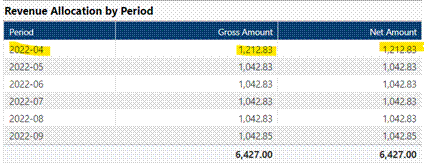
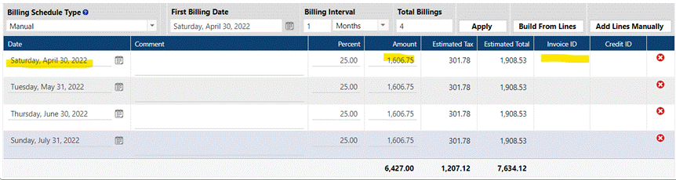
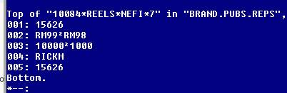
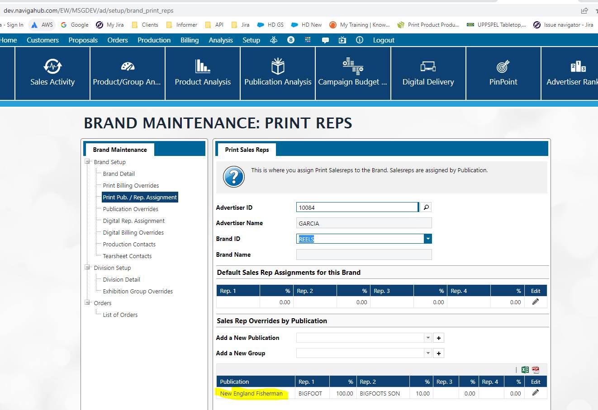
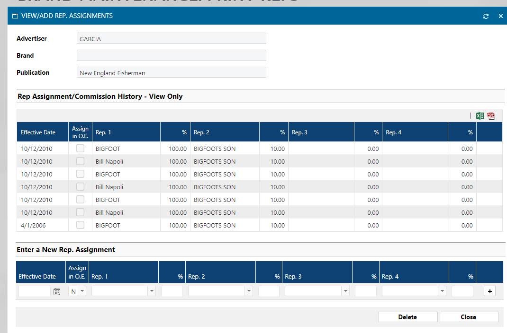
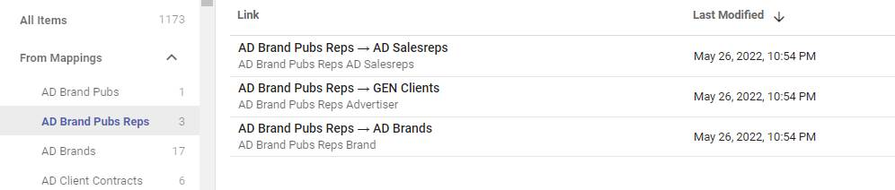

This document contains information that has not yet been proofed or decided where in the main documentation that it should live.

## Row Level Security Filter

Yes the Informer row filter looks at salesrep security at the user level and the pub/group security at the security group level.

Might be a few things going on here. From what Andrew Morovati @Entrinsik told me that the Row filter doesn’t apply to datasets so there’s that.

Our row filter handles the data selection and varies from file to file. This was something we had in Informer 4 and we had Andrew modify it to work with Informer 5 but he specified only for Ad Hoc Queries. 

AD Orders, Inet Campaigns, AD Internet Orders, User Reports are all using Salesrep/Publication security and I think on the circ/book side it’s at a company level. This is calling a program in Unidata called “INFORMER.ROW.FILTER”, passing in the User ID, security group and filename within Naviga Ad at the database level. That is probably why it won’t work with datasets because it can select data using elasticsearch without even getting to the database level and then there would be the issue of who created the dataset vs who runs reports from the dataset and they might have different group access entirely. I can understand why our plugin would not work in that case.

Here is the actual case statement that determines which filter to use by file:

```sql
BEGIN CASE
CASE DATAFILE = 'USER_REPORTS_DETAIL'
 ROUTINE.NAME = 'INFORMER.ROW.FILTER.AD'
CASE DATAFILE = 'ODBC_PBOOKINGS'
 ROUTINE.NAME = 'INFORMER.ROW.FILTER.AD'
CASE DATAFILE = 'INF_INET.ORDERS'
 ROUTINE.NAME = 'INFORMER.ROW.FILTER.AD'
CASE DATAFILE = 'INET.CAMPAIGNS'
 ROUTINE.NAME = 'INFORMER.ROW.FILTER.AD'
CASE DATAFILE = 'INF_REP.COMM.FILE'
 ROUTINE.NAME = 'INFORMER.ROW.FILTER.AD'
CASE DATAFILE = 'INF_CM.ACTION.ITEMS'
 ROUTINE.NAME = 'INFORMER.ROW.FILTER.AD'
*
\* circ files
*
CASE DATAFILE = 'INF_SU.SUB'
 ROUTINE.NAME = 'INFORMER.ROW.FILTER.CW'
CASE DATAFILE = 'INF_SU.PUB'
 ROUTINE.NAME = 'INFORMER.ROW.FILTER.CW'

*
\* book files
*
*
CASE DATAFILE = 'ODBC_BOOK_MASTER'
 ROUTINE.NAME = 'INFORMER.ROW.FILTER.BW'
CASE DATAFILE = 'ODBC_INV_DETAIL'
 ROUTINE.NAME = 'INFORMER.ROW.FILTER.BW'
CASE DATAFILE = 'INF_BOOK.CONTACTS'
 ROUTINE.NAME = 'INFORMER.ROW.FILTER.BW'
CASE DATAFILE = 'INF_BOOK.PRICES'
 ROUTINE.NAME = 'INFORMER.ROW.FILTER.BW'
CASE DATAFILE = 'INF_BOOK.SETS'
 ROUTINE.NAME = 'INFORMER.ROW.FILTER.BW'
CASE DATAFILE = 'INF_BROWSE.CATEGORY'
 ROUTINE.NAME = 'INFORMER.ROW.FILTER.BW'
CASE DATAFILE = 'INF_BW.SO.DETAIL'
 ROUTINE.NAME = 'INFORMER.ROW.FILTER.BW'
CASE DATAFILE = 'INF_BW.SO.SERIES'
 ROUTINE.NAME = 'INFORMER.ROW.FILTER.BW'
CASE DATAFILE = 'INF_BW.TEMPLATE'
 ROUTINE.NAME = 'INFORMER.ROW.FILTER.BW'
CASE DATAFILE = 'INF_BW.UNASSEMBLED.SETS'
 ROUTINE.NAME = 'INFORMER.ROW.FILTER.BW'
CASE DATAFILE = 'INF_HIST.ORD.DETAIL'
 ROUTINE.NAME = 'INFORMER.ROW.FILTER.BW'
CASE DATAFILE = 'INF_INV.ADJ'
 ROUTINE.NAME = 'INFORMER.ROW.FILTER.BW'
CASE DATAFILE = 'INF_INVENTORY.TRANS'
 ROUTINE.NAME = 'INFORMER.ROW.FILTER.BW'
CASE DATAFILE = 'INF_JOB-FILE'
 ROUTINE.NAME = 'INFORMER.ROW.FILTER.BW'
CASE DATAFILE = 'INF_ORD.DETAIL'
 ROUTINE.NAME = 'INFORMER.ROW.FILTER.BW'
CASE DATAFILE = 'INF_PICKLISTS.XREF'
 ROUTINE.NAME = 'INFORMER.ROW.FILTER.BW'
CASE DATAFILE = 'INF_PO.BOOK.XREF'
 ROUTINE.NAME = 'INFORMER.ROW.FILTER.BW'
CASE DATAFILE = 'INF_POD'
 ROUTINE.NAME = 'INFORMER.ROW.FILTER.BW'
CASE DATAFILE = 'INF_SALES.BOOK'
 ROUTINE.NAME = 'INFORMER.ROW.FILTER.BW'
CASE DATAFILE = 'INF_SALES.BOOK.CUST'
 ROUTINE.NAME = 'INFORMER.ROW.FILTER.BW'
CASE DATAFILE = 'INF_SALES.BWREPS.BOOK'
 ROUTINE.NAME = 'INFORMER.ROW.FILTER.BW'
CASE DATAFILE = 'INF_SALES.ROY.ERR'
 ROUTINE.NAME = 'INFORMER.ROW.FILTER.BW'
CASE DATAFILE = 'INF_STOCK.LOCATOR'
 ROUTINE.NAME = 'INFORMER.ROW.FILTER.BW'
CASE DATAFILE = 'INF_BOOK.REVIEWS'
 ROUTINE.NAME = 'INFORMER.ROW.FILTER.BW'

*
\* royalty files
*
CASE DATAFILE = 'INF_ROYALTY.CYCLE'
 ROUTINE.NAME = 'INFORMER.ROW.FILTER.ROY'
CASE DATAFILE = 'INF_ROY.MASTER'
 ROUTINE.NAME = 'INFORMER.ROW.FILTER.ROY'

*
\* Membership files
*
CASE DATAFILE = 'INF_MM.PRODUCTS'
 ROUTINE.NAME = 'INFORMER.ROW.FILTER.MM'
CASE DATAFILE = 'INF_MM.ORDDETAIL'
 ROUTINE.NAME = 'INFORMER.ROW.FILTER.MM'
CASE DATAFILE = 'INF_MM.ORDHEADER'
 ROUTINE.NAME = 'INFORMER.ROW.FILTER.MM'
*
```

## Taxes

From Wayne

> I believe we store the tax code on the order and calculate the tax amount, I don’t believe we actually store taxes until billing. 
>
> One would need to look at tax code and at the taxable yes/no flag in order to calculate taxes.
>
> Canada is particularly vexing as they have layered tax codes, all provinces apply the federal tax, and then on top of that they apply a state tax.
>
> There is a “cumulative” flag on the tax code setup that asks if the calculation of the second amount includes the amount applied on the first tax (so on a $100 order where first tax is $10 are we applying second tax to $100 or to $110)

From Greg

> Wayne is correct the tax is calculated at billing and there is a tax code on the client record but there can also be override tax code on the publication.


## Invoice Data

Invoice IDs are stored differently for Flexible and Performance Campaigns, so you would have to at least have 2 columns, but maybe 2 separate reports. This may not be an issue if GMG uses one type exclusively.

Flexible – INET.CAMPAIGNS<28> Billing Schedule Invoice ID, also Billing Schedule Amount is in F27

Something to watch for is if they bill 2 (or more) Schedule Dates together than an Invoice ID might appear twice in this field. If the Amount comes from the linked table instead of from the Billing Schedule, then it could over-report.

 

Performance – INET.ORDERS<80> Month Invoice ID, also Month Actual Amount is in F76 (note also that Credits are stored in F81 which adds additional complexity for a global report)

Here again, multiple INET.ORDERS could be combined onto one Invoice during billing so care needs to be taken to avoid doubling up on Amounts.

 

Finally, if the base table is Campaigns, in my experience Informer will always pass F28 as the Invoice ID to lookup in the Invoices table even if the path to display the Invoice ID goes through the Orders table (Performance Campaigns). Likewise, if the base table is Orders it always passes F80 as the Invoice ID to lookup even if the path to display the Invoice ID goes through the Campaigns table (Flexible Campaigns). 

 

If it still works this way ,then you would either have to do Flexible and Performance on different reports to get the correct data from the Invoice table. Or have one report for Invoice IDs based on Campaigns table and another report for Invoice Amounts based on Invoices table (if you don’t use Billing Schedule Amount/Month Actual Amount because it isn’t the actual “Invoice Amount”).


Technically only F27 should be used. This will be populated regardless of whether there is an Invoice ID in F28 – it is the amount scheduled to be billed, not actually billed. Only the presence of data in F28 gives it the “actually billed” status. Also, the Billing Schedule total is supposed to add up to the Campaign total (sum of F21/F22). However, it can get out-of-synch so understandable to use a different valuation for comparison.

 

No, F21/F22 do not have the same granularity as F27. One of the main features of Flexible Campaigns is the ability to bill on a different schedule than Revenue. F22 (net revenue) would be less Agency Commission – if F21/F22 are different, then F22 is going to be what is comparable to F27. Informer should be set to report a total sum of the multi-values (I4 did this with a java script) instead of each piece.

 

https://dev.navigahub.com/ew/devdigital/ad/campaign_revenue_summary?ID=9551

Table displaying F20, F21, F22 (Revenue Allocation)



 

Table displaying F26, F27, F28 (Billing Schedule)



## Campaign Start/End Dates

The campaign start and end dates are defining the absolute outside edges of the campaign.

It defaults dates in to each line (speeding line entry), it prevents entry of a line starting/ending outside of the range (minimizing error) and it provides a way to report on expiring campaigns.

Each line item could run for the entire length of the campaign, or any one line may run just for a portion of the campaign.

I might purchase a digital line that runs for the entire start/end range but may choose to purchase only one print issue, so while my digital line start/end = campaign start/end my print line may not.

I could also purchase multiple different sizes/positions and that would result in multiple lines each with their start end which may be less than the total length of campaign

##  Brands

Asked Greg for info on how brands work.  Emails below.

**Email 1**

We may need to add a new link. The brand key is the CLIENT.ID*BRAND.ID.

You are correct the clients file stores a list of brands in CLIENTS<30> if the company was set up to use brands.  I believe we create an “XX” brand for “AD” type clients even if they aren’t using brands but if it is set up as an agency we do not create any brands so we need to create the missing link from Clients to Brands and cross my fingers because virtual field links in Informer are iffy but I think the last one we made actually worked but this one is a little more virtual. I would need to loop through CLIENTS<30> to create the link.

**Email 2**

I think I forgot to answer your question about how they are related but I’ll give you the thumbnail sketch. Each company might want to be broken down into subdivisions without having to enter separate companies. For example Ford might be the main company but wants to have separate campaigns for Explorer, Fusion, and Fiesta. The difficult decision is a company like Proctor and Gamble, would you set up the brand for a product type like “air fresheners” or go even more narrow down to the SKU level for every single product.

For each Client record then we allow them to create unlimited number of brands which could also entail separate PIB codes, ad agencies and salereps all associated with that brand. Even if they decide they are NOT using brands we create a default XX brand just so that everything in order entry keeps working as far as they know.

The Agencies do not have brands.

 

Next I created an idescriptor that I got working that will link the GEN CLIENTS to AD BRANDS so if they want to create a report using the GEN Clients mapping they can link to the AD Brands and pull the description etc.

### Brands and Brand Reps

For print there is the following relationship which has been around longer than I’ve been associated with MSG… which is my way of saying don’t blame me…lol…

 

You could start with clients which stores a list of BRANDS on CLIENTS<30>


 

PRODCAMP is the brand record CLIENT.ID*BRAND.ID

 

BRAND.PUBS is a middle tier CLIENT.ID*BRAND.ID*PUB.ID

Stores the effective date and counter which is a bit redundant 

 

 


 

 

 

BRAND.PUBS.REPS is CLIENT.ID*PUB.ID*PUB.ID*[COUNTER]



 

So every time the rep is reassigned with a new effective date for the same brand/pub/rep the counter is incremented.

 



 

 

When you edit this line you will see all seven assignments:

 



 

For rep reporting I would recommend starting with Brand Pubs Reps and link from there:

 


