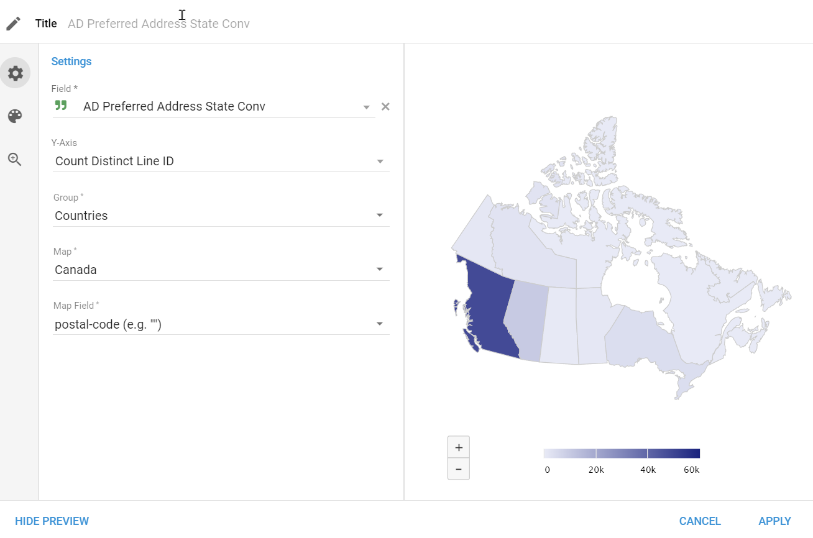
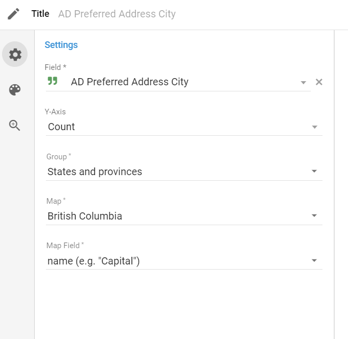

## Links

- [Topology JSON Files](https://code.highcharts.com/mapdata/)
- [Docs](https://www.highcharts.com/docs/maps/map-series)


## Terminology

### hc-key

The `hc-key` property is a unique identifier used in the map data files provided by Highcharts. It stands for "High Charts Key" and is typically a string that uniquely identifies a specific region or area on the map.

For example, in the map data file for the United States (`us-all.topo.json` *[Topology JSON Files](https://code.highcharts.com/mapdata/)*), each state has an `hc-key` property that looks something like this:

```json
{
  "type": "Topology",
  "objects": {
    "us-all": {
      "type": "GeometryCollection",
      "geometries": [
        {
          "type": "Polygon",
          "properties": {
            "hc-key": "us-ca",
            "name": "California"
          },
          // ...
        },
        {
          "type": "Polygon",
          "properties": {
            "hc-key": "us-tx",
            "name": "Texas"
          },
          // ...
        }
      ]
    }
  }
}
```

In this example, the `hc-key` for California is `"us-ca"`, and for Texas, it's `"us-tx"`.

The `hc-key` values are consistent across different map data files from Highcharts, which makes it easier to join your data with the appropriate region on the map. For example, if you have data related to Canadian provinces, you can use the `hc-key` values from the `ca-all.topo.json` file to match your data with the corresponding province on the map.

When you use the `joinBy` option in the Highcharts map configuration, you specify which property from your data should be matched with the `hc-key` (or any other property) in the map data file. This allows Highcharts to correctly associate your data values with the corresponding regions on the map for visualization.


## Countries Map

Could be using 

- [Custom Countries topo JSON File](https://code.highcharts.com/mapdata/custom/usa-and-canada.topo.json)
- [Canada topo JSON file](https://code.highcharts.com/mapdata/countries/ca/ca-all.topo.json)

Both of the above have the same properties.  Here is an example:

```json
{
    "hc-group": "admin1",
    "hc-key": "ca-bc",
    "hc-a2": "BC",
    "labelrank": "2",
    "hasc": "CA.BC",
    "alt-name": "Colombie britannique|New Caledonia",
    "woe-id": "2344916",
    "subregion": "British Columbia",
    "fips": "CA02",
    "postal-code": "BC",
    "name": "British Columbia",
    "country": "Canada",
    "type-en": "Province",
    "region": "Western Canada",
    "longitude": "-124.662",
    "woe-name": "British Columbia",
    "latitude": "54.6943",
    "woe-label": "British Columbia, CA, Canada",
    "type": "Province",
    "hc-middle-lon": -124.831,
    "hc-middle-lat": 55.314
}
```

If you use the **State** field from the Dataset and choose the `postal-code` as the join key, we will get our data placed in their respective regions.



## States and Provinces Map

If you choose a Province map, like **British Columbia**, you will be able to map to ***Regional Districts***, not cities.

It uses the *topo* files for Provinces found here: [topo JSON files](https://code.highcharts.com/mapdata/).  Scroll down to the **CANADA PROVINCES ADMIN 2** section.

Here is a link to the topo JSON for British Columbia [British Columbia topo](https://code.highcharts.com/mapdata/countries/ca/ca-bc-all.topo.json)


