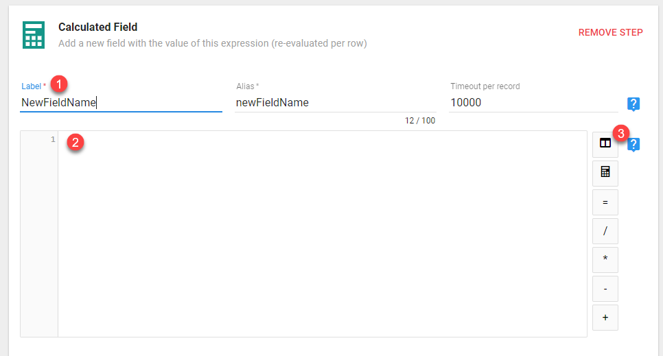

There are two primary ways that you can use JavaScript in Informer to enhance your data. Both of these ways come in the form of **Flow Steps**.

You can add **Flow Steps** to either a _Ad Hoc Report_ or a _Dataset_. They will act the same, however all examples in this document will be on _Datasets_.

The two Flow Steps that you use JavaScript in are **Calculated Fields** and **Power Scripts**.

> NOTE: If a Calculated Field is acting irrationally, copy the script text, remove the flow step and recreate it. This is after you have concluded that the issue is not in the logic of your script.

A **Calculated Field** will allow you to use JavaScript to define a single field. This can use existing fields in the logic as well.

A **Powerscript** is different from a Calculated Field in that it will allow you to create multiple fields with a single script.

> **Recommendation:** If you have more that 3 or 4 calculated fields, I would recommend just putting them into a Powerscript. This makes maintenance of the code much easier. Also make sure to comment your Powerscript and/or Calculated fields well.

## Calculated Fields

To add a Calculated Field to a Dataset, you will first need to Edit the Dataset that you want to add the field to.

Once in the Edit screen click on the plus sign by the **Flow Steps**. You will be presented with a menu where you will choose **Add Field/Calculated Field**.


You will be presented with the Calculate Field window below:



1. **Label** - This will be the new field name that your calculated field will create. The Alias will be created for you automatically.
2. **Code Window** - This is where you will put your JavaScript code for the new field
3. **Helper Buttons** - These buttons are just helpers. The only one you really need is the first one. This is the _inputs_ buttons. It will allow you to choose the existing fields in your dataset to use in your calculation of the new field.

:::danger

It is important to understand how Informer uses the JavaScript in your calculated field.

:::

Understand that the **Dataset** is like a query in that it will return a number of rows. Each of those rows will have the same fields (obviously, each row will have different values for the fields).

Informer will take each row of fields from the dataset and pass it to the **Calculated Field** code.

Informer will then evaluate all the JavaScript code that you enter and the actual field value will be the whatever is returned by the last expression in the code.

So now that we know that each row of data is passed to the **Calculated Field Flow Step**, then it follows that we have access to all the fields and their values in our calculated field code.

That means we can use field values to make decisions on what to output as our new calculated field.

Before we get into examples, there is one other concept to understand. The actual field value of the calculated field will be the whatever is returned by the last expression in the code.

For example, if you put the following in the Code Window:

```javascript
"one";
"two";
"this is what the field will be";
```

The last string _'this is what the field will be'_ is what will be returned for the field value.

## Calculated Field Examples

While the following examples are contrived, each of them will try to show some of the most useful JavaScript features that you can use within **Calculated Fields**.

### Calculated Fields with Multi-value Fields

When working with a field that is Multi-Valued within a Calculated field, you will get an JavaScript array to work with.

For example, if you have the following data:

| Order # | Customer | OrderAmounts |
| ------- | -------- | ------------ |
| 1       | Cust_01  | 120,250, 75  |
| 2       | Cust_02  | 50           |
| 3       | Cust_03  |              |

When you access the _Order Amounts_ field in your calculated field you will get the following for each row:

| Order # | Value in Calc Field for OrderAmounts |
| ------- | ------------------------------------ |
| 1       | [120, 250, 75]                       |
| 2       | [50]                                 |
| 3       | []                                   |

Once you understand this, then you can effectively work with Multi-Valued fields within Calculated fields.

Let's say that you want to take the above data and get a total for each multi-valued field.

You could use this code:

```javascript
orderAmounts.reduce((sum, val) => (sum += val), 0);
```

You may want to read up on the [Array's reduce](https://developer.mozilla.org/en-US/docs/Web/JavaScript/Reference/Global_Objects/Array/reduce) function.

The main takeaway here is that multi-valued fields are represented as JavaScript arrays in Calculated fields (and Power Scripts).

### Field Concatenation using + and Template Literals

This first example is simply going to concatenate two fields together into a new field. However, we are going to do it two ways. The first, easiest way will show you how JavaScript concatenation works. The second way is going to use [Template Literals](https://developer.mozilla.org/en-US/docs/Web/JavaScript/Reference/Template_literals) a powerful new way to create and concatenate strings in JavaScript.

In this example, we will concatenate the Brand Id and Brand Name with a hyphen separating them. The new field will be called "Full Brand"

**Easy String Concatenation**

To start with, you will need the field names. It is best to use the Input button to the right of the code window. When you press it, it will show you a list of fields from you dataset. Here we will choose _Brand Id_.


This will insert the field name into our code window. Be aware that the field name shown in the code may be different that what is shown in the input button's drop down. This is because sometimes fields have Aliases put on them to make them more human readable. This is yet another reason to ALWAYS use the input button to get your field names.

To concatenate items in JavaScript, simply use the + operator. This is what would appear in the Code Window.

```javascript
brandcode + "-" + brandname;
```

You may be wondering what happens if one of the values you are concatenating is a number. This is important. JavaScript will coerce the types when needed. For example, if you had two numbers `1 + 2` this will actually add the numbers together and return `3`. However, if you have a mixture of string and numbers concatenated by a + operator, then the numbers will be coerced to string and thus be concatenated.

**Template Literal Concatenation**

[Template Literals](https://developer.mozilla.org/en-US/docs/Web/JavaScript/Reference/Template_literals) are very cool! First, if the above explanation about coerced values confused you, then take heart, because with Template Literals, you do not have to worry about this.

Here is the same example as above, but with template literals.

```javascript
`${brandcode} - ${brandname}`;
```

Lets go over the syntax.

A template literal is enclosed in back ticks. Not a single quote, but a back tick, usually located on the same key as the tilde (~).

Next, if you need to include a field value, you will use a dollar sign followed by curly braces with the field value inside of the curly braces. This just tells the template literal to evaluate what is inside those curly braces. In our example, that means returning the value that is in the field.

Here is what it looks like in Informer:


### SQL Case When in JavaScript

A common thing to do in SQL when you want to modify your output based on the value of a field is to use a CASE ... WHEN statement.

In JavaScript, this can be accomplished with [**if...then...else**](https://developer.mozilla.org/en-US/docs/Web/JavaScript/Reference/Statements/if...else) statements or a [**switch**](https://developer.mozilla.org/en-US/docs/Web/JavaScript/Reference/Statements/switch) statement.

Both accomplish the same thing, however if you have many cases you want to check for, then the **switch** statement can sometimes be more readable.

### Wildcard Searching

Sometimes the field you are creating will be based on if another field is like some value. Usually we would call this a wildcard search and use an asterisks (\*) to denote the "wildcard".

In JavaScript you will instead use [String Functions](https://developer.mozilla.org/en-US/docs/Web/JavaScript/Reference/Global_Objects/String) to search within strings. The easiest to use in the [includes](https://developer.mozilla.org/en-US/docs/Web/JavaScript/Reference/Global_Objects/String/includes) function. Other useful functions are [startsWith](https://developer.mozilla.org/en-US/docs/Web/JavaScript/Reference/Global_Objects/String/startsWith) and [endsWith](https://developer.mozilla.org/en-US/docs/Web/JavaScript/Reference/Global_Objects/String/endsWith).

Each of these functions (_includes, startsWith_ and _endsWith_) return a Boolean (true or false). You can then use this return value to decide what to do.

**includes Example**

This example will use the includes string function to see if the Brand Name has any spaces in it. If it does, then we will return the brandname with the spaces removed, otherwise just return the brandname.

```javascript
if (brandname.includes(" ")) {
  ("Includes Spaces");
} else {
  ("NO Spaces");
}
```

The **brandname** is a String field. This is important, as the _includes_ function only works on string fields.

How can you tell what is a "string", when you click on the _inputs_ button on the right of the _Code Window_ you will see a drop down that displays the fields in your dataset. Informer is nice to you and tells you exactly what data types the fields are. You will see strings ("TEXT FIELDS"), Numbers and Dates.


I'm sure you asking, what if I have a field that is a number data type, but I want to search in it like a string? For example, the Order No field above is a number, but maybe you want to search it with the _includes_ function. You can do this!

```javascript
if (orderno.toString().includes("1")) {
  ("Includes 1");
} else {
  ("Does not include 1");
}
```

You can use the _toString()_ function to convert the number to a string so that you can use the _includes_ function on it.

The _startsWith_ and _endsWith_ work just the same as includes, except they look for the search string at either the start or the end of the field value.

### Replacing Values in a String

In this example, you will replace all occurrences of a space in a fields value. To do this you will use the [replace](https://developer.mozilla.org/en-US/docs/Web/JavaScript/Reference/Global_Objects/String/replace) function that each string has access to.

```javascript
brandname.replace(/\s/g, "");
```

The replace function has two arguments, the first is what do I search for to replace and the second is the string to replace what I found of the first argument.

The first argument can be either a string value or a regular expression.

> If you use a String for the first argument, it will only replace the FIRST occurrence of the string pattern that is found. This usually is not what you are looking for when using the replace function. Therefore, you will probably want to use a regular expression.

Regular expressions can be bit tricky. There are books written on how to use and create them. If you want to explore regular expression deeper, just search google and you will find a lot.

I will give you two patterns that should answer most of your replace needs.

> The regex expression is found inside the `/..` forward slashes. The characters after the final forward slash will be can either `g` or `i` or both. `g` means global. So search the whole string and find all matches. The `i` means ignore case when doing your search.

1. **Replace Spaces** - `/\s/g` the stuff inside the forward slashes will be the regular expression. Here the \s is stating the we want to match any whitespace (spaces, tabs, new line characters and carriage returns).
   If you want to replace whitespace only where there are more than a certain number, you can modify your regex like this:
   `/\s{3}/g`
   Now it will only replace if it finds 3 whitespace characters in a succession.
2. **Replace Words** - `brandname.replace(/ABC/gi, 'CBA')` Notice the the regex expression is just the text you want to look for with NO quotes. I have also add the `gi` switches so that it searches and replaces all occurrences and ignores case while doing it.

### Extract Month or Year or Day from Date field

If you have a date field and what to extract a portion of it (Day, Month, Year), the easiest way to do that is using the [_moment_](https://momentjs.com/) library that is available in Informer.

Here is an example:

```javascript
// Extract Month from issuedate date field
// Note MM = 01, MMM = 'Nov', 'Dec', etc, MMMM = 'November', etc.
moment(issuedate).format("MM");

//Extract Year from issuedate date field
moment(issuedate).format("YYYY");
```

Here is a list of common arguments that can be passed to the format function. Note, you can combine these in any way.

For example: **'YYYY-MM-DD'** would produce **'2020-01-01'**

| Argument | Output         | Description                       |
| :------- | :------------- | :-------------------------------- |
| YYYY     | 2019           | 4 digit year                      |
| YY       | 19             | 2 digit year                      |
| MMMM     | August         | Full month name                   |
| MMM      | Aug            | Abbreviated month name            |
| MM       | 08             | 2 digit month                     |
| M        | 8              | 1 digit month                     |
| DDD      | 225            | Day of the year                   |
| DD       | 13             | Day of the month                  |
| Do       | 13th           | Day of the month with ordinal     |
| dddd     | Wednesday      | Full day name                     |
| ddd      | Wed            | Abbreviated day name              |
| HH       | 17             | Hours in 24 hour time             |
| hh       | 05             | Hours in 12 hour time             |
| mm       | 32             | Minutes                           |
| ss       | 19             | Seconds                           |
| a        | am / pm        | Ante or post meridiem             |
| A        | AM / PM        | Capitalized ante or post meridiem |
| ZZ       | +0900          | Timezone offset from UTC          |
| X        | 1410715640.579 | Unix timestamp in seconds         |
| XX       | 1410715640579  | Unix timestamp in milliseconds    |

To extract the **Quarter** number from a date, you will need to just use a different function from moment.

```javascript
//Extract Quarter number from issuedate date field
moment(issuedate).quarter(); // returns a number from 1 to 4
```

### Mimicking the IN keyword

In JavaScript there is not an "IN" keyword like there is in SQL. However, the technique shown below will help you mimic this feature.

You use the "IN" keyword when you have a question like:

> Return all the customers whose name matches one of "a list of customer names..."

In SQL, it would look like `customername IN ('name1', 'name2', 'name3')`

To do this in an Informer Calculated Field, you will create an Array that holds all of the values you are looking for and then use the Array's prototype function **includes** to determine if a field is in those array values.

#### Match Full

```javascript
var matchCodes = ["Luxottica USA", "Audi UK", "Google"];

if (matchCodes.includes(advname)) {
  ("Full Match");
} else {
  ("Criteria Not Met");
}
```

You have seen the **includes** function used on a string field. Here we are using it on an Array looking to see if any of the values stored in `matchCodes` matches the `advname` field value. If it does, `true` will be returned.

> NOTE: When you use the **includes** function on a _string_ you get the effect of a Wild Card search. Meaning that if any part of the string matches your search it returns true.
>
> However, when using the **includes** function on an _array_, it will search for items in the array that are an exact match to what you are searching for. To do wild card searches on arrays, see the [Wild Match Array Values](#wild-match-array-values)

However, this will look for full matches, not partial. To enable "wildcard" searches against a list of values, you need to change the above up a little bit.

#### Wild Match Array Values

```javascript
var wildMatchCodes = ["Luxottica USA", "Audi UK", "Google", "AMC"];

if (wildMatchCodes.some((wildValue) => advname.includes(wildValue))) {
  ("Wild Match");
} else {
  ("Criteria Not Met");
}
```

In the above example, we used the [some](https://developer.mozilla.org/en-US/docs/Web/JavaScript/Reference/Global_Objects/Array/some) Array function, which accepts a function as an argument. What the some function does, is send each value in the array, one at a time, through the passed function `wildValue => advname.includes(wildValue)`

That function will run once for every item in the **wildMatchCodes** array. We will then use the **includes** string function to see if the **advname** field value _includes_ the wildValue. [See Wildcard Searching](#wildcard-searching) for details on using the includes with string values.

> To change any of these to be NOT IN, simply add the JavaScript not operator- ! to the return value.

### Lookup Table Style Find/Replace

If you have field that you want to do a number of lookups on and replace the found values with a new value, you can use the standard `if/else` syntax.

However, if you have many conversions that you want to do, the `if/else` syntax gets difficult to maintain. Here is an easier and cleaner method of implementing this.

The simple example we will use is converting a field that hold a country code (countryID) and convert it to the full country name (countryName). If no conversion is found, then we will just use the value in the countryID field.

```javascript
countryObj = {
  USA: "UnitedStates",
  GRB: "Great Britain",
};

!countryObj[countryID] ? countryID : countryObj[countryID];
```

Step one is to create our conversion object. In the above code, it is called `countryObj`. This is a standard JavaScript object with the key (USA, GRB) being our lookup field and the values assigned to the keys will be the returned information when a key is matched.

The next line of code is a [ternary operator](https://developer.mozilla.org/en-US/docs/Web/JavaScript/Reference/Operators/Conditional_Operator) and is used to handle the fact that we want any lookups that fail to return the `countryID`.

If your requirements were such that if a match wasn't found on the lookup you wanted the same default to be returned, you can change the second line of code to use the logical OR (||) operator to short circuit to your default value when nothing is found in the lookup.

```javascript
countryObj = {
  USA: "UnitedStates",
  GRB: "Great Britain",
};

countryObj[countryID] || "My DEFAULT";
```

### Building a Complex Example

You can combine all of the above techniques to get the final result that you need. In this example we will be working with the `campaignCode` and `billNameId` fields.

When building complex scenarios it is very important that before you start to code anything, you have a clear written plan of what your scenario is.

I find it is best to work backwards. So start with what will the final values be in your field. Then define what criteria must be met for each of the values to become the selected value.

This process is best understood with an example, so let's get started.

#### Define The Final Field

First, we need to name our final field. It will be called **FinalOrderType**.

**Define our final Values**

Before we can even start with criteria, we must know what the final options for the values can be.

These values are

- Corporate
- Private
- Unknown

Next, define what criteria must be met for each of these to "win" at being the final value for our new field.

I find it makes it easier to understand if we define these criteria in a table listing the field the criteria applies to, the Operation and the Detail.

#### Define Requirements

The requirements for **Corporate** becoming the final value are:

| Field        | Operation           | Detail                                                                                                                    |
| ------------ | ------------------- | ------------------------------------------------------------------------------------------------------------------------- |
| campaignCode | Starts With         | '3' OR 'P'                                                                                                                |
| campaignCode | Must Not Match      | '3C11CUDO','3C11CDOP','3C11CDOS',<br />'P1203CUD','P1207CUD','P1BETOP','P1BEAWW',<br />'P1303BLK','3C17WWG2', 'PIAGENT'   |
| campaignCode | Must Not Start With | 'PHW','PWW','HW1','HWK','PM1','PK5','PMB',<br />'PMR','PF5','PMS','PFB','HRI','PRI','PKM','PM6','PM7',<br /> 'PI', 'PWWW' |

The requirements for **Private** becoming the final value are much simpler, but we still keep our table format:

| Field      | Operation    | Detail |
| ---------- | ------------ | ------ |
| billNameId | Greater than | 3      |

The requirements for **Unknown** becoming the final value is the easiest and doesn’t require a table.

| Requirement                                                                           |
| ------------------------------------------------------------------------------------- |
| **Unknown** is the default value if no other conditions are met for the other values. |

#### Build your Code

Now we can start coding. Since the criteria for the first value (Corporate) is complex, we will code each of the requirements and store the result in a variable. These variables can then be combined later.

We will start with the **first criteria** requirement.

| Field        | Operation   | Detail     |
| ------------ | ----------- | ---------- |
| campaignCode | Starts With | '3' OR 'P' |

```javascript
// Returns true for any row where the campaignCode starts with 3 or P
var criteria_startWith =
  campaignCode.startsWith("3") || campaignCode.toLowerCase().startsWith("p");
```

We have created a variable **criteria_startWith** that holds the result value of either **true** or **false**.

It will hold true if the current row's campaignCode value starts with either a '3' or 'P'.

The **next requirement**:

| Field        | Operation      | Detail                                                                                                                  |
| ------------ | -------------- | ----------------------------------------------------------------------------------------------------------------------- |
| campaignCode | Must Not Match | '3C11CUDO','3C11CDOP','3C11CDOS',<br />'P1203CUD','P1207CUD','P1BETOP','P1BEAWW',<br />'P1303BLK','3C17WWG2', 'PIAGENT' |

```javascript
var campCodeMatchList = [
  "3C11CUDO",
  "3C11CDOP",
  "3C11CDOS",
  "P1203CUD",
  "P1207CUD",
  "P1BETOP",
  "P1BEAWW",
  "P1303BLK",
  "3C17WWG2",
  "PIAGENT",
];
// Returns true for any row where campaignCode is NOT IN the campCodeMatchList
var criteria_CCNotIn = !campCodeMatchList.includes(campaignCode);
```

To check this criteria, we must first create an array with all of the values that the campaignCode must NOT match. Then we use the [Match Full](#match-full) technique to see if the current campaignCode matches and values in the array. But, since this is a must NOT match criteria, we throw the not operator (!) in front of the expression: `!campCodeMatchList.includes(campaignCode)`

The **last requirement:**

| Field        | Operation           | Detail                                                                                                                    |
| ------------ | ------------------- | ------------------------------------------------------------------------------------------------------------------------- |
| campaignCode | Must Not Start With | 'PHW','PWW','HW1','HWK','PM1','PK5','PMB',<br />'PMR','PF5','PMS','PFB','HRI','PRI','PKM','PM6','PM7',<br /> 'PI', 'PWWW' |

```javascript
// Returns true for any row where the campaignCode does NOT start with a value from the campCodeNOTStartsWithList.
var campCodeNOTStartsWithList = [
  "PHW",
  "PWW",
  "HW1",
  "HWK",
  "PM1",
  "PK5",
  "PMB",
  "PMR",
  "PF5",
  "PMS",
  "PFB",
  "HRI",
  "PRI",
  "PKM",
  "PM6",
  "PM7",
  "PI",
  "PWWW",
];
var criteria_CCNotStartsWith = !campCodeNOTStartsWithList.some((swValue) =>
  campaignCode.startsWith(swValue)
);
```

To check this criteria, we must first create an array with all of the values that the campaignCode must NOT START with. Then we use the [Wild Match Array Values](#Wild-Match-Array-Values) technique to campaignCode's that start with the values in our array. Lastly, since this is a NOT condition, we apply the JavaScript not (!) operator to the result.

Now we have three variables that will each tell us if the campaignCode for the given row complies with one of the conditions set forth in our table. Since all conditions must be true for the campaignCode to "pass", we will combine these variable in an if statement.

```javascript
if (criteria_startWith && criteria_CCNotIn && campCodeNOTStartsWithList) {
    'Corporate'
} else ...
```

We are using the JavaScript **&&** operator to find out if all of these variables are true. It is equivalent to saying

_If criteria_startWith is true and criteria_CCNotIn is true and campCodeNOTStartsWithList then ..._

We can test for the **second requirement** by taking on another if statement to the else and the final else will handle everything that doesn't match the first two requirements.

**Final If Statement**

```javascript
if (criteria_startWith && criteria_CCNotIn && campCodeNOTStartsWithList) {
  ("Corporate");
}
// This if would check the billing status, but I don't know where that field is
else if (billNameId > 3) {
  ("Freen");
} else {
  ("Grace Status");
}
```

#### Final Code

```javascript
// Returns true for any row where the campaignCode starts with 3 or P
var criteria_startWith =
  campaignCode.startsWith("3") || campaignCode.toLowerCase().startsWith("p");

var campCodeMatchList = [
  "3C11CUDO",
  "3C11CDOP",
  "3C11CDOS",
  "P1203CUD",
  "P1207CUD",
  "P1BETOP",
  "P1BEAWW",
  "P1303BLK",
  "3C17WWG2",
  "PIAGENT",
];
// Returns true for any row where campaignCode is NOT IN the campCodeMatchList
var criteria_CCNotIn = !campCodeMatchList.includes(campaignCode);

// Returns true for any row where the campaignCode does NOT start with a value from the campCodeNOTStartsWithList.
var campCodeNOTStartsWithList = [
  "PHW",
  "PWW",
  "HW1",
  "HWK",
  "PM1",
  "PK5",
  "PMB",
  "PMR",
  "PF5",
  "PMS",
  "PFB",
  "HRI",
  "PRI",
  "PKM",
  "PM6",
  "PM7",
  "PI",
  "PWWW",
];
var criteria_CCNotStartsWith = !campCodeNOTStartsWithList.some((swValue) =>
  campaignCode.startsWith(swValue)
);

//------Billing Status check ---//

if (criteria_startWith && criteria_CCNotIn && campCodeNOTStartsWithList) {
  ("Corporate");
}
// This if would check the billing status, but I don't know where that field is
else if (billNameId > 3) {
  ("Freen");
} else {
  ("Grace Status");
}
```

## Powerscripts

Power Scripts are advanced scripts (JavaScript) that gives you complete control over the data. A Power Script is JavaScript with a sandboxed script context

Here are the predefined keywords you can use in your Power Script. [Informer Docs](https://informer5.zendesk.com/hc/en-us/articles/115005113823)

| Keyword | Type            | Desc                                                               |
| ------- | --------------- | ------------------------------------------------------------------ |
| $record | object          | The current row. You may modify this row.                          |
| $index  | number          | The current row number (row 1 = index 0)                           |
| $omit() | function        | When called, removes the current row                               |
| $fields | object          | Field metadata                                                     |
| $field  | function        | Function to describe a field: $field('location').label('Loc')      |
| $inputs | object          | User Inputs                                                        |
| $local  | object          | Variable that is not cleared from on record to the next            |
| \_      | object/function | Lodash v3 library. [lodash](https://lodash.com)                    |
| moment  | function        | moment date manipulation library. [momentjs](https://momentjs.com) |

To declare a variable use the `var` keyword. However, within the Powerscripts it seems you do not have to "declare" variables that you will be using.

```javascript
var gtp = $inputs["greaterThanPrice"] || 0;
if ($record.baseCost >= gtp) {
  $record.isGreaterThan = true;
} else {
  $record.isGreaterThan = false;
}
```

Do not `return` anything from the Power Script. Simply change the value of what you want.

You can create multiple fields in a single Power Script.

### Using $inputs

Many times on your Datasets, you will create _inputs_. These are values that your end user will be prompted to enter upon the reloading of the Dataset.

Usually these _inputs_ are used in your criteria, however, there may be times when you want to use the value either in a calculation of another field or to simply display as a new field in the result set.

You will be able to access these _inputs_ in Calculated Fields and Powerscripts using the **$inputs** object.

To access an input value, use the following syntax:

```javascript
$record.nameOfInput = $inputs["nameOfInput"];
```

### Using $local

The $local keyword is very powerful in that it persists throughout the load process. First thing to understand is that it is an Object. Which means, you can declare multiple local persistent variables using the $local keyword:

```javascript
$local.count = 0;
$local.otherVariable = "x";
```

However, if you were to declare the $local variables as above, they would be reset every time. To declare these types of variables, you must first check if they exists, if they do, continue, if they don't, then create them:

```javascript
if (!$local.count) {
  // if this var doesn't exist then
  $local.count = 0; // initialize it
}
// Another method that does the same thing
$local.count = $local.count ? $local.count : 0;

// Last way to do the same thing
$local.count = $local.hasOwnProperty("count") ? $local.count : 0;

// Wait, one other way!
// This way is good if you have multiple items you need to initialize on the $local
```

If you wanted to create a row count variable, you would pick one of the above methods to perform the initialization and then increment the count and store in a `$record` variable.

```javascript
if (!$local.count) {
  // if this var doesn't exist then
  $local.count = 0; // initialize it
}
//This will create a rowCount record for every row
//the ++ at the end of the $local.count will increment AFTER it assigns
//whatever is in $local.count.  This just means your first row will be 0.
$record.rowCount = $local.count++;
```

### Numbers and Other Gotchas

You must be aware of the data type of the fields you are using and if there are any _Null_ values in the fields you are using.

For Example, if you wanted to get a running total by Customer (AdvName) and the field you were using to get this running total (priceActAmt) had null values in it, you would need to take that into account in your script.

### Delete a column

Use the keyword **delete** followed by the column you want removed.

```javascript
delete $record.columnToDelete;
```

### Using $fields Metadata

The **$fields** object has a key for each field in your query and each of those has some metadata on it that you can view and/or change.

:::caution Be Aware

As of version **5.4.6**, the ONLY metadata that you can change on the $fields object is the **label**.  All other items are **read-only**.

This may change in the future.

:::

Here is the shape of the object:

```javascript
{
    issueYear: {
        dataType: 'string' | 'double' | 'int',
        label: '' // Viewable label
        position: // Position in output grid (int)
        name: // This is the name as it is referred to in Calculated fields or Powerscripts
    },
    field2: {
        dataType: 'string' | 'double' | 'int',
        label: '' // Viewable label
        position: // Position in output grid (int)
        name: // This is the name as it is referred to in Calculated fields or Powerscripts
    },
    ...
}
```

There are some other metadata available, but it isn't very useful. If you want to query this data yourself, here is code that will let you view all of the properties on a field in the $field object.

```javascript
// Inspect $fields object for a single field
$record.fieldInspect = Object.keys($fields.issueDate).map((key) => [
  key,
  $fields.issueDate[key],
]);
```

### $query Object

I haven't found a use for this, but here is the shape of the $query object:

```javascript
{
	domain: object
	_events: object
	_eventsCount: number
	_maxListeners: undefined
	limit: number:
	errorHandlers: object
	throughHandlers: object
	postHandlers: object
	preHandlers: object
	options: object
	params: object
	fields: object
	payload: object
	dataTypes: object
	handler: function
	language: string
	user: string
	_promise: object
	preInvokedAt: object
	preCompletedAt: object
	handlerInvokedAt: object
	handlerCompletedAt: object
	result: object
	postInvokedAt: object
	postCompletedAt: object
}
```

## Powerscript Examples

### Getting Total By Advertiser and % of Total By Advertiser

The `$local` variable can be very powerful by itself, but when used in conjunction with the **Flush** flow step, you can do a number of other things.

It is important to understand that the `$local` object will persist between running a Power Script and a **Flush** flow step.

**Goal**

The goal is to get a field that sums the revenue for an advertiser and then uses that to calculate the percentage of total for every row.

> This is vastly different from the **Percent of Total** flow step as this is based on the Grand Total versus totals by advertiser.

To do this we need three flow steps.

1. **Power Script Flow Step** - used to calculate the Total Revenue for each Advertiser. This information will have to be stored in the `$local` object so that it is persisted.
2. **Flush** - Starts a new pass of the data with our `$local` object intact.
3. **Power Script Flow Step** - used to calculate the % of Total Revenue per Advertiser and create the fields
   - **$record.percentOfTotalByAdv** - This is the field we want, the % of Total Revenue by Advertiser.
   - **$record.TotalByAdv** - This is the subtotal for each advertiser. We really don't need to expose this as a record, but it is useful for testing.

Here is what the Flow steps look like:


**Power Script - Aggregate Rev By Advertiser**

```javascript
// The usual initialization code
if (!$local[$record.advCode]) {
  $local[$record.advCode] = 0;
}
// Add current records amount to the running total
$local[$record.advCode] = $local[$record.advCode] + $record.orderNetAmt;
```

The unique thing that is happening in the **Aggregate Rev By Advertiser** Power Script, is that we are create a different object property on the `$local` object for each advCode (advertiser). This allows us to keep a different total for each Advertiser.

Next we just run the **Flush** Flow step.

**Power Script - Percent Of Adv Total**

```javascript
$record.percentOfTotalByAdv = $record.orderNetAmt / $local[$record.advCode];
$record.TotalByAdv = $local[$record.advCode];
```

This above code is simply creating the two new fields that we want.

### Dealing with Duplicate Fields in Normalized data (Aggregation)

I will start by saying this code is not recommended for large datasets. It slows down the load considerably. However, it is always worth a try to see if will help.

The scenario that calls for this is a dataset that is loading a group of fields that includes some **multivalued** fields and that also runs a **Normalize** flow step on these multivalued fields.

This results in "duplication" of the data in non-multivalued fields. Makes sense and works fine, unless you have a numeric NON multivalued field that you want to aggregate on. This results in an over aggregation of this field.

For example, if we had a dataset that contained the following:

| Field Name        | Multivalued? |
| ----------------- | ------------ |
| Order ID          | NO           |
| Order Total       | NO           |
| Order Line Number | YES          |
| Order Line Amount | YES          |

Then the normalized dataset would look like this:

| Order ID | Order Total | Order Line Number | Order Line Amount |
| -------- | ----------- | ----------------- | ----------------- |
| A        | 100         | A001              | 50                |
| A        | 100         | A002              | 50                |
| B        | 500         | B001              | 500               |
| C        | 600         | C001              | 200               |
| C        | 600         | C002              | 300               |
| C        | 600         | C003              | 100               |

If you try to aggregate on the Order Total field you will get the incorrect amount because that line has been "duplicated" because of the normalization.

> NOTE: This is as intended and is to be expected.

Since this is how Informer works, we will need to get around this another way. This is can be accomplished via a Powerscript.

What we are trying to do is to get the dataset to look like this:

| Order ID | Order Total | Order Line Number | Order Line Amount |
| -------- | ----------- | ----------------- | ----------------- |
| A        | 100         | A001              | 50                |
| A        | 0           | A002              | 50                |
| B        | 500         | B001              | 500               |
| C        | 600         | C001              | 200               |
| C        | 0           | C002              | 300               |
| C        | 0           | C003              | 100               |

To do this, we will need to do two things. First, you must add a counter to your Dataset and name it **preCounter**


The counter creation will be the first Flow step.

Next do any other flow steps that need to happen before the Normalize (it is Ok if it is none), then do the Normalize Flow step.

Lastly, create a Powerscript called "OneToManyFix" (or whatever you want to call it).

Past the following code in the Powerscript.

> Make sure to update the $record.fieldToFix to the field(s) that need to be "zeroed" out on certain records.

```javascript
// Initialize "prevCounter" in the local object if undefined
if (!$local["prevCounter"]) {
  $local["prevCounter"] = 1;
}
// Check to see if our stored counter variable is the same as the current one
// If it is, then this is a "Duplicate" and we should zero out any numeric
// variables that we want to aggregate
if ($record.preCounter === $local["prevCounter"]) {
  // These will be all the fields that you do not want to be duplicated.
  // These fields will be numeric fields
  $record.fieldToFix = 0;
  // any other fields to fix
}
// update our local copy of the counter to the current one.
$local["prevCounter"] = $record.preCounter;
```

### Normalize Doesn't Propagate all Values

Sometimes when you normalize and you have _one-to-many_ fields that are associated with _multi-valued_ fields, those _one-to-many_ only one iteration of the _one-to-many_ fields will be populated.

Here is an example of what you see even after applying the _Normalize_ flow step:

| ID  | One-To-Many | Multi-Valued |
| --- | ----------- | ------------ |
| 1   | MM33001     | 15           |
| 2   |             | 12           |
| 3   | MM55221     | 10           |
| 4   |             | 40           |
| 5   |             | 20           |

But what you really want is this:

| ID  | One-To-Many | Multi-Valued |
| --- | ----------- | ------------ |
| 1   | MM33001     | 15           |
| 2   | MM33001     | 12           |
| 3   | MM55221     | 10           |
| 4   | MM55221     | 40           |
| 5   | MM55221     | 20           |

To achieve this, you need to use Powerscript.

After the Normalize flow step, add this Powerscript:

**PropagateField**

```javascript
if ($record.One-To-Many) {
	$local.prevOne-To-Many = $record.One-To-Many
}

$record.One-To-Many = $local.prevOne-To-Many || ''
```

The first "if" statement is checking to see if we have a value in the **One-To_Many** field. The expectation is that we will have a value before we encounter any of the "empty" columns.

We then store this value and when we encounter the next rows **One-To-Many** field, if it is empty we, will populate it with the value that we had previously stored.

The final line is using the `|| ''` as a precaution so that if there are any rows that do not have a **One-To-Many** field populated, we won't error out.

### Easy Calculations on Values

Many times you will want to create a calculation between two values from your dataset. For example, you have a **Net Revenue** and **Net Invoice**, but you also what a **Variance** column (**Net Revenue - Net Invoice**).

Simply create a PowerScript:

```javascript
$record.variance = $record.netRevenue - $record.netInvoice;
```

### Calculations on Aggregated Values

As of Informer 5.3.2, you can not create an expression using fields that you aggregated.

For example, you have created a pivot table with **Year** and **Rep** as Rows and then have Total aggregations on **Net Revenue** and **Net Invoice**, but you also what a **Variance** column (**Net Revenue - Net Invoice**). There is currently not a way to do this via their standard tools.

> **NOTE:** This is a manual example of what can also be done using the [calculateAggregates Saved Function](informer-saved-functions#-calculateaggregates---usage).
> **ALSO NOTE:** This example does NOT need to use any type of aggregate functions, but is an easy example to understand the concept of what is happening. See [Easy Calculations on Value](#easy-calculations-on-values)

To accomplish this, you will need to calculate the aggregates at each level that you need them and create a new field for the Variance, or whatever other type of calculation that you need to do with the aggregated values.

Before you can start, you need to determine what your aggregation levels are going to be. In the above example, we have chosen, **Year and Rep**.

We are going to create a _groupKey_ for each of these levels and use that key to aggregate the totals in the **$local** object that Powerscript provides.

This is the first Powerscript that will be needed:

> NOTE: There is a helper function called **returnNumber** which will accept anything and return a valid number. If you don't pass a valid number, it returns 0.

```javascript
// Get the year of the issue date
vIssueYear = moment($record.issuedate).format("YYYY");

// Create a column for issueYear
$record.issueYear = vIssueYear;
// Make sure the datatype for issueYear is a String
$fields.issueYear.dataType = "string";

//*****************************************************
// Start the aggregation process
//*****************************************************
/* It will create and generate the three levels of aggregate
   data that will be used in the second Powerscript to calculate the three levels of
   aggregates of the Yield calculations.
   The three groups are:
   issueYear (groupKey1)
   issueYear + RepId (groupKey2)
*/
// Define the groupKey to be used across aggregates
groupKey1 = `${vIssueYear}`;
groupKey2 = `${vIssueYear}-${$record.salesrep_id_assoc_id}`;

// Initialize each group key
$local[groupKey1] = $local[groupKey1]
  ? $local[groupKey1]
  : { sumNet: 0, sumInvoice: 0, Group1Set: false };
$local[groupKey2] = $local[groupKey2]
  ? $local[groupKey2]
  : { sumNet: 0, sumInvoice: 0, Group2Set: false };

// Add current records amount to the running total for each group key
// GROUPKEY1
$local[groupKey1].sumNet = $local[groupKey1].sumNet + $record.orderNetAmt;
$local[groupKey1].sumInvoice =
  $local[groupKey1].sumInvoice +
  returnNumber($record.invoiceID_assoc_invamount);

// GROUPKEY2
$local[groupKey2].sumNet = $local[groupKey2].sumNet + $record.orderNetAmt;
$local[groupKey2].sumInvoice =
  $local[groupKey2].sumInvoice +
  returnNumber($record.invoiceID_assoc_invamount);

//------------------------------------------------------------------------------------
//- FUNCTIONS
//------------------------------------------------------------------------------------
//* takes a value in and returns a number (parsed as float)
function returnNumber(numberIn) {
  let parsedNumber = parseFloat(numberIn);
  if (isNaN(parsedNumber)) {
    return 0;
  }
  return parsedNumber;
}
```

Now we have objects on the $local object that have totals for each level. The object shape will look like this:

```javascript
$local = {
  [groupKey1]: {
    sumInvoice: float,
    sumNet: float,
    Group1Set: float,
  },
  [groupKey2]: {
    sumInvoice: float,
    sumNet: float,
    Group2Set: float,
  },
};
```

**Step 2**

After we have aggregated to the levels that we need, you will need to run a Flush Flow step:


**Step 3**

The last step is another Powerscript that will do the calculations needed on the stored aggregations.

```javascript
/*
This is the second Powerscript.
It needs to be run AFTER a Flush flow step.
It will calculate the aggregate calculations at the three different groupings.
Also this will create a field for each group key named
groupKey1, groupKey2, groupKey3
*/

// Get the year of the issue date
vIssueYear = $record.issueYear;

// Define the groupKey to be used across aggregates - Must be the same as those defined in the first Powerscript
groupKey1 = `${vIssueYear}`;
groupKey2 = `${vIssueYear}-${$record.salesrep_id_assoc_id}`;

// GROUPKEY1
// This If statement allows us to only return the total once.
// By doing this, we can use the Total Aggregation function which keeps things more consistent
if (!$local[groupKey1].Group1Set) {
  //Create a field for the GroupKey and each of the Totals for the groupKey
  $record.groupKey1 = groupKey1;
  $record.RepNetByYear_Total = $local[groupKey1].sumNet;
  $record.RepInvTotalForYear_Total = $local[groupKey1].sumInvoice;
  $record.NetInv_VarianceByYear_Total =
    $local[groupKey1].sumNet - $local[groupKey1].sumInvoice;
  $local[groupKey1].Group1Set = true;
}

// GROUPKEY2
// Same as for GroupKey1, but using groupKey2
if (!$local[groupKey2].Group2Set) {
  $record.groupKey2 = groupKey2;
  $record.RepNetByYearRep_Total = $local[groupKey2].sumNet;
  $record.RepInvTotalForRepYear_Total = $local[groupKey2].sumInvoice;
  $record.NetInv_VarianceByYearRep_Total =
    $local[groupKey2].sumNet - $local[groupKey2].sumInvoice;
  $local[groupKey2].Group2Set = true;
}

$fields.RepNetByYear_Total.dataType = "number";
$fields.RepInvTotalForYear_Total.dataType = "number";
$fields.NetInv_VarianceByYear_Total.dataType = "number";

$fields.RepNetByYearRep_Total.dataType = "number";
$fields.RepInvTotalForRepYear_Total.dataType = "number";
$fields.NetInv_VarianceByYearRep_Total.dataType = "number";
```

| Issue Year | Rep Id | Net Revenue | Invoice Revenue |
| ---------- | ------ | ----------- | --------------- |
| 2019       | MM     | 100         | 75              |
| 2019       | SW     | 50          | 50              |
| 2020       | MM     | 125         | 100             |
| 2020       | SW     | 25          | 20              |
| 2020       | TE     | 75          | 75              |

### Year Over Year Calculations

Year over Year views of your data can be created using a Pivot table with a Year field as a Column.


However, if you wanted to actually calculate a difference column for Current and Previous year, you will find that you cannot do this in the Informer Pivot table currently.

To make this possible, we need to write some Flow steps to create fields that will hold each year's values and then another script to do the calculations. Our end goal will be to create a chart that looks like this:


**Fields You Need To Have**

- **DateField** - You will replace this field in the PowerScripts with the data field that you want the YOY data from. This could be an Issue Date, Date Entered, or any date that you want to see your data by.
- **FieldName** - Since we will be creating new fields in the format of '2020-FIeldName', '2021-FieldName', you need to replace this value with an appropriate name that describes the data being stored.
- **AggregatationValue** - This is the field that you holds the value that you are examining. This may be the Rep Revenue, Invoice Revenue, etc.
- **CurrentYear/PreviousYear** - These could be based on todays date (in the sample PowerScripts they are), but you can use any Year values that you would like for these (I would rename them if you do.)

> **NOTE:** If you need your aggregation to be at multiple levels and the calculation is not a percentage that relies on the hierarchy, you can get by with a single aggregation. For example, if you just wanted the difference between years for Advertiser by Rep, Advertiser (by itself) and Rep(by itself), you would only need a single groupKey of 'Advertiser-Rep', but if you were calculating percentages that you wanted to view at each level, you would need to create a groupKey for each of the three levels.

**PowerScript #1 - Create Year Fields**

This script will create a separate field for each year from the date field you use for `$record.DateField`. The field name will be the year plus whatever you replace `-FieldName_1` with. For example, if you want the `NetRevenue` to be broken into each Issue year you would make the following replacements:

- `$record.DateField` **changed to** `$record.IssueDate`
- `${transactionYearToCompare}-FieldName_1` changed to `${transactionYearToCompare}-NeRevenue`
- `$record.AggregatationValue` **changed to** `$record.NetRevenue`

The result being fields in the format of `2020-NetRevenue`, `2021-NetRevenue`, etc.

```javascript
// Extract Year from transaction date
// this will become part of the identifying field name
transactionYearToCompare = moment($record.DateField).format("YYYY");

// this will be used as the fieldname
// example: '2020-FieldName_1', '2021-FieldName_1', etc
$record.FieldName_1 = `${transactionYearToCompare}-FieldName_1`;

// Store the value in your new field things like $record.repNetCost, etc
$record[$record.FieldName_1] = $record.AggregatationValue;
```

**PowerScript #2 - Calculate Aggregates**

Review the [Calculate Aggregates Function Docs](informer-saved-functions#calculateaggregates---usage) for details on how this function works in more detail.

In this script you will be aggregating your YOY values. You will need to define WHICH years you want to perform calculations on and create a specific aggregation object within the **groupAggr** array for that year. In the below example, I am using the `moment()` library to get the current year and the previous year.

Then in the groupAggr array, I'm creating an object for the Current Year (sumCurrNet) and Previous Year (summPrevNet). The `value` key must match the field name that you used in script #1, but substituting the `transactionYearToCompare` with your `currentYear` & `previousYear` variables.

```javascript
// Year Variables - Year buckets you want to create
currentYear = moment().format("YYYY");
previousYear = moment().subtract(1, "years").format("YYYY");

// Create the grouping levels that you will need in your aggregations
$record.groupKey1 = `${$record.advName}-${$record.repName}`;

// Levels that you want to see your calculation over
groupKeys = [
  {
    name: "Advertiser-Rep",
    groupKey: $record.groupKey1,
  },
];

groupAggr = [
  {
    name: "sumCurrNet",
    initValue: 0,
    value: naviga.returnANumber($record[`${currentYear}-FieldName_1`]),
  },
  {
    name: "sumPrevNet",
    initValue: 0,
    value: naviga.returnANumber($record[`${previousYear}-FieldName_1`]),
  },
];
// Call the calculateAggregtes saved function
naviga.calculateAggregates({ $local, groupKeys, groupAggr });
```

**Perform a Flush Flow Step**

**PowerScript #3 - Post Aggregation Calculations**

This last script is where you will actually perform the calculations for the fields you need.

```javascript
// GROUP KEY 1
if (!$local[$record.groupKey1].GroupSet) {
  $record.CurrPreviousDifference =
    $local[$record.groupKey1].sumCurrNet - $local[$record.groupKey1].sumPrevNet;
  $local[$record.groupKey1].GroupSet = true; //Setting to true means we will not excute this code again during the load.
}
```

### Remove Duplicate Values in Aggregation

This is similar to the [Proper Aggregations in Normalized data](#proper-aggregations-in-normalized-data), except that in this case we are not normalizing and thus will not need a counter, but will instead use another field to use as our indicator that a field value should not be propogated.

The example will be from the User Reports mapping and the Order Net Amt field. This field holds the total net value for a campaign Id, however, it is duplicated across all lines. You will see data as below:

| Campaign Id | Order Net Revenue |
| ----------- | ----------------- |
| 1055        | 1500              |
| 1055        | 1500              |
| 1055        | 1500              |
| 2545        | 5400              |
| 2545        | 5400              |

But what you really need to see, so that you can aggregate properly is:

| Campaign Id | Order Net Revenue |
| ----------- | ----------------- |
| 1055        | 1500              |
| 10550       | 0                 |
| 1055        | 0                 |
| 2545        | 5400              |
| 2545        | 0                 |

To do this, you will need to add a Powerscript flow step AND very importantly, you will need to make sure the data coming through the flow step is ordered by the Campaign Id.

First to make sure the data is in the correct order, you will need to add an **Order By** step when building your dataset:


Then you will need to add a Powerscript Flow step to update the Order Net Amt.

```javascript
// Initialize $local.currCampId
$local.currCampId = $local.currCampId === undefined ? 0 : $local.currCampId;

// New OrderNetAmount field will be 0 if we have already populated for a previous row for this campaignId
$record.OrderNetAmount =
  $local.currCampId === $record.campaignId ? 0 : $record.orderNetCost;

// Update the local campaign Id with the current campaign Id
$local.currCampId = $record.campaignId;
```

The above Powerscript creates a new field, so I usually will choose to remove the field that the above is Powerscript is "Deduping".

Simply add a Remove Fields flow step to accomplish this.

### New Business Flag

**<a  target="_blank"  href="/downloads/naviga-new-business-flag.tgz"> Sample New Business Flag Dataset - [NAVIGA]-New Business Flag</a>**

Many times there is a need to declare a customer as a new customer after a defined length of inactivity.  That is where this code can help.

The code below is based on the **AD Internet Campaigns** mapping and uses the campaigns Start and End dates to determine inactivity between campaigns.

The fields needed from **AD Internet Campaigns** are:

- **Advertiser ID <1>**
- **Start Date <4>**
- **End Date <5>**

:::info **Important**

We MUST set the **Order By** in the Query to sort Ascending by **Advertiser ID** AND **Start Date**.  This will group the records by advertiser and also order each advertisers campaign in order of when the campaigns started.

:::

The basic logic will be that as we go through the records, we will compare the previous record to the current record for an advertiser and calculate how much time has passed between the **End Date** of the previous record and the **Start Date** of the current record.  

:::note

The date calculations are based on the first of the month.  For example, if the end date is 01/15/2022, the code will use 01/01/2022 for the comparison.

Many Advertisers will have overlapping campaigns, where the end date of one is **After** the start date of the previous:

 *camp 1, startDate 01/01/2020 End Date 01/01/2021*
 *camp 2, startDate 05/02/2020 End Date 07/01/2020*

This is OK, as in the calculations the result will be negative and is handled.

:::

There are some constants that you will set in the first part of the script that will define how the application sets the New Business status.

- **INACTIVE_MONTHS_LIMIT** - How many months of inactivity must a client have before being designated as "New" business
- **PROBATION_MONTHS** - Many times you also want to know how long a customer has been identified as "New" business.  For example, if a customer starts doing business with your company, you would want them to retain that new status for a certain amount of time.  This is referred to as the **Probationary Period** in the code.  It is defined in months.
- **NEW_STATUS_TEXT** - Text to use in the **ClientStatus** field  when the client is "New"
- **EXISTING_STATUS_TEXT** - Text to use in the **ClientStatus** field when the client is not "New"

Here is the code for the Constants.

```javascript
//=====================
//-- Constants
//-- This is the number of months of inactivty between current and last ad before we call the customer new
INACTIVE_MONTHS_LIMIT = 12;
//-- Number of months AFTER a customer is declared "new" that we keep there status as "New"
PROBATION_MONTHS = 12;
// Status Text
NEW_STATUS_TEXT = 'New';
EXISTING_STATUS_TEXT = 'Existing';
//=====================
```

**Definitions of some Variables**

- **lastActivityDate** - the previous record's "last activity" date.  Maybe the Month End Date of Campaign
        At the start of the Powerscript, this date will be pulled from $local.previousValues object
        At the end of the Powerscript, whatever field is deemed to be the lastActivityDate, will be pulled
        from the current record and stored as the lastActivityDate in the $local.previousValues object
- **currentActivityDate** - the current record's "current activity" date. Maybe the Month Start Date of Campaign
- **startDateOfNewStatus** - gets set to the lastActivityDate of the current record when there has been no activity for 12 months
    This date does not get reset until there is another 12 month period of inactivity.
    This is because a "new" advertiser, stays new for 12 months after becoming new.  After 12 months of activity, status
    will change to "existing"

**Persistent Objects** - These object will persist over every row processed

- **$local.previousValues** - This object will contain the "advertiserId" and "lastActivityDateMoment" from
    the PREVIOUS record.
    If this is the first record (meaning this variable is `undefined`) we initialize to: 
      { advertiserId: null, lastActivityDateMoment: moment(null) }
    One of the **final** steps of the Powerscript is to update this Object with the current records
    advertiser id and "lastActivityDate", which will then be the next records "PREVIOUS" values.
- **$local[advId]** - Since we are using the record's advertiser id as a key on the $local object, all the 
    values stored will be overwritten as we progress through the Advertisers campaign records.

**Main Script**

```javascript
//=====================
//-- Constants
//-- This is the number of months of inactivty between current and last ad before we call the customer new
INACTIVE_MONTHS_LIMIT = 12;
//-- Number of months AFTER a customer is declared "new" that we keep there status as "New"
PROBATION_MONTHS = 12;
// Status Text
NEW_STATUS_TEXT = 'New';
EXISTING_STATUS_TEXT = 'Existing';
//=====================

// get $local object and initialize if they don't yet exist
previousValues = $local.previousValues
  ? $local.previousValues
  : { advertiserId: null, lastActivityDateMoment: moment(null) };

// Get Info for setting $local Adv Bucket
AdvId = $record['advId'];
//!! This is the date of activity for the current record.  It will be compared to
//!! 	  the previous records "lastActivityDateMoment" field.
currentActivityDateMoment = moment($record['startDate']).startOf('month');

// Initialize AdvId bucket in $local var
$local[AdvId] = $local[AdvId]
  ? $local[AdvId]
  : {
      SalesStatusWorking: {
        salesStatus: NEW_STATUS_TEXT,
        startDateOfNewStatus: currentActivityDateMoment,
        isLastRecord: false,
        counter: 0,
      },
    };

//--- Setup Variables
// Pull previous values into vars
lastActivityDateMoment = previousValues.lastActivityDateMoment;
startDateOfNewStatus = $local[AdvId].SalesStatusWorking.startDateOfNewStatus;

currMinusPrevDate = currentActivityDateMoment.diff(
  lastActivityDateMoment,
  'months'
);
currDateMinusCurrStartDOfNS = currentActivityDateMoment.diff(
  startDateOfNewStatus,
  'months'
);

isNewAdvertiser = previousValues.advertiserId !== $record['advId'];

// If the previous record was the final one for the previous advertiser, then set the
//     $local[previousAdvertiserid]"isLastRecord" flag to true.
// Used in the final script to determine the correct sales status.
if (isNewAdvertiser && previousValues.advertiserId) {
  $local[previousValues.advertiserId].isLastRecord = true;
}

// boolean - if true, cust marked as new with startDateOfNewStatus reset to currentActivityDateMoment
isOver12MonthsSinceLastOrder = currMinusPrevDate > INACTIVE_MONTHS_LIMIT;
isPastProbationPeriod = currDateMinusCurrStartDOfNS > PROBATION_MONTHS;

// ------ DEBUGS Start -----
// $record.DEBUG_prevAdvertiser = previousValues.advertiserId;
// $record.DEBUG_lastActivityDateMoment =
//   previousValues.lastActivityDateMoment.format('MM-DD-YYYY');
// $record.DEBUG_startDateOfNewStatus = startDateOfNewStatus;
// $record.DEBUG_dateTestCurrMinusPrev = currMinusPrevDate;
// $record.DEBUG_currDateMinusCurrStartDOfNS = currDateMinusCurrStartDOfNS;
// $record.DEBUG_isPastProbationPeriod = isPastProbationPeriod;
// $record.DEBUG_isOver12MonthsSinceLastOrder = isOver12MonthsSinceLastOrder;
// ------ DEBUGS End -----

// Do some logic to figure out what we should make the sales status and "StartDateOfNewStatus"
if (isNewAdvertiser || isOver12MonthsSinceLastOrder) {
  // This object will persist between records
  // Stores advertiser's current status and the date of when they "acquired" that status
  // Whenever we start on a new advertiser, they are assumed "New"
  $local[AdvId].SalesStatusWorking = {
    salesStatus: NEW_STATUS_TEXT,
    startDateOfNewStatus: currentActivityDateMoment,
    counter: $local[AdvId].SalesStatusWorking.counter + 1,
  };
} else {
  // Setting counter.  Maybe use to determine last salesStatus
  $local[AdvId].SalesStatusWorking.counter =
    $local[AdvId].SalesStatusWorking.counter + 1;
  // Check if out of probationary period, if so, then set Existing status text
  if (isPastProbationPeriod) {
    $local[AdvId].SalesStatusWorking.salesStatus = EXISTING_STATUS_TEXT;
  }
}
  // Setting counter.  Maybe use to determine last salesStatus
  $local[AdvId].SalesStatusWorking.counter =
    $local[AdvId].SalesStatusWorking.counter + 1;
//Before going on to the next record, store the "previous" values
$local.previousValues = {
  advertiserId: $record['advId'],
  lastActivityDateMoment: moment($record['endDate']).startOf('month'), // This will be a moment Object
};

// Expose the current info from our SalesStatusWorking object as records for this transaction
// The $record.counter is very important for the post flush powerscript
// It lets us know compare last record's counter to it, so that we know
// which transaction was the last record for the given advertiser.
$record.workingSalesStatus = $local[AdvId].SalesStatusWorking.salesStatus;
$record.counter = $local[AdvId].SalesStatusWorking.counter;
```

**FLUSH Flow Step**

```javascript
// Put a Flush Flow Step here
```

**Set the Last Record Flag**

```javascript
//!!!!--- Finalize Script - Set Last Record ---!!!!//
advId = $record["advId"];
$record.lastRecord = false;
// We need to move the last record flag out of the $local variable and onto the record itself.
if (
  $local[advId].lastRecord &&
  $local[advId].SalesStatusWorking.counter === $record.counter
) {
  $record.lastRecord = $local[advId].lastRecord;
  $record.finalSalesStatus = $local[advId].SalesStatusWorking.salesStatus;
}
```

**FLUSH Flow Step**

```javascript
// Put a Flush Flow Step here
```

**Remove Non Final Status**

```javascript
// Uncomment to only show FINAL Sales Status
// This make it so that you have only a single row per customer.
if (!$record.isLastRecord) $omit()
```

**Remove Fields**

You can also add a *Remove Fields* flow step to remove the following fields:

- Campaign ID
- Working Sales Status
- Counter
- Start Date
- End Date 
- Is Last Reocrd

### Rolling Up Budgets To Higher Level for Percentage Calculations

When you load external data such as budget information, you will define it at a certain granularity.  This might be something like **Product by Year Month**.  

Because the transaction data that you are most likely joining the budget data to is at a much lower level, when you join your budget file to your transactions, your budget amounts will get duplicated.  To combat this, you need to aggregate the budget information to the granularity of the budget data.

You will use the [Calculate Aggregates](informer-saved-functions#calculateaggregates---usage) saved function to do this.

Once this is done, you will have created a new Budget Field that can be aggregated in reports.  You most likely will also have created a difference field (Actual minus Budget).  For example, for our budget data brought in at the **Product by Year Month** granularity, we could create pivot tables that aggregated on Product, Product/Month, Product/Quarter, Product/Year, Quarter only or Year only without an issue.

However, if you wanted to have a calculation such as a percentage that cannot be aggregated, you will have to take some extra steps is transforming the incoming data.  

:::caution 

If you were to create a Percentage Difference calculation at the **Product by Year Month** level in the post aggregation code, you would be able to use that field in Visuals that had the Product By Year Month dimensions, but nothing else.  For example, you can't add up all the percentage differences for a product's months and get the correct total percentage difference.

See how the Sum of the %'s is wrong (503%), but the Calculation of the totals of the Net Amount and Budget (120%) is correct

| Product   | Year Month | Net Amount | Budget         | % to Budget |
| --------- | ---------- | ---------- | -------------- | ----------- |
| Prod1     | 2022-01    | 100        | 120            | 120%        |
| Prod1     | 2022-02    | 200        | 180            | 90%         |
| Prod1     | 2022-03    | 100        | 160            | 160%        |
| Prod1     | 2022-04    | 150        | 200            | 133%        |
| **Total** |            | **550**    | **660**        | **120%**    |
|           |            |            | **SUM of %'s** | **503%**    |

:::

:::info **Scenario**

We MUST set the **Order By** in the Query to sort Ascending by **Advertiser ID** AND **Start Date**.  This will group the records by advertiser and also order each advertisers campaign in order of when the campaigns started.

:::

## Using the momentjs Date Library

I will try to show you the most common uses of **momentjs** within Informer, however, you can get more information from the **momentjs** website.

- [momentjs Docs](https://momentjs.com/docs/)
- [momentjs Guides](https://momentjs.com/guides/)

### Extract Year, Month or Day from Date

```javascript
// Extract pieces from a date
// $record.issuedate is a Date type
year = moment($record.issuedate).format("YYYY"); // Year
month = moment($record.issuedate).format("MM"); // month number with preceeding zero if needed
day = moment($record.issuedate).format("DD"); // day number with preceeding zero if needed

// If the field is a string, but you know the format of the date, you can do the following:
momentDateField = moment($record.dateString, "MM/DD/YYYY");
```

### Date Math

There are many times when you will want to be able to take a date and add or subtract **days**, **months** or **years** from it.

Useful resources:

- [Manipulating Dates](https://momentjs.com/docs/#/manipulating/)
- [Date vs Time Math](https://momentjs.com/guides/#/lib-concepts/date-time-math/)

**Common Date Math**

The two primary functions to are `.add()` and `.subtract()`. You pass to them a number of how much you want to add or subtract and then identify the number as day, months, years, etc.

```javascript
lastYear = moment().subtract(1, "years").format("YYYY"); // returns 4 digit year based on today's date.
nextMonth = moment().add(1, "months").format("MM"); // Return 2 digit month for month following today's date.

//Chaining
chainExample = moment().add(1, "months").subtract(7, "days");
```

Here are the Keys and their shorthands that you can use in the above functions.

| Key          | Shorthand |
| :----------- | :-------- |
| years        | y         |
| quarters     | Q         |
| months       | M         |
| weeks        | w         |
| days         | d         |
| hours        | h         |
| minutes      | m         |
| seconds      | s         |
| milliseconds | ms        |

### Days Between, Months Between (Date Difference)

Moment.js makes it easy to get the time difference between two dates. [Moment Diff Docs](https://momentjs.com/docs/#/displaying/difference/)

Moment.js has the **diff** function that allows you to get Years, Months, Days, etc differences between two dates. When using the diff function, it helps to think of it as "minus". So you if you want the difference between two dates, it would be `endDate minus startDate` or `endDate.diff(startDate, 'months')`

Here are some common options.

```javascript
startDate = "01/01/2020";
endDate = "05/19/2020";
// Before we do anything, we need to covert the dates to Moment objects:
startDate = moment(startDate);
endDate = moment(endDate);

//Get the months between these dates (think of it like endDate - startDate in months)
$record.sampleMonthsBetween = endDate.diff(startDate, "months");
// result = 4.00
// you can see this will round the result down, in essence doing a floor on the result
// If you want a decimal result, pass true as a final parameter
$record.sampleMonthsBetween = endDate.diff(startDate, "months", true);
// result = 4.58

// Years between will return zero until a full year between
$record.sampleMonthsBetween = endDate.diff(startDate, "years");
// return decimal value
$record.sampleMonthsBetween = endDate.diff(startDate, "years", true);

// Days between
$record.sampleMonthsBetween = endDate.diff(startDate, "days");
```

## Miscellaneous

### Base 64 Decode.

The only way to do this in Informer 5 is to use a calculated column or Powerscript with the below, replacing the 'valueHere' with the value to be decoded.

```javascript
// convert encoded field to readable text
$record.longerNote  = Buffer.from($record['other_notes_assoc_comment'], 'base64').toString()
```

I have seen some encoded text in Naviga be in the incorrect format or too large for the above code.  You may want to put the above statement in a `try/catch` block:

```javascript
// convert encoded field to readable text
try {
   $record.longerNote  = Buffer.from($record['other_notes_assoc_comment'], 'base64').toString()  
} catch (e) {
  $record.longerNote = "Error Converting"
}

```


**Only use if Informer Version before 5.5** 

**Option 1**

```javascript
let decode = new java.lang.String(
  java.util.Base64.getDecoder().decode("valueHere"),
  "utf-8"
);

return decode;
```

**Option 2**

```java
var result;
try {
  var decoded = javax.xml.bind.DatatypeConverter.parseBase64Binary(longCopyEncoded); // be sure to change this per query
  result = new java.lang.String(decoded,'UTF-8');
} catch (err) {
    result = longCopyEncoded;
}

result;

```
