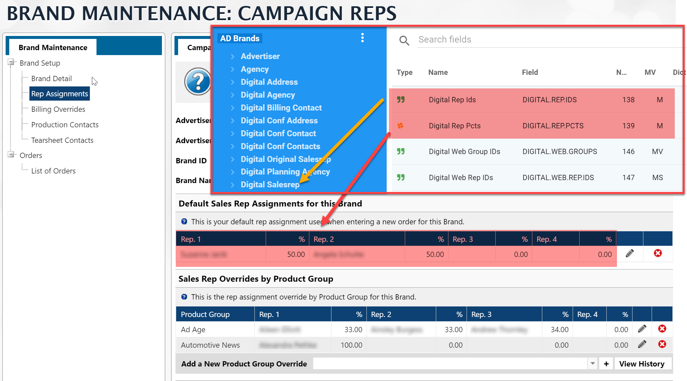

Most of the time you will want to access Brand information in the context of a Client.  When writing a report that has the **GEN Clients** mapping in it, you will see that one of the relationships is **AD Brands**, however, when you want to pull "setup" information about a Brand and its related Client, you will need to start from the AD Brands mapping.

:::info

If you are wanting Setup Information about Brands, you will want to have your base mapping be **AD Brands**

:::

## Rep Assignments

**Default Sales Reps Assignments for this Brand**

The following fields from the AD Brands mapping are the default sales reps assignments for the selected brand.

- **DIGITAL.REP.IDS <138>** - The Rep ID
- **DIGITAL.REP.PCTS <139>** - The Rep's percentage

To get the Sales Rep name and other details on the rep, go to the **Digital Salesrep** associated mapping.



---

**Sales Rep Overrides by Product Group**

:::caution

Note that the relationship between the Digital Web Group ID and the Digital Web Rep ID is multivalued.  You can have multiple Product Groups in this override area **AND EACH** Product Group can have up to four Reps assigned to it!  This is why you see the **MS** next to the DIGITAL.WEB.REP.IDS <147> field.  It is indicating that it is Multivalued/subvalued.  

Since you know that each Product Group can have only 4 reps, you could create a separate column for each using the code below in a Powerscript.

```javascript
if ($record['digitalWebRepIds']) {
	$record['digitalWebRepIds'].forEach((el, index) => {
	    $record[`GroupRep${index+1}`] = el
        $record[`GroupRepPercent${index+1}`] = $record['digitalWebRepPcts'][index]
	})
}
```

>  Remember to add a Remove flow step to remove the **digitalWebRepIds** and **digitalWebRepIds** fields after you have converted them to columns.

:::

The following fields have the same granularity and are associated.

- **DIGITAL.WEB.GROUPS <146>** - The Pub Group ID
- **DIGITAL.WEB.REP.IDS <147>** - Rep IDs assigned to the Pub Group 
- **DIGITAL.WEB.REP.PCTS <148>** - Rep %'s for each rep.

Rep Detail information can be pulled from the **Digital Web Salesrep** associated mapping


If you need the Product Group detail information, you will need to either get that from a joined dataset OR you can manually create a link to the **AD Pub Groups** mapping.  Here are the details for a Manual Link:

**From Mapping**: ODBC_PRODCAMP (this is the AD Brands mapping)

**To Mapping**: ODBC_PUB_GROUPS

**Link Name**: Can be whatever you want, but it should be descriptive and indicate that it was created by the site

**AD Brands**: DIGITAL.WEB.GROUPS - this is the link field from AD Brands to AD Pub Groups.


---

**Sales Rep Overrides by Product**

In the AD Brands mapping, you will only have access to the Product IDs, but **not** the reps associated with each product.  This is stored in another mapping called **AD Internet Brand Product Reps**.

The Field is in the AD Brands mapping

- **PRODUCT.IDS<185>** - The Pub Group ID


This the above will get you the Product Ids.  To get the associated reps, you will need to access the **AD Internet Brand Product Reps** mapping.


## Billing Overrides

**Billing Contact**

The field **AD Brands** `DIGITALBILLING.CONTACT <141> `links to the **GEN Company/Individual Names** mapping, which is named "Digital Billing Contact" in the mapping relationship from **AD Brands**.  


:::caution

You can get most of the information needed for the Billing Overrides in the **Digital Billing Contact** mapping, however, the billing address can be changed from the default.  Either way, the address that shows in the Billing Overrides section is in the field **DIGITAL.ADDRESS.ID <142>** in **AD Brands**.

The details for this address are located in the relationship called **Digital Address**


:::

**Invoice Email Contacts**

The Invoice Email Contacts for a given brand in the Billing Overrides section, is a multivalued field and links to the **GEN Company/Individual Names** mapping.

The field **AD Brands** `INET.INV.CONTACTS <203>` contains the IDs of the contacts.  As of the Q2-2022 release of the Informer Mappings, there is not a link to the detail information for this field.


If you need this information, you will need to create a manual link in your datasource.  This can be done within Informer by using the following information when adding a new link to the **AD Brands** links

 


