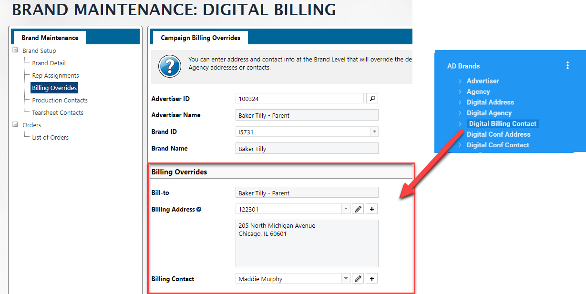

Most of the time you will want to access Brand information in the context of a Campaign. 

However, when going to the **AD Brands** mapping from **GEN Clients** , you will have access to "setup" information about a Brand and its related Client.  Each Client can have multiple Brands associated with it, whereas when coming from a campaign, you will be presented with the Brand appropriate to the campaign.

:::info

If you are wanting Setup Information about Brands, having your base mapping a **AD Brands** will make things a bit easier to understand.

:::

## Rep Assignments

**Default Sales Reps Assignments for a Brand**


There is no "Default Rep" field in the **AD Brands** mapping.  The default rep is stored in the **AD Internet Brand Product Reps** mapping with a `Brand Product ID` of 

- Client ID (Name ID)
- Brand ID
- `Default`

A default rep for Client 123 with a Brand XX would be `123*XX*Default` and exist only in the **AD Internet Brand Product Reps**.

There is NO relationship between **AD Brands** and **AD Internet Brand Product Reps** for the default rep.  To get this information in a report you will need to create a separate **dataset** that only pulls the default reps from **AD Internet Brand Product Reps** and then join that to your report needing the default rep information for a brand.

Here is a sample template for a dataset that will return the default rep for a Brand Key.  Since there may be multiple groups of default reps based on date (as of date), the dataset has code to only return the most recent one based on Today's date. 

### Download [JOIN]-Default Brand Rep

:::tip Download

**<a  target="_blank"  href="/downloads/join-default-brand-rep.tgz">[JOIN]-Default Brand Rep</a>**

:::


Here is an example:

| asOfDate   | asOfRep                 | asOfRepPct         |
| ---------- | ----------------------- | ------------------ |
| 2024-01-01 | REP-1, REP-2<br />REP-3 | 50%, 50%<br />100% |
| 2024-06-15 | REP-2                   | 100%               |
| 2024-06-25 | REP-3                   | 100%               |
| 2024-06-30 | REP-2                   | 100%               |

If today was *06/26/2024* The **[JOIN]Default Brand Rep** dataset would return **REP-3** from the asOfDate 2024-06-25.

Also note that the `asOfRep` and `asOfRepPct` fields are not only multivalued but also subvalued, in essence arrays of arrays.


---


**Sales Rep Overrides by Product Group**

The details for the *Rep overrides by Product Group* are linked to **AD Brands** by the **BRAND.REP.KEY**.  This key is a virtual field that is the `Client ID*Brand ID*Product Group ID`.  To get the actual override reps, you will need to use the **AD Internet Brand Reps** mapping.


:::danger

Given that you have the ability to "schedule" reps, the table structure is a bit complex.  Given that, you will need to create a separate dataset to get Ad Brand Product Group reps.

Here is a template that will return the "Current" rep based on the date the report was run.

**<a  target="_blank"  href="/downloads/join-ad-brand-product-groups.tgz">[JOIN]-Ad Brand Product Groups</a>**

:::

:::caution

Note that you can have multiple Product Groups in this override area **AND EACH** Product Group can have up to four Reps assigned to it!  


Since you know that each Product Group can have only 4 reps, you could create a separate column for each using similar code from below in a Powerscript.

```javascript
if ($record['GroupReps<replace with actual field>']) {
	$record['GroupReps<replace with actual field>'].forEach((el, index) => {
	    $record[`GroupRep${index+1}`] = el
        $record[`GroupRepPercent${index+1}`] = $record['GroupReps<replace with actual field>'][index]
	})
}
```

:::

---

**Sales Rep Overrides by Product**

In the AD Brands mapping, the **BRAND.PRODUCT.REP.KEY**  will link to the **AD Internet Brand Product Reps** mapping.  This mapping will hold the information about the Product Rep overrides for a brand.

:::caution

The **AD Internet Brand Product Reps** mapping will hold all of the "Dates" for the override reps.  In Naviga you can schedule when reps are the active rep.  This means that you will need to extract the rep you are looking for.  If you are looking for the active rep based on today's date, you can use a function.  [Most Recent Date Function](#most-recent-date-function)

:::


### Most Recent Date Function

```js
//------------------------------------------------------------
// Pass in an array of dates and get the INDEX returned
// of the date the is closest to but not greater than today
//------------------------------------------------------------
function getMostRecentDateIndex(asOfDates) {
    if (!Array.isArray(asOfDates)) return 0
    const today = moment();
    let mostRecentIndex = -1;
    let mostRecentDate = null;
    
    asOfDates.forEach((date, index) => {
        const momentDate = moment(date);
        if (momentDate.isSameOrBefore(today)) {
            if (!mostRecentDate || momentDate.isAfter(mostRecentDate)) {
                mostRecentDate = momentDate;
                mostRecentIndex = index;
            }
        }
    });
    
    return mostRecentIndex;
}
```


## Billing Overrides

**Billing Contact**

The field **AD Brands** `DIGITALBILLING.CONTACT <141> `links to the **GEN Company/Individual Names** mapping, which is named "Digital Billing Contact" in the mapping relationship from **AD Brands**.  



:::caution

You can get most of the information needed for the Billing Overrides in the **Digital Billing Contact** mapping, however, the billing address can be changed from the default.  Either way, the address that shows in the Billing Overrides section is in the field **DIGITAL.ADDRESS.ID <142>** in **AD Brands**.

The details for this address are located in the relationship called **Digital Address**


:::

**Invoice Email Contacts**

The Invoice Email Contacts for a given brand in the Billing Overrides section, is a multivalued field and links to the **GEN Company/Individual Names** mapping.

The field **AD Brands** `INET.INV.CONTACTS <203>` contains the IDs of the contacts.  As of the Q2-2022 release of the Informer Mappings, there is not a link to the detail information for this field.


If you need this information, you will need to create a manual link in your datasource.  This can be done within Informer by using the following information when adding a new link to the **AD Brands** links

 

## PIB Codes

In the **AD Brands** mapping you will find the PIB Code in the **PIB_CODE <4>** field.


:::caution

You may also see a **PIB_CODE <101>** field in the **GEN Clients** mapping.  DO NOT USE this fields as it is not maintained. 

:::
