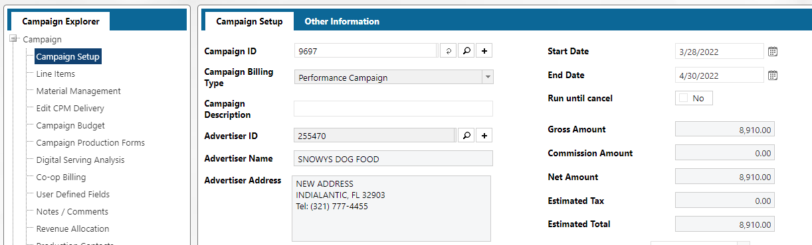

The AD Internet Campaigns mapping is the at the campaign level. If you need line item detail, you will need to get that from the AD Internet Orders mapping.

When pulling back records from AD Internet Campaigns, you can filter on the Status Code (STATUS.CODE, #7).  A common filter on status is: 

- **IS** - Invoicing Started
- **CO** - Confirmed
- **R%** - 

> NOTE: This is the status at the **Campaign** level. So, it will be filtering on campaign level status's. If you are pulling data in from AD Internet Orders also, you will need to also filter on the **Line Cancel Status ID (LINE.CANCEL.STATUS.ID #26)**

## Amount Fields

Since you are pulling data at the Campaign level, you probably want a single revenue amount for the campaign.  The fields to look at begin with **Tot**

- **Tot Revenue Amt** - Will be the Net Amount for the campaign as a whole
  
- **Tot Price Act Amt** - This is the Total Actual Amount for the campaign Lines.
  

If you need to get to the Line Item detail, for example, each line id's amounts, you would use the fields starting with **Price**.  These will be multivalued fields, so you need to be careful if you Normalize on these fields if you are aggregating on any other non multivalued fields.

- **Price Line Id** - The line Id
- **Price Actual Amount** - The actual amount for the line Id.  If there are multiple issues on a line, this will be the total actual amount

2. f it **IS NOT** populated we then read the size record from the **AD Internet Sizes** linked to the **AD Internet Ratecards Detail**.
   

Lastly, there is sometimes size information in the **X Value <157>** and **Y Value <158>** fields in **AD Internet Orders**

## Invoices

[See AR Invoice section](informer-mappings-ar-invoices#ar-invoices)

