import { Accordion } from '@site/src/components/UIHelpers';

# AD Internet Orders mapping

The AD Internet Orders mapping is the detail level of a campaign. It will hold the individual line items.

[**AD Internet Campaigns**](informer-mappings-ad-internet-campaigns) hold the summary data and then links to the **AD Internet Orders** mapping for the detail about the lines and reps.

Given that most of the reports that you write that pull data for Orders will want the detail level information found in **Ad Internet Orders**, it is recommended that you start with the AD Internet Orders mapping.

## Last Changed Date

If you change or edit a line (**AD Internet Orders**), it will update the line Last Change Date/Time/User in AD Internet Orders, **but NOT** the Last Change Date fields in the **AD Internet Campaigns** mapping, **unless** you are adding/deleting a line because only a line addition/removal would change the data on the campaign as well.

If something changes in the campaign header record then it will update the **AD Internet Campaigns** Last Change Date/Time/User **AND** the Last Change Date fields in the **AD Internet Orders** mapping.

Here is a list of items being tracked for changes:

 - Expense Budgets
 - Revenue Budgets
 - Pre-payment
 - Exhibition Orders
 - Override Billing Contact
 - Override Address
 - Co-op Details
 - Billing Schedule
 - Tearsheet Contacts
 - Production Contacts
 - Order Reps
 - Original Reps
 - Advertiser Id
 - Brand Id
 - Start Date
 - End Date
 - Industry Code
 - Status Code
 - Agency
 - Agency Pct%
 - P.O. Number
 - Marketing Campaign
 - Order Contact
 - Production Controller
 - Terms Code
 - Discount Pct%
 - Contract Id
 - Run untl Cancel Ind.
 - Internal Notes
 - Confimation Comments
 - Invoice Comments
 - Journal Entries
 - Confirmed Date
 - Self Service Approval Ind.
 - Self Service Email
 - Self Service Phone
 - Linked Jobs
 - Override Territory

## Filtering

When pulling data from the **AD Internet Orders** mapping, realize that Deleted Lines and potentially unwanted Campaign Status's will be included in your results. Since most reports do not want this information, you will want to add criteria to filter this information out.

Here is a common set of Criteria for a report from the **AD Internet Orders** mapping:


The first is the Status Code on the Campaign. It is found in the **AD Internet Campaigns** mapping and is called **Status Code**


The second field, **Line Cancel Status ID**, makes sure that no Deleted Lines are included in your results. It is located on the **AD Internet Orders** mapping.


## Multivalued Fields

You will notice in this mapping that there are a number of Multivalued fields. Even though we are at the Line level in the **AD Internet Orders** mappings, you will still see multivalued fields. One of these fields that we will use for Revenue is the **Month Period** field. Why would a single line within a Campaign have multiple Month Period fields?

First, the Month Period field is the Month/Period and Year (MM-YYYY) that this line is to be recognized as revenue in.

When you view a line in Naviga Ad, you see that a single line can extend across multiple months. If you want to see this information by month, then you will have to deal with the multivalued fields for this breakout. In particular the fields are:

- Month Period
- Month Start
- Month End
- Month Est Amt
- Month Act Amt

This is what a Line in a Campaign looks like in Naviga Ad. Notice that it has further detail showing the billing amount for each month (i.e. each issue). The values above correspond to each of these value in Naviga Ad.


The bit of difficulty is that these fields are stored in a Multivalued field. A weird concept if you are coming from a relational background, however, all it means, is that, in the example above, there will be three values stored in each of the MV fields mentioned.

A multivalued field in Informer usually is not in a format that is usable and thus you will need to run a flow step in your report to "Normalize" it.

This is what a report pulling these multivalued fields would look like without Normalization:


The problem with the above format is two fold, first it is hard to reason about, since we are used to seeing a full row of data. Secondly, you cannot filter on the MV fields.

Given this, the normal course of action when we have MV fields in our report is to normalize the MV fields. This can be done with the **Normalize** flow step.

After Normalizing, the above data will now look like this:

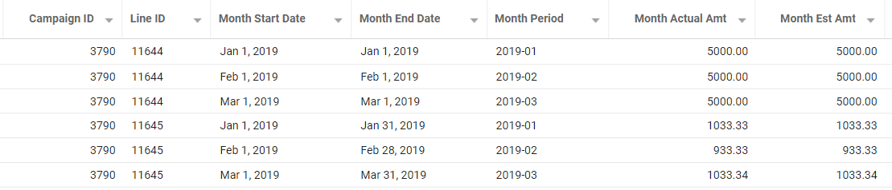

## Print vs Digital

To find if a campaign line is associated with a Print or Digital publication, you would use the **Print Pub Ind** field from the **AD Publications** mapping.

If this field is **Y**, then the campaign is Print, if **N**, then the campaign is Digital.

If you have created a report using the AD Internet Orders mapping, you would find the **Print Pub Ind** field in the **Web Site** association:

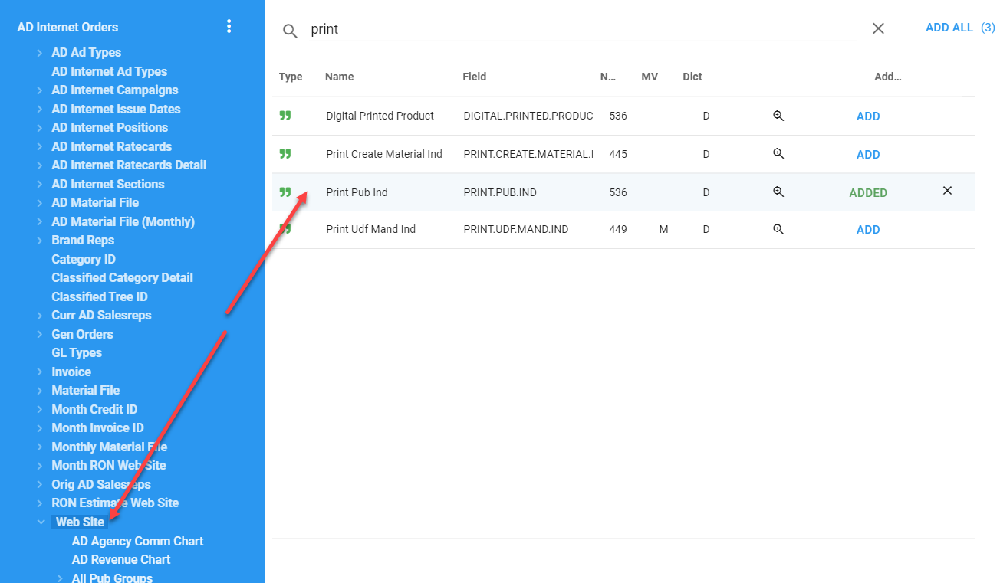

## Amount Fields

There are a lot of Amount fields in the **AD Internet Orders** mapping. We will focus on the Month Actual/Est Amt fields and the **Line Price Amt** fields in this document.

**Line Price Amt**

If you do not need to know the Line Item monthly breakout of revenue, then you can simply use the **Line Price Amt**. Just be aware that if you include any multivalued fields and normalize on them, the **Line Price Amt** field will be duplicated over those normalized items.

Also, the be aware that the **Line Price Amt** is the **Price per Issue**.  That would mean that if a line had 3 issues at $100 for the Issue Price, the Line Price Amt would be $100, but you may instead be looking for $300, the price for each issue summed up.

If that is what you are looking for, then you will want to take a look at the Month Actual/ Est Amt section below.

## Month Actual / Est Amt

:::tip Make Life Easier!

We have a saved function that will take care of all the calculations described below.  You can find the documentation on this function here:
**[Calculate Line Amounts Function](informer-saved-functions#calculatelineamounts---usage)**	

It is still good to read the below descriptions to understand how the information in the function is being processed.

:::

The **Month Actual and Est Amt** multivalued fields, which means that you will most likely want to normalize them and they also have some special rules that need to be followed to get the correct information from a report written using them.

First, you will want to normalize the **Month Actual Amt** and **Month Est Amt** fields.  If you look at a single line in Naviga, you will see that a single line id can have multiple "runs".  You can see below, that this Line ID of 11644 has three run days:


In Informer, WITHOUT any normalization, you will see the following:


What we need is to have those Month Actual Amt, Month Est Amt and Start and End date fields to each be on a row of their own.  To do this, we apply a **Normalization** Flow Step:

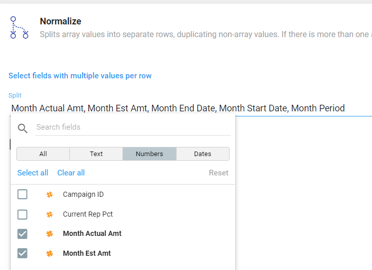

This will give us the following:

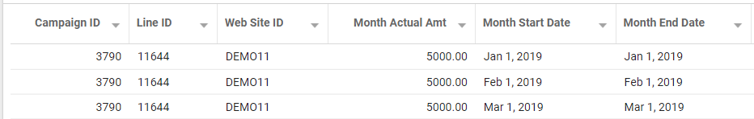

> If you want to add Reps to the mix, you have a couple of other steps, see the next section for reps.

The other rules can only be applied via a PowerScript Flow step.

Here are the rules:

- **Flexible Campaigns** - If the line is part of a flexible campaign, then you will **only** use the **Month Est Amt**
- **Other Types of Campaigns** - If the line is not part of a flexible campaign, then we need to determine whether to use the Actual or Estimated amount field. You will simply choose the Estimated amount if the Actual amount field is zero or empty.


Here is a Powerscript excerpt that embodies the above rules and creates a single revenue field called **NetAmount**:

```javascript
// Calculated the Net Revenue Amount field
if ($record.a_d_internet_campaigns_assoc_campaignType === "F") {
  $record.NetAmount = $record.monthEstAmt;
} else {
  $record.NetAmount =
    $record.monthActualAmt === 0 || !$record.monthActualAmt
      ? $record.monthEstAmt
      : $record.monthActualAmt;
}
```

:::danger

The **monthEstAmt** and **MonthActualAmt** fields are inclusive of Agency Commission.  If you want to remove **agency** commission, you will need to include the **monthActualCommAmt <202>** and the **monthEstCommAmt <201>** fields from the **AD Internet Orders** mapping.

Here is Powerscript that will create a **GrossAmount** field (that **includes** Agency Commission) and **NetAmount** field (that **excludes** Agency Commission)

```javascript
// Calculated the Gross and Net Revenue Amount fields
if ($record.a_d_internet_campaigns_assoc_campaignType === "F") {
  $record.grossAmount = $record.monthEstAmt;
  $record.netAmount = $record.monthEstAmt - naviga.returnANumber($record['monthEstCommAmt']);
} else {
  $record.grossAmount =
    $record.monthActualAmt === 0 || !$record.monthActualAmt
      ? $record.monthEstAmt
      : $record.monthActualAmt;
 // Calc net of Agency Commission
    $record.netAmount =
    $record.monthActualAmt === 0 || !$record.monthActualAmt 
      ? $record.monthEstAmt - naviga.returnANumber($record['monthEstCommAmt'])
      : $record.monthActualAmt - naviga.returnANumber($record['monthActualCommAmt']);
}
```

:::

> NOTE: The above code references the following fields:
>
> - **$record.a_d_internet_campaigns_assoc_campaignType** - This is the Campaign Type from the **AD Internet Campaign** mapping
> - **$record.monthEstAmt** - This is the Month Est Amt from the **AD Internet Orders** mapping
> - **$record.monthActualAmt** - This is the Month Actual Amt from the **AD Internet Orders** mapping
>
> The above code assumes the base mapping is **AD Internet Orders**. If not, the field reference name may be different.

### Gross / Net alternative Calculation

You can manually calculate the agency commission by using the following fields:

- **AD Internet Orders -> NO.AGY.COMM.IND <68>** - Indicates if this  Order line should have Agency commission removed.  This is a "double negative" flag.  So **"Y"** means that there is NOT any agency commission on the order line versus **"N"** which means that we will need to take out Agency commission.
- **AD Internet Campaigns -> COMMISSION.PCT<19>** - This is the percentage of Agency commission to use if commission is to be removed from the Line amounts.


## Adding Reps into the Mix

Obviously, you will want to have reports with rep data.  Having a Rep in the report seems straightforward, however, given that you can have MULTIPLE reps assign to every one of the line details, this can sometimes be confusing.

The image below shows a Campaign, with a single Line.  The Line has 4 line detail transactions.  The order also has two sales reps that will get 50% of each line detail.

The bottom grid is showing what the data would look like in Informer when "flattened".  You can see that you need to be careful because now the Month Est/Act Amount fields would be doubled if we aggregated them in a report.  There are techniques to keep this from happening that we will review below.


To add Reps to your report, you will first have to choose, whether you want the Current Rep or the Original Rep.  Most likely, you will want to use the Current Rep.

:::info

Below are the fields for Current and Original Rep.  The rest of the examples will use Current Rep, but you may substitute Original rep if that is data you prefer.

- [Add Reps Using the Current Rep Fields](#add-reps-using-current-rep-fields) - This method uses the Multi-Valued Rep fields that are NOT associated with the Month MV fields. 
  - CURRENT.REP.IDS <263>
  - CURRENT.REP.PCTS <264>
- Add Reps Using the Original Rep Fields - This method uses the Multi-Valued Rep fields that are NOT associated with the Month MV fields. 
  - ORIG.REP.IDS <260>
  - ORIG.REP.PCTS <261>

:::


---

### Add Reps Using Current Rep Fields

If you choose to use the Current Rep ID.

These are the fields you would need:

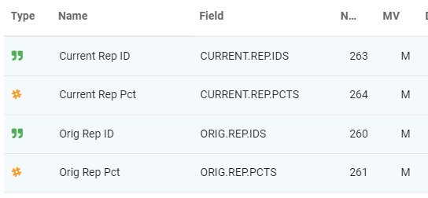

You will want to grab the Rep Pct if you have any ads with multiple reps on them.

For our example, we will be using the Current Rep ID and Current Rep Pct fields.

Once, you select those, fields you may also want the Rep name, you can get this from the associated mapping called **Curr AD Salesrep**:


For our example, I will be selecting the **Salesrep Name** field from the **Curr AD Salesrep** mapping.

You might think you are done, but not yet.  Notice that each of the Rep fields are *multivalued*, this is similar to what you saw with the Amount fields.  We had to normalize them.  Is most cases where you have fields from the same mapping (amt fields and rep fields) that are multivalued, you can just include them all in a single normalize step.  

**BUT Not here!** 

The Rep fields are multivalued, but in reference to something different than the Amount fields.  The Amount fields will have a multiple values in relation to the run days of a line ID, but the Sales Rep fields will have multiple values based on whether multiple reps are assigned to the Line.

Long story, short, you will need **TWO** normalization steps:

- **FIRST** normalize the Amount Fields
- **NEXT** normalize the Rep Fields 

> If you have included any fields from the Associated rep mappings (Curr AD Salesrep or Orig AD Salesrep), they will **ALSO** need to be included in the normalization step.

Here is what the normalization would look like:


And in our Flow steps, you will have two normalize steps:

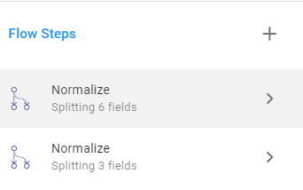

Lastly, you will need to account for Lines with multiple reps assigned to them, with different percentage allotments.  This can be done either:

- Using a Powerscript step manually calculating the rep amount - This will run **AFTER** the second normalize step 
- Using the saved function [calculateRepAmounts](informer-saved-functions#calculaterepamount---usage) - must run **BEFORE** the second normalize step.  


**Manual Rep Amount Calculation - AFTER Second Normalize**

```javascript
// Calculated the Net Revenue Amount field
if ($record.a_d_internet_campaigns_assoc_campaignType === "F") {
  $record.NetAmount = $record.monthEstAmt;
} else {
  $record.NetAmount =
    $record.monthActualAmt === 0 || !$record.monthActualAmt
      ? $record.monthEstAmt
      : $record.monthActualAmt;
}

// We need to calculate the Rep Amount.  This is because you may have more than one
// rep on an order at different % values.
// If there is NOT a rep id assigned, then just return the NetAmount
$record.RepAmount =  $record['currentRepIds'] ? $record.NetAmount * ($record.currentRepPcts/100) : $record.NetAmount

```

**calculateRepAmount Calculation - BEFORE Second Normalize**

```javascript
$record.netRepAmount = naviga.calculateRepAmounts($record['currentRepPcts'], $record.netAmount);
```

**REMEMBER** After the above calculation, you will have an array in the **$record.repNetAmount** field and you will want to normalize it along with your other Rep fields.

### Keeping Month Actual/Est Amounts with Rep Amounts


<Accordion title="Older Way to Not Duplicate Amounts">


Many times you will want to have a single dataset contain both the Rep amounts and the Month Amounts, however, as stated above, this can be problematic because multiple reps may be assigned to a Month line.

When you normalize for reps, this duplicates the **monthActualAmount** and **monthEstAmount** fields, thus you cannot use them for aggregating in any of your reports.  Most of the time you would be OK using the Rep Amounts, unless your reps can total more than 100% of an Ad.  For example two reps, each "getting" 100% of an Ads revenue.

The solution for this is to zero out the Month amounts when normalizing for Reps creates a new row.

Here are the steps. *NOTE: this code is also calculating foreign currency amounts*

Fields used in the below scripts:

**AD Internet Orders**

- MONTH.ACTUAL.AMT <76>
- MONTH.EST.AMT <73>
- CURRENT.REP.IDS <263>
- CURRENT.REP.PCTS <264>

**AD Internet Campaigns**

- CAMPAIGN.TYPE <8>
- CURR.RATE <226>

**1 - Normalize Month Line fields**

:::note Normalize Month Line fields

This is the standard normalize that we do for Month fields (monthActualAmt, monthEstAmt, monthStartDate, etc)

:::

**2 - Powerscript: Calculate Line Amounts**

```javascript
// We will use the following formula
// ---- Local Currency Amount = Foreign Currency Amount / Exchange Rate
// If there is an exchange rate, return it else return 1
exchangeRate = $record['a_d_internet_campaigns_assoc_currRate'] ? $record['a_d_internet_campaigns_assoc_currRate'] : 1;

$record.actualLineLocalAmount = $record['monthActualAmt'] / exchangeRate
$record.estLineLocalAmount = $record['monthEstAmt'] / exchangeRate
$record.netLineLocalAmount = calcNetAmount($record['a_d_internet_campaigns_assoc_campaignType'], $record.actualLineLocalAmount, $record.estLineLocalAmount)

$record.actualLineForeignAmount = $record['monthActualAmt'] 
$record.estLineForeignAmount = $record['monthEstAmt'] 
$record.netLineForeignAmount = calcNetAmount($record['a_d_internet_campaigns_assoc_campaignType'], $record.actualLineForeignAmount, $record.estLineForeignAmount)


// Inline function to calculate net amount.
function calcNetAmount (campaignType, monthActualAmt, monthEstAmt) {
    if (campaignType === "F") {
      return monthEstAmt;
    } else {
      return
        monthActualAmt === 0 || !monthActualAmt
          ? monthEstAmt
          : monthActualAmt;
    }
}
```

**3 - Normalize Reps**

:::note Normalize Reps

Normalize the Rep Fields AND the above created Line Amount fields. By normalizing the line amount fields, we ensuring that they ONLY show up on the FIRST row if there are multiple reps on the Line/Month row.

**Normalize the following fields**

- actualLineLocalAmount
- estLineLocalAmount
- netLineLocalAmount
- actualLineForeignAmount
- estLineForeignAmount
- netLineForeignAmount
- Current Rep ID
- Current Rep Pct
- Current Rep Name (if you added it)

:::

**4 - Powerscript: Calculate Rep Amounts**

Now we will calculate the rep amounts using the rep percentage.  Since we have normalize and have not modified the month actual amount and month est amount fields, we will use them to calculated the rep percentage.

```javascript
// We will use the following formula
// ---- Local Currency Amount = Foreign Currency Amount / Exchange Rate
// If there is an exchange rate, return it else return 1
exchangeRate = $record['a_d_internet_campaigns_assoc_currRate'] ? $record['a_d_internet_campaigns_assoc_currRate'] : 1;

repNetForeignAmount = calcNetAmount($record['a_d_internet_campaigns_assoc_campaignType'], $record['monthActualAmt'], $record['monthEstAmt']) * ($record.currentRepPcts/100)
repActualForeignAmount = $record.monthActualAmt * ($record.currentRepPcts/100)
repEstForeignAmount = $record.monthEstAmt * ($record.currentRepPcts/100)

$record.actualRepLocalAmount = repActualForeignAmount / exchangeRate
$record.estRepLocalAmount = repEstForeignAmount / exchangeRate
$record.netRepLocalAmount = repNetForeignAmount / exchangeRate

$record.actualRepForeignAmount = repActualForeignAmount
$record.estRepForeignAmount = repEstForeignAmount 
$record.netRepForeignAmount = repNetForeignAmount

function calcNetAmount (campaignType, monthActualAmt, monthEstAmt) {
    if (campaignType === "F") {
      return monthEstAmt;
    } else {
      return
        monthActualAmt === 0 || !monthActualAmt
          ? monthEstAmt
          : monthActualAmt;
    }
}
```

**5 - Remove Month Actual and Est amount fields**

I would recommend removing the `monthActualAmt` and `monthEstAmt `fields as they will not be usable in any aggregations.

</Accordion>

## Foreign Currency and Exchange Rates

When an ad is placed using a foreign currency, you will need to be very precise about where you are getting your amount fields so that you know if the stored amount is in the foreign currency or local (home) currency.  Certain fields in the **AD Internet Campaigns** will show up in the foreign currency and some in the local currency.  You can see the list in the **AD Internet Campaigns mapping** section below.


:::tip **Foreign Currency in AD Internet Campaigns**

If a Campaign is placed in a currency other than the 'home' currency, it is considered a **foreign currency** and will be stored as such in the AD Internet Orders MONTH amount fields. 

Orders placed in a foreign currency are stored in the AD Internet Orders mapping MONTH revenue fields in the foreign currency.  This means that the foreign amount will be stored in the Month Act Amt and Month Est Amt fields.  

This is important to remember because you will be using a formula to convert the Foreign currency amount back to the Local currency amount.

NOTE: Use the [calculateLineAmounts](informer-saved-functions#calculateLineAmounts---Usage) saved function to automate the conversion.

:::

The other important item to understand is that when the ad is placed, the exchange rate at that point in time is stored and used to calculate the currency values for the **AD Internet Orders** and **AD Internet Campaigns** mappings and they will not change.  However, once the campaign is invoiced, the system will reach out for the exchange rate at the time of invoicing.  That exchange rate is not stored, but instead a variance value is stored.  This is the difference between the initial foreign currency value and the "new" value given the exchange rate at the time of invoicing.  This "difference" field is in the **AR Invoices** mapping and is called **Exchange Revaluation Amount** (99)

> Exchange Rate Formula for Reference:
>
> `Local Currency Amount = Foreign Currency Amount / Exchange Rate`

**AD Internet Campaigns mapping**

The exchange rate is only stored in this mapping.  The field is called **Currency Exchange Rate** (226).  The Exchange rate is such that you can calculate the foreign currency amount using this formula `local currency amount * exchange rate`

You can also find what the foreign currency is by adding the **Currency Code** (50) field.  

There are many amount fields in the AD Internet Campaigns mapping and below is a list of common ones and what they will display if an ad has been booked in a foreign currency.  If a field you need is not in the list, make sure to verify if it is showing local or foreign currency before using it in your report.

- **Gross Amount** - Local Currency
- **Web Site Local Gross Amt** - Local Currency
- **Current Salesrep Amounts** - Local Currency
- **Local Revenue Amount** - Local Currency
- **Local Web Site Amount** - Local Currency
- **Price Actual Amount** - Foreign Currency
- **Revenue Amount** - Foreign Currency
- **Revenue Net Amount** - Foreign Currency
- **Foreign Currency Cost** - Foreign Currency

The most useful fields from the AD Internet Campaigns mapping are:

- **Currency Code**
- **Currency Exchange Rate**

**AD Internet Orders mapping**

In the AD Internet Orders mapping, there is no exchange rate field, however, most of the amount fields are expressed in the **foreign** currency, if the campaign was booked in a foreign currency.

- **Month Actual Amt** - Foreign Currency
- **Month Est Amt** - Foreign Currency
- **Month Curr Rep Amt** - Foreign Currency

**Convert Foreign Currency to Local**

You may want to see all your revenue in your local currency.  To do this, you will need to add a flow step.  If you are using the template dataset for AD Internet Orders, you would replace the Powerscript that is defining the Net Amount:

```javascript
// We will use the following formula
// ---- Local Currency Amount = Foreign Currency Amount / Exchange Rate
// If there is an exchange rate, return it else return 1
exchangeRate = $record['a_d_internet_campaigns_assoc_currRate'] ? $record['a_d_internet_campaigns_assoc_currRate'] : 1;

// Calculated the Net Revenue Amount field taking into account the exchange rate if one exists.
if ($record.a_d_internet_campaigns_assoc_campaignType === 'F') {
    $record.NetAmount = $record.monthEstAmt / exchangeRate
} else {
    $record.NetAmount = ($record.monthActualAmt === 0 || !$record.monthActualAmt) ? $record.monthEstAmt / exchangeRate : $record.monthActualAmt / exchangeRate;    
}
```

> Remember that the amounts in the AD Internet Orders and AD Internet Campaign mappings are based on the Exchange rate in the AD Internet Campaigns mapping and will not change.
>
> This means that when the campaign is invoiced, it may be invoiced at a different exchange rate. 


> **AR Invoice mapping**
>
> The last piece is the AR Invoice mapping.  It has a field called the **Exchange Revaluation Amount**, which is the difference **in LOCAL Currency** between the converted price at booking and the converted price at invoicing.

### Using Foreign Currency with Rep Amounts

You may also want to extend the foreign currency over to Rep Amounts.  Rep amounts are unique since there may be multiple reps per Month/Order line as each rep may get a different percentage of that Month/Order line.

In the example below, we are going to convert the **Actual**, **Estimated** in addition to the calculated **Net** amount.

The final revenue fields will be:

**Regular Amount Fields**

- **actualLineLocalAmount**
- **estLineLocalAmount**
- **netLineLocalAmount**
- **actualLineForeignAmount**
- **estLineForeignAmount**

**Rep Amount Fields**

- **actualRepLineLocalAmount**
- **estRepLineLocalAmount**
- **netRepLineLocalAmount**
- **actualRepLineForeignAmount**
- **estLineForeignAmount**
- **netRepLineForeignAmount**

**Normalize Flow Step**

You must first normalize any of the "Month" fields.  this will include the monthActAmt and monthEstAmt.

**Calculate Initial Line Amounts**

```javascript
// We will use the following formula
// ---- Local Currency Amount = Foreign Currency Amount / Exchange Rate
// If there is an exchange rate, return it else return 1
exchangeRate = $record['a_d_internet_campaigns_assoc_currRate'] ? $record['a_d_internet_campaigns_assoc_currRate'] : 1;

$record.actualLineLocalAmount = $record['monthActualAmt'] / exchangeRate
$record.estLineLocalAmount = $record['monthEstAmt'] / exchangeRate
$record.netLineLocalAmount = calcNetAmount($record['a_d_internet_campaigns_assoc_campaignType'], $record.actualLineLocalAmount, $record.estLineLocalAmount)

$record.actualLineForeignAmount = $record['monthActualAmt'] 
$record.estLineForeignAmount = $record['monthEstAmt'] 
$record.netLineForeignAmount = calcNetAmount($record['a_d_internet_campaigns_assoc_campaignType'], $record.actualLineForeignAmount, $record.estLineForeignAmount)
```

**Normalize Flow Step**

You must then normalize the Current Rep fields AND the Amount field created in the above Powerscript, but NOT the **monthActualAmt** or **monthEstAmt**.  This is very important.

When we perform this normalize, we want the Amount fields we created in the above script, the `...LineLocal...` amount fields to NOT get added to each rep when we normalize those reps.  Instead, these fields will be able to be used to in any aggregation formula that doesn't deal with Reps.  This is important because, depending on a site's setup, aggregating rep revenue may overstate real revenue.

However, we DO need the `monthActualAmt` and `monthEstAmt` fields to be "duplicated" to each rep, thus, they are NOT included in this flow step.  This way, we can use them in the next Powerscript to calculate Rep specific revenue.

**Calculate Rep Amounts**

```javascript
// We will use the following formula
// ---- Local Currency Amount = Foreign Currency Amount / Exchange Rate
// If there is an exchange rate, return it else return 1
exchangeRate = $record['a_d_internet_campaigns_assoc_currRate'] ? $record['a_d_internet_campaigns_assoc_currRate'] : 1;
// - We are using  the monthActualAmt and monthEstAmt for our calcs.
repNetForeignAmount = calcNetAmount($record['a_d_internet_campaigns_assoc_campaignType'], $record['monthActualAmt'], $record['monthEstAmt']) * ($record.currentRepPcts/100)
repActualForeignAmount = $record.monthActualAmt * ($record.currentRepPcts/100)
repEstForeignAmount = $record.monthEstAmt * ($record.currentRepPcts/100)

$record.actualRepLineLocalAmount = repActualForeignAmount / exchangeRate
$record.estRepLineLocalAmount = repEstForeignAmount / exchangeRate
$record.netRepLineLocalAmount = repNetForeignAmount / exchangeRate

$record.actualRepLineForeignAmount = repActualForeignAmount
$record.estRepLineForeignAmount = repEstForeignAmount 
$record.netRepLineForeignAmount = repNetForeignAmount
```

**Remove Fields**

The last thing we need to do is remove the `monthActualAmt` and `monthEstAmt` fields since we have used them to calculate the field that we need.

---

## Classified Category Tree and Category

In Naviga Ad, on certain Ad Types Lines, you have the Category Tree and Category as seen below.


To get these fields from the **AD Internet Orders** mapping, you can use three different links

- **CLASS.TREE.ID <267>** - This field links to the Classified Tree ID relationship.  To get the Desc, go the the **Classified Tree ID** and choose **CATEGORY.DESC <1>**.
- **CATEGORY.ID<0>** - This field links to the Category ID relationship. To get the Desc, go the the **Category ID** and choose **CATEGORY.DESC <1>**.
- **INET.CLASSIFIEDS.KEY<0>** - This field links to the Classified Category Detail relationship. It will result in the same information as the CATEGORY.ID linkage. To get the Desc, go the the **Category ID** and choose **CATEGORY.DESC <1>**.


## Classifieds Metadata Fields

The Metadata fields are found on the Category Metadata tab in the Naviga system:

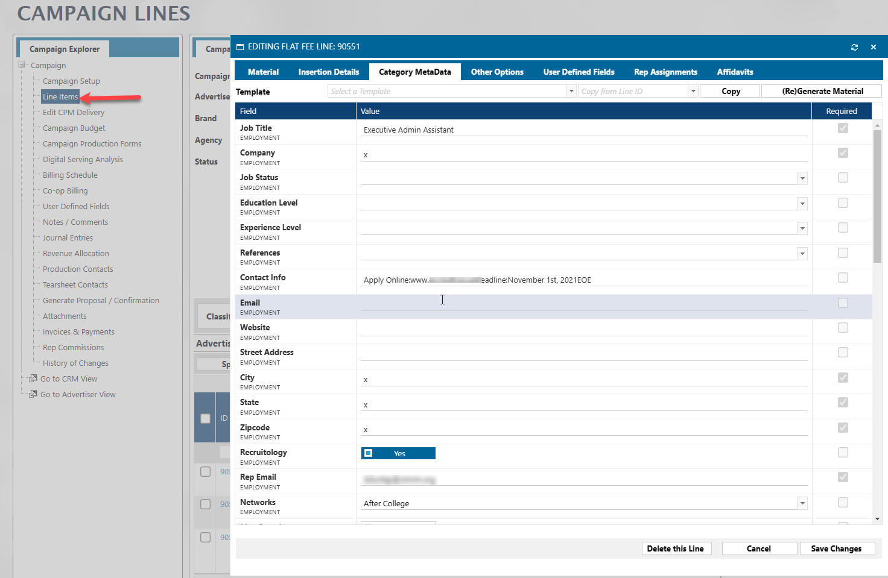

To access these fields in Informer, you will need to pull in the following fields from the AD Internet Orders mapping:

- **Classified Questions Desc (0)**
- **Class Answers (269)** 


The above fields are Multivalued and you may want to Normalize them depending on your needs.

However, if you would prefer to have each Class Questions Desc be its own column, you can do this with the below Powerscript:

```javascript
// Loop through the question descriptions and create a new field 
// for each question with the column name being Q-"Question Desc", with
// its value being the Answer.
// NOTE: We are "cleaning" the questions desc to remove special character.
//   This isn't really needed, but it makes the fields names more consistent.
//   You may remove it if you want.
if ($record['classQuestionsDescs'].length > 0) {
    pattern = /[^a-zA-Z0-9.-]/g;
    replacement = "";


    for (const [index, question] of $record['classQuestionsDescs'].entries()) {
        cleanQuestion = question.replace(pattern, replacement);
        $record[`Q-${cleanQuestion}`] = $record['classAnswers'][index]
    }
}
```

You will then want to use a **Remove** flow step to remove the original `$record['classQuestionsDescs']` and `$record['classAnswers']` fields.

## GL Codes in AD Internet Orders

In the most basic scenario, you can get the GL Code string from the AD Publications mapping grabbing the **IN Revenue GL ID**. 

Each Product will have a default Revenue GL Id and this field will hold it.  In Informer this will look as follows:


:::caution

However, most sites will have GL Overrides, which means that an order line may not be associated with the default Revenue ID (**IN Revenue GL ID**).  This is almost always the case, so never just use the **AD Publication -> IN Revenue GL ID**. 

This makes things a bit more tricky, but following the steps below will get you the correct GL.

In the code you will see that we still use the **AD Publication -> IN Revenue GL ID <114>** as the *default* GL.  This is because there may not be a match between the GL Type ID from AD Internet Orders and one of the fields in **AD Publication -> GL Type Revenue ID <318>** and if this is the case, we will default to the IN **Revenue GL ID <114>**.

:::

There is a **GL Type ID** field in the **AD Internet Orders** mapping.  This field will be the correct GL Type for the GL Code, meaning that if that line is "overridden", that GL Type ID field **will be** the overridden value.


The tricky part is that we do not have a link to the AD Publication table on GL Type.  To overcome this, we can add some Powerscript code to help us.

Here are the fields you will need in your dataset:

AD Internet Orders -> GL Type ID (12)

AD Publications (Web Site) -> GL Type ID (317)

AD Publications (Web Site) -> GL Type Revenue ID (318)

AD Publications (Web Site) -> IN Revenue GL ID (114)

With the above three fields you will see something like this:


The first GL Type is from AD Internet Orders and is the "correct" GL Type.  The other fields are from AD Publications and show all GL Types associated with the given publication.

Our Powerscript needs to match the GL Type ID from AD Internet Orders to the correct on from AD Publications and then get the correct GL Code (GL Type Revenue ID).  However, if a match is not found, we will use the IN Revenue GL ID <114> on the AD Publications mapping

Here is that code:

```javascript
// Loop through the all the GL Types on a product
// and match it to the GL Type on the Order Line
// Return the matching GL code for the GL Type
productGLTypes = $record['web_site_id_assoc_glTypes'];
productGLRevCodes = $record['web_site_id_assoc_glTypeRevenue'];
lineGLType = $record['glTypeId']

// Default if match is not found
$record.RealGLCode = $record['web_site_id_assoc_inetRevCode']

for(let i = 0; productGLTypes.length>i; i++) {
  let el = productGLTypes[i]
  if (el === lineGLType) {
    $record.RealGLCode = productGLRevCodes[i]
    // Only needed if you "need" the external gl code (changeCode)
    // $record.RealExternalGLCode = $record['changeCode'][i]
  	break;
  }
} 

```

This code will return a "Real" GL Code and also is returning the External GL (Change Code) if that is something you need.  However, getting the External GL Code requires another dataset to connect the **GL Chart of Accounts** mapping to the AD Internet Orders mapping.  The sample dataset download includes this other Dataset.  You may remove it if you like.

:::caution

The External GL requires a **separate** Dataset to return the External GL.  This means that if you import the below sample dataset and you want to include the External GL, you will need to also reload the dataset that is joined in the main dataset to get the external GL.  

This dataset is name **[NAVIGA]-GL To External GL**

:::

### Adding Level Descriptions for your Real GL Code information

Each GL Code is in the mapping **GL Chart of Accounts** and in that table, the GL Code can be broken out into 6 different "levels".  If you have done this and want to also pull in specific Level description, you have some extra work to do.

The **AD Publication -> GL Type Revenue ID <318>** does not have a relationship to its GL Chart of Accounts, so that must first be added.

Go to the Datasources area and double click on the Datasource that you want to add this link to.  Then click on the Links icon and click **NEW LINK**.


On the screen that is displayed, enter the following information.  

> NOTE:  Change the SITEID to your Site's three letter Identifier.


You will then need to add all of the Level Descriptions that you need.  In the diagram below, you will see that I am adding the Desc for Level 1.  You would then repeat the process for any other Level Descriptions that you need.


Now that we have added the Override GLs Level information, we next add the default  GL Level information.

That will be found in the **Inet Revenue GL** associated mapping.  Again, grab each of the Level Descriptions that you need.


The next step is to process these fields in our Powerscript.  The below Powerscript does the same things as the first Powerscript  you encountered in this section, except that we are now adding the Level descriptions into the mix.

I am just adding the first four, if you need more, you can add them.

```javascript
// Loop through the all the GL Types on a product
// and match it to the GL Type on the Order Line
// Return the matching GL code for the GL Type
productGLTypes = $record['web_site_id_assoc_glTypes'];
productGLRevCodes = $record['web_site_id_assoc_glTypeRevenue'];
productGLRevDescriptions = $record['web_site_id_assoc_gl_type_rev_gl_chart_of_accounts_mgh_glDesc']
lineGLType = $record['glTypeId']
level1Desc = $record['web_site_id_assoc_gl_type_rev_gl_chart_of_accounts_mgh_g_lkeyslevel_1_assoc_desc']
level2Desc = $record['web_site_id_assoc_gl_type_rev_gl_chart_of_accounts_mgh_g_lkeyslevel_2_assoc_desc']
level3Desc = $record['web_site_id_assoc_gl_type_rev_gl_chart_of_accounts_mgh_g_lkeyslevel_3_assoc_desc']
level4Desc = $record['web_site_id_assoc_gl_type_rev_gl_chart_of_accounts_mgh_g_lkeyslevel_4_assoc_desc']

//--Default values if there is no match found with the GL Type from AD Internet Orders
$record.RealGLCode = $record['web_site_id_assoc_inetRevCode']
$record.RealGLDesc = $record['web_site_id_assoc_inet_revenue_gl_assoc_glDesc']
$record.RealLevel1Desc = $record['web_site_id_assoc_inet_revenue_gl_assoc_g_lkeyslevel_1_assoc_desc']
$record.RealLevel2Desc = $record['web_site_id_assoc_inet_revenue_gl_assoc_g_lkeyslevel_2_assoc_desc']
$record.RealLevel3Desc = $record['web_site_id_assoc_inet_revenue_gl_assoc_g_lkeyslevel_3_assoc_desc']
$record.RealLevel4Desc = $record['web_site_id_assoc_inet_revenue_gl_assoc_g_lkeyslevel_4_assoc_desc']

for(let i = 0; productGLTypes.length>i; i++) { 
  let el = productGLTypes[i]
  if (el === lineGLType) {
    $record.RealGLCode = productGLRevCodes[i]
      $record.RealGLDesc = productGLRevDescriptions[i]
      $record.RealLevel1Desc = level1Desc[i]
      $record.RealLevel2Desc = level2Desc[i]
	  $record.RealLevel3Desc = level3Desc[i]
	  $record.RealLevel4Desc = level4Desc[i]
    // Only needed if you "need" the external gl code (changeCode)
    // $record.RealExternalGLCode = $record['changeCode'][i]
    break;
  }
} 

glParts = $record.RealGLCode.split("*")
$record.ReaclLevel1 = glParts[0]
$record.ReaclLevel2 = glParts[1]
$record.ReaclLevel3 = glParts[2]
$record.ReaclLevel4 = glParts[3]
```


---

Lastly, you will want to remove the Web Site GL Type ID and Web Site GL Type Revenue ID field from you report so that you don't get the multivalued fields showing.

> NOTE: if you chose to add Level Descriptions, those fields should also be included in the remove step.

> Download a sample Dataset:
> **<a  target="_blank"  href="/downloads/naviga-ad-internet-orders-with-gl.tgz"> [NAVIGA]-AD Internet Orders With GL</a>**
> NOTE: This sample has some campaign criteria that you will want to clear or update.

## Adjustments On Lines

If you need to get the Adjustment Amount and Descriptions for Campaign Lines, you will find this information on the **AD Internet Orders** mapping.

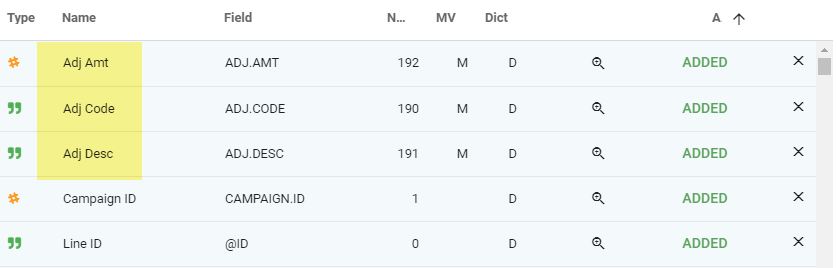

> NOTE: The Month Actual / Est Amt fields already have any adjustment amounts factored into them.

Also note that the Adjustment amount fields are multivalued.  You need to be careful since these are similar to what we have when we add sales reps from AD Internet Orders.  These fields ARE multivalued, but at a different level than the Amount and Sales Rep fields.  You will need to normalize these in a separate normalize step.

The Adjustments apply to all of a lines multivalued Amount and Date fields like Month Period and Mont Act Amount, etc.

Here is a visual example:

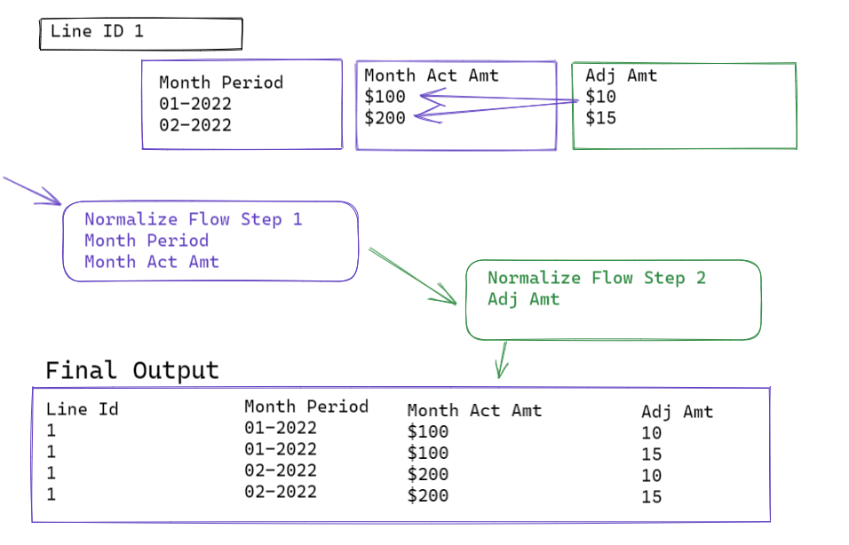

## Preprints

The fields listed below are multivalued and are at the SAME grain (i.e. associated with) the Month amount fields mentioned [above](#month-actual-/-est-amt)

- Month Zone IDs - There are the Zones
- Month Zone Circ A/B/C/D - These will have the Amounts for each Zone
- Month Est Qty - This will be the billed amount after billing.

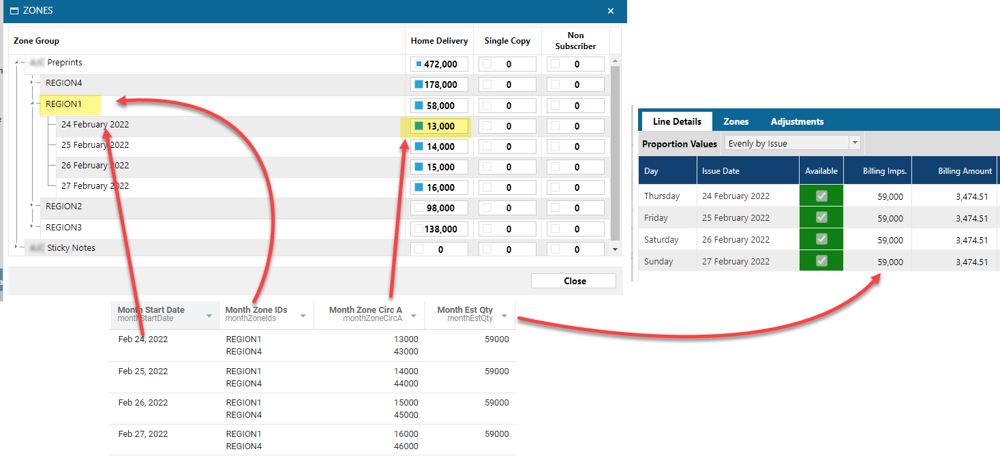

## Impressions

The below image shows how the Estimated and Actual impressions map from Naviga to Informer.

:::note

Be aware that the **Month Actual Imps** and **Month Est Qty** are both multivalued fields, so you will most likely want to normalize them.

:::

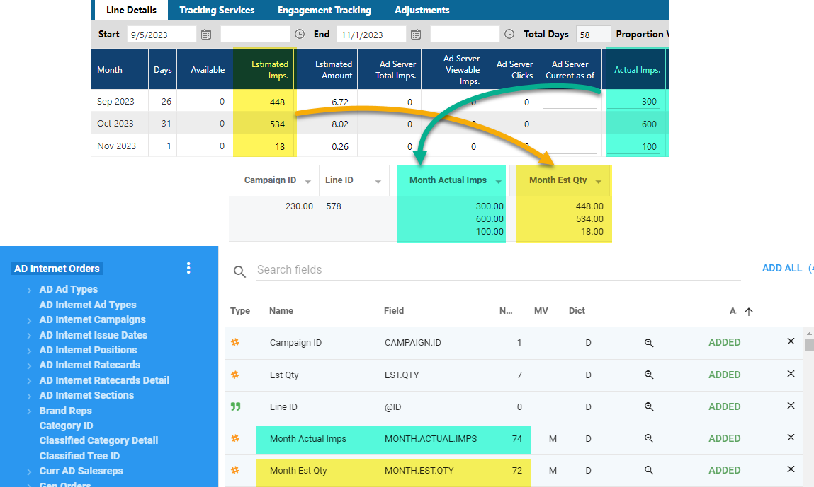

## Digital Size - Columns - Inches

Size information is located in a couple of places based on the value in the **Dimensions <9>** field in **AD Internet Orders**.

1. If the **Dimensions** field in Ad Internet Orders **IS** populated then read the size record from the **AD Internet Sizes** linked to AD Internet Orders.

   

2. If it **IS NOT** populated we then read the size record from the **AD Internet Sizes** linked to the **AD Internet Ratecards Detail**.
   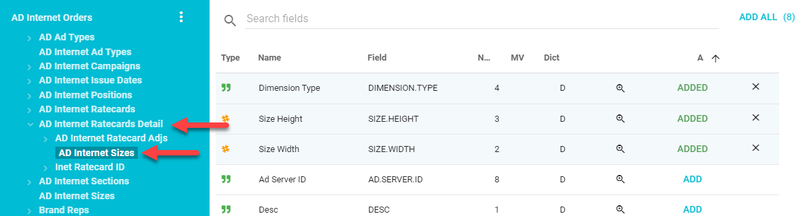

Lastly, there is sometimes size information in the **X Value <157>** and **Y Value <158>** fields in **AD Internet Orders**


## Invoices

[See AR Invoice section](informer-mappings-ar-invoices#ar-invoices)


## DEPRICATED FIELDS

## Add Reps Using Month Rep fields

The fields you will need will be either the Month Curr or Month Orig Rep fields, however we will focus only on the **Month Curr Rep** fields.


:::tip

Two things to note about these fields:

1. **They are MS (Multivalued - Sub-valued) fields** - This means that they are Arrays of Arrays.  Remember that each Line Detail can have multiple reps.  Since the Line Detail fields (Month Act Amount, etc) are already MV fields, the Rep fields need to be this Array of Arrays structure.
2. **Month Curr Rep Amt** has the Percentage (Month Curr Rep Pct) applied to it already.  This means if the Line Detail **Month Act Amount** field was $750 and there were two reps each getting 50%.  The **Month Curr Rep Amt** field would be $375 for each Rep.

:::

The fact the the **Month Curr Rep** fields are MS fields, means that if we want a single row for every transaction, we will need two normalize steps. 

The first normalize will include all of the **Month** fields.  The fields in **AD Internet Orders** that start with *Month* are all associated Multivalued fields.  Even the **Month Curr Rep** fields are associated at this level.  

So the first step is to add a **Normalize** flow step and add ALL of the Month fields:


The above normalize step will leave the **Month Curr Rep** fields still in a multivalued state.

> Note, that if you do not have a lot of Campaigns with multiple reps, it may look like you are done at this step.  But you are not.  The next step will take any sub-valued Rep fields and normalize them.

Next add **another** Normalize Flow step and add the **Month Curr  Rep** fields.


Below is an image of the output, when you DON'T include the **Month Actual Amt and Month Est Amt** fields in the second normalize versus when you do:


Lastly, you will most likely want to get the Sales Reps names also.  These are in a joined mapping called **Month Curr Rep Id**


