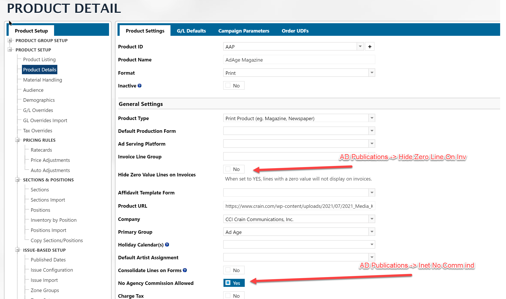
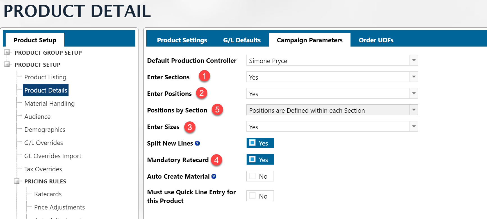

## AD Publications

- **No Agency Commission Allowed Flag** - AD Publications -> **INET.NO.COMM.IND <475>**
- **Hide Zero Value Lines on Invoices** - AD Publications -> **HIDE.ZERO.LINE.ON.INV <658>** When blank it is equivalent to **N**

**Product Type**

The Product type (first option under General Settings), can be one of four options.  There are three flags involved in this setting:

- AD Publications -> PRINT.PUB.IND <536> - If equal to Y, the **Print Product**
- AD Publications -> ENEWS>IND <386> - If equal to Y, the **Date or Issue-Based**
- AD Publications -> INET.RON.IND <371> - If equal to Y, the **Group Product**
- If all above are Null, then **Standard Product**

---

### Campaign Parameters

1. AD Publications -> **INET.ENTER.SECTION <379>**
2. AD Publications -> **INET.ENTER.POS<380>**
3. AD Publications -> **INET.ENTER.SIZE<381>**
4. AD Publications -> **INET.REQ.RC <382>**
5. AD Publications -> **INVENTORY.NO.SECTIONS.IND <560>** - 
   - "Y" - Positions are Defined **Independent** of Section
   - "N" - Positions are Defined within each Section

## Positions and Sections

Sections/Positions can be complicated outside of the orders.

You can define sections that are dependent on a Position or not.

Either way the tables for the set up data are:

AD Internet Sections
AD Internet Positions

Also, in AD Publications there is a flag.

AD Publications -> **INVENTORY.NO.SECTIONS.IND <560>** - 

- "Y" - Positions are Defined **Independent** of Section
- "N" - Positions are Defined within each Section

BUT, you cannot get to Positions or Sections from AD Publications. You need to start your report with either AD Internet Sections or AD Internet Positions.

Both of these mappings have a link to the AD Publications table
