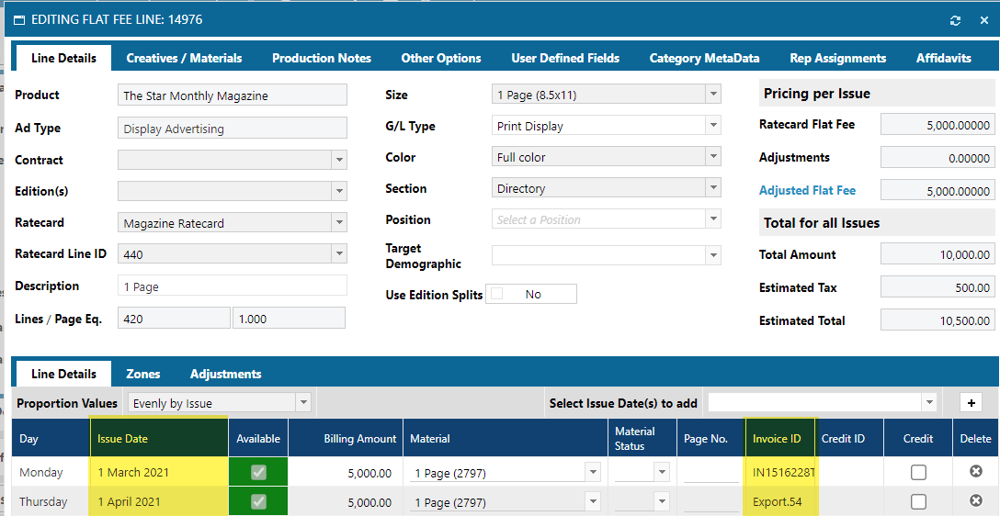

## AR Invoices

The AR Invoices mapping contains information about the AR invoices in the system.  It is helpful to understand how invoices are viewed in the Naviga system.

First, understand that there can be no more than a single Campaign per invoice, **however**, there can by many Invoices per campaign.

Also, **Performance Campaigns** and **Flexible Campaigns** invoice differently.

**Performance Campaigns**

Each line in a campaign may run in multiple issues.  Each issue will have its own Invoice.  Here is an example showing an Line item with two issues.  Notice each issue has its own Invoice:

In Informer, from the **AD Internet Orders** mapping,  the above Order Line looks like this:

For **Performance** Campaigns one can choose to bill by **Product** or by **Product Group.** So if there are 5 lines on the campaign, each for a different product, the invoice could either be for one line (or more if there are multiple lines for that product) or for the entire campaign. So not necessarily a one for one relationship but the line information does feed the invoice amount.

**Flexible Campaigns**

The invoice is for a percentage of the total campaign, there is no direct relationship between the line item(s) and invoice each invoice is always a percentage of the sum amount of the entire campaign.

### Credits and Debits 

This section describes how to find if an a transaction is an Invoice, Credit or Debit.  These Credit and Debits are not the T-Account style accounting CR and DR, but instead when we give a customer a Credit on their account for something or Debit their account.

The field that you will use is on the **AR Invoices** mapping.

- **Document Type** - This field has the following values:

  - **I** - Invoice
  - **C** - Credit
  - **D** - Debit
  - **W** - Writeoff

### Client vs Advertiser

The **CLIENT_NO <1>** field in **AR Invoices** is the *Bill To / Owner*  of the Invoice.  If there is an Agency involved then it will show up in this field.

The **ADV_ID** (Advertiser Id) field in **AR Invoices** is the *receiver of the service*.

An Invoice from the Ad Module may be issued to an Agency or directly to the Advertiser. If it went to an Agency, then the **Client ID** would be for the Agency (owner of the Invoice/debt) and the **Advertiser ID** would be for the Client that placed the Ad (receiver of the service). If the Invoice was directly to the Advertiser, then both should be the same value.

**BE AWARE**, there are some exceptions to the above rules.  If they have a Remit-To Invoice (bill the Advertiser directly and then when paid send their cut to the Agency). It is also possible to have an Override Bill-To and they could theoretically put the Advertiser there, thus hiding the Agency.

If you need to work around the above exceptions, you can get Advertiser and Agency information directly from the campaign.

**NOTE: this will only work for Invoices linked to campaigns.**  

### AR Invoices From AD Internet Orders and Campaigns

Many times you will want to be able to access information from AR Invoices when the starting point for your Dataset is from AD Internet Orders or AD Internet Campaigns.

You are able to do this, but you must be aware that the Invoice Ids are stored differently for Flexible and Performance campaigns.

- [Flexible](#flexible-campaign-invoice-fields) (Campaign Type = "F") - AD Internet Campaigns INVOICE.ID <28> - This is a MV (Multi Valued) field, hence, there can be multiple invoices for every campaign.  The Invoices align with the Billing Schedule.
- [Performance](#performance-campaign-invoice-fields) (Campaign Type = "M") - AD Internet Orders MONTH.INVOICE.ID <80> - In a performance campaign the invoices will align with the Order Lines.  There can be multiple order line on a single invoice depending on your settings in Naviga Ad.

#### Flexible Campaign Invoice Fields

As stated above, Flexible campaigns store their Invoice Ids in the AD Internet Campaigns mapping in field **<28> INVOICE.ID**.  

INVOICE.ID is a MV (Multi Valued) field which means that there can be multiple invoices for every campaign.  

These invoices are part of the Billing schedule.  This means that the billing schedule fields in AD Internet Campaigns are also MV fields **AND** since the Invoice INVOICE.ID <28> and Billing Schedule fields are related one to one, you can think of them as being associated at the same level. 

Some useful billing schedule fields **BILLING.AMOUNT <27>** and **BILLING.DATE <26>**.

To get the Invoice Details, there is a relationship to the **AR Invoice** mapping as shown below.

:::tip

If an Invoice has not *Posted To AR* yet,  you will see it in the AD Internet Campaigns INVOICE.ID field, but it will not yet exist in the AR Invoices mapping.

:::

:::caution

Sometimes users will want a report that displays Billing schedule amounts and Order Line amounts, but be aware that these are different types of data.  Even though the total of all Orders should match the total of the Billing Schedule amount, they do match line for line.  Thus having them on a single report tends to be problematic unless you really know what you want.

Here is an example of Revenue Allocation by Period Recognized.  Fields shown are in the **AD Internet Campaigns** mapping and are REVENUE.PERIOD<20>, REVENUE.AMOUNT<21>, REVENUE.NET.AMOUNT<22>:

VERSUS it's billing schedule.  Fields shown are in the **AD Internet Campaigns** mapping and are BILLING.DATE <26>, BILLING.AMOUNT <27>, INVOICE.ID <28>.

Note that the Billing information can and will exist before an Invoice is generated.

:::

#### Performance Campaign Invoice Fields

Performance campaigns have Invoice IDs that are associated with Order lines, so their data is located in the **AD Internet Orders** mapping.

- **AD Internet Orders** - **MONTH.INVOICE.ID <80>** - The invoice ID for the current Line/Month
- **AD Internet Orders** - **MONTH.ACTUAL.AMT <76>** - The amount for the current Line/Month
- **AD Internet Orders** - **MONTH.CREDIT.ID <81>** - The Credit ID for the current Line/Month

> These are all multivalued field and are associated at the same level as the other fields that start with MONTH in the AD Internet Orders mapping.

:::caution

Be aware that the MONTH.INVOICE.ID is not one to one with the Line ID or the MONTH.ACTUAL.AMT

:::

You can get details for Invoices and Credits from the associated mapping **Month Invoice ID** and **Month Credit ID** respectively.

:::tip

Please note, that the Month Credit Id mapping will hold credit that only apply to Performance Campaigns and would be the full amount of the Order Line (at the time) of the Credit.  There are other types of Credits in the system, but they would not be found via this relationship.

:::

### Reversing Credits

Reversing Credits are stored in **AD Internet Campaigns** for both Performance and Flexible Campaigns in attribute **UNBILLED.CREDIT.IDS <252>** with related information in F251 through F255.

## AR Cash

The **AR Cash** mapping holds your received payments.  Depending on the information you need, you may start a report from **AR Invoices** and pull some payment information from **AR Cash** OR you may start from **AR Cash** and pull some invoice information from **AR Invoices**.

It will depend on your report's needs.  The relationship between the two mappings is a many to many.

This means that one Invoice could have multiple payments being used to pay it down OR one payment could be used to pay multiple invoices.
