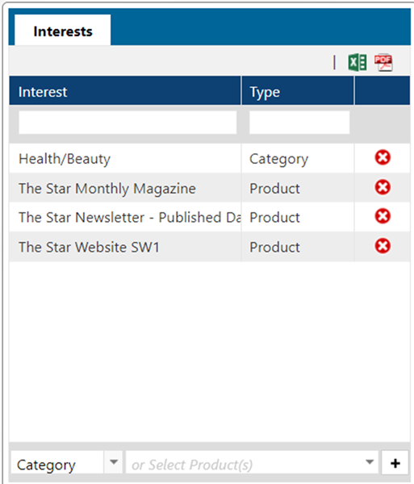

The CM Opportunities mapping allows you to report on the opportunities that you have in the system.

## [NAVIGA]-CM Opportunities template dataset

Here is a template Dataset to review and modify to your needs:

**<a  target="_blank"  href="/downloads/naviga-cm-opportunities.tgz">CM Opportunities Template Dataset</a>**

To import this template dataset into your system, start at **step 4** in the documentation [Copying a Dataset To a Different Datasource](informer-basics/#copying-dataset-to-different-datasource)

Please note that there are some additional Flow Steps that you should remove if you are not going to use their results:


### Template Usage Notes

There is a sample Visual in the Dataset for you to review.

The field **Opp Split Price** is the **Weighted** monthly amount. It is broken out by Month using the Start and End date on the Opportunity to calculate how many months to spread the weight amount over.

Here is the code that performs this split, the Flow step is **Split Prepare**:

```javascript
//=========================================================================
//== We have a Start and End Date field.
//== The need is to create a row for each month between these dates and
//== equally allocate the Digital Price across those months as well as multiplying that
//== amount by a weight percentage.
//== To do this, two fields will be created OppSplitMonth("YYYY-MM")
//== and OppSplitPrice (number)
//== These fields will contain arrays that when normalized will create a "new"
//== row for each.  Note, the price field will take
//== the Digital Price divided by the number of months and multiply by some weighting value.
//=========================================================================

//
startDate = $record.digitalStartDate;
endDate = !$record.digitalEndDate
  ? $record.digitalStartDate
  : $record.digitalEndDate;
//endDate = moment($record.digitalEndDate);
//-----------AUDIT FIELD
$record.errorIssues = !$record.digitalEndDate ? "Empty End Date" : undefined;
//----------
//probabilityPercent = $record.opportunity_stages_assoc_probPct / 100;
probabilityPercent = $record.probPct / 100;

// Get the number of months between the start and end date
// zero months will return 1
diffMonths = informer.navReturnANumber(
  naviga.getMonthsBetween(startDate, endDate)
);

// Make sure diffMonths is positive, if not, make zero
diffMonths = diffMonths < 0 ? 0 : diffMonths;
//  $record.DIFFMONTHS = typeof diffMonths + diffMonths + endDate.format('YYYY-MM')

// Create an array with diffMonths slots each filled with the digitalPrice
// Note: digitalPrice will be multiplied by it's probability %
priceArray = new Array(diffMonths).fill(
  $record.digitalPrice * probabilityPercent
);
monthArray = new Array(diffMonths).fill(startDate);

$record.OppSplitPrice = priceArray.map((price) => price / monthArray.length);
$record.OppSplitMonth = monthArray.map((sDate, idx) =>
  moment(sDate).add(idx, "M").format("YYYY-MM")
);

$record.SplitLength = monthArray.length;
//$fields.monthSplit.dataType = 'string';
//$record.monthlyPrice = [100, 200, 300, 400]

function returnNumber(numberIn) {
  let parsedNumber = parseFloat(numberIn);
  if (isNaN(parsedNumber)) {
    return 0;
  }
  return parsedNumber;
}

function diffMonths(startDate, endDate) {
  // Returns the number of months between the startDate and the endDate
  // Confige object could have:
  // negativeReturn: "actual", "absolute", default is actual and if something other than passed, that is what is used
  // Given how moment caclulates the difference between dates, it was returning the wrong number of months between in certain cases.
  // To fix, we pass the true flag, which return a decimal that we just take the ceiling of, i.e. round up all the time
  diffMonths = Math.ceil(returnNumber(endDate.diff(startDate, "months", true)));
  return diffMonths <= 0 ? 1 : diffMonths;
}
```

## User versus Rep

What is the difference between a User and Rep in Naviga Ad? The User is a System User with a login to the Naviga Ad system. Hence, you can think of the User Id being associated with a person who can log into Naviga Ad and enter campaigns, view reports, etc.

A Rep, however, is a separate id that will be associated with one or more Users. A Rep is the entity that gets credit for a campaign or is attached brand.

The reason for this is that while most of the time a Rep IS a person, sometimes that person may not have access to the Naviga Ad system (they never log into Naviga Ad) OR the Rep may be something like "House Ads Rep", which is not a person, but still technically a "rep" that is receiving credit for the campaign.

### Why Does this Matter

Most of the time it doesn't. Just about every mapping in Informer has **Rep** information associated with the transactions.

However, when dealing with the **CM Opportunities** mappings, you will see an **Owner User ID**. These are not **Reps**. They are Users of the system.

Since an opportunity has not yet happened, there can be no **Original Rep**, but there is a User who owns it.

By Q3 of 2021, you will see some additional information available for the Owner User Id:

- **Owner Email**
- **Owner Name**
- **Owner Assoc Rep IDs** - This is a multivalued field that contains the [Reps that this User is associated with](#user-id-and-rep-id-association). It will link to the **Owner Assoc Rep IDs** mapping so that you can get more detailed information for the linked/associated reps.

### User ID and Rep ID Association

As was noted above, a User ID can be associated with multiple Rep IDs.

Within Naviga Ad you can find this association in the User Setup Area.


## Simple Pipeline Starter

:::info Download Bundle

This is a sample Pipeline report using CM Opportunities mapping.

**<a  target="_blank"  href="/downloads/naviga-crm-action-item-report.tgz">CRM Action Item Report</a>**

:::

## Action Items and Notes

:::info Download Bundle

This is a sample Action Item report.

**<a  target="_blank"  href="/downloads/naviga-crm-action-item-report.tgz">CRM Action Item Report</a>**

:::

The above sample report does create some fields so that you can aggregate data on items that are Open and Closed for This Week, Last Week and The Last 30 Days.

> NOTE: There is a saved function `naviga.actionTypeDecode([$record['actionCode']])` that you will need to create.  The Action Type IDs (Codes) do not have a decoded value in Informer, so we create a decode function that will handle this.  Enter a support case if you need help building this function.

```js

$record.actionCompleted = $record['completedDate'] ? "Closed" : "Open"
// Initialize Buckets
//**NOTE if you add buckets to function update with initializer here
$record[`Closed-This Week`] = 0
$record[`Open-This Week`] = 0
$record[`Closed-Last Week`] = 0
$record[`Open-Last Week`] = 0
$record[`Closed-Last 30 Days`] = 0
$record[`Open-Last 30 Days`] = 0

// Create buckets based on Completed Dates.  These buckets will hold the counts
// for items that were closed in the three bucket periods.
// This week / Last Week / Last 30 days
categorizeDatePeriod($record['completedDate']).forEach(bucket => {
    $record[`Closed-${bucket}`] = 1
})

// Create buckets based on Created Dates.  These buckets will hold the counts
// for items that were created in the three bucket periods. 
// NOTE: These buckets will also count actions that were closed in these periods if
//    they were also created in these periods.  So a bit of double dipping, that is how Naviga report shows data too.
// This week / Last Week / Last 30 days
categorizeDatePeriod($record['createdDate']).forEach(bucket => {
    $record[`Open-${bucket}`] = 1
})

// Setup action type decode
$record.actionTypeDesc = naviga.actionTypeDecode([$record['actionCode']])

//$record.actionCompleted = 


//--- HELPER FUNCTION ------------
//NOTE: We need to return an array as and item that is in the This or Last week
//   bucket will ALSO show up in the last 30 days bucket.
function categorizeDatePeriod(inDate) {
  const now = moment();
  const created = moment(inDate);
  
  // Get start/end of current week (Sunday-Saturday)
  const startOfThisWeek = moment().startOf('week');
  const endOfThisWeek = moment().endOf('week');
  
  // Get start/end of last week
  const startOfLastWeek = moment().subtract(1, 'weeks').startOf('week');
  const endOfLastWeek = moment().subtract(1, 'weeks').endOf('week');
  
  let buckets = []
  // Check if date is in this week
  if (created.isBetween(startOfThisWeek, endOfThisWeek, 'day', '[]')) {
    buckets.push("This Week");
  }
  
  // Check if date is in last week
  if (created.isBetween(startOfLastWeek, endOfLastWeek, 'day', '[]')) {
    buckets.push("Last Week");
  }
  
  // Check if date is within last 30 days
  const thirtyDaysAgo = moment().subtract(30, 'days');
  // isBetween docs -> https://momentjs.com/docs/#/query/is-between/
  if (created.isBetween(thirtyDaysAgo, now, 'day', '[]')) {
    // If it's in the last 30 days but not in this/last week, return array
    buckets.push("Last 30 Days");
  }
  
  // If none of the above, return a string indicating it's older
  return buckets
};
```


## Prospect Interests



Prospect Interests are found in the CM Prospects mapping in Informer.  They are tricky to work with because the Prospects mapping's key is `Client Id * Rep Id`.  

This means that each rep could have their own Interests for a given Client/Prospect.

Meaning the best we can do is create a report that shows all reps Interest settings for a given client.

The `Interest` data is stored in three fields: 

- PUB.LIST <22>
- CATEGORY.LIST <23>
- EXHIBITION.LIST <24>
