When you build a report for Clients, you most likely will use the **GEN Clients** mapping as your base mapping.  However, there will be a number of fields that you will get from the mapping related to **GEN Clients**.

Every customer will have a record in the GEN Clients mapping, however the details of the client's name is stored in a link to the **GEN Company/Individual Names** mapping and is called "Client Names".

If you need address information, you can get the from the links to the **GEN Company/Individual Addresses**.  The GEN Client mapping is related to this mapping in two different ways. 

- **AD Preferred Address** - The default address for AD
- **AR Preferred Address** - The default address for AR

Most of the time the AD Preferred Address is best to use.

## Indicator / Flag fields

There are number of fields in the different mappings the end in `Ind`.  These are Indicator fields, which are considered Y/N or Boolean fields.

:::danger

Many of the Indicator fields can not only be Y or N, but sometimes they are empty.  There is no rule that can be applied to say that all empty indicator fields are Y or vice versa.  I will document some of the useful indicator fields in the next section.  If you run across an undocumented indicator field, contact support about it's default value when blank.

:::

### Indicator fields

| Field Name /Number   | Mapping                      | Value If Blank |
| -------------------- | ---------------------------- | -------------- |
| STATEMENT.IND <68>   | GEN Clients                  | Y              |
| AGENCY<277>          | GEN Clients                  | N              |
| CREDIT.STOP <45>     | GEN Clients                  | Y              |
| ACTIVE.IND <162>     | GEN Clients                  | Y              |
| AD.PRE.PAY.IND <310> | GEN Clients                  | N              |
| DO.NOT.USE.IND <150> | GEN Company/Individual Names | N              |
| DEBT.LET.ID <59>     | GEN Clients                  | N              |
| AM.PO.REQD <126>     | GEN Clients                  | N              |
| CC.APP.IND <248>     | GEN Clients                  | N              |

>NOTE: You can test if a field is blank using the following:
>
>```javascript
>if (!$record.IndicatorFieldName) {
>	//If we get here, the field is blank
>}
>```

### Field Locations in Naviga

1. **On Credit Stop** - GEN Clients -> CREDIT.STOP <45> - When Blank assume "Y"
2. **Generate Statements** -  GEN Clients -> STATEMENT.IND <68> - When Blank assume "Y"
3. **Active** - GEN Clients -> ACTIVE<162> - When Blank assume "Y"

https://xxx.navigahub.com/EW/XXX/general/setup/name_maint_ar


1. **Is this an Agency** - GEN Clients -> AGENCY.IND <277> - When Blank assume "N"
1. **Pre-Payment Required** - GEN Clients -> AD.PRE.PAY.IND <310> - When Blank assume "N"

https://xxx.navigahub.com/EW/XXX/general/setup/name_maint_ad


1. **Do Not Use** - GEN Clients -> DO.NOT.USE.IND <150> - When Blank assume "N"

https://xxx.navigahub.com/EW/XXX/general/setup/name_maint_general


1. **Allow generation of collection letters** - GEN Clients -> DEBT.LET.ID <59> - When Blank assume "N"

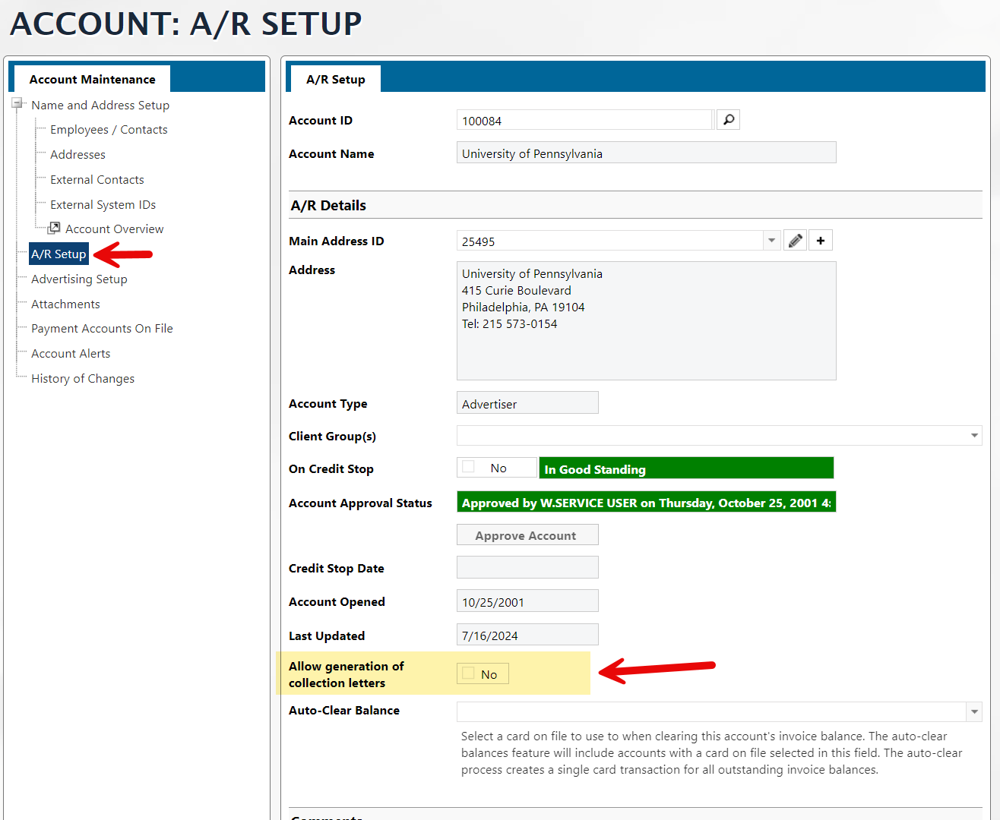


1. **Charge Credit Card** - GEN Clients -> CC.APP.IND <248> - When Blank assume "N"
1. **P.O. Required** - GEN Clients -> AM.PO.REQD <126> - When Blank assume "N"

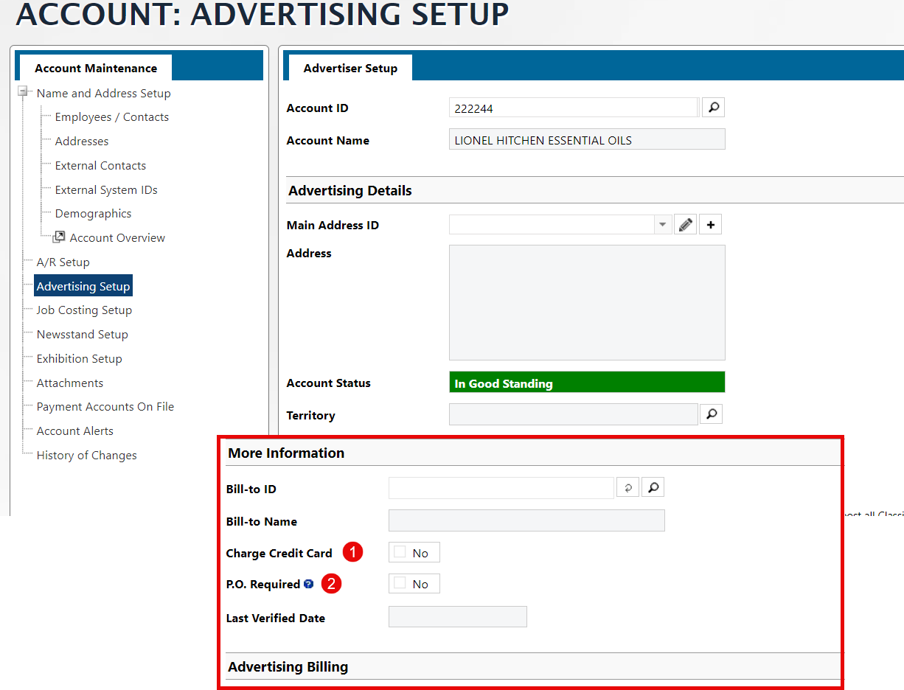

---


## Various Emails / Contact fields

### General Emails Field

The Email field seen below is found in the **GEN Company/Individual Names** mapping.  There are two fields that make this up:

- EMAIL.ADDRESSES <21> - This is the email address field.
- EMAIL.IDS <143> - This is the Type field seen below.

> Note that both of the above fields are Mulitvalued.  This means that there can be more than one email address stored per Client Name.

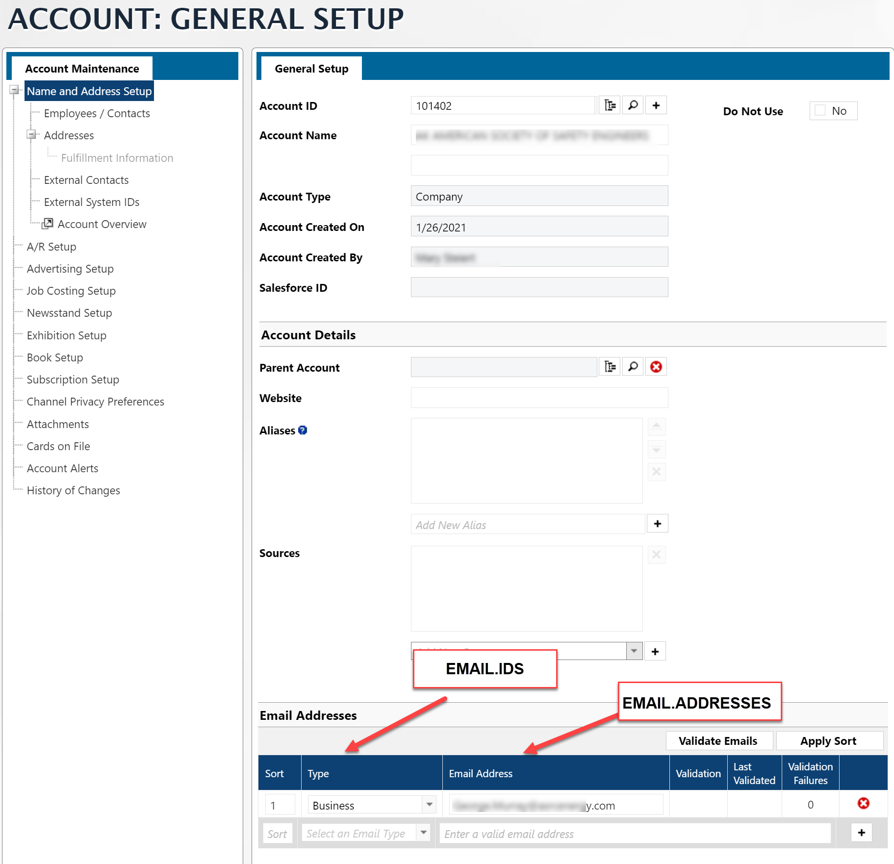

### Employees


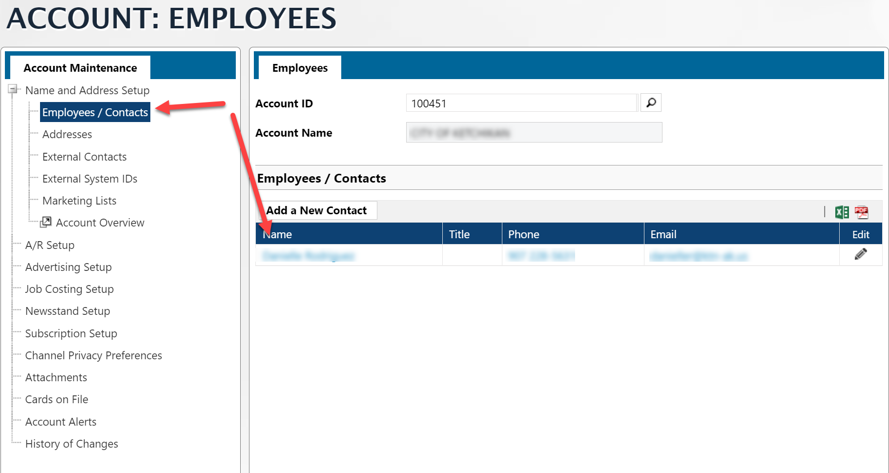


From Informer

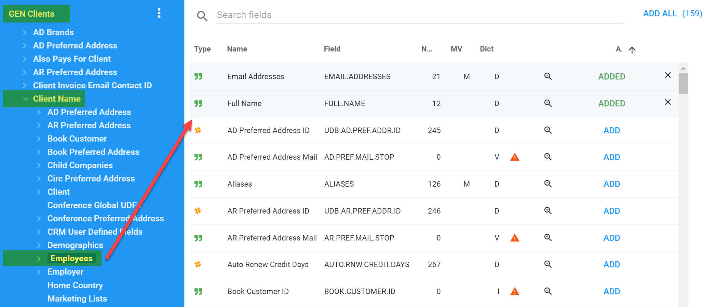

### Client Account Base Emails

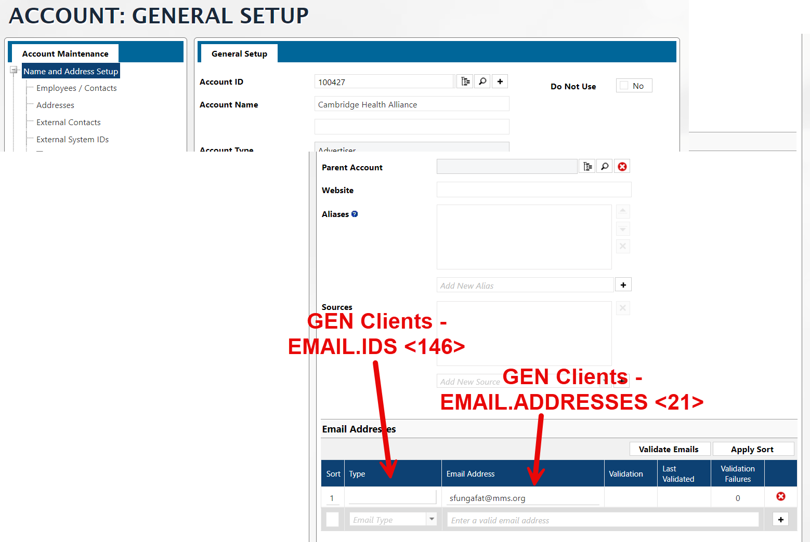

### Ad Billing Contact (Appears on Invoice)

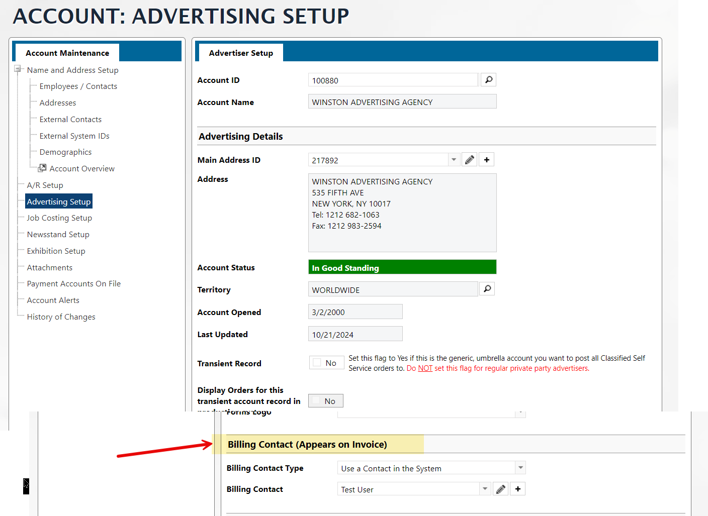

You will find this Contact Id in the **GEN Clients** mapping as `AD.INVOICE.CONTACT.ID <278>`, however, there is no related mapping to give you the details.  In the screenshot you see the arrow pointing to the **AD Billing Contact** related mapping.  This will need to be setup on a site by site basis.  Below are the details.

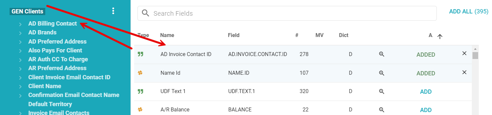


To add this Link to your datasource, you will need to go to the datasource that you want to add it to and enter the following for a new link.  Feel free to enter a Salesforce case and Naviga will create this for you.

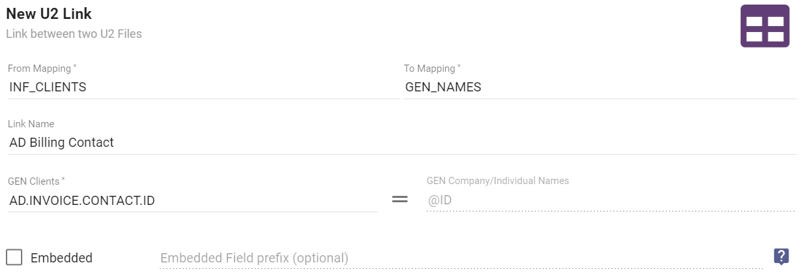


## Client Terms fields

There are two terms fields:

- A/R Setup Terms - **GEN Clients** **TERMS.CODE** <10> 
- Advertising Setup - **GEN Clients** **PRINT.TERMS.CODE** <271>

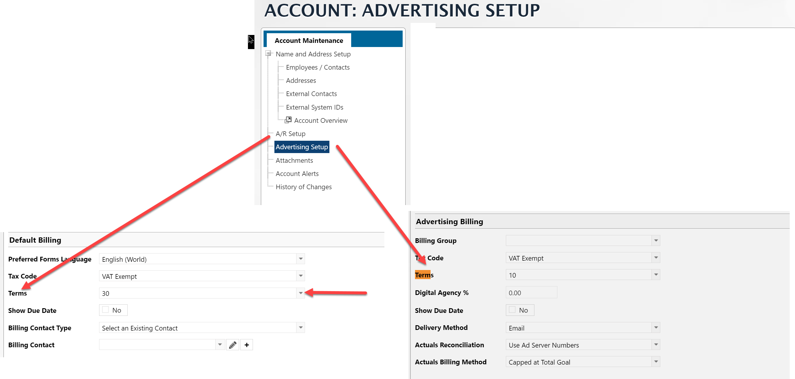

## Statement Email Address

In GEN Clients, there is a **Statement Email ID**, this ID is a link into the **GEN Company/Individual Names**, however it is not mapped in the Informer system as of June 2022.  You can add a manual link to remedy this.


This will add a new relationship to the GEN Clients mapping:


:::danger

The below information doesn't always work.  It will only work if the Statement Email Address "person" is an employee of the company.  This is left in the docs because it is a useful technique to use in other circumstances.

:::

The **GEN Company/Individual Names** mapping has a number IDs within that are self referencing.  One such ID is the the Employees ID.

What that means is that the **GEN Company/Individual Names** mapping holds the information for any entity that represents an Individual or a company, that individual could be an employee or a Transient Ad booker.  It could also be a parent or child company!

So this mapping does a lot.  In this section, I want to leverage that to be able to gain access to Contact Email addresses that are not available in the **GEN Company/Individual Names** mapping.

For example, there is company "Big Company" in the **GEN Clients** mapping, in that mapping there is a field called *Stmt Email Contact ID* which is an ID to a "contact" that lives in the **GEN Company/Individual Names** mapping, but the **GEN Clients** JUST has the ID, not the actual email address and there is no defined relationship to be able to get the email address.

We can still get at that email address information by using our understanding of **GEN Company/Individual Names**. 

- We know that the *Stmt Email Contact ID* is pointing to a "row" in the **GEN Company/Individual Names** mapping.
- We know that the *Stmt Email Contact ID* field is pointing to an **employee** of "Big Company"
- We know that we can get a list of all of the employees, because of the following relationship:
  
- Notice that in the above relationships, **GEN Company/Individual Names** is self referencing from Client Name to Employees.

What this relationship allows us to do is to get all of the employees for a particular company, "Big Company" in this case.  However, we only need the **Name Id** and **Email Addresses** fields from the **Employee** mapping.  Those along with the *Stmt Email Contact Id* (this field IS the Name Id) field from **GEN Clients**, we can create a powerscript to grab the email addresses.

```javascript
// Since we don't have a link to users from GEN Clients -> Client Name . stmtEmailContactId to 
// the GEN Company/Individual Names mapping to get the actual email addresses, we use the below.

// Create an object associating the employee ID with the employee email address
// { [nameId]: "emailAddress", ... }
// NOTE: this will pull ALL employees from the employee 
employeeIdEmailObject = $record['new_name_assoc_employees_assoc_nameId'].reduce((final, el, index) => {
  final = { ...final, [el]: $record['new_name_assoc_employees_assoc_emailAddresses'][index]}
  return final
}, {})


// Since stmtEmailContactId is multivalued, loop through and grab all matching emails from the above
// created eployeeIdEmailObject
$record.StmtContactEmails = $record['stmtEmailContactId'].map(contactId => employeeIdEmailObject[contactId])
```

You will also want a flow step to **Remove** the Employee fields, as they were only used to help us get the information we needed.

You will then be left with an array of *StmtContactEmails*.

## Advertising Setup - Contacts

In Advertising Setup ->  "Email Invoices to These Contacts" information.

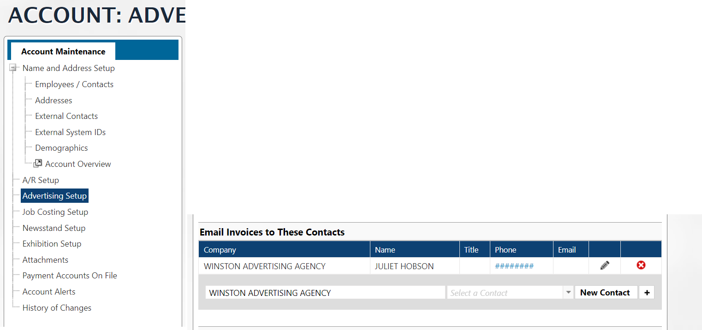

To access the "Email Invoices to These Contacts" information in Informer.

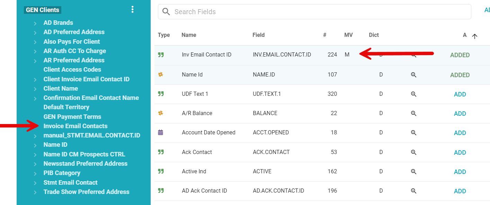

## Delivery Methods

Here are the mappings of the various delivery methods.  

1. **A/R Setup - Misc. Billing Details Delivery Method**
   `GEN Clients.Inv. Delivery Method CI (250)`

2. **A/R Setup - Misc. Billing Details Email Contacts** - The field in GEN Clients is only the ID to the contact.  To get the actual email address you will need to pull from the `Client Invoice Email Contact ID` linked mapping off of GEN Clients.

   `GEN Clients.CI Inv Email Contact ID (251)`


---

**A/R Setup - Statement Details Delivery Method**
`GEN Clients.Stmt Delivery Method (259)`


**Advertising Setup for Digital First Naviga Users**

> Digital First is the latest version of the Naviga software

Delivery Method - `GEN Clients - Digital Inv Delivery (275)`


**Advertising for Classic Naviga Users**

> Classic is the term used for the legacy version the Naviga System

Digital Billing Delivery Method - `GEN Clients - Digital Inv Delivery (275)`

Print Billing Delivery Method - `GEN Clients - Invoice Delivery Method (226)`


## Auto-Clear Balance


If your client has the Auto-Clear Balance Credit Card number assigned in the Customer A/R Setup section, you will be able to find that information when creating a report using GEN Clients as the base mapping.

In GEN Clients the field AR.AUTH.CC.TO.CHARGE <438> will either be empty, indicating there NOT a default card set for auto-clear, OR it will have a value in it.

The value itself is not helpful for your report, however, it allows a join to the **AR Auth CC To Charge** associated mapping (See below), which will have the card details for the selected auto-clear card.


## Actuals Reconciliation field

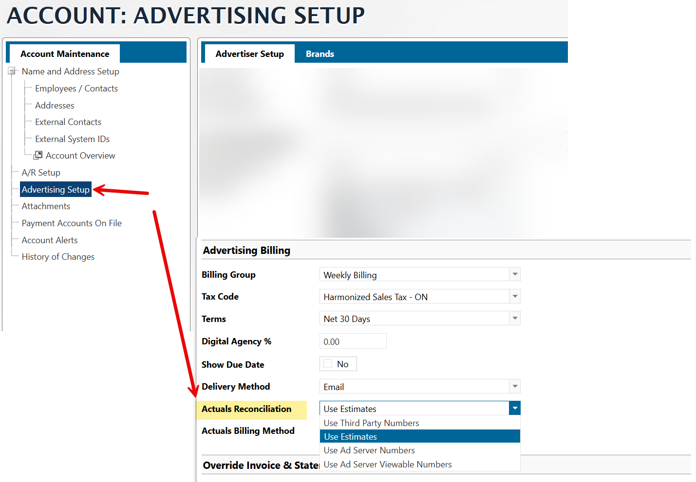

In Informer, you will find this field in the **GEN Clients** mapping in field -> **DIGITAL.3RD.PARTY.ACTUALS <282>**

You will need to decode the values in this field.  Here is the key:

- **E** = Use Estimates
- **V** = Use Ad Server Viewable Numbers
- **N** = Use Ad Server Numbers
- **Y** = Use Third Party Numbers

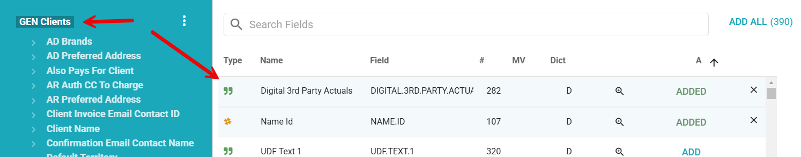


## Sales CRM Other Contacts

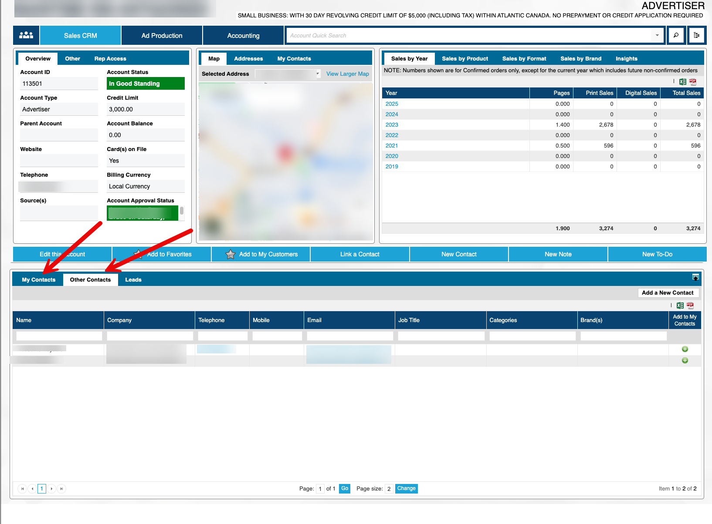

All of the contacts of a customer exist on **GEN Company/Individual Names** mapping in field EMPLOYEES <10>.  These are IDs that will show all of the contacts for the customer.  However, you will not be able to determine if it falls under the My Contacts tab or the Other Contacts tab.

The reason we cannot determine this within Informer is because of how the data is stored.  The CM.PROSPECTS mapping stores this information by NAME.ID*REP.ID, where the REP.ID would be the Rep you are looking for, meaning it is dynamic and not stored in a table per se. The NAME.ID is the customer we are looking for.

If you had that information you would need to join to the CM.PROSPECTS mapping on its KEY, which is NAME.ID*REP.ID.  Then IF the Contact Id (EMPLOYEES) is in the CM.PROSPECTS CONTACT ID <7>, it goes in that REP.ID "My Contacts", if not, then "Other Contacts"

## Portal Users

Information for Portal users is located on the **GEN Clients** mapping.  You will see some of the information with the prefix **Portal** and other info with **User**

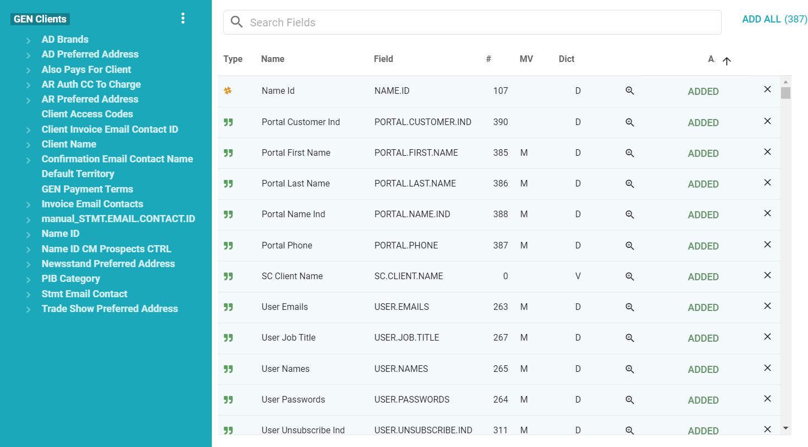

There is also a **GEN Portal Audit** file which has information about the Portal users logins.
