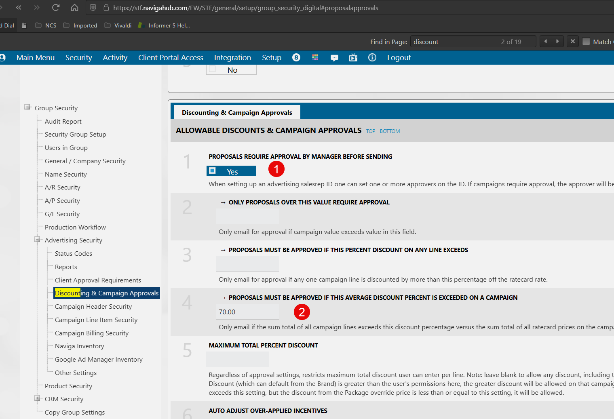

## CM Action Items

The CM Actions items mapping holds information on the Reps interaction with customers and contacts.  

There is one linked mapping called **Other Notes** and it has `Long Note` and `Completed Note` fields in it.  These fields are Base64 encoded, which means they will need to be decoded to make any sense.

You will need to have at the least Informer version 5.5.1 to be able to run the code below.

```javascript
// Decode a base64 encoded field.
$record.longerNote  = Buffer.from($record['other_notes_assoc_comment'], 'base64').toString()

```

---

## GEN User Control

GEN User Control is a mapping that contains some simple information about the users in your Naviga database. The following example Dataset will flatten the information in the GEN user control mapping into something usable.  

**<a  target="_blank"  href="/downloads/naviga-gen-user-control.tgz">GEN User Control Dataset</a>**

The GEN User Control mapping is a confusing mapping in the sense that there are multiple types of data in the mapping.  The User Groups exist separately from the Users and the User Parameter fields exist in separate rows from other user information.

The sample dataset has two Powerscripts that recombine the data so that each User has their own row with all of their relevant data.

### Building the GEN User Control Dataset

To build the Dataset yourself, create a Dataset with all the fields from the GEN User Control mapping and add the following Flow steps.

**Pre Flush Powerscript**

```javascript
//===============================================================================
// The ID field contains the User Id but it is formatted differently depending if
// it is the "main" record, it will start with a "~" or a Parameters record, in 
// which case it will end with "*PARAMS".
// There is also a special case where a row will actually contain a Group ID in the 
// id Field and the Group Description in the lastName field.
// All of these cases are accounted for in the code below.
//===============================================================================
//---- Create a cleansedUserID
idField = $record['id_1']
// Determine if row is params row or user row
// If the id ends in *PARAMS it has certain other fields filled for the user
$record.isParamsRow = idField.includes('*PARAMS')
// If the id begins in "~" it has certain other fields filled for the user
$record.isUserRow = idField.includes('~') 
// This will help us determine if the row is a Group description row
$record.isUserGroupIdEmpty = $record['userGroupId'] ? false : true

// Clean based on type of field
cleanedIdParams = idField.includes('*PARAMS') ? idField.substring(0, idField.length - 7 ) : undefined;
cleanedIdTilde = idField.includes('~') ? idField.slice(1) : undefined;

// Above cleaning will produce a cleansed user id that we can use to join in post flow step
$record.cleansedUserId = cleanedIdTilde || cleanedIdParams || ''

//-----------------------------------------------------------------
// The steps below will save information to the $local object so that
// we can recall them in the Post flush script and combine the user records
// into a single row for each user
//-----------------------------------------------------------------
// Store user row fields on local object - these will be joined with the *PARAMS
// rows in the Post flush script
if ($record.isUserRow) {
    $local[$record.cleansedUserId] = {
        firstName: $record['firstName'],
        lastName: $record['lastName'],
        status: $record['usrStatus'],
        groupId: $record['userGroupId']
    }
}

// Check if this is a Group definition row, if so store the info on the local object
// Use the idField (which is really the groupId) so that we can pull the description 
// in the Post flush script.
if (!$record.isParamsRow && $record.isUserGroupIdEmpty) {
    // the idField in this case will the the Group ID
	$local[idField] = {
        groupDesc: $record['lastName']
    }	
}
```

**FLUSH Flow Step**

```javascript
// Put a Flush Flow Step here
```

**Post Flush Powerscript**

```javascript
// Status lookup object
statusLookup = {
    A: "Active", 
    L: "Logged",
    R: "Retired"
}

//------------------------------------------------------------------------
// We are using the *PARAMS row as the base row and then adding on the 
// information from the user rows that had ~ in their ID.
// If this is not a *PARAMS row, then we will delete it from the output
if ($record.isParamsRow && $local[$record.cleansedUserId]) {
    $record.paramFirstName = $local[$record.cleansedUserId].firstName
    $record.paramLastName = $local[$record.cleansedUserId].lastName
    $record.paramUserStatusCode = $local[$record.cleansedUserId].status
    $record.paramUserStatus = statusLookup[$local[$record.cleansedUserId].status] || $local[$record.cleansedUserId].status
    $record.paramGroupId = $local[$record.cleansedUserId].groupId    
    $record.groupDesc = $local[$local[$record.cleansedUserId].groupId].groupDesc
} else {
    $omit()
}

```

**Remove Fields**

You can also add a *Remove Fields* flow step to remove fields used in the calculations and unneeded fields:

- First Name
- Last Name
- User Group Id
- @ID
- User Status
- isParamsRow
- isUserRow
- isUserGroup

**Rename Fields**

This last Powerscript just cleans up some of the labels:

```javascript
// Change field labels (removing param)
$fields.paramGroupId.label = "Group"
$fields.paramFirstName.label = "First Name"
$fields.paramLastName.label = "Last Name"
$fields.paramUserStatus.label = "User Status"
$fields.paramUserStatusCode.label = "User Status Code"
```


---

## GEN Security File

The **GEN Security File** holds much of the security data for Groups.

1. **IN.PROPOSAL.APPROVAL.REQD <448>**
2. **IN.PROPOSAL.APPROVAL.CAMP.PCT <444>**



## Miscellaneous Information

### Date Time Stamp fields

You may encounter Text fields in information called "Date Time Stamp".  These will be a string of numbers that are not useful until interpreted.  This field is a Unidata Date/Time formatted field.  Below is how to *decode* it.  

You can also use the saved function [Parse Date Time Stamp](informer-saved-functions#parsedatetimestamp---usage) to do the decode for you.

**Unidata Date / Time Format:**

The first 5 digits in the Unidata date number is the number of days since

**12/31/1967**

 The last 8 digits are the number of milliseconds into the day, so that is the time component.

For example "**19736** *43200000*" would be interpreted as:

**1/12/2022 12:00:00:000 PM**

 **19736** = 1/12/2022 - 12/31/1967

*43200000* = 12:00:00:000 PM

## Number Field Formats


### AD Internet Orders

**X Value <157>** and **Y Value <158>**


