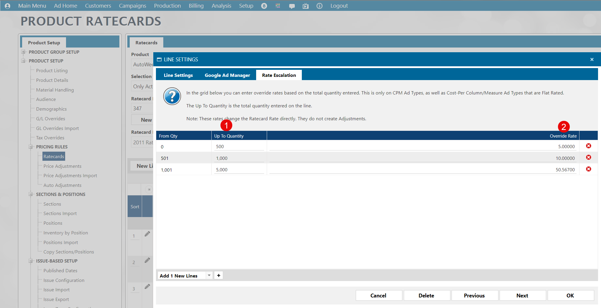

## Ratecard Detail Escalation Factor

The **From Qty** is NOT a field, but is derived in Naviga Ad.

The **Up To Quantity** is called **ESCALATION.QTY** in AD Internet Orders

The **Override Rate** is called **ESCALATION.FACTOR** in AD Internet Orders

1. **AD Internet Ratecards Detail - ESCALATION.QTY <142>**
2. **AD Internet Ratecards Detail - ESCALATION.FACTOR <143>**

 
