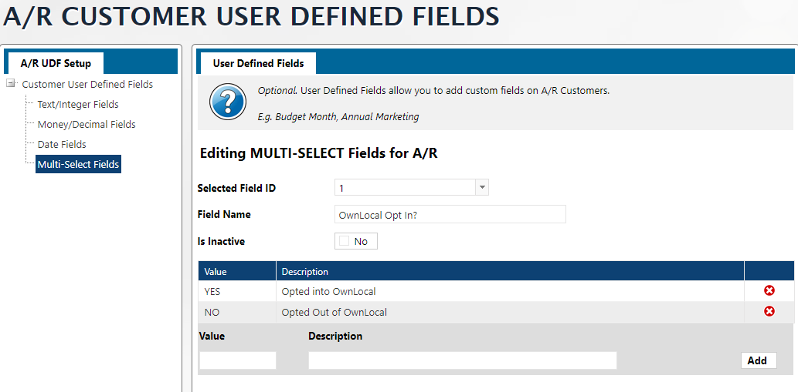
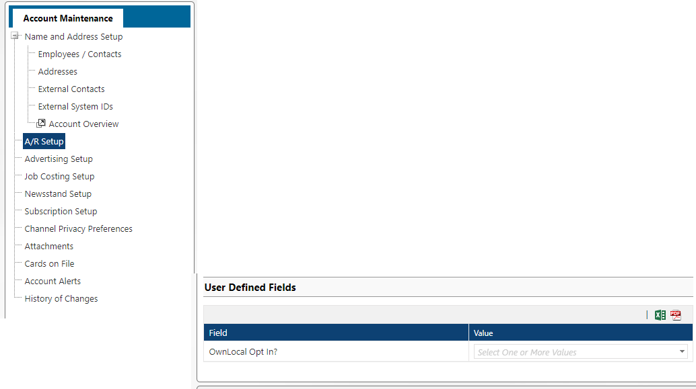
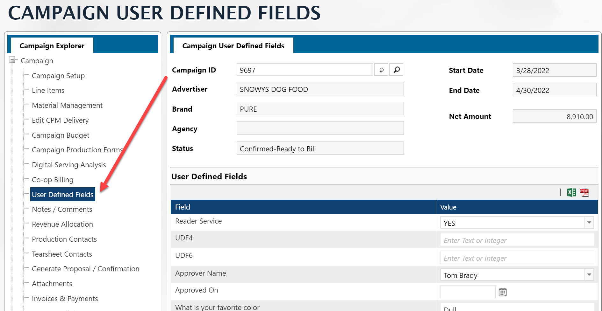
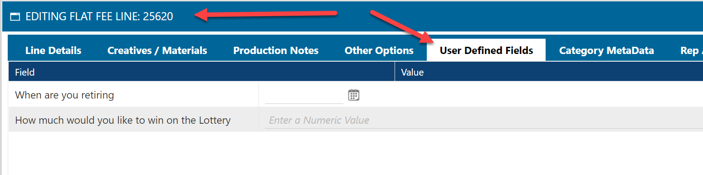

UDF stands for **User Defined Fields**.  These are fields that you get to define to hold whatever information you need.  This is great for flexibility, however, since every site will have different information, it can be a bit confusing finding the UDF you need.

To start with, you will need to know what information your UDF is associated with in Naviga.  It can be [Client AR](#client-ar-udf), [Opportunity UDF](#opportunity-udf), [CRM UDF](#crm-udf), [Campaign UDF](#campaign-udf), [Order Line UDF](#order-line-udf).

In **Informer**, each of these types of UDF fields are stored in different mappings, but have the same format.

First, UDF fields come in different types, **Text, Date, Numeric, Picklist**.  Also, you can define more than one of each type of UDF.  In Informer you will see them defined as:

- **Text UDFs** - UDF 1 Text, UDF 2 Text, OR UDF Text 1, UDF Text 2, etc.
- **Date UDFs** - UDF 1 Date, UDF 2 Date OR UDF Date 1, UDF Date 2, etc.
- **Numeric UDFs** - UDF 1 Numeric, UDF 2 Numeric OR  UDF Numeric 1, UDF Numeric 2, etc.
- **Picklist UDFs** - UDF 1 Picklist, UDF 2 Picklist OR  UDF Picklist 1, UDF Picklist 2, etc.

> All UDFs EXCEPT for Picklists hold a single value, however, Picklists are multivalued fields and can hold multiple values.


## UDF Descriptions

Currently, the UDF Codes are the only items stored in the various mapping that hold the UDFs.  If you need a particular UDF description, you will need to create a separate dataset that you can then join to to get this information.

The mapping the holds the UDF Descriptions is **GEN UDFs**.  

The **@ID** field is the field that you will need to join to.  It is a Unidata key and is structured as follows:

`<UDF Identifier>*<UDF Type>*<UDF Position>`

- **UDF Identifier** - This will align with one of the sections below.  For example CRM UDFs will have `CRM` as the UDF Identifier, Order Line UDFs will have `INET.LINE`.  You can inspect the table for more details.
- **UDF Type** - This will be PICKLIST or TEXT
- **UDF Position** - This will be a number based on which position the UDF is in given its Identifier and Type.

Here is a sample Dataset that you can use for the UDF Lookup:

**<a  target="_blank"  href="/downloads/lookup-udf-descriptions.tgz">[LOOKUP]-UDF Descriptions</a>**

You will **NOT** find a field in AD Internet Orders or any other table containing the UDF codes with a field ready to join to the @ID in **GEN UDFs**, so you will have to build that field yourself in a Powerscript flow step.  It can be a simple hardcoded field:

`$record.udfText2Join = "INET*TEXT*1"`

### Picklist Joins

Picklist are a bit more difficult because the are MultiValued/SubValued fields.  This means that each Picklist UDF can have Multiple


```js
$record.picklistDescs = []

// $record['picklistUdfCodes'] - This is the 
for (let picklistCode of $record['picklistUdfCodes'][0]) {
    index = $record['join-picklistUdfCode'].findIndex(el => el === picklistCode)
    $record.picklistDescs.push($record['join-picklistUdfCodeDes'][index])
}
```


## Client AR UDF

You can define the UDFs here - https://XXX.navigahub.com/ew/XXX/accounting/setup/ar_udf_codes?t=TEXT


Once you set up the UDF, you can applyit in the Account Maintenance module:



---

## Opportunity UDF

You can define the UDFs here -  https://XXX.navigahub.com/ew/XXX/crm/setup/crm_parameters_udf_codes?m=OPP&t=TEXT
When you enter an opportunity (https://XXX.navigahub.com/EW/XXX/crm/opportunity_add_update), you will have the option to assign to any defined UDFs for Opportunities. 

**INFORMER**

To find these UDF in Informer, you will look in the **CM Opportunities** mapping.

---

##  CRM UDF

You can define the UDFs here -  https://XXX.navigahub.com/ew/XXX/crm/setup/crm_parameters_udf_codes?m=CRM&t=TEXT

These UDF fields are added to the Customer via the Sales CRM area:

https://XXX.navigahub.com/ew/XXX/crm/default_new

**INFORMER**

These user defined fields are associated with the CRM client and are located in the base table `INF_CM.PROSPECTS.CTRL` with the associate mapping named **CM Prospects Control**.  This mapping is usually linked to the **GEN Clients** mapping, but can be found linked to the **AD Internet Campaigns** mapping also.

---

## Campaign UDF

You can define the UDFs here -  https://XXX.navigahub.com/ew/XXX/ad/setup/campaign_udf_codes?t=TEX

You then associate the UDFs to Product Groups here - https://xxx.navigahub.com/EW/XXX/ad/setup/webgroup_details

You can add UDF fields to a campaign here:



**INFORMER**

You can then find the UDF fields that where given values to campaigns by adding them in Informer from the **AD Internet Campaigns** mapping.  

---

## Order Line UDF

You can define the UDFs here -  https://XXX.navigahub.com/ew/XXX/ad/setup/digital_line_udf_codes?t=TEXT

You then associate the UDFs to Product Groups here - https://xxx.navigahub.com/EW/XXX/ad/setup/website_details

You then can set the UDFs while editing a Line Item:



**INFORMER**

You can find these UDF fields in the **AD Internet Orders** mapping

---

## UDF Security Settings

Each Naviga user also needs to have permissions to see each UDF.  This is accomplished by setting group permissions for the UDFs.

I'm only aware of security for the CRM UDF fields and those are set here:

https://xxx.navigahub.com/EW/XXX/general/setup/group_security_crm

---

