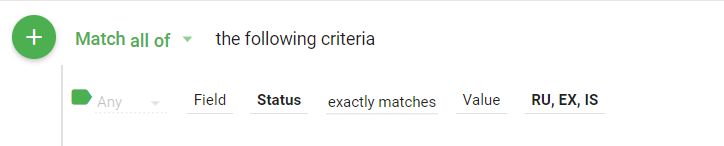
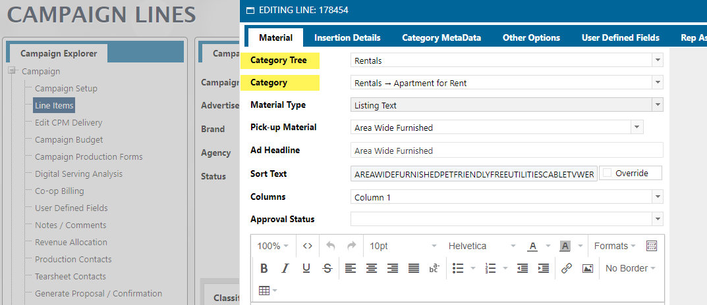
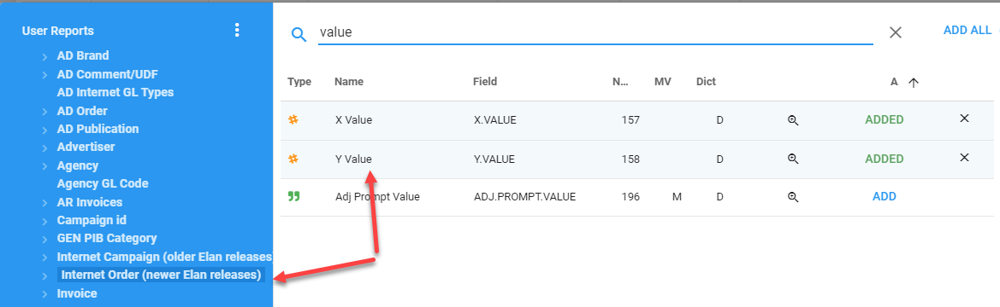

## User Reports vs User Reports Original Rep

The `User Reports` mapping does not have the original rep but they can go to the source record in AD ORDERS or INET.CAMPAIGNS and get the original rep.

When the USER REPORTS trigger was first created it was two files USER_REPORTS_DETAIL (current) and USER_REPORTS_DETAIL_O (original). Then most of our clients complained that they needed something to represent the “Brand Rep” and keep the “current rep” so as of now here is how it looks:

**User Reports** - BRAND REP (the rep with the current assignment on the brand regardless of what is on the order)

**User Reports Original Rep** - CURRENT REP (the current rep assigned on the order which would be the brand rep at the time of order entry and/or if orders were updated because users are given a choice.)  
When the order is created, the Brand rep becomes the "Original Rep", however, the critical question is, when they update the brand rep, they are prompted, **“Do you want to update future orders?”**. If they answer YES, then the **Current Rep** will become the Brand Rep and will have the same info as the User Reports mapping. Up to that point the Current rep on the order is the same as the original rep and will stay the same unless they say “Yes, update future orders”. In that case the current rep on future orders changes to the brand rep and the original rep on the order never changes but we have no User Reports that points to the Original rep on the order.
If they change the Brand Rep and **do not say yes to update future orders** then User Reports Original Rep (Current Rep on the order) would then be the same as the Original Rep on the order.

> **History on Naming**: The way it is at the moment, User Reports will pull the Brand Rep (from the brand record itself), and User Reports Original will pull the current Rep on the order. I know the label is confusing, that is because years ago we had it as the actual current rep and original rep on the order but the demand was to change this instead to Brand rep for User Reports and Current Rep on the order for User Reports Original Rep

---

## User Reports Revenue Fields

While there are over 80 "Amt" fields in the User Reports mapping. You most likely will only need one, but I will explain the three that will jump out as being usable.

> NOTE: All of the fields described below will show NET revenue:
>
> 

- **Order Net Amt** - This is the total net amount for the campaign. The problem with this field is that it will be duplicated for every line item in User Reports for an order. If you are going to do any aggregation on the field, you will need to add a flow step to remove the duplicates. [Remove Duplicates Code](informer-javascript/#remove-duplicate-values-in-aggregation)

  > Be aware that to use the above field, you will need to Sort your Dataset using the **Order By** step when building the "query". This can slow the query down. I don't feel you really will ever or should ever use the Order Net Amt.
  > Instead, if you just need net amount for campaigns, use the Rep Split Net Amt field fix below.

- **Rep Split Net Amt** - This field can be aggregated to get total net revenue for a campaign **ONLY when the Rep Indicator is filtered to 1.**
  To expand on this, there is a field in User Reports called **Rep Indicator(REP_MV)**. This indicator is used to indicate the number of reps on the order. If you do not filter by the Rep Indicator, your revenue will be overstated for some ads.

  The **Rep Split Net Amt** field is the total net amount for a line within a campaign

  To keep from having to filter on the Rep Indicator, you could also set the Rep Net Amt field to zero for those that have a Rep Indicator not equal to zero.
  I would also suggest removing the original RepSplitNetAmt field from your dataset after the above Powerscript has been run.

```javascript
// Rep Split Net Amt Fix
$record.LineNetAmount = $record.repMv === 1 ? $record.netCost : 0;
```

- **Rep Net Amt** - This field IS the **Rep Split Net Amt \* Salesrep Percentage**. Note that the aggregation of this at the campaign level is not always the Net amount of the order. This is because multiple reps may be getting commission or a percentage of the campaign.

## User Report NEEDED Status Criteria

Most of the time when you are creating a report to get revenue, you **DO NOT** want to include deleted lines. To ensure this, you will need to add the following criteria to only pull the following **Status** field values

The **Status** field is located in the **User Reports** mapping and you will want to exactly match the following:

- **EX** - Billed
- **RU** - Confirmed
- **IS** - Invoicing Started

The filter will look like this:



## User Report Other Fields

### Product or Website Field

The product and website are stored in the same field. In the User Reports mapping you can get at the Product/Website ID and Product/Website name from a couple of different places.

In the User Reports mapping you can use:

- **Pub Id** - This will be the Product/Website Id
- **Pub Desc** - This will be the Product/Website Description

### Classified Category Tree and Classified Category

These fields exist in the **AD Internet Classified** mapping but are NOT linked to anything. However, the individual fields _Category Tree_ and _Category_ exist on the **AD Internet Orders** mapping. You can pull these fields in from this mapping and in from the **User Reports** mapping you would get to it by going to the **Internet Order (newer Elan releases)**, which is just the **AD Internet Orders** mapping renamed for this link.


The above two fields come from the following on the Line Item Detail:



## User Report Print vs Digital

To determine if a campaign is either Print or Digital, you can use the field **Inet Print Pub Ind** in the User Reports mapping.

If this field is Y, then the campaign is Print, if N, then the campaign is Digital.

You can use this piece of code in a Powerscript to convert the Y or N to Print or Digital

```javascript
PrintDigitalConvert = {
  Y: "Print",
  N: "Digital",
};
$record.PrintOrDigital =
  PrintDigitalConvert[$record.inetPrintPubInd] || "Not Defined";
```

## Linage Values

To get the X/Y values you can use the following



