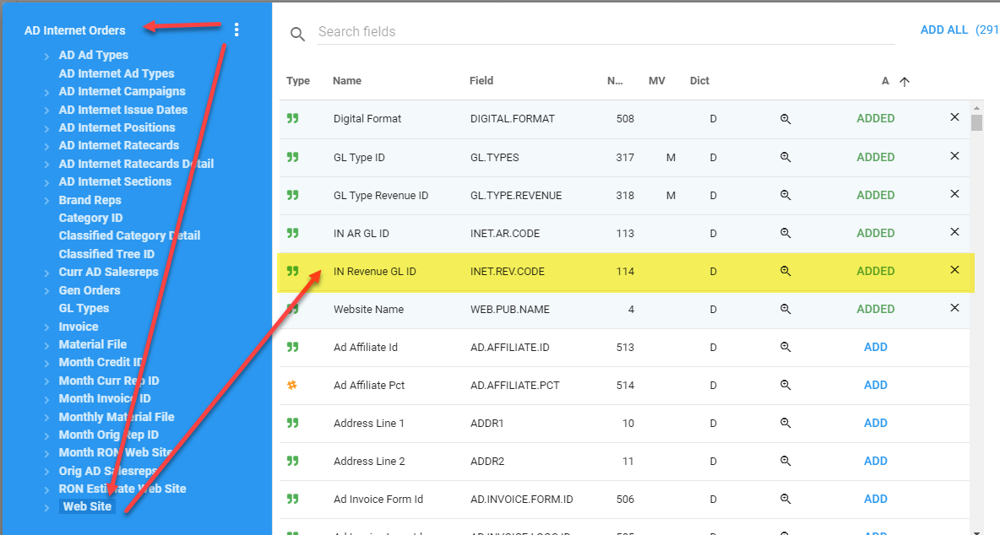
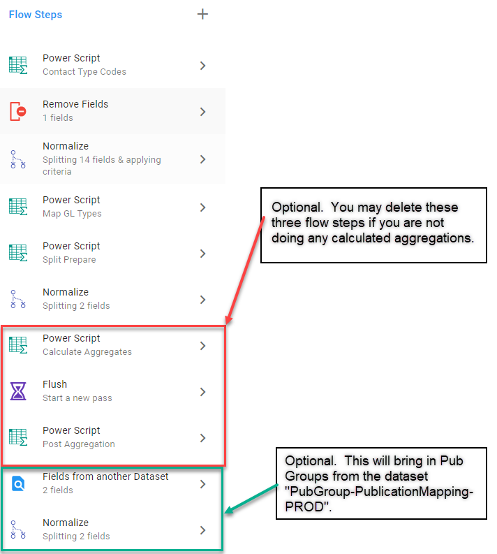
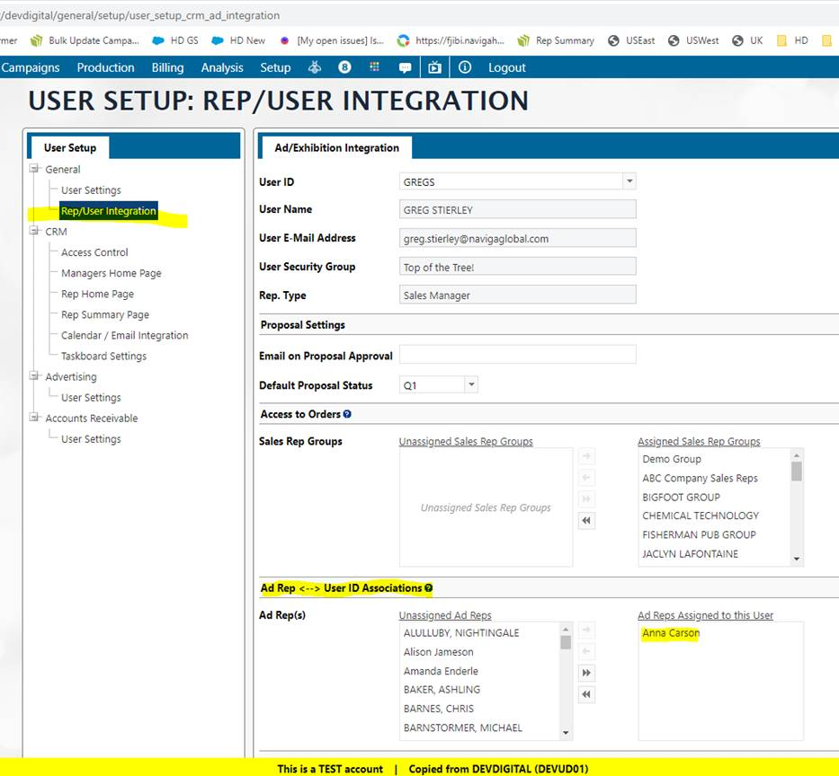
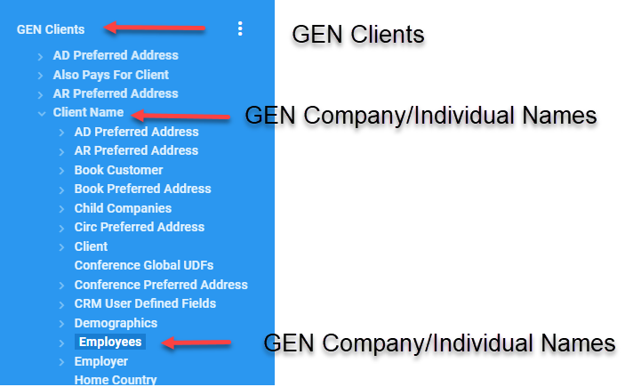
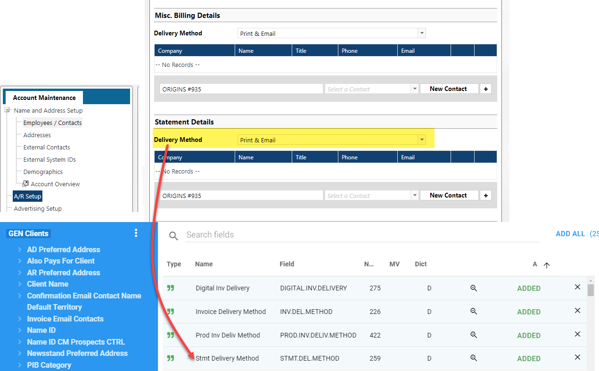
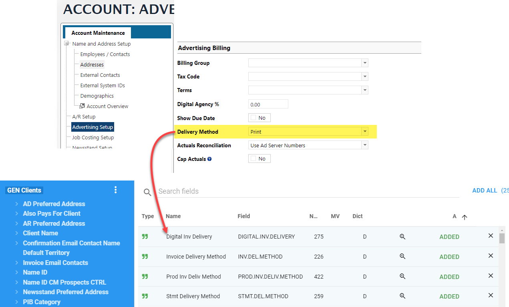
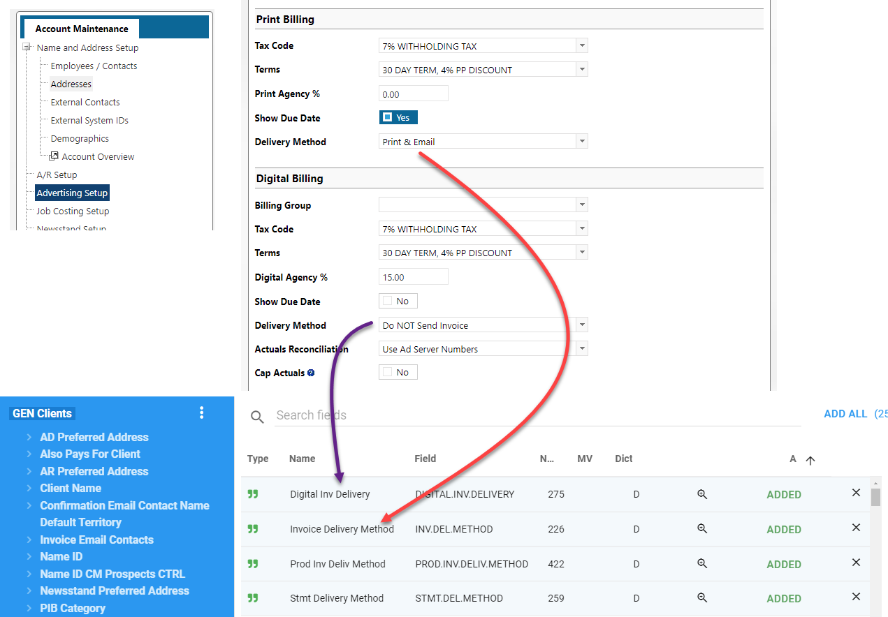

## Templates

### User Reports

This dataset template uses the User Reports Mapping as its starting point.

> Download the Dataset:
> **<a  target="_blank"  href="/downloads/template-user-reports.tgz"> [TEMPLATE]-User Reports</a>**

The User Reports mapping is a table in the Naviga Database that brings together commonly used reporting items into a single table.

With that said, the User Reports mapping also has useful relationships to other mappings that can be utilized to access information that is not contained in the User Reports mapping itself.

**Base Mapping** - User Reports

| Field Name                | Mapping - User Reports                                              | Description                                                                                                                                                   |
| ------------------------- | ------------------------------------------------------------------- | ------------------------------------------------------------------------------------------------------------------------------------------------------------- |
| Campaign ID               |                                                                     | ID Identifying the Campaign                                                                                                                                   |
| Line ID                   | Internet Orders (newer Elan Releases)                               | Every campaign has Lines (Orders). This ID identifies the line within a campaign.                                                                             |
| Advertiser Name           |                                                                     |                                                                                                                                                               |
| Brand Name                |                                                                     |                                                                                                                                                               |
| Product Id                |                                                                     | Product or Website ID                                                                                                                                         |
| Product Name              |                                                                     | Product or Website Name                                                                                                                                       |
| Start Date                |                                                                     | Month Start Date for the Line ID (Note: Line IDs can have multiple rows with different start dates.)                                                          |
| End Date                  |                                                                     | Month End Date for the Line ID                                                                                                                                |
| Rep Name                  |                                                                     |                                                                                                                                                               |
| Line Net Amount           |                                                                     | Calculated Net amount for the Line ID. This field can be aggregated [More Info](#user-reports-revenue-fields)                                                 |
| Rep Net Amt               |                                                                     | If you have Rep Name in your report, you will want to use this amount field. It takes into account when multiple reps are on a Line and their Rep Percentage. |
| Salesrep Percent          |                                                                     | Percentage of Line attributed to the Rep (already taken into account in the Rep Net Amt field.)                                                               |
| Confirmed Date            |                                                                     |                                                                                                                                                               |
| Period                    |                                                                     | Date Order was recognized in the format of "YYYY-MM"                                                                                                          |
| Revenue Date              |                                                                     | Same as Period except in a Date format MM-DD-YYYY. The day will always be the first day of the month.                                                         |
| Status                    |                                                                     | EX - Billed, RU - Confirmed, IS - Invoicing Started, DE - Line Deleted                                                                                        |
| Campaign Type             | Internet Orders (newer Elan Releases) -><br />AD Internet Campaigns | F - Flexible Campaign<br />M - Performance Campaign                                                                                                           |
| Campaign Description      | Internet Orders (newer Elan Releases) -><br />AD Internet Campaigns |                                                                                                                                                               |
| Line Desc                 | Internet Orders (newer Elan Releases)                               |                                                                                                                                                               |
| Ad Size                   |                                                                     |                                                                                                                                                               |
| GL Type ID                |                                                                     |                                                                                                                                                               |
| GL Types Description      | AD Internet GL Types                                                |                                                                                                                                                               |
| Position Description      | Internet Orders (newer Elan Releases) -><br />AD Internet Positions |                                                                                                                                                               |
| Ad Types Description      | Internet Orders (newer Elan Releases) -><br />AD Internet AD Types  |                                                                                                                                                               |
| Rep Indicator             |                                                                     | Used in Line Net Amt Calculation see [User Reports Revenue Fields](#user-reports-revenue-fields)                                                              |
| Advertiser Client Type    | Advertiser                                                          |                                                                                                                                                               |
| Advertiser Client Type ID | Advertiser                                                          |                                                                                                                                                               |
| IN Size                   |                                                                     |                                                                                                                                                               |
| Size                      |                                                                     |                                                                                                                                                               |
| Mo Est Impression Qty     |                                                                     |                                                                                                                                                               |
| Mo Act Impression Qty     |                                                                     |                                                                                                                                                               |
| Division                  |                                                                     |                                                                                                                                                               |
| Division Name             |                                                                     |                                                                                                                                                               |

### CM Opportunities

There are two versions of this template, one with the Product Groups and one without the Product Groups. If you download and use the one with Product Groups, you must be aware that the Product groups create a many to many relationship and will overstate values UNLESS you filter by the product group you are interested in. If this doesn't make sense, use the template without the Product Groups.

> Download the Dataset:
>
> **<a  target="_blank"  href="/downloads/template-cm-opportunities.tgz"> [TEMPLATE]-CM Opportunities</a>**
>
> **<a  target="_blank"  href="/downloads/template-cm-opportunities-with-productgroups.tgz"> [TEMPLATE]-CM Opportunities With Product Group</a>**

There is quite a bit happening behind the scenes with this template dataset. Specifically, it is looking at the Start and End Dates of a row and then figuring out how many months the campaign is scheduled to run and creates a new row for each of those months.

If you have a row with a Digital Start Date of `Sept 1st 2021` and a Digital End Date of `Oct 31st 2021`. The flow steps will create TWO rows for this single row, one for September and one for October.

Remember, we started out with a single row, now we have two rows. All of the other data is duplicated, however, a couple of new fields are created

- **Opp Split Price** - This takes into account how many rows were created and splits the `digitalPrice` between the rows AND multiplies each result by the `probPct` field from the CM Opportunities table.
- **Opp Split Month** - Utility field in the format of `YYYY-MM` which designates a row created.

> **Some Rules:**
>
> - If there is only a **Digital Start Date** and NO **Digital End Date**, then there will be only one row and the Opp Split Month field will be from the Digital Start Date.
> - If **Digital Start Date** and NO **Digital End Date**, then no **Opp Split Price/Month** fields will be created.

> **OTHER NOTES**
>
> **Users vs Reps**
> You will notice that there are NO reps associated with an opportunity. The two fields you will find are **Entered By User Id** and **Owner User Id**.
>
> These are Users of the Naviga Ad system and since an opportunity is not yet an Order, the system does not know how the reps will be assigned to the final order.
>
> ---
>
> **Proposals vs Opportunities**
>
> This dataset is focused on information pertaining to opportunities. If you need proposals, you can get that from the User Reports template and filter on the Status field and just pull those Status's that pertain to Proposals.
>
> The only different between a **proposal** and a **campaign** is the status. So if you enter a campaign with a Q1, Q2 orQ3 status that will be a quote/proposal. If you enter exactly the same data with an R1, R2, R3 or CO status that will be a campaign/order.
>
> The opportunity area allows you to create a potential opportunity without a lot of details. You can create an opportunity with only the customer and an opportunity description. Optionally you can add products, $, dates, etc. Eventually when you have all the details you can convert an opportunity and turn it into a proposal.

In the _Description_ column, if you see a #n value, you can use that to reference to the screenshots of the Naviga system to see what the source of the fields are.

| Field Name                                            | Mapping - CM Opportunities                                   | Description                                                  |
| ----------------------------------------------------- | ------------------------------------------------------------ | ------------------------------------------------------------ |
| Opportunity Id                                        |                                                              | **#1**                                                       |
| Opportunity Type                                      |                                                              | **#2**                                                       |
| Group Name                                            | From Dataset (Flow step)<br />PubGroup-PublicationMapping-PROD | \*Only in Product Group Template                             |
| Product ID                                            |                                                              |                                                              |
| Product Name                                          | Digital Product                                              |                                                              |
| Reporting Date                                        | Calculated\*                                                 | Opp Split Month (YYYY-MM) converted to a Date format (MM-01-YYYY) |
| Opp Split Month                                       | Calculated\*                                                 |                                                              |
| Opp Split Price                                       | Calculated\*                                                 | Amount of opportunity for **Opp Split Month** - NOTE: Opportunity % is used in this calculation. |
| Opportunity Weighted Amount <br />By Month Year Total | Calculated\*                                                 | Opp Split Price aggregated by **Opportunity Id + Opp Split Month + Product ID**.<br />This field is just an example of aggregation via Flow steps. |
| Group Key1                                            | Calculated\*                                                 | Used in Opportunity Weighted Amount By Month Year Total field. Only useful for debugging if doing [flow step aggregation](informer-javascript#calculations-on-aggregated-values). |
| Stage Id                                              |                                                              | #8                                                           |
| Opportunity Stage Description                         |                                                              | #8                                                           |
| Advertiser Name                                       | Advertiser -> Client Name                                    | **#3**                                                       |
| Advertiser Id                                         |                                                              | **#3**                                                       |
| Brand Id                                              |                                                              | **#4**                                                       |
| Digital Start Date                                    |                                                              | **#**                                                        |
| Digital End Date                                      |                                                              | **#**                                                        |
| Error Issues                                          | Calculated\*                                                 | Checks for errors when calculating the Opp Split Month/Price fields. Helpful in debugging. |
| Digital Rate                                          |                                                              |                                                              |
| Digital Qty                                           |                                                              |                                                              |
| Digital Price                                         |                                                              | Used in calculating **Opp Split Price**. <br />**NOTE:** You cannot use this field for aggregating in a report since the flow steps in this Dataset will be creating new rows. |
| Opportunity Stage Probability Pct                     | Opportunity Stage                                            | Probability percentage from the Opportunity Stage table.<br />**NOTE**- This is **NOT** the field used in calculating the **Opp Split Price** field. |
| Publication Pub Group ID                              |                                                              |                                                              |
| Start Date                                            |                                                              | **#5**                                                       |
| End Date                                              |                                                              | **#6**                                                       |
| Probability Pct                                       |                                                              | Field used in the calculating the **Opp Split Price**        |
| Mkt Campaign ID                                       |                                                              |                                                              |
| Entered By User ID                                    |                                                              |                                                              |
| Owner User Id                                         |                                                              | **#7**                                                       |
| Owner Email                                           |                                                              | **#7**                                                       |
| Owner Name                                            |                                                              | **#7**                                                       |
| Digital Line Desc                                     |                                                              |                                                              |
| GL Types Description                                  | Digital Internet Orders -> GL Types                          |                                                              |
| Digital Ratecard Line Detail Gl Type                  | Digital Ratecard Line Detail                                 |                                                              |
| Gl Type Description                                   | Calculated\*                                                 | In the **Map GL Types** flow step, you can modify this calculation to map your _Digital Ratecard Line Detail Gl Type_ field to a new value. |
| Digital Format                                        | Digital Product                                              |                                                              |
| Split Length                                          | Calculated\*                                                 | Debug field indicating how many months were created for for this row. |
| Digital Ratecard Line ID                              |                                                              |                                                              |
| Digital Ratecard Line Desc                            | Digital Ratecard Line Detail                                 |                                                              |
| Pub Sizes                                             |                                                              |                                                              |
| Contact Type Codes Field                              | Calculated\*                                                 |                                                              |


## User Reports Mappings

### User Reports vs User Reports Original Rep

The `User Reports` mapping does not have the original rep but they can go to the source record in AD ORDERS or INET.CAMPAIGNS and get the original rep.

When the USER REPORTS trigger was first created it was two files USER_REPORTS_DETAIL (current) and USER_REPORTS_DETAIL_O (original). Then most of our clients complained that they needed something to represent the “Brand Rep” and keep the “current rep” so as of now here is how it looks:

**User Reports** - BRAND REP (the rep with the current assignment on the brand regardless of what is on the order)

**User Reports Original Rep** - CURRENT REP (the current rep assigned on the order which would be the brand rep at the time of order entry and/or if orders were updated because users are given a choice.)  
When the order is created, the Brand rep becomes the "Original Rep", however, the critical question is, when they update the brand rep, they are prompted, **“Do you want to update future orders?”**. If they answer YES, then the **Current Rep** will become the Brand Rep and will have the same info as the User Reports mapping. Up to that point the Current rep on the order is the same as the original rep and will stay the same unless they say “Yes, update future orders”. In that case the current rep on future orders changes to the brand rep and the original rep on the order never changes but we have no User Reports that points to the Original rep on the order.
If they change the Brand Rep and **do not say yes to update future orders** then User Reports Original Rep (Current Rep on the order) would then be the same as the Original Rep on the order.

> **History on Naming**: The way it is at the moment, User Reports will pull the Brand Rep (from the brand record itself), and User Reports Original will pull the current Rep on the order. I know the label is confusing, that is because years ago we had it as the actual current rep and original rep on the order but the demand was to change this instead to Brand rep for User Reports and Current Rep on the order for User Reports Original Rep

---

### User Reports Revenue Fields

While there are over 80 "Amt" fields in the User Reports mapping. You most likely will only need one, but I will explain the three that will jump out as being usable.

> NOTE: All of the fields described below will show NET revenue:
>
> 

- **Order Net Amt** - This is the total net amount for the campaign. The problem with this field is that it will be duplicated for every line item in User Reports for an order. If you are going to do any aggregation on the field, you will need to add a flow step to remove the duplicates. [Remove Duplicates Code](informer-javascript/#remove-duplicate-values-in-aggregation)

  > Be aware that to use the above field, you will need to Sort your Dataset using the **Order By** step when building the "query". This can slow the query down. I don't feel you really will ever or should ever use the Order Net Amt.
  > Instead, if you just need net amount for campaigns, use the Rep Split Net Amt field fix below.

- **Rep Split Net Amt** - This field can be aggregated to get total net revenue for a campaign **ONLY when the Rep Indicator is filtered to 1.**
  To expand on this, there is a field in User Reports called **Rep Indicator(REP_MV)**. This indicator is used to indicate the number of reps on the order. If you do not filter by the Rep Indicator, your revenue will be overstated for some ads.

  The **Rep Split Net Amt** field is the total net amount for a line within a campaign

  To keep from having to filter on the Rep Indicator, you could also set the Rep Net Amt field to zero for those that have a Rep Indicator not equal to zero.
  I would also suggest removing the original RepSplitNetAmt field from your dataset after the above Powerscript has been run.

```javascript
// Rep Split Net Amt Fix
$record.LineNetAmount = $record.repMv === 1 ? $record.netCost : 0;
```

- **Rep Net Amt** - This field IS the **Rep Split Net Amt \* Salesrep Percentage**. Note that the aggregation of this at the campaign level is not always the Net amount of the order. This is because multiple reps may be getting commission or a percentage of the campaign.

### User Report NEEDED Status Criteria

Most of the time when you are creating a report to get revenue, you **DO NOT** want to include deleted lines. To ensure this, you will need to add the following criteria to only pull the following **Status** field values

The **Status** field is located in the **User Reports** mapping and you will want to exactly match the following:

- **EX** - Billed
- **RU** - Confirmed
- **IS** - Invoicing Started

The filter will look like this:


### User Report Other Fields

#### Product or Website Field

The product and website are stored in the same field. In the User Reports mapping you can get at the Product/Website ID and Product/Website name from a couple of different places.

In the User Reports mapping you can use:

- **Pub Id** - This will be the Product/Website Id
- **Pub Desc** - This will be the Product/Website Description

#### Classified Category Tree and Classified Category

These fields exist in the **AD Internet Classified** mapping but are NOT linked to anything. However, the individual fields _Category Tree_ and _Category_ exist on the **AD Internet Orders** mapping. You can pull these fields in from this mapping and in from the **User Reports** mapping you would get to it by going to the **Internet Order (newer Elan releases)**, which is just the **AD Internet Orders** mapping renamed for this link.


The above two fields come from the following on the Line Item Detail:


### User Report Print vs Digital

To determine if a campaign is either Print or Digital, you can use the field **Inet Print Pub Ind** in the User Reports mapping.

If this field is Y, then the campaign is Print, if N, then the campaign is Digital.

You can use this piece of code in a Powerscript to convert the Y or N to Print or Digital

```javascript
PrintDigitalConvert = {
  Y: "Print",
  N: "Digital",
};
$record.PrintOrDigital =
  PrintDigitalConvert[$record.inetPrintPubInd] || "Not Defined";
```

### Linage Values

To get the X/Y values you can use the following


---

## AD Internet Campaigns mapping

The AD Internet Campaigns mapping is the at the campaign level. If you need line item detail, you will need to get that from the AD Internet Orders mapping.

When pulling back records from AD Internet Campaigns, you can filter on the Status Code (STATUS.CODE, #7).  A common filter on status is: 

- **IS** - Invoicing Started
- **CO** - Confirmed
- **R%** - 

> NOTE: This is the status at the **Campaign** level. So, it will be filtering on campaign level status's. If you are pulling data in from AD Internet Orders also, you will need to also filter on the **Line Cancel Status ID (LINE.CANCEL.STATUS.ID #26)**

### Amount Fields

Since you are pulling data at the Campaign level, you probably want a single revenue amount for the campaign.  The fields to look at begin with **Tot**

- **Tot Revenue Amt** - Will be the Net Amount for the campaign as a whole
  
- **Tot Price Act Amt** - This is the Total Actual Amount for the campaign Lines.
  


If you need to get to the Line Item detail, for example, each line id's amounts, you would use the fields starting with **Price**.  These will be multivalued fields, so you need to be careful if you Normalize on these fields if you are aggregating on any other non multivalued fields.

- **Price Line Id** - The line Id
- **Price Actual Amount** - The actual amount for the line Id.  If there are multiple issues on a line, this will be the total actual amount


## AD Internet Orders mapping

The AD Internet Orders mapping is the detail level of a campaign. It will hold the individual line items.

**AD Internet Campaigns** hold the summary data and then links to the **AD Internet Orders** mapping for the detail about the lines and reps.

Given that most of the reports that you write that pull data for Orders will want the detail level information found in **Ad Internet Orders**, it is recommended that you start with the AD Internet Orders mapping.

### Filtering

When pulling data from the **AD Internet Orders** mapping, realize that Deleted Lines and potentially unwanted Campaign Status's will be included in your results. Since most reports do not want this information, you will want to add criteria to filter this information out.

Here is a common set of Criteria for a report from the **AD Internet Orders** mapping:


The first is the Status Code on the Campaign. It is found in the **AD Internet Campaigns** mapping and is called **Status Code**


The second field, **Line Cancel Status ID**, makes sure that no Deleted Lines are included in your results. It is located on the **AD Internet Orders** mapping.


### Multivalued Fields

You will notice in this mapping that there are a number of Multivalued fields. Even though we are at the Line level in the **AD Internet Orders** mappings, you will still see multivalued fields. One of these fields that we will use for Revenue is the **Month Period** field. Why would a single line within a Campaign have multiple Month Period fields?

First, the Month Period field is the Month/Period and Year (MM-YYYY) that this line is to be recognized as revenue in.

When you view a line in Naviga Ad, you see that a single line can extend across multiple months. If you want to see this information by month, then you will have to deal with the multivalued fields for this breakout. In particular the fields are:

- Month Period
- Month Start
- Month End
- Month Est Amt
- Month Act Amt

This is what a Line in a Campaign looks like in Naviga Ad. Notice that it has further detail showing the billing amount for each month (i.e. each issue). The values above correspond to each of these value in Naviga Ad.


The bit of difficulty is that these fields are stored in a Multivalued field. A weird concept if you are coming from a relational background, however, all it means, is that, in the example above, there will be three values stored in each of the MV fields mentioned.

A multivalued field in Informer usually is not in a format that is usable and thus you will need to run a flow step in your report to "Normalize" it.

This is what a report pulling these multivalued fields would look like without Normalization:


The problem with the above format is two fold, first it is hard to reason about, since we are used to seeing a full row of data. Secondly, you cannot filter on the MV fields.

Given this, the normal course of action when we have MV fields in our report is to normalize the MV fields. This can be done with the **Normalize** flow step.

After Normalizing, the above data will now look like this:


### Print vs Digital

To find if a campaign line is associated with a Print or Digital publication, you would use the **Print Pub Ind** field from the **AD Publications** mapping.

If this field is **Y**, then the campaign is Print, if **N**, then the campaign is Digital.

If you have created a report using the AD Internet Orders mapping, you would find the **Print Pub Ind** field in the **Web Site** association:


### Amount Fields

There are a lot of Amount fields in the **AD Internet Orders** mapping. We will focus on the Month Actual/Est Amt fields and the **Line Price Amt** fields in this document.

**Line Price Amt**

If you do not need to know the Line Item monthly breakout of revenue, then you can simply use the **Line Price Amt**. Just be aware that if you include any multivalued fields and normalize on them, the **Line Price Amt** field will be duplicated over those normalized items.

Also, the be aware that the **Line Price Amt** is the **Price per Issue**.  That would mean that if a line had 3 issues at $100 for the Issue Price, the Line Price Amt would be $100, but you may instead be looking for $300, the price for each issue summed up.

If that is what you are looking for, then you will want to take a look at the Month Actual/ Est Amt section below.

### Month Actual / Est Amt

The **Month Actual and Est Amt** multivalued fields, which means that you will most likely want to normalize them and they also have some special rules that need to be followed to get the correct information from a report written using them.

First, you will want to normalize the **Month Actual Amt** and **Month Est Amt** fields.  If you look at a single line in Naviga, you will see that a single line id can have multiple "runs".  You can see below, that this Line ID of 11644 has three run days:


In Informer, WITHOUT any normalization, you will see the following:


What we need is to have those Month Actual Amt, Month Est Amt and Start and End date fields to each be on a row of their own.  To do this, we apply a **Normalization** Flow Step:


This will give us the following:


> If you want to add Reps to the mix, you have a couple of other steps, see the next section for reps.

The other rules can only be applied via a PowerScript Flow step.

Here are the rules:

- **Flexible Campaigns** - If the line is part of a flexible campaign, then you will **only** use the **Month Est Amt**
- **Other Types of Campaigns** - If the line is not part of a flexible campaign, then we need to determine whether to use the Actual or Estimated amount field. You will simply choose the Estimated amount if the Actual amount field is zero or empty.

Here is a Powerscript excerpt that embodies the above rules and creates a single revenue field called **NetAmount**:

```javascript
// Calculated the Net Revenue Amount field
if ($record.a_d_internet_campaigns_assoc_campaignType === "F") {
  $record.NetAmount = $record.monthEstAmt;
} else {
  $record.NetAmount =
    $record.monthActualAmt === 0 || !$record.monthActualAmt
      ? $record.monthEstAmt
      : $record.monthActualAmt;
}
```

> NOTE: The above code references the following fields:
>
> - **$record.a_d_internet_campaigns_assoc_campaignType** - This is the Campaign Type from the **AD Internet Campaign** mapping
> - **$record.monthEstAmt** - This is the Month Est Amt from the **AD Internet Orders** mapping
> - **$record.monthActualAmt** - This is the Month Actual Amt from the **AD Internet Orders** mapping
>
> The above code assumes the base mapping is **AD Internet Orders**. If not, the field reference name may be different.

### Adding Reps into the Mix

Obviously, you will want to have reports with rep data.  

To add Reps to your report, you will first have to choose, whether you want the Current Rep or the Original Rep.  These are the fields you would need:


You will want to grab the Rep Pct if you have any ads with multiple reps on them.

For our example, we will be using the Current Rep ID and Current Rep Pct fields.

Once, you select those, fields you may also want the Rep name, you can get this from the associated mapping called **Curr AD Salesrep**:


For our example, I will be selecting the **Salesrep Name** field from the **Curr AD Salesrep** mapping.

You might think you are done, but not yet.  Notice that each of the Rep fields are *multivalued*, this is similar to what you saw with the Amount fields.  We had to normalize them.  Is most cases, where you have fields from the same mapping (amt fields and rep fields) that are multivalued, you can just include them all in a single normalize step.  

**BUT Not here!** 

The Rep fields are multivalued, but in reference to something different than the Amount fields.  The Amount fields will have a multiple values in relation to the run days of a line ID, but the Sales Rep fields will have multiple values based on whether multiple reps are assigned to the Line.

Long story, short, you will need **TWO** normalization steps:

- **FIRST** normalize the Amount Fields
- **NEXT** normalize the Rep Fields 

> If you have included any fields from the Associated rep mappings (Curr AD Salesrep or Orig AD Salesrep), they will **ALSO** need to be included in the normalization step.

Here is what the normalization would look like:


And in our Flow steps, you will have two normalize steps:


Lastly, if you have Lines with multiple reps assigned to them, with different percentage allotments, then you will need to create a calculated field or Powerscript to calculate the reps amount:

```javascript
// Calculated the Net Revenue Amount field
if ($record.a_d_internet_campaigns_assoc_campaignType === "F") {
  $record.NetAmount = $record.monthEstAmt;
} else {
  $record.NetAmount =
    $record.monthActualAmt === 0 || !$record.monthActualAmt
      ? $record.monthEstAmt
      : $record.monthActualAmt;
}

// We need to calculate the Rep Amount.  This is because you may have more than one
// rep on an order at different % values.
// If there is NOT a rep id assigned, then just return the NetAmount
$record.RepAmount =  $record['currentRepIds'] ? $record.NetAmount * ($record.currentRepPcts/100) : $record.NetAmount

```

#### Keeping Month Actual/Est Amounts with Rep Amounts

Many times you will want to have a single dataset contain both the Rep amounts and the Month Amounts, however, as stated above, this can be problematic because multiple reps may be assigned to a Month line.

When you normalize for reps, this duplicates the monthActualAmount and monthEstAmount fields, thus you cannot use them for aggregating in any of your reports.  Most of the time you would be OK using the Rep Amounts, unless your reps can total more than 100% of an Ad.  For example two reps, each "getting" 100% of an Ads revenue.

The solution for this is to zero out the Month amounts when normalizing for Reps creates a new row.

Here are the steps. *NOTE: this code is also calculating foreign currency amounts*

Fields used in the below scripts:

**AD Internet Orders**

- MONTH.ACTUAL.AMT <76>
- MONTH.EST.AMT <73>
- CURRENT.REP.IDS <263>
- CURRENT.REP.PCTS <264>

**AD Internet Campaigns**

- CAMPAIGN.TYPE <8>
- CURR.RATE <226>

**1 - Normalize Month Line fields**

:::note Normalize Month Line fields

This is the standard normalize that we do for Month fields (monthActualAmt, monthEstAmt, monthStartDate, etc)

:::

**2 - Powerscript: Calculate Line Amounts**

```javascript
// We will use the following formula
// ---- Local Currency Amount = Foreign Currency Amount / Exchange Rate
// If there is an exchange rate, return it else return 1
exchangeRate = $record['a_d_internet_campaigns_assoc_currRate'] ? $record['a_d_internet_campaigns_assoc_currRate'] : 1;

$record.actualLineLocalAmount = $record['monthActualAmt'] / exchangeRate
$record.estLineLocalAmount = $record['monthEstAmt'] / exchangeRate
$record.netLineLocalAmount = calcNetAmount($record['a_d_internet_campaigns_assoc_campaignType'], $record.actualLineLocalAmount, $record.estLineLocalAmount)

$record.actualLineForeignAmount = $record['monthActualAmt'] 
$record.estLineForeignAmount = $record['monthEstAmt'] 
$record.netLineForeignAmount = calcNetAmount($record['a_d_internet_campaigns_assoc_campaignType'], $record.actualLineForeignAmount, $record.estLineForeignAmount)


// Inline function to calculate net amount.
function calcNetAmount (campaignType, monthActualAmt, monthEstAmt) {
    return monthActualAmt
    if (campaignType === "F") {
      return monthEstAmt;
    } else {
      return
        monthActualAmt === 0 || !monthActualAmt
          ? monthEstAmt
          : monthActualAmt;
    }
}
```

**3 - Normalize Reps**

:::note Normalize Reps

Normalize the Rep Fields AND the above created Line Amount fields. By normalizing the line amount fields, we ensuring that they ONLY show up on the FIRST row if there are multiple reps on the Line/Month row.

**Normalize the following fields**

- actualLineLocalAmount
- estLineLocalAmount
- netLineLocalAmount
- actualLineForeignAmount
- estLineForeignAmount
- netLineForeignAmount
- Current Rep ID
- Current Rep Pct
- Current Rep Name (if you added it)

:::

**4 - Powerscript: Calculate Rep Amounts**

Now we will calculate the rep amounts using the rep percentage.  Since we have normalize and have not modified the month actual amount and month est amount fields, we will use them to calculated the rep percentage.

```javascript
// We will use the following formula
// ---- Local Currency Amount = Foreign Currency Amount / Exchange Rate
// If there is an exchange rate, return it else return 1
exchangeRate = $record['a_d_internet_campaigns_assoc_currRate'] ? $record['a_d_internet_campaigns_assoc_currRate'] : 1;

repNetForeignAmount = calcNetAmount($record['a_d_internet_campaigns_assoc_campaignType'], $record['monthActualAmt'], $record['monthEstAmt']) * ($record.currentRepPcts/100)
repActualForeignAmount = $record.monthActualAmt * ($record.currentRepPcts/100)
repEstForeignAmount = $record.monthEstAmt * ($record.currentRepPcts/100)

$record.actualRepLocalAmount = repActualForeignAmount / exchangeRate
$record.estRepLocalAmount = repEstForeignAmount / exchangeRate
$record.netRepLocalAmount = repNetForeignAmount / exchangeRate

$record.actualRepForeignAmount = repActualForeignAmount
$record.estRepForeignAmount = repEstForeignAmount 
$record.netRepForeignAmount = repNetForeignAmount

function calcNetAmount (campaignType, monthActualAmt, monthEstAmt) {
    return monthActualAmt
    if (campaignType === "F") {
      return monthEstAmt;
    } else {
      return
        monthActualAmt === 0 || !monthActualAmt
          ? monthEstAmt
          : monthActualAmt;
    }
}
```

**5 - Remove Month Actual and Est amount fields**

I would recommend removing the `monthActualAmt` and `monthEstAmt `fields as they will not be usable in any aggregations.

### Foreign Currency and Exchange Rates

When an ad is placed using a foreign currency, certain fields will show up in the foreign currency and some in the local currency.

The other important item to understand is that when the ad is placed, the exchange rate at that point in time is stored and used to calculate the currency values for the **AD Internet Orders** and **AD Internet Campaigns** mappings and they will not change.  However, once the campaign is invoiced, the system will reach out for the exchange rate at the time of invoicing.  That exchange rate is not stored, but instead a variance value is stored.  This is the difference between the initial foreign currency value and the "new" value given the exchange rate at the time of invoicing.  This "difference" field is in the **AR Invoices** mapping and is called **Exchange Revaluation Amount** (99)

> Exchange Rate Formula for Reference:
>
> `Local Currency Amount = Foreign Currency Amount / Exchange Rate`

**AD Internet Campaigns mapping**

The exchange rate is only stored in this mapping.  The field is called **Currency Exchange Rate** (226).  The Exchange rate is such that you can calculate the foreign currency amount using this formula `local currency amount * exchange rate`

You can also find what the foreign currency is by adding the **Currency Code** (50) field.  

There are many amount fields in the AD Internet Campaigns mapping and below is a list of common ones and what they will display if an ad has been booked in a foreign currency.  If a field you need is not in the list, make sure to verify if it is showing local or foreign currency before using it in your report.

- **Gross Amount** - Local Currency
- **Web Site Local Gross Amt** - Local Currency
- **Current Salesrep Amounts** - Local Currency
- **Local Revenue Amount** - Local Currency
- **Local Web Site Amount** - Local Currency
- **Price Actual Amount** - Foreign Currency
- **Revenue Amount** - Foreign Currency
- **Revenue Net Amount** - Foreign Currency
- **Foreign Currency Cost** - Foreign Currency

The most useful fields from the AD Internet Campaigns mapping are:

- **Currency Code**
- **Currency Exchange Rate**

**AD Internet Orders mapping**

In the AD Internet Orders mapping, there is no exchange rate field, however, most of the amount fields are expressed in the **foreign** currency, if the campaign was booked in a foreign currency.

- **Month Actual Amt** - Foreign Currency
- **Month Est Amt** - Foreign Currency
- **Month Curr Rep Amt** - Foreign Currency

**Convert Foreign Currency to Local**

You may want to see all your revenue in your local currency.  To do this, you will need to add a flow step.  If you are using the template dataset for AD Internet Orders, you would replace the Powerscript that is defining the Net Amount:

```javascript
// We will use the following formula
// ---- Local Currency Amount = Foreign Currency Amount / Exchange Rate
// If there is an exchange rate, return it else return 1
exchangeRate = $record['a_d_internet_campaigns_assoc_currRate'] ? $record['a_d_internet_campaigns_assoc_currRate'] : 1;

// Calculated the Net Revenue Amount field taking into account the exchange rate if one exists.
if ($record.a_d_internet_campaigns_assoc_campaignType === 'F') {
    $record.NetAmount = $record.monthEstAmt / exchangeRate
} else {
    $record.NetAmount = ($record.monthActualAmt === 0 || !$record.monthActualAmt) ? $record.monthEstAmt / exchangeRate : $record.monthActualAmt / exchangeRate;    
}
```

> Remember that the amounts in the AD Internet Orders and AD Internet Campaign mappings are based on the Exchange rate in the AD Internet Campaigns mapping and will not change.
>
> This means that when the campaign is invoiced, it may be invoiced at a different exchange rate. 

**AR Invoice mapping**

The last piece is the AR Invoice mapping.  It has a field called the **Exchange Revaluation Amount**, which is the difference **in LOCAL Currency** between the converted price at booking and the converted price at invoicing.


### Metadata Fields

The Metadata fields are found on the Category MetaData tab in the Naviga system:


To access these fields in Informer, you will need to pull in the following fields from the AD Internet Orders mapping:

- **Classified Questions Desc (0)**
- **Class Answers (269)** 

The above fields are Multivalued and you will most likely want to Normalize them.

### GL Codes in AD Internet Orders

In the most basic scenario, you can get the GL Code string from the AD Publications mapping grabbing the **IN Revenue GL ID**. 

Each Product will have a default Revenue GL Id and this field will hold it.  In Informer this will look as follows:



However, most sites will have GL Overrides, which means that a line won't be associated with the default Revenue ID.

This makes things a bit more tricky.  

There is a **GL Type ID** field in the **AD Internet Orders** mapping.  This field will be the correct GL Type for the GL Code, meaning that if that line is "overridden", that GL Type ID field **will be** the overridden value.

The tricky part is that we do not have a link to the AD Publication table on GL Type.  To overcome this, we can add some Powerscript code to help us.

Here are the fields you will need in your dataset:

AD Internet Orders -> GL Type ID (12)

AD Publications (Web Site) -> GL Type ID (317)

AD Publications (Web Site) -> GL Type Revenue ID (318)

With the above three fields you will see something like this:


The first GL Type is from AD Internet Orders and is the "correct" GL Type.  The other fields are from AD Publications and show all GL Types associated with the given publication.

Our Powerscript needs to match the GL Type ID from AD Internet Orders to the correct on from AD Publications and then get the correct GL Code (GL Type Revenue ID).

Here is that code:

```javascript
// Loop through the all the GL Types on a product
// and match it to the GL Type on the Order Line
// Return the matching GL code for the GL Type
productGLTypes = $record['web_site_id_assoc_glTypes'];
productGLRevCodes = $record['web_site_id_assoc_glTypeRevenue'];
lineGLType = $record['glTypeId']

for(let i = 0; productGLTypes.length>i; i++) {
  let el = productGLTypes[i]
  if (el === lineGLType) {
    $record.RealGLCode = productGLRevCodes[i]
    // Only needed if you "need" the external gl code (changeCode)
    // $record.RealExternalGLCode = $record['changeCode'][i]
  	break;
  }
} 

```

This code will return a "Real" GL Code and also is returning the External GL (Change Code) if that is something you need.  However, getting the External GL Code requires another dataset to connect the **GL Chart of Accounts** mapping to the AD Internet Orders mapping.  The sample dataset download includes this other Dataset.  You may remove it if you like.

Lastly, you will want to remove the Web Site GL Type ID and Web Site GL Type Revenue ID field from you report so that you don't get the multivalued fields showing.

> Download a sample Dataset:
> **<a  target="_blank"  href="/downloads/naviga-ad-internet-orders-with-gl.tgz"> [NAVIGA]-AD Internet Orders With GL</a>**

### Adjustments On Lines

If you need to get the Adjustment Amount and Descriptions for Campaign Lines, you will find this information on the **AD Internet Orders** mapping.


> NOTE: The Month Actual / Est Amt fields already have any adjustment amounts factored into them.

Also note that the Adjustment amount fields are multivalued.  You need to be careful since these are similar to what we have when we add sales reps from AD Internet Orders.  These fields ARE multivalued, but at a different level than the Amount and Sales Rep fields.  You will need to normalize these in a separate normalize step.

The Adjustments apply to all of a lines multivalued Amount and Date fields like Month Period and Mont Act Amount, etc.

Here is a visual example:


### Preprints

The fields listed below are multivalued and are at the SAME grain (i.e. associated with) the Month amount fields mentioned [above](#month-actual-/-est-amt)

- Month Zone IDs - There are the Zones
- Month Zone Circ A/B/C/D - These will have the Amounts for each Zone
- Month Est Qty - This will be the billed amount after billing.


### Impressions

The below image shows how the Estimated and Actual impressions map from Naviga to Informer.

:::note

Be aware that the **Month Actual Imps** and **Month Est Qty** are both multivalued fields, so you will most likely want to normalize them.

:::


### Digital Size - Columns - Inches


## CM Opportunities

The CM Opportunities mapping allows you to report on the opportunities that you have in the system.

### [NAVIGA]-CM Opportunities template dataset

Here is a template Dataset to review and modify to your needs: [Naviga CM Opportunities Template Dataset](downloads/naviga-cm-opportunities.tgz). To import this template dataset into your system, start at **step 4** in the documentation [Copying a Dataset To a Different Datasource](informer-basics/#copying-dataset-to-different-datasource)

Please note that there are some additional Flow Steps that you should remove if you are not going to use their results:



#### Template Usage Notes

There is a sample Visual in the Dataset for you to review.

The field **Opp Split Price** is the **Weighted** monthly amount. It is broken out by Month using the Start and End date on the Opportunity to calculate how many months to spread the weight amount over.

Here is the code that performs this split, the Flow step is **Split Prepare**:

```javascript
//=========================================================================
//== We have a Start and End Date field.
//== The need is to create a row for each month between these dates and
//== equally allocate the Digital Price across those months as well as multiplying that
//== amount by a weight percentage.
//== To do this, two fields will be created OppSplitMonth("YYYY-MM")
//== and OppSplitPrice (number)
//== These fields will contain arrays that when normalized will create a "new"
//== row for each.  Note, the price field will take
//== the Digital Price divided by the number of months and multiply by some weighting value.
//=========================================================================

//
startDate = $record.digitalStartDate;
endDate = !$record.digitalEndDate
  ? $record.digitalStartDate
  : $record.digitalEndDate;
//endDate = moment($record.digitalEndDate);
//-----------AUDIT FIELD
$record.errorIssues = !$record.digitalEndDate ? "Empty End Date" : undefined;
//----------
//probabilityPercent = $record.opportunity_stages_assoc_probPct / 100;
probabilityPercent = $record.probPct / 100;

// Get the number of months between the start and end date
// zero months will return 1
diffMonths = informer.navReturnANumber(
  naviga.getMonthsBetween(startDate, endDate)
);

// Make sure diffMonths is positive, if not, make zero
diffMonths = diffMonths < 0 ? 0 : diffMonths;
//  $record.DIFFMONTHS = typeof diffMonths + diffMonths + endDate.format('YYYY-MM')

// Create an array with diffMonths slots each filled with the digitalPrice
// Note: digitalPrice will be multiplied by it's probability %
priceArray = new Array(diffMonths).fill(
  $record.digitalPrice * probabilityPercent
);
monthArray = new Array(diffMonths).fill(startDate);

$record.OppSplitPrice = priceArray.map((price) => price / monthArray.length);
$record.OppSplitMonth = monthArray.map((sDate, idx) =>
  moment(sDate).add(idx, "M").format("YYYY-MM")
);

$record.SplitLength = monthArray.length;
//$fields.monthSplit.dataType = 'string';
//$record.monthlyPrice = [100, 200, 300, 400]

function returnNumber(numberIn) {
  let parsedNumber = parseFloat(numberIn);
  if (isNaN(parsedNumber)) {
    return 0;
  }
  return parsedNumber;
}

function diffMonths(startDate, endDate) {
  // Returns the number of months between the startDate and the endDate
  // Confige object could have:
  // negativeReturn: "actual", "absolute", default is actual and if something other than passed, that is what is used
  // Given how moment caclulates the difference between dates, it was returning the wrong number of months between in certain cases.
  // To fix, we pass the true flag, which return a decimal that we just take the ceiling of, i.e. round up all the time
  diffMonths = Math.ceil(returnNumber(endDate.diff(startDate, "months", true)));
  return diffMonths <= 0 ? 1 : diffMonths;
}
```

### User versus Rep

What is the difference between a User and Rep in Naviga Ad? The User is a System User with a login to the Naviga Ad system. Hence, you can think of the User Id being associated with a person who can log into Naviga Ad and enter campaigns, view reports, etc.

A Rep, however, is a separate id that will be associated with one or more Users. A Rep is the entity that gets credit for a campaign or is attached brand.

The reason for this is that while most of the time a Rep IS a person, sometimes that person may not have access to the Naviga Ad system (they never log into Naviga Ad) OR the Rep may be something like "House Ads Rep", which is not a person, but still technically a "rep" that is receiving credit for the campaign.

#### Why Does this Matter

Most of the time it doesn't. Just about every mapping in Informer has **Rep** information associated with the transactions.

However, when dealing with the **CM Opportunities** mappings, you will see an **Owner User ID**. These are not **Reps**. They are Users of the system.

Since an opportunity has not yet happened, there can be no **Original Rep**, but there is a User who owns it.

By Q3 of 2021, you will see some additional information available for the Owner User Id:

- **Owner Email**
- **Owner Name**
- **Owner Assoc Rep IDs** - This is a multivalued field that contains the [Reps that this User is associated with](#user-id-and-rep-id-association). It will link to the **Owner Assoc Rep IDs** mapping so that you can get more detailed information for the linked/associated reps.

#### User ID and Rep ID Association

As was noted above, a User ID can be associated with multiple Rep IDs.

Within Naviga Ad you can find this association in the User Setup Area.



## AD Internet Ratecards

You can set up Ratecard information in Product Setup:


Within **Product Setup**, when you go to **Pricing Rules/Ratecards** you will have access to your Ratecards:


The fields available on the above screen can be found in the following mappings within Informer:

- **AD Internet Ratecards** - This is considered the "header" records for rates.  It has links to the **AD Publications**, which is how the product is associated with a ratecard.
- **AD Internet Ratecards Details** - This mapping hold the details or lines of the individual ratecards. 
- **AD Publications**
- **AD Internet Ratecard Adj** - This mapping holds information for any Price or Auto Adjustments (the two options in Naviga under "Ratecards")

When creating a report where you are looking for the Ratecard setup information, it is best to use the **AD Internet Ratecards** mapping as your base mapping:


**AD Internet Ratecards** is joined to **AD Publications** by the field **WEB.SITE** which is actually the "Publication ID".  

Both **AD Internet Ratecards Details** and **AD Internet Ratecard Adjs** are linked to via the **LINES** multi valued field in **AD Internet Ratecards**.  

## AR Invoices

The AR Invoices mapping contains information about the AR invoices in the system.  It is helpful to understand how invoices are viewed in the Naviga system.

First, understand that there can be no more than a single Campaign per invoice, **however**, there can by many Invoices per campaign.

Also, **Performance Campaigns** and **Flexible Campaigns** invoice differently.

**Performance Campaigns**

Each line in a campaign may run in multiple issues.  Each issue will have its own Invoice.  Here is an example showing an Line item with two issues.  Notice each issue has its own Invoice:


In Informer, from the **AD Internet Orders** mapping,  the above Order Line looks like this:


For **Performance** Campaigns one can choose to bill by **Product** or by **Product Group.** So if there are 5 lines on the campaign, each for a different product, the invoice could either be for one line (or more if there are multiple lines for that product) or for the entire campaign. So not necessarily a one for one relationship but the line information does feed the invoice amount.


**Flexible Campaigns**

The invoice is for a percentage of the total campaign, there is no direct relationship between the line item(s) and invoice each invoice is always a percentage of the sum amount of the entire campaign.

### Credits and Debits 

This section describes how to find if an a transaction is an Invoice, Credit or Debit.  These Credit and Debits are not the T-Account style accounting CR and DR, but instead when we give a customer a Credit on their account for something or Debit their account.

The field that you will use is on the **AR Invoices** mapping.

- **Document Type** - This field has the following values:

  - **I** - Invoice
  - **C** - Credit
  - **D** - Debit
  - **W** - Writeoff

  

## GEN Clients

Intro

### Statement Email Address

The **GEN Company/Individual Names** mapping has a number IDs within that are self referencing.  One such ID is the the Employees ID.

What that means is that the **GEN Company/Individual Names** mapping holds the information for any entity that represents an Individual or a company, that individual could be an employee are a Transient Ad booker.  It could also be a parent or child company!

So this mapping does a lot.  In this section, I want to leverage that to be able to gain access to Contact Email addresses that are not available in the **GEN Company/Individual Names** mapping.

For example, there is company "Big Company" in the **GEN Clients** mapping, in that mapping there is a field called *Stmt Email Contact ID* which is an ID to a "contact" that lives in the **GEN Company/Individual Names** mapping, but the **GEN Clients** JUST has the ID, not the actual email address and there is no defined relationship to be able to get the email address.

We can still get at that email address information by using our understanding of **GEN Company/Individual Names**. 

- We know that the *Stmt Email Contact ID* is pointing to a "row" in the **GEN Company/Individual Names** mapping.
- We know that the *Stmt Email Contact ID* field is pointing to an **employee** of "Big Company"
- We know that we can get a list of all of the employees, because of the following relationship:
  
- Notice that in the above relationships, **GEN Company/Individual Names** is self referencing from Client Name to Employees.

What this relationship allows us, is to be able to get all of the employees for a particular company, "Big Company" in this case.  However, we only need the **Name Id** and **Email Addresses** fields from the **Employee** mapping.  Those along with the *Stmt Email Contact Id* (this field IS the Name Id) field from **GEN Clients**, we can create a powerscript to grab the email addresses.

```javascript
// Since we don't have a link to users from GEN Clients -> Client Name . stmtEmailContactId to 
// the GEN Company/Individual Names mapping to get the actual email addresses, we use the below.

// Create an object associating the employee ID with the employee email address
// { [nameId]: "emailAddress", ... }
// NOTE: this will pull ALL employees from the employee 
employeeIdEmailObject = $record['new_name_assoc_employees_assoc_nameId'].reduce((final, el, index) => {
  final = { ...final, [el]: $record['new_name_assoc_employees_assoc_emailAddresses'][index]}
  return final
}, {})


// Since stmtEmailContactId is multivalued, loop through and grab all matching emails from the above
// created eployeeIdEmailObject
$record.StmtContactEmails = $record['stmtEmailContactId'].map(contactId => employeeIdEmailObject[contactId])
```

You will also want a flow step to **Remove** the Employee fields, as they were only used to help us get the information we needed.

You will then be left with an array of *StmtContactEmails*.

### Delivery Methods

Here are the mappings of the various delivery methods.  

1. **A/R Setup - Misc. Billing Details Delivery Method**
   `GEN Clients.Inv. Delivery Method CI (250)`

2. **A/R Setup - Misc. Billing Details Email Contacts** - The field in GEN Clients is only the ID to the contact.  To get the actual email address you will need to pull from the `Client Invoice Email Contact ID` linked mapping off of GEN Clients.

   `GEN Clients.CI Inv Email Contact ID (251)`


---

**A/R Setup - Statement Details Delivery Method**
`GEN Clients.Stmt Delivery Method (259)`



**Advertising Setup for Digital First Naviga Users**

> Digital First is the latest version of the Naviga software

Delivery Method - `GEN Clients - Digital Inv Delivery (275)`



**Advertising for Classic Naviga Users**

> Classic is the term used for the legacy version the Naviga System

Digital Billing Delivery Method - `GEN Clients - Digital Inv Delivery (275)`

Print Billing Delivery Method - `GEN Clients - Invoice Delivery Method (226)`



## Miscellaneous Information

### Date Time Stamp fields

You may encounter Text fields in information called "Date Time Stamp".  These will be a string of numbers that are not useful until interpreted.  This field is a Unidata Date/Time formatted field.  Below is how to *decode* it.

**Unidata Date / Time Format:**

The first 5 digits in the Unidata date number is the number of days since

**12/31/1967**

 The last 8 digits are the number of milliseconds into the day, so that is the time component.

For example "**19736** *43200000*" would be interpreted as:

**1/12/2022 12:00:00:000 PM**

 **19736** = 1/12/2022 - 12/31/1967

*43200000* = 12:00:00:000 PM
