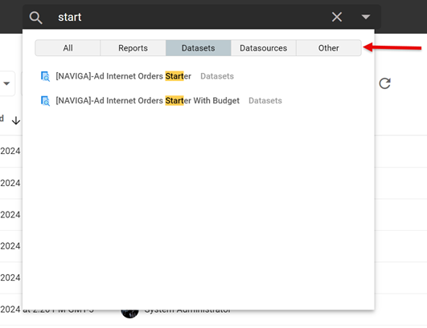

## Informer Home Screen Changes

Informer version 5.7 got a UI overhaul!  The main thing that might "shock" users who log into Informer is the new look of the Home screen.  Once you understand how to navigate from the Home screen, things are essentially the same.

When you log into Informer, here is the screen you are used to seeing:

The latest version of Informer has made some changes.  You will now see something like this:

To review some of the changes:

1. **Left Navigation Pane** - You will find direct links to the main areas in Informer that used to be listed in the center of the Home page screen.  This makes for easy navigation to your Reports, Datasets, Jobs or other area.
2. **New Button** - The New button will allow you to create anything that you have privileges to create from the Home screen.
3. **Search Input** - As you noticed, from the Home screen you have access to all of the Informer object types.  To quickly find a named item, simply start typing.  NOTE: This will only search the Item names.
4. **Quick Filters** - These dropdowns will allow you to quickly filter the list by Folder, Tag, Type or Owner.
5. **Extras** - The **Star** indicates a *favorited* item.  Selecting the star in this context will only show items you have marked as your *favorite*.  The *column* icon next to the Star will allow you to select the columns you want to see on your Home screen. 
   The *refresh* icon will refresh your home screen display.
6. **Item Level Star & Ellipsis** - By selecting the **Star** next to an item, you will add that to your *favorites*.  Selecting the ellipsis, will give you an **Action Context menu** application to the Item type you are working with.

### Global Search Bar

The **Global Search Bar** is found at the top of your Informer screen.  It is very powerful, allowing you to start typing any item name and then narrowing the search by Object type:

:::tip

Also, when you drop down the Global Search, you will see the last accessed items. This makes it very easy to revisit a dataset or report that you were recently working on.

:::

## Report / Dataset Changes

For the most part the Report and Dataset areas will be familiar, however there were a few things that were moved.

### Export Data

The export data option has been moved out of the action menu and now has its own dedicated icon.

### Actions Menu

The actions menu has had a reorganization.  Here are some notable changes:

1. Share actions have been grouped into a secondary menu.  The Share menu will now be where you set the Users or Teams you share your report with.  You can also create Tokens from the Share menu.
2. To rename your report, you will now choose **Edit Name/Description**
3. The old Clear User Settings is now called **Reset View**.  This will reset your column position back to the default viewed saved in the report.

