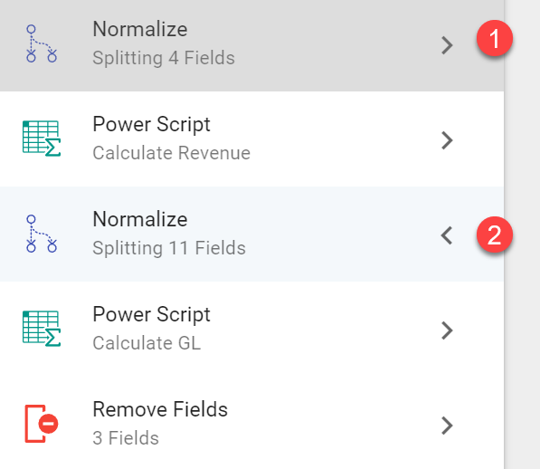
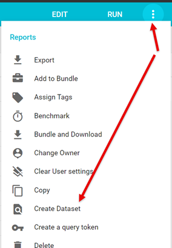
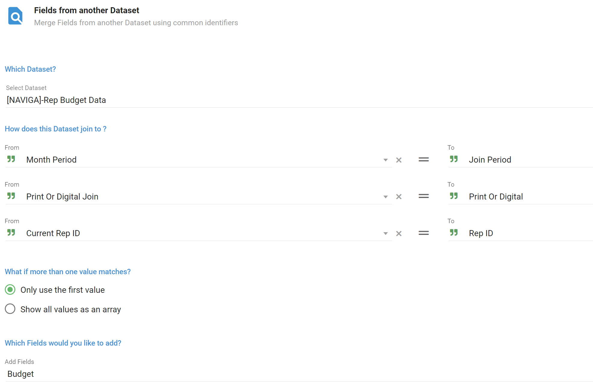
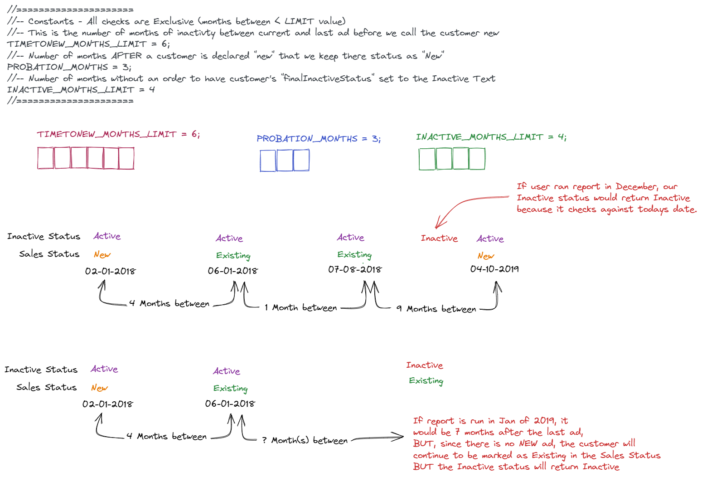
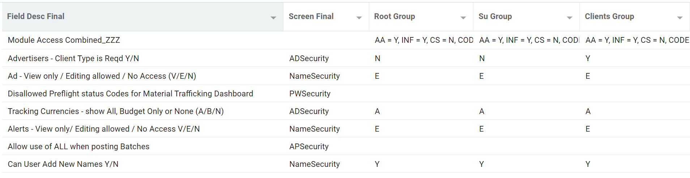
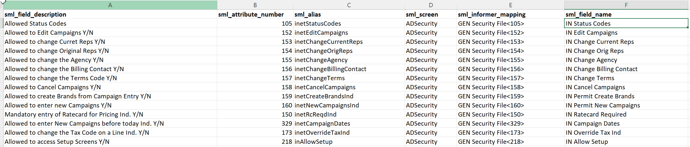
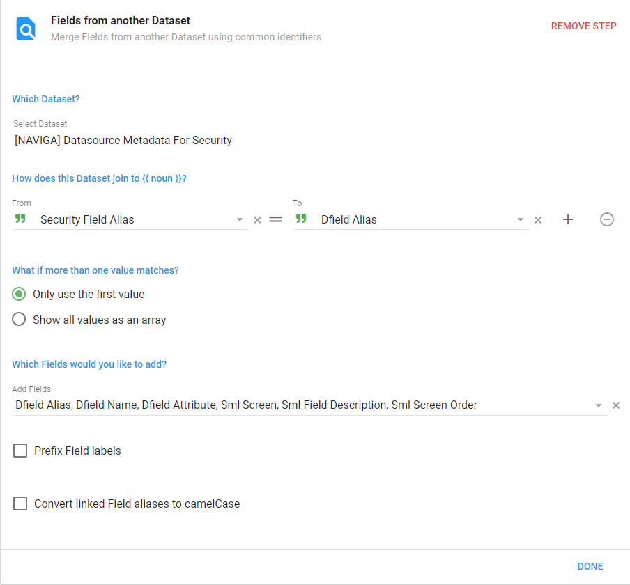
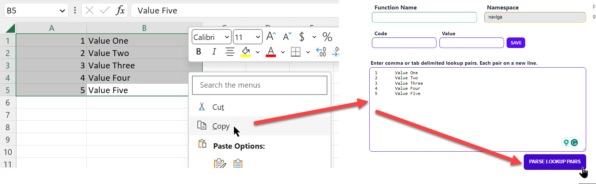
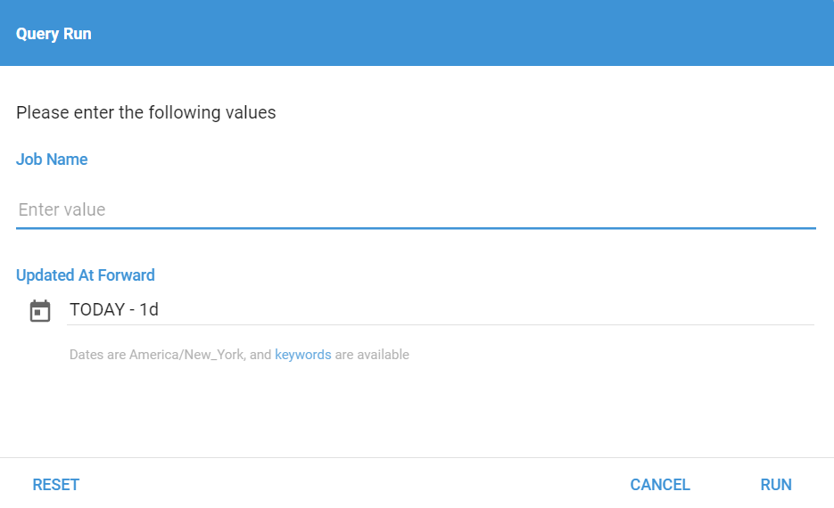

## AD Internet Orders Base Revenue Report

This is a great starter for Revenue reports based on the AD Internet Orders mapping. 

:::info Download Bundle

This is a "starter" dataset that is great for most revenue reports. 

**<a  target="_blank"  href="/downloads/naviga-ad-internet-orders-starter.tgz">AD Internet Orders Starter</a>**

:::

It includes 

- Net/Gross Revenue - Both local and foreign amounts
- Rep/Gross Revenue - Both local and foreign amounts
- GL Codes - Based on the overrides in your product setup
- Other needed fields

To calculate the Revenue Amounts it uses the [calculateLineAmounts](informer-saved-functions#calculatelineamounts---usage) saved function.

To calculate the Rep Revenue Amounts it uses the [calculateRepAmounts](informer-saved-functions#calculaterepamounts---usage) saved function.

The GL codes uses the logic detailed in the documentation -> [GL Code Logic](informer-mappings-ad-internet-orders#gl-codes-in-ad-internet-orders)

### Adding Fields to the Starter Dataset

You can add fields to augment the data in the dataset, but you do need to be aware of certain steps if you add certain Multivalued fields.

1. **Month prefixed fields** - If you add any field from AD Internet Orders with the prefix of Month, like MONTH.START.DATE, you will need to make sure that you also add that field to the FIRST normalize flow step.
2. **Line Detail Level Amount Fields** - Since this started dataset is calculating Rep Revenue amounts, we need to take special steps to make sure to not overstate Line Detail Revenue.  For example, if you had two reps on an order, each getting 50%, then that line would become two separate lines.  The second Flow step includes ANY Revenue field that we do not want duplicated across multiple reps.  So, if you add a value field that you are going to aggregate, make sure to add it to the second Flow step.




## AR Invoices Performance Applied

> **NOTE**: This is a custom report that may be bugging.  Test and refine to make sure it works for you.

**Download Report Sample**

**<a  target="_blank"  href="/downloads/naviga-ar-invoices-performance-applied_ADHOC.tgz"> AR Invoices Performance Applied Ad Hoc Report - [NAVIGA]-AR Invoices Performance - Applied</a>**

**<a  target="_blank"  href="/downloads/naviga-ar-invoices-applied-by-rep_ADHOC.tgz"> AR Invoices Performance Applied by Rep Ad Hoc Report - [NAVIGA]-AR Invoices Performance - Applied By Rep</a>**

:::info

Be aware that in the second Report (By Rep), that I have modified the sort from Campaign Id, Line Id, Month Start Date to JUST Campaign Id and Line ID.

This had to be done because of how the sorting "explodes" the MV fields to get the Month Start Date sorted.  

This should not be a problem unless you have Lines where the Month start dates are not ascending.  

:::


This report attempts to show applied amounts for each line's associated invoices and checks how much of the invoice is has been paid.  It then takes this "Applied Amount" and distributes it across the Lines that the invoice is assigned to.  

Many times it is one invoice per line, but if there are multiple Line Details (Month Start Dates), this would distribute the applied amount across those dates.

In cases where the invoice is applied to multiple Line Ids, the code attempts to do the same thing.


Here is the final Power Script that handles the above:
```js
//var netRevenue = $record.netLineLocalAmount
// Use the rep Net amount for our calculation
var netRevenue = $record['netRepAmount']

// IF amountAppliedLeft is NOT defined for invoice Initialize it
if (!$local.amountAppliedLeft[$record['monthInvoiceId']]) {
    $local.amountAppliedLeft[$record['monthInvoiceId']] = $record['month_invoice_id_assoc_invAmount'] - $record['month_invoice_id_assoc_invBalance']
}

// If the amountApplied Left is greater than this lines amount, that becomes the applied amount for the line
// Then we must subtract the line revenue from the amountAppliedLeft reducing it for future lines that may 
// use the invoice

if ($local.amountAppliedLeft[$record['monthInvoiceId']] >= netRevenue) {
    $record.lineAmountApplied = netRevenue;
    $local.amountAppliedLeft[$record['monthInvoiceId']] = $local.amountAppliedLeft[$record['monthInvoiceId']] - netRevenue
} else {
    // If amount left is less than the line amount, then we make the line applied amount equal
    // to the amountAppliedLeft and set the amountAppliedLeft to zero.
    $record.lineAmountApplied = $local.amountAppliedLeft[$record['monthInvoiceId']]
    $local.amountAppliedLeft[$record['monthInvoiceId']] = 0
}

if ($record['monthCreditId'][0]) {
    $record.lineAmountApplied = 0
}

// keep the credit from being show twice if applied to two lines
// NOTE: only looking at first credit if more than one applied to a line
if ($local.credits[$record['monthCreditId'][0]]) {
    $record['month_credit_id_assoc_invAmount'][0] = 0
}
$local.credits = { ...$local.credits, [$record['monthCreditId'][0]]: true }

```

## Budget Reports

**<a  target="_blank"  href="/downloads/naviga-ad-internet-rep-format-budgets.tgz"> Sample Rep Format Budget Report</a>**

Budgets can be stored in three different mappings, `AD Internet Budgets`, `AD Internet Rep Budgets` or `AD Internet Rep Format Budgets`.  Depending on how you want to track your Budgets, your data may appear in one or more of the above mappings.

Each work in a similar manner, so the example below will be for the `AD internet Rep Format Budgets` mapping.

The data is stored WITHOUT an implicit date field.  Instead the information for the Year is embedded in the ID field and the Month information is stored positionally in the Budget field.  

<div>
  <div>
   
    <div>
      <p>
      We need to take the `@id` field and extract the Year and Format from it.  The Rep ID is the last item of the ID, but we already have that as a separate field.</p>
<p><br />
We will then infer the month based on the position of the budget amount in the array.  Since arrays are zero based, we will need to add +1 to each element's position.
  </p>
    </div>
 </div>
  <div style={{clear: "both"}} ><br /></div>
</div>


The attached report manipulates the data using the following Powerscript:

```javascript
// The budget amounts are stored in a MV field and they are in month order
// Index 0 = Jan, 1 = Feb, etc.  We add one to the index to get the correct month numbers
$record.month = $record.budget.map((el, index) => index + 1)
// String of the above to be used in joins if needed
$record.monthString = $record.month.map(el => el.toString().padStart(2, "0"))

// The Year and the Format is stored in the ID field
// We split that field and take what we need
$record.budgetYear = $record.id.split("*")[0]
$record.printOrDigital = $record.id.split("*")[1]
```

The report then adds a Normalize flow step on the MV fields to get the final output.

### Adding Budget data to another Dataset

Most likely you will want to join the budget data to another dataset so that you can compare the budget data to the actual revenue being earned.

To do this, you will first need to convert the Ad Hoc Budget report into a dataset.  This is easily done by:

- Run the Ad Hoc report
- From the Actions menu choose "Create Dataset"

 

You can now join this dataset to another dataset, however, be aware that when you join the budget data to another dataset that have its revenue data at a different granularity, you will need to make sure to "fix" the budget data so that it is not duplicated to the target datasets granularity.

For example, our budget data is showing budgets by **Month-Year-Rep-Format**, but our Revenue data may be displayed down to the Line detail level.  Which means our budget data will be duplicated for every line that a **Month-Year-Rep-Format** exists for.

To make sure we only see one budget amount per **Month-Year-Rep-Format**, we need to use the [calculateAggregates Saved Function](informer-saved-functions#calculateaggregates---when-to-use) to  get the budgets showing the way that is needed.

Here is an example that can be used if you add budgets to a dataset getting data from AD Internet Orders.

**Step 1**

Get data from your budget dataset.  



**Step 2**

Aggregate Calculation Powerscript

```js
// Based on PrintPubInd create new field with "Print" or "Digital"
$record.printOrDigitalJoin = $record['web_site_id_assoc_printPubInd'] === "Y" ? "PRINT" : "DIGITAL"
// Define your group keys on the $record object so that
// you can reuse them in the Post Aggregation function
$record.groupKey1 = `${$record['currentRepIds']}-${$record['printOrDigitalJoin']}-${$record['monthPeriod']}`;
groupKeys = [
  {
    name: "Year",
    groupKey: $record.groupKey1,
  }
];

groupAggr = [
  {
    name: "budget",
    initValue: 0,
    value: $record['budget'],
    type: "replace"
  },
];

// Calling the calculate aggregates in a Powerscript
naviga.calculateAggregates({ $local, groupKeys, groupAggr });
```

**Step 3** ADD A Flush Flow Step

**Step 4**

Post Aggr Powerscript.

```js
// Get the group keys you defined in your Calc aggregations Powerscript
groupKey1 = $record.groupKey1
$record.budget = 0

// GROUP KEY 1
if (!$local[groupKey1].GroupSet) {
  $record.budget = $local[groupKey1].budget;
  $local[groupKey1].GroupSet = true; //Setting to true means we will not excute this code again during the load.
}
```

## Material Production Status

To get the Material Production status, we need to first create a dataset that reads the **AD Production Workflow Header** mapping and pulls the Product ID out of the ID.

**<a  target="_blank"  href="/downloads/naviga-production-status-mapping.tgz">Download -> naviga-production-status-mapping</a>**

This dataset is then joined to other datasets that have the Material Status and Product values to join to this dataset.

If you are getting the Material status from **AD Internet Orders**, you will need to include some Powerscript code to make sure you get the correct Material status as depending on the type of Order the Material status could be in the *Month Material Status* field or in the *Material Status* field, both of these are in **AD Internet Orders**.

The below example will also create the **[NAVIGA]-Product Status Mapping** dataset.

**<a  target="_blank"  href="/downloads/naviga-production-status-on-orders.tgz">Download naviga-production-status-on-orders.tgz</a>**

When joining to the **[NAVIGA]-Product Status Mapping** dataset, you can do so as follows:

<div>
	  
</div>


The *statusidnumber* above is calculated in the Powerscript below.  This takes into account that sometime the Material status is in Month Material Status field and sometimes in the Material status field:

```js
// Look for status id in MonthMaterialStatus and if that doesn't exist use the MaterialStatus
// field.
// This will be used to join to the Product Status Mapping dataset along with Product ID to get 
//the Material Status Description
finalMaterialStatus = !$record['monthMaterialStatus'] || $record['monthMaterialStatus'].length === 0 ? $record['materialStatus'] : $record['monthMaterialStatus']
$record.statusidnumber = parseInt(finalMaterialStatus)
```


## New Business Flag

> IN PROCESS FEATURE - Create a lapsed customer option.  This would check a customers **last order date** against **today's date** and if it was greater than x months, we would mark the customer as lapsed.  Most likely you will want Lapsed Months to be Greater than the INACTIVE months.

**<a  target="_blank"  href="/downloads/naviga-new-business-flag.tgz"> Sample New Business Flag Dataset - [NAVIGA]-New Business Flag</a>**

Many times there is a need to declare a customer as a new customer after a defined length of inactivity.  That is where this code can help.

The code below is based on the **AD Internet Campaigns** mapping and uses the campaigns Start and End dates to determine inactivity between campaigns.

The fields needed from **AD Internet Campaigns** are:

- **Advertiser ID <1>**
- **Start Date <4>**
- **End Date <5>**

:::info **Important**

We MUST set the **Order By** in the Query to sort Ascending by **Advertiser ID** AND **Start Date**.  This will group the records by advertiser and also order each advertisers campaign in order of when the campaigns started.

:::

The basic logic will be that as we go through the records, we will compare the previous record to the current record for an advertiser and calculate how much time has passed between the **End Date** of the previous record and the **Start Date** of the current record.  

:::note

The date calculations are based on the first of the month.  For example, if the end date is 01/15/2022, the code will use 01/01/2022 for the comparison.

Many Advertisers will have overlapping campaigns, where the end date of one is **After** the start date of the previous:

 *camp 1, startDate 01/01/2020 End Date 01/01/2021*
 *camp 2, startDate 05/02/2020 End Date 07/01/2020*

This is OK, as in the calculations the result will be negative and is handled.

:::

There are some constants that you will set in the first part of the script that will define how the application sets the New Business status.

- **INACTIVE_MONTHS_LIMIT** - How many months of inactivity must a client have before being designated as "New" business
- **PROBATION_MONTHS** - Many times you also want to know how long a customer has been identified as "New" business.  For example, if a customer starts doing business with your company, you would want them to retain that new status for a certain amount of time.  This is referred to as the **Probationary Period** in the code.  It is defined in months.
- **INACTIVE_MONTHS_LIMIT** - How many months of no orders before we mark this customer as "Inactive".  
- **NEW_STATUS_TEXT** - Text to use in the **finalSalesStatus** field  when the client is "New"
- **EXISTING_STATUS_TEXT** - Text to use in the **finalSalesStatus** field when the client is not "New"
- **INACTIVE_STATUS_TEXT** - Text to use in the **finalInactiveStatus** field when the client is considered "Inactive"
- **ACTIVE_STATUS_TEXT** - Text to use in the **finalInactiveStatus** field when the client is considered "Active"

Here is the code for the Constants.

```javascript
//=====================
//-- Constants - All checks are Exclusive (months between < LIMIT value)             
//-- This is the number of months of inactivty between current and last ad before we call the customer new
TIMETONEW_MONTHS_LIMIT = 12;
//-- Number of months AFTER a customer is declared "new" that we keep their status as "New"
PROBATION_MONTHS = 3;
//-- Number of months without an order to have customer's "finalInactiveStatus" set to the Inactive Text
INACTIVE_MONTHS_LIMIT = 4

// Status Text
NEW_STATUS_TEXT = 'New';
EXISTING_STATUS_TEXT = 'Existing';
INACTIVE_STATUS_TEXT = 'Inactive'
ACTIVE_STATUS_TEXT = 'Active'
//=====================
```

### Visual Overview of a Couple of Scenarios



:::tip

If a customer's last transaction gave them a Sales Status of "New" and it has been more than the "INACTIVE_MONTHS_LIMIT", you will see that customer listed as "New" and "Inactive".  This just means that they never had a transaction after the probationary period.  

:::

**Definitions of some Variables**

- **lastActivityDate** - the previous record's "last activity" date.  Maybe the Month End Date of Campaign
      At the start of the Powerscript, this date will be pulled from $local.previousValues object
      At the end of the Powerscript, whatever field is deemed to be the lastActivityDate, will be pulled
      from the current record and stored as the lastActivityDate in the $local.previousValues object
- **currentActivityDate** - the current record's "current activity" date. Maybe the Month Start Date of Campaign
- **startDateOfNewStatus** - gets set to the lastActivityDate of the current record when there has been no activity for 12 months
  This date does not get reset until there is another 12 month period of inactivity.
  This is because a "new" advertiser, stays new for 12 months after becoming new.  After 12 months of activity, status
  will change to "existing"

**Persistent Objects** - These object will persist over every row processed

- **$local.previousValues** - This object will contain the "advertiserId" and "lastActivityDateMoment" from
  the PREVIOUS record.
  If this is the first record (meaning this variable is `undefined`) we initialize to: 
    { advertiserId: null, lastActivityDateMoment: moment(null) }
  One of the **final** steps of the Powerscript is to update this Object with the current records
  advertiser id and "lastActivityDate", which will then be the next records "PREVIOUS" values.
- **$local[advId]** - Since we are using the record's advertiser id as a key on the $local object, all the 
  values stored will be overwritten as we progress through the Advertisers campaign records.

### Main Script

```javascript
//=====================
//-- Constants
//-- This is the number of months of inactivty between current and last ad before we call the customer new
TIMETONEW_MONTHS_LIMIT = 12;
//-- Number of months AFTER a customer is declared "new" that we keep there status as "New"
PROBATION_MONTHS = 3;
//-- Number of months without an order to have customer's "finalInactiveStatus" set to the Inactive Text
INACTIVE_MONTHS_LIMIT = 4

// Status Text
NEW_STATUS_TEXT = 'New';
EXISTING_STATUS_TEXT = 'Existing';
INACTIVE_STATUS_TEXT = 'Inactive'
ACTIVE_STATUS_TEXT = 'Active'
//=====================

// get $local object and initialize if they don't yet exist
previousValues = $local.previousValues
  ? $local.previousValues
  : { advertiserId: null, lastActivityDateMoment: moment(null) };

// Get Info for setting $local Adv Bucket
AdvId = $record['advId'];
//!! This is the date of activity for the current record.  It will be compared to
//!!    the previous records "lastActivityDateMoment" field.
currentActivityDateMoment = moment($record['startDate']).startOf('month');

// Initialize AdvId bucket in $local var
$local[AdvId] = $local[AdvId]
  ? $local[AdvId]
  : {
      SalesStatusWorking: {
        salesStatus: NEW_STATUS_TEXT,
        startDateOfNewStatus: currentActivityDateMoment,
        inactiveStatus: ACTIVE_STATUS_TEXT,
        isLastRecord: false,
        counter: 0,
      },
    };

//--- Setup Variables
// Pull previous values into vars
lastActivityDateMoment = previousValues.lastActivityDateMoment;
startDateOfNewStatus = $local[AdvId].SalesStatusWorking.startDateOfNewStatus;

currMinusPrevDate = currentActivityDateMoment.diff(
  lastActivityDateMoment,
  'months'
);
currDateMinusCurrStartDOfNS = currentActivityDateMoment.diff(
  startDateOfNewStatus,
  'months'
);

// Months since last order from todays date
// We will use this to determine if we should use Active Text or Inactive Text 
inactiveCheckMonths = moment().diff(currentActivityDateMoment, 'months')
inactiveText = inactiveCheckMonths > INACTIVE_MONTHS_LIMIT ? INACTIVE_STATUS_TEXT : ACTIVE_STATUS_TEXT;

isNewAdvertiser = previousValues.advertiserId !== $record['advId'];

// If the previous record was the final one for the previous advertiser, then set the
//     $local[previousAdvertiserid]"isLastRecord" flag to true.
// Used in the final script to determine the correct sales status.
if (isNewAdvertiser && previousValues.advertiserId) {
  $local[previousValues.advertiserId].isLastRecord = true;
}

// boolean - if true, cust marked as new with startDateOfNewStatus reset to currentActivityDateMoment
isOver12MonthsSinceLastOrder = currMinusPrevDate > TIMETONEW_MONTHS_LIMIT;
isPastProbationPeriod = currDateMinusCurrStartDOfNS > PROBATION_MONTHS;

// ------ DEBUGS Start -----
// $record.DEBUG_prevAdvertiser = previousValues.advertiserId;
// $record.DEBUG_lastActivityDateMoment =
//   previousValues.lastActivityDateMoment.format('MM-DD-YYYY');
// $record.DEBUG_startDateOfNewStatus = startDateOfNewStatus;
// $record.DEBUG_dateTestCurrMinusPrev = currMinusPrevDate;
// $record.DEBUG_currDateMinusCurrStartDOfNS = currDateMinusCurrStartDOfNS;
// $record.DEBUG_isPastProbationPeriod = isPastProbationPeriod;
// $record.DEBUG_isOver12MonthsSinceLastOrder = isOver12MonthsSinceLastOrder;
// ------ DEBUGS End -----

// Do some logic to figure out what we should make the sales status and "StartDateOfNewStatus"
if (isNewAdvertiser || isOver12MonthsSinceLastOrder) {
  // This object will persist between records
  // Stores advertiser's current status and the date of when they "acquired" that status
  // Whenever we start on a new advertiser, they are assumed "New"
  $local[AdvId].SalesStatusWorking = {
    salesStatus: NEW_STATUS_TEXT,
    startDateOfNewStatus: currentActivityDateMoment,
    counter: $local[AdvId].SalesStatusWorking.counter + 1,
  };
} else {
  // Setting counter.  Maybe use to determine last salesStatus
  $local[AdvId].SalesStatusWorking.counter =
    $local[AdvId].SalesStatusWorking.counter + 1;
  

  // Check if out of probationary period, if so, then set Existing status text
  if (isPastProbationPeriod) {
    $local[AdvId].SalesStatusWorking.salesStatus = EXISTING_STATUS_TEXT;
  }
}
  // Setting counter.  Maybe use to determine last salesStatus
  $local[AdvId].SalesStatusWorking.counter =
    $local[AdvId].SalesStatusWorking.counter + 1;
  $local[AdvId].SalesStatusWorking.inactiveStatus = inactiveText;
//Before going on to the next record, store the "previous" values
$local.previousValues = {
  advertiserId: $record['advId'],
  lastActivityDateMoment: moment($record['startDate']).startOf('month'), // This will be a moment Object
};

// Expose the current info from our SalesStatusWorking object as records for this transaction
// The $record.counter is very important for the post flush powerscript
// It lets us know and compare last record's counter to it, so that we know
// which transaction was the last record for the given advertiser.
$record.workingSalesStatus = $local[AdvId].SalesStatusWorking.salesStatus;
$record.counter = $local[AdvId].SalesStatusWorking.counter;
```

**FLUSH Flow Step**

```javascript
// Put a Flush Flow Step here
```

**Set the Last Record Flag**

```javascript
//!!!!--- Finalize Script - Set Last Record ---!!!!//
advId = $record["advId"];
$record.isLastRecord = false;
$record.workingcounter = $local[advId].SalesStatusWorking.counter

if ($local[advId].SalesStatusWorking.counter == $record.counter
) {
  // We need to move the last record flag out of the $local variable and onto the record itself.
  $record.isLastRecord = $local[advId].isLastRecord || true;
  $record.finalSalesStatus =  $local[advId].SalesStatusWorking.salesStatus;
  $record.finalInactiveStatus = $local[advId].SalesStatusWorking.inactiveStatus
} 
```

**FLUSH Flow Step**

```javascript
// Put a Flush Flow Step here
```

**Remove Non Final Status**

```javascript
// Uncomment to only show FINAL Sales Status
// This make it so that you have only a single row per customer.
if (!$record.isLastRecord) $omit()
```

**Remove Fields**

You can also add a *Remove Fields* flow step to remove the following fields:

- Campaign ID
- Working Sales Status
- Counter
- Start Date
- End Date 
- Is Last Record


## GEN Security File Report

This section has the sample files and explains in detail how to build a report that takes the fields from the **GEN Security File** mapping in Informer and transforms it into a more readable and usable format.  Steps 1-10 will get you a report that has the following format.

| User Group | Security Field Name          | Security Field Value |
| ---------- | ---------------------------- | -------------------- |
| ROOT       | Advertisers - Client type... | Y                    |
| ROOT       | Allowed to apply...          | N                    |
| ...        |                              |                      |
| CLIENT     | Advertisers - Client type... | N                    |
| CLIENT     | Allowed to apply...          | N                    |
| ...        |                              |                      |

Continuing to follow the steps after step 10 will transform the report into a cross tab report, with the User Groups going across the top of the report.



Before starting, make sure to review the prerequisites and download the sample files.

:::info Prerequisites and Sample Files

****

**Prerequisites**

- You MUST have v2 of the `calculateAggregates` saved function installed. [Get Code Here](informer-saved-functions#calculateaggregates---create-function)
- You must be on Informer version 5.2 or above

**Sample Files**

**<a  target="_blank"  href="/downloads/SecurityMappingLabelDescriptions.csv">SecurityMappingLabelDescriptions.csv File</a>**

**<a  target="_blank"  href="/downloads/securityreport/naviga-datasource-metadata-for-security.tgz">Datasource Metadata For Security Report</a>** - ***Dependent on*** the Security Mapping Spreadsheet being uploaded into a Workspace

**<a  target="_blank"  href="/downloads/securityreport/naviga-gen-security-final.tgz">Security Crosstab with Columns Sample Dataset</a>** - ***Dependent on*** `Datasource Metadata For Security Report` for HNP Security

:::

#### Setup For Building Dataset

**Step 1 Create Upload spreadsheet**

This CSV file has already been created for you, it can be downloaded above.  However, if you want to modify any of the *sml_field_description* values, you may.  You may also modify the *sml_screen* and *sml_screen_order* field values. 

The **attribute number** is used to join to the Metadata and the **Field Description** to build our new label.

The only fields we use in this version of the report are:

- sml_field_description
- sml_attribute_number
- sml_screen
- sml_screen_order - this field holds the order of the fields as they appear in the Naviga security screen.

:::tip

All other fields are for informational purposes.  If you find they are difficult to get into the spreadsheet, you can omit them.

:::



:::danger Important

Once you have created this file, you will upload it into a Workspace -> **Security Mapping Label Descriptions**

If you make any changes in the spreadsheet, you MUST upload and replace the data in the Workspace!

:::

**Step 2 "Datasource Metadata For HNP Security" Dataset**

The next step is to get Metadata for the GEN Security File mapping.  This dataset was created to get that information:

If anything has changed in the Spreadsheet from Step 1 and you have uploaded it into the Workspace, you first need to refresh this dataset. 

:::caution

I found discrepancies in the metadata JSON field "Field Data" for the alias name.  

To work around this, I used the FIeld Id in from the **Mapping** mapping and used it to calculate the field Alias.  The Field Id is what you see in the datasource mapping lists in the format "FIELD.NAME".  However, sometimes the value separating words is a period "." and sometimes an underscore "\_". 

Here is the code.

```javascript
// Below code is creating a calculated field for the field name to join with our main dataset
// I found that certain fields were getting incorrect alias names when pulling from teh field_data JSON file.
// This one is calculating from teh Field ID.
splitDelimiter = $record['field_fieldId'].indexOf(".") > 0 ? "." : "_"
fieldNameArray = $record['field_fieldId'].split(splitDelimiter) // $record['field_data'].name.split(" ")

lastFieldVals = fieldNameArray.slice(1).map(el => el.toLowerCase()[0].toUpperCase() + el.slice(1).toLowerCase())
$record.dfieldAliasCalced = fieldNameArray[0].toLowerCase() + lastFieldVals.join("")
```

I point this out, because we use the calced field as the Join field in the final dataset and if you see any field that isn't pulling its description, first look to this value to make sure it is "calculating" the correct alias.

:::

Once refreshed, you can export it to excel for reference.  The fields of interest are:

- **Field Label Expression** - Used in the HNP Security dataset to update the label of fields with descriptions.
- **Condense Multi Valued Expression** - Used in the HNP Security dataset to convert multivalued fields to a string of values
- **Object Map Pair** - --NO LONGER NEEDED-- The key/value pairs *was* extracted and used to create a lookup object in the **naviga.securityMapLookup** saved function
- **SML Screen** - Informational value identifying which Naviga Screen this field comes from

*However*, the fields that contain the information you **need** for the Powerscripts in the final dataset can simply be **copied and pasted from the dataset.**  These are:

- **Final Condense Multi Valued Expression** - Used in the HNP Security dataset to convert multivalued fields to a string of values.  

  > NOTE: There may be some MV fields that need additional processing and this will take place in the Flow step during the final report build.

- **Final Alias Array** - Used in the HNP Security dataset to the field array will tell us the fields in the mapping to process.

- **Final Field Label Expression** - **NOT USED** in the final dataset, but for informational purposes, you could use this code to **update the label of fields** with descriptions.

- **Final Object Map Pair** - --**NOT USED**-- The key/value pairs will be extracted and used to create a lookup object in the **naviga.securityMapLookup** saved function

#### Build the Final Dataset

To transform a dataset with 300+ columns to a Cross Tab we will need to 

- Create the following arrays will be created:
  - UserGroup - will be the @id (User Group) field
  - SecurityFieldLabel - will be the column name
  - SecurityFieldValue - will be the column value
  - SecurityFieldAlias - used to join to the Dataset-> **Datasource Metadata For Security Report**

We continue to push values onto these arrays (in the $local object so that they persist between rows) for every row.  

**Step 1**

Create a Dataset pointed to the GEN Security File mapping and then grab ALL of the fields.  

**ADD** *Criteria* 

- WHERE Group Name is Not Empty
  

**Step 2 - Flow Step Powerscript** 

In this Powerscript, we are defining the `$local.fieldsToLoop` array. This array is defined in the **Final Alias Array** field in the **Datasource Metadata For Security Report** dataset.  Just copy and paste it after the "="

*Assign FieldsToLoop Local Array*

```javascript
// Create Array of field aliases that we will loop through and "unwind"
$local.fieldsToLoop = ['adClientTypeReqdInd',...,'adCustOption']
```


**Step 3 - Flow Step Powerscript**

This script can be modified to meet your needs.  Initially, there are many multivalued fields and if you are not sure how to handle them, it is best to simply convert the multiple values into a delimited string list.  To determine if a field is Multivalued, there is the **Datasource Metadata For Security Report** dataset.  Simply run this dataset and copy the **Final Condense Multi Valued Expression** field.  It will contain the code that you need to convert all of the MV fields to string delimited.

As an example, the moduleAccessCombined code is showing that you can do custom edits with MV fields if needed.  the genWebModuleAccess and genWebModuleCodes are two MV fields that are associated and so, we added them into a single field.

:::caution

If you create a new field with values as we have done with **$record.moduleAccessCombined**, you will need to add that field name to the array **$local.fieldsToLoop** defined in Step 2 above.

:::

*Deal with MV Fields*

```javascript
// Deal with Multivalued fields
//-------------------------------
// Custom coversion of a multivalued field
moduleAccessCombined = $record['genWebModuleAccess'].map((el, index) => {
    return `${$record['genWebModuleCodes'][index]} = ${el}`
})

// Since we are creating a new field IT MUST be added to the fieldsToLoop array in the previous powerscript
$record.moduleAccessCombined = naviga.multiValuedToString(moduleAccessCombined, ", ", true)
//-------------------------------

// Convert all multivalued fields to strings - code from "Datasource Metadata For HNP Security" dataset
$record["inClientAccessCodes"] = naviga.multiValuedToString($record["inClientAccessCodes"], ",", false)
$record["inetStatusCodes"] = naviga.multiValuedToString($record["inetStatusCodes"], ",", false)
...
$record["incentiveAutoAdjustCodes"] = naviga.multiValuedToString($record["incentiveAutoAdjustCodes"], ",", false)

//-----------------------------
// The below code will be used to modify any MV fields that need further refinement.
// cmrAdRepScreens has the description fields in an iDescriptor, BUT iDescriptors do NOT Have an attribute number
// to map to
// so we are just copying over the ids with descriptions here.
$record["crmAdRepScreens"] = $record["crmAdRepScrDesc"]
```


**Step 4 - Flow Step Powerscript**

Here is the script where we start the process of "unwinding" the fields.  This is done by creating 4 arrays for each of the final fields that we want. 

*Field Mapping*

```javascript
// GEN Security File Field Mapping
//-- Initialize the $local arrays
$local.UserGroup = $local.UserGroup || []
$local.SecurityFieldLabel = $local.SecurityFieldLabel || []
$local.SecurityFieldValue = $local.SecurityFieldValue || []
$local.SecurityFieldAlias = $local.SecurityFieldAlias || []


loopFields = $local.fieldsToLoop
// Loop through the field alias array and build three arrays that will be 
// the final three fields in the table
for (let i=0; i < loopFields.length; i++) {
    fieldName = loopFields[i]
    // Make sure field exists in dataset
    if ($fields[fieldName]) {
        $local.UserGroup.push($record['id']) 
        $local.SecurityFieldLabel.push($fields[fieldName].label + "_ZZZ")
        $local.SecurityFieldValue.push($record[fieldName])
        $local.SecurityFieldAlias.push(fieldName)
    }
}
```

**Step 5 - Flow Step Flush**

We need a flush step because we want to process all of the above steps before proceeding to the next Powerscript.

```bash
#FLUSH Flow Step
```

**Step 6 - Flow Step Powerscript**

*Local To Records*

```javascript
// Copy all of our $local persistant arrays that were created to
// records.  NOTE: These will be 4 large arrays.
// ALSO, since we only need ONE value (hence one row), we delete all other rows
// as we have aggregated the information we need into the below local arrays
if (!$local.firstTime) {
    $record.UserGroup = $local.UserGroup
    $record.SecurityFieldLabel = $local.SecurityFieldLabel
    $record.SecurityFieldValue = $local.SecurityFieldValue  
    $record.SecurityFieldAlias = $local.SecurityFieldAlias
    $local.firstTime = true
} else {
    $omit()
}
```

**Step 7 Flow Step Normalize**

Next we need to normalize on the four new fields we created above.

Add the Normalize Flow step and choose 

- UserGroup
- SecurityFieldLabel
- SecurityFieldValue
- SecurityFieldAlias

**Step 8 Flow Step Field from Another Dataset**

There is some information in our **Datasource Metadata For Security Report** dataset that we need.

Join the **Security Field Alias** to the **Dfield Alias** and then pull in the following fields:

- **Dfield Name**
- **Dfield Alias**
- **Dfield Attribute**
- **Sml Screen**
- **Sml Field Description**



**Step 9 Flow Step Powerscript**

*Populate Final Field Description*

```javascript
// We expect some fields will not have a Description defined in the Workspace table, if not
// Populate with the original field Label.
$record['FinalFieldDescription'] = $record['smlFieldDescription'] || $record['SecurityFieldLabel']
```

:::tip

The completion of Step 9 will give you a dataset with the GEN Security File fields "Unwound".  Proceed to Step 10 to remove unneeded fields.  

However, if you want to convert this into a Crosstab style report that looks like the image below, **SKIP** Step 10 and proceed to **Step 11**.


:::

**Step 10 After Run**

After you have loaded the data, you will find that you have over 300 fields and you only want/need 4.  Click on the "Columns" button and deselect all fields except for the following.


:::danger

Do not use the Remove Fields flow steps to get rid of the fields.  Given how we are building the dataset, this causes issues when I tried in the past.  As new versions of Informer are released, this option could be tested again.

:::

**Step 11 Flow Step Powerscript**

To accomplish the output, we will need to take the User Group field and make all unique values in it their OWN field AND the values of each field must be the corresponding SecurityFieldValue values.

We are going to use the `naviga.calculateAggregates` saved function to help.  **Make sure you have version 2,** which includes the `type` option.

Using this function, we will group by the "UserGroup" field and do a special aggregation which will concatenate ALL the value from the following fields:

- **SecurityFieldValue** - The value for the Field Description.
- **FinalFieldDescription** - The final field description will be the new description from the spreadsheet, or if that doesn't exist it will be the original label for the field with an "_ZZZ" at the end.
- **SecurityFieldLabel** - This is the ORIGINAL label for the field.
- **SecurityFieldAlias** - This is the alias for the field
- **smlAttributeNumber** - The attribute number of the field.  NOTE: this will only be populated for fields that had a description in the spreadsheet/workspace
- **smlScreen**
- **smlScreenOrder**

**Aggregation Step**

```javascript
// Define your group keys on the $record object so that
// you can reuse them in the Post Aggregation function
$record.groupKey1 = `${$record['UserGroup']}`;
groupKeys = [
  {
    name: "Group",
    groupKey: $record.groupKey1,
  }
];

groupAggr = [
  {
    name: "value",
    initValue: '',
    value: $record['SecurityFieldValue'],
      type:  'concatall'
  },
  {
    name: "desc",
    initValue: '',
    value: $record['FinalFieldDescription'],
      type:  'concatall'
  },
  {
    name: "label",
    initValue: '',
    value: $record['SecurityFieldLabel'].replace("_ZZZ", ""),
    type:  'concatall'
  },     
  {
    name: "screen",
    initValue: '',
    value: $record['smlScreen'],
    type:  'concatall'
  }, 
  {
    name: "screenOrder",
    initValue: '',
    value: $record['smlScreenOrder'] ,
    type:  'concatall'
  },     
  {
    name: "attributeNum",
    initValue: '',
    value: $record['dfieldAttribute'],
    type:  'concatall'
  },    
  {
    name: "alias",
    initValue: '',
    value: $record['SecurityFieldAlias'],
    type:  'concatall'
  },     
];

// Calling the calculate aggregates in a Powerscript
naviga.calculateAggregates({ $local, groupKeys, groupAggr });
```


**Step 12 Flow Step FLUSH**

```bash
#FLUSH Flow Step
```

**Step 13 Flow Step Powerscript**

This is where things get trickly.  We are still only working on the $local object.  This means that we need the values to persist.

In this step we should only have one row for each **UserGroup** field.  Each of these rows will have other fields that contain arrays of all the security fields and values.  We are going to store all of this information in a new Key on the $local object called **final**

NOTE that we store the User Group and value fields each time a new groupKey1 is encountered, HOWEVER, we only store the other field ONCE.  This is because the other fields are actually associated with the Field Values.  

For example, the field description might be "AD Can Open Something" and it will have "answers/values" for each user group.

These are the keys we will create on the final object.

- $local.final.fieldDesc_FINAL
- $local.final.screen_FINAL
- $local.final.fieldLabel_FINAL
- $local.final.attributeNum_FINAL
- $local.final.alias_FINAL

**Post Aggregation**

```javascript
// Get the group keys you defined in your Calc aggregations Powerscript
groupKey1 = $record.groupKey1

// GROUP KEY 1
if (!$local[groupKey1].GroupSet) {
  // Create a persistant "final" key on the local object
  $local.final = { ...$local.final, [`${groupKey1} Group`]: [] }
  $local.final[`${groupKey1} Group`] = $local[groupKey1].value;
  if (!$local.fieldDescDone) {
    $local.final.fieldDesc_FINAL = $local[groupKey1].desc 
    $local.final.screen_FINAL = $local[groupKey1].screen 
    $local.final.screenOrder_FINAL = $local[groupKey1].screenOrder     
    $local.final.fieldLabel_FINAL = $local[groupKey1].label 
    $local.final.attributeNum_FINAL = $local[groupKey1].attributeNum
    $local.final.alias_FINAL = $local[groupKey1].alias     

    $local.fieldDescDone = true
  } 
    
  $local[groupKey1].GroupSet = true; //Setting to true means we will not excute this code again during the load.
} else { 
  $omit()
}
```

**Step 14 Flow Step FLUSH**

```bash
#FLUSH Flow Step
```

**Step 15 Flow Step Powerscript**

In this last Powerscript, the code loops over the keys in the final object and assigns them to an actual Record.   We just need to loop through and assign value in the keys to a $record name with the Key for each Key.

**Final Processing**

```javascript
if (!$local.stopProcessing) {
    for (key of Object.keys($local.final)) {
      $record[`${key}_VIEWFINAL`] = $local.final[key]
    }
    $local.stopProcessing = true
} else {
    $omit()
}
```

**Step 16 Flow Step Normalize**

The last step is to normalize your single row, which is now just Arrays.

You will want to select all the field that end with `VIEWFINAL`.  

**Step 17 Choose Columns**

The final step is to choose the columns to display.  The easiest way to do this, is to click on the Columns and, the same way you chose the fields in the Normalize step, search for `VIEWFINAL` and choose those fields.

## Lookup Function Generator

import LookupFunction from '@site/src/components/lookupFunction/';

The **Lookup Function Generator** below allows you to create the pieces needed for a **Lookup Function** that can be used in your Powerscripts.

:::caution 

While there is no limit to the number of `code/value` pairs you can create, this function is best suited for a smaller number of `code/value` pairs and also, pairs that don't change much over time.  However, if needed, updates to the function are not difficult.

::: 

Where might you need something like this?  Think of any place where you might use an VLOOKUP in excel.  This function would do something similar. 

Another scenario would be when you need to group items at a higher level.  For example, you may want to group your Ad Types into a higher level of categorization.  You could do this with something like:

| Code       | Value        |
| ---------- | ------------ |
| ADTYPE_1   | Category One |
| ADTYPE_2   | Category One |
| ADTYPE_3   | Category Two |
| ADTYPE_... | Category ... |

To use the Generator below, you will need to enter the following:

- **Function Name** - This name is how you will "call" your function in Powerscript.
- **Code/Value Pairs** - The `code` value is what you will "send" to your function in your Powerscript.  You will be returned the `value` .

You can either enter you `code/value` pairs individual in the available input boxes OR paste in a string with the `code` and `value` delimited by a **comma** or **tab**, with each pair separated by a new line.

If you build your pairs in excel, just copy and paste into the input box:



### Creating the Function in Informer

The below generator cannot create the saved function for you, but it gives you all of the pieces to be able to do it yourself.

<LookupFunction />

# Informer Metadata Reports

The following reports are built using the Metadata datasource in Informer.  This datasource may not exist in your Informer system yet.  If you do not see an **Informer Metadata** datasource, enter a Salesforce case asking for it to be created for you.

Here is how to create the Informer Metadata datasource/database -> [Informer Metadata Database Creation](informer-system#setting-up-informer-metadata-database-as-datasource-v586-forward)


## Job Status Check

:::info Download Dataset

**<a  target="_blank"  href="/downloads/naviga-job-status-check.tgz">Job Status Check</a>**

:::

This report will return any jobs that have had an error in the past *n* days that you enter.  You can also enter a Job Name to target a specific Job.




