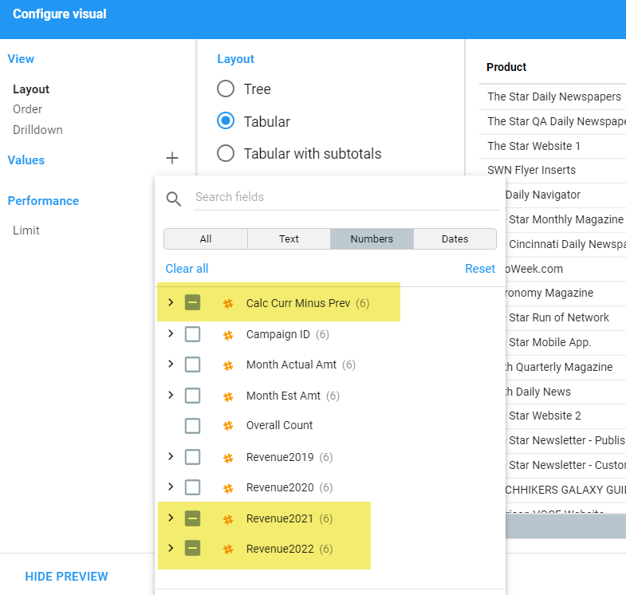
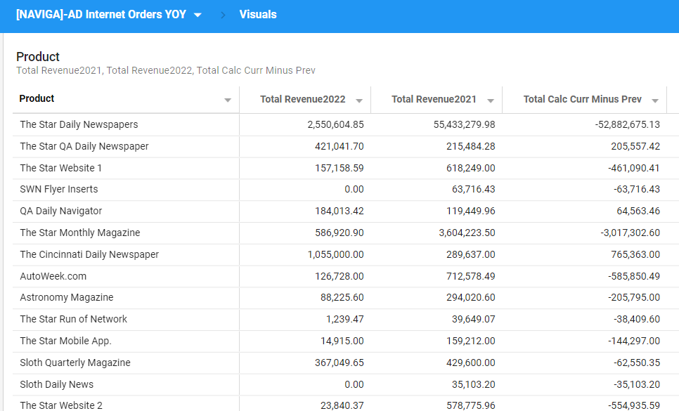

Saved Functions are functions that are added to an Informer site via the Administration/Saved Functions area.

Users can then call these function in their Datasets to perform whatever action they were designed to do.

All functions created by Naviga staff will be located in the **naviga** namespace.

If a function in this list doesn't exist in your Informer system, you can create it by logging into Informer and going to the Administration page, then clicking on the Saved Functions icon.

When you are in the **Saved Functions** area, you will see a **New Function** button in the left sidebar.

After clicking on this button you will be presented with a dialog to fill out.  Simply fill it out with the details give in the **Create Function** section for each of the below functions.

## calculateAggregates - Create Function

- **Function name:** calculateAggregates

- **Namespace:** naviga

- **Description:** Create keys on the local object to aggregate fields

- **Parameters:**

  | Data Type | Variable name    | Label            | Sample                           |
  | --------- | ---------------- | ---------------- | -------------------------------- |
  | Any       | aggrConfigObject | AggrConfigObject | { $local, groupKeys, groupAggr } |

**Function Body**

```javascript
/*
==============================
Version 2.0 - Release 09/2022
==============================
type groupKeyObj = {
    name: string,
    groupKey: string,
  }
type groupKeys = groupKeyObj[]

type groupAggrObj = {
    name: string,
    initValue: ???,
    value: ??,
    type: 'sum' | 'replace' | 'concat'
  }
type groupAggr = groupAggrObj[]
*/
const groupKeys = aggrConfigObject.groupKeys || [];
const groupAggr = aggrConfigObject.groupAggr || [];
const localHold = aggrConfigObject.$local;
//---------------------------------------------------
//Loop through the groupKeys Array
// In this forEach loop we will process each groupAggr item
groupKeys.forEach((groupKeyObj) => {
  //Create the groupInit object
  groupInit = {
    GroupSet: false,
    ...groupAggr.reduce(
      (init, obj) => ({ ...init, [obj.name]: obj.initValue }),
      {}
    ),
  };
  //
  groupKey = groupKeyObj.groupKey;
  // Initialize the groupKey on the $local object
  // To accomodate dynamic groupAggr values, spreading new groupInit first, 
  // then any existing value in local for given groupKey
  localHold[groupKey] = { ...groupInit, ...localHold[groupKey] };
  //---------------------------
  // Loop through groupAggr Array and perform the aggregation
  groupAggr.forEach((aggrObj) => {
    switch (aggrObj.type) {
      case 'replace':
        localHold[groupKey][aggrObj.name] = aggrObj.value ? aggrObj.value : localHold[groupKey][aggrObj.name];
        break;
      case 'concat':
        // Bail out if passed value is undefined
        if (!aggrObj.value) return localHold
        // We do not break because I want the concat to flow to the concatall step if 
        // if it didn't bail above.
      case 'concatall':     
        // make sure the [aggrObj.name] exists on the [groupKey] on the local object if not return []
        localHold[groupKey][aggrObj.name] = localHold[groupKey][aggrObj.name] ? localHold[groupKey][aggrObj.name] : []
        currVals = [...localHold[groupKey][aggrObj.name], aggrObj.value]
        localHold[groupKey][aggrObj.name] = currVals;
        break;
      case 'sum':
        localHold[groupKey][aggrObj.name] = localHold[groupKey][aggrObj.name] + returnANumber(aggrObj.value);
        break;        
      default:
        // If no type given, then sum
        localHold[groupKey][aggrObj.name] = localHold[groupKey][aggrObj.name] + returnANumber(aggrObj.value);
    }
  });
  //---------------------------
});
//---------------------------------------------------
return localHold;

//-------------------------------------------------------
//- HELPER FUNCTION
//-------------------------------------------------------
function returnANumber(numberIn) {
  // If a date is passed return 0 otherwise dates get converted to unix time value
  numberIn =
    Object.prototype.toString.call(numberIn) === "[object Date]" ? 0 : numberIn;
  const parsedNumber = Number(numberIn);
  if (isNaN(parsedNumber)) {
    return 0;
  }
  return parsedNumber;
}
```


## calculateAggregates - When To Use

Before you decide to use the `calculateAggregates` function, it is a good idea to ask yourself why you think you need it, just to make sure you actually do need to use the function.

**calculateAggregates Needed**

A common use case that needs something like our `calculateAggregates` function is calculating **percentages** between two values based on certain groups in your data.

Think of it this way, any value that cannot be aggregated needs to use the `calculateAggregates` function or some technique like it.

> **Cannot be Aggregated** - Most **percentages** can't be aggregated.  If I have a field that is the Actual vs Budget percentage, I cannot calculate this on a transaction by transaction basis and then sum all the %'s up at the end.  I need to determine at what level I'm going to calculate the % at (maybe Advertisers or Sales Reps) and use the `calculateAggregates` function or other technique to get me the answer.

**calculateAggregates Maybe NOT Needed**

Once you better understand what they function does, you will find that you can use even in the cases listed below, but your report only needs the use cases listed below, then using the `calculateAggregates` function will add unneeded complexity to your report.

The example that you will see in this usage doc doesn't require the `calculateAggregates` function, however, it is super easy to understand.

- **Scenario 1** - Aggregates you get by summing up a field.  Since Informer lets you create pivot tables which will let you choose Field Values to aggregate, you obviously don't need extra functions for this scenario.
- **Scenario 2** - You want to create a calculation between two fields and aggregate it.  For example, the difference between Actual and Budget numbers.  Since this will create another value that can be aggregated across any other field, you don't need extra functions for this scenario.

## calculateAggregates - Usage

This function is called with a configuration object that will define fields to aggregate and the groupings to aggregate those fields by.

For example, if you had the following data, but wanted a field that aggregated by Year-Month and Rep.

This is the starting dataset

| Year-Month | Rep  | Amount |
| ---------- | ---- | ------ |
| 2020-01    | ABA  | 50     |
| 2020-01    | ABA  | 100    |
| 2020-01    | MRM  | 200    |
| 2020-02    | MRM  | 100    |
| 2020-02    | ABA  | 50     |
| 2020-02    | ABA  | 10     |
| 2020-03    | MRM  | 100    |

After you follow the instructions below, because the function call is just the first step.

Your result could be:

| Year-Month | Rep  | Amount | AggAmount |
| ---------- | ---- | ------ | --------- |
| 2020-01    | ABA  | 50     | 150       |
| 2020-01    | ABA  | 100    |           |
| 2020-01    | MRM  | 200    | 300       |
| 2020-02    | MRM  | 100    |           |
| 2020-02    | ABA  | 50     | 60        |
| 2020-02    | ABA  | 10     |           |
| 2020-03    | MRM  | 100    | 100       |

This is useful in reports requiring calculations to be done on aggregated amounts like percentages, etc.

### Calling the function

```javascript
// Calling the calculate aggregates in a Powerscript
naviga.calculateAggregates({ $local, groupKeys, groupAggr });
```

The function accepts a single object as a parameter. That object has the following shape:

```javascript
{
  $local, // This is the local object
  groupKeys, // How you want to aggregate your data (by what fields)
  groupAggr, // The actual aggregates you want to calculate (i.e. Total Net Amount, etc)
}
```

**groupKeys** defines the aggregation groups that you are trying to define. It is an **array** of objects, with each object defining an aggregation key

For example, if you wanted to aggregate on Year and Rep, you have to define two keys, one for **Year**, the other for **Year-Rep**. Usually your aggregation groups are hierarchical.

Here is the **groupKeys** array you would create:

```javascript
// Define your group keys on the $record object so that
// you can reuse them in the Post Aggregation function
$record.groupKey1 = $record.Year;
$record.groupKey2 = `${$record.Year}-${$record.salesrepId}`;
groupKeys = [
  {
    name: "Year",
    groupKey: $record.groupKey1,
  },
  {
    name: "Year_Rep",
    groupKey: $record.groupKey2,
  },
];
```

The second key of the parameter is the **groupAggr** array of objects. Each object in this array defines one of the aggregations that you want to perform.

In the example below, we have defined two aggregations by assigning the following keys to each object in the array:

- name - A name that will be used to store the aggregation on the \$local object.
- initValue - The initial value of the aggregation. This is usually zero.
- value - This is the value that you are aggregating.

```javascript
groupAggr = [
  {
    name: "sumNet",
    initValue: 0,
    value: $record.orderNetAmt,
  },
  {
    name: "sumInvoice",
    initValue: 0,
    value: $record.invoiceID_assoc_invamount,
  },
];
```

### Post Aggregate Powerscript

This is where you will perform the calculations that you needed the aggregates for.

> This Powerscript must run AFTER a Flush flow step

To do this, you will use the values that were stored on the \$local object in the preAggregation function.

**\$local Object Fields:**

Let's look at an example. You are calculating aggregates for **IssueYear** and **IssueYear-RepId**.

This means you have two groupKeys for every record. If we have data that looks like this:

| Issue Year | Rep Id | Net Revenue | Invoice Revenue |
| ---------- | ------ | ----------- | --------------- |
| 2019       | MM     | 100         | 75              |
| 2019       | SW     | 50          | 50              |
| 2020       | MM     | 125         | 100             |
| 2020       | SW     | 25          | 20              |
| 2020       | TE     | 75          | 75              |

Your groupKeys for **IssueYear** will be "2019", "2020"
Your groupKeys for **IssueYear-RepId** will be "2019-MM", "2019-SW", "2020-MM", "2020-SW", "2020-TE"

The preAggregation function creates a key on the \$local object for each one of these groups that you can then access in your post aggregation Powerscript.

Here is an example of the \$local object would hold for the 2019 IssueYear groupkey

```javascript
$local = {
  2019: {
    sumNet: 125322,
    sumInvoice: 105423,
    GroupSet: false,
  },
};
```

The GroupSet can be used if you only want the total to show up once in your dataset for each groupKey. This allows you to use the Total aggregation function when building pivot tables, etc.

Here is example code of how you could implement the Post Aggregate code:

```javascript
// Get the group keys you defined in your Calc aggregations Powerscript
groupKey1 = $record.groupKey1
groupKey2 = $record.groupKey2

// GROUP KEY 1
$record.groupKey1 = groupKey1; // If you want a record in your data showing the groupKey for the record
if (!$local[groupKey1].GroupSet) {
  $record.RepNetByYear_Total = $local[groupKey1].sumNet;
  $record.RepInvTotalForYear_Total = $local[groupKey1].sumInvoice;
  $record.NetInv_VarianceByYear_Total =
    $local[groupKey1].sumNet - $local[groupKey1].sumInvoice;
  $local[groupKey1].GroupSet = true; //Setting to true means we will not excute this code again during the load.
}
// GROUP KEY 2
$record.groupKey2 = groupKey2;
if (!$local[groupKey2].GroupSet) {
  $record.RepNetByYearRep_Total = $local[groupKey2].sumNet;
  $record.RepInvTotalForRepYear_Total = $local[groupKey2].sumInvoice;
  $record.NetInv_VarianceByYearRep_Total =
    $local[groupKey2].sumNet - $local[groupKey2].sumInvoice;
  $local[groupKey2].GroupSet = true;
}
```

### Advanced Usage

The default aggregation taken when you are defining your Group Aggregations object is summation.  That is what is needed most of the time, but there is another object key you can add if you want to do something other than a sum.

That is the **type** key.  It can have four values:

- **sum** - This is the default and if left off, this is the aggregation used.  It will sum all values passed to it based on the group structure.
- **replace** - This will not aggregate, but instead will only return a single value.  Each pass through the function will take what is passed and overwrite the previous value. It will ignore undefined or null values.
- **concat** - This will create an array of passed values, excluding any undefined or null values.  NOTE: you will need to deal with this as an array in your Post Aggr Powerscript.  You could produce a string by simply using the `join(',')` command.
- **concatall** - Same as above, but will include undefined and null values in your output array.

---

## sumMultiValuedField - Create Function

- **Function name:** sumMultiValuedField

- **Namespace:** naviga

- **Description:** Accepts an array (multivalued field) and returns the sum of the elements.  Non numeric values will be assumed to be zero.

- **Parameters:**

  | Data Type | Variable name | Label              | Sample |
  | --------- | ------------- | ------------------ | ------ |
  | Any       | mvField       | Multi Valued Field |        |

**Function Body**

```javascript
// Check if item passed is an array, if not return zero or a number if a number was passed
if (!Array.isArray(mvField)) {
  return returnANumber(mvField);
}

// field is an array
total = mvField.reduce((tot, val) => tot + returnANumber(val), 0);

return total;
//---------------------------
//--Helper Function ---------
function returnANumber(numberIn) {
  // If a date is passed return 0 otherwise dates get converted to unix time value
  numberIn = Object.prototype.toString.call(numberIn) === '[object Date]' ? 0 : numberIn
  const parsedNumber = Number(numberIn);
  if (isNaN(parsedNumber)) {
    return 0;
  }
  return parsedNumber;
}
```

## sumMultiValuedField - Usage

Accepts an array (multivalued field) and returns the sum of the values.

If the passed field is not an array, zero will be returned.

If the any of the values are not numeric they will be ignored, but all numeric values will be summed and a total returned.

**Function Syntax**

```javascript
sumMultiValuedField(field)
```

**Sample Input and Output**

| Input     | Output |
| --------- | ------ |
| [1,2,3,4] | 10     |
| [a, b, c] | 0      |
| [1, b, 3] | 4      |
| 15        | 15     |
| Test      | 0      |


---

## multiValuedToString - Create Function

- **Function name:** multiValuedToString

- **Namespace:** naviga

- **Description:** Accepts an array (multivalued field) and returns a string, delimited by comma (default) or a delimiter passed in by user.  Can also be made unique.

- **Parameters:**

  | Data Type | Variable name | Label              | Sample          |
  | --------- | ------------- | ------------------ | --------------- |
  | Any       | mvField       | Multi Valued Field |                 |
  | String    | delimiter     | delimiter          | ',' (default)   |
  | Any       | makeDistinct  | Make Distinct      | false (default) |

**Function Body**

```javascript
delimiter = delimiter || ','
makeDistinct = makeDistinct || false

// If passed mvField is NOT an array, then return mvField
if (!Array.isArray(mvField)) {
  return mvField;
}

//Need to convert elements to string because I found
//some text value are represented as an object type
//so the distinct options wouldn't work.
mvField = mvField.map((el) => el.toString());

// If makeDistinct flag set, make distinct using Set
if (makeDistinct) {
  // Use the JS Set to make sure we have a unique array of values
  mvField = [...new Set(mvField)];
}

// reduce to a single line of text
const finalString = mvField.reduce((final, val) => {
  if (final) {
    return `${final}${delimiter}${val}`;
  } else {
    return val;
  }
}, undefined);

return finalString;
```

## multiValuedToString - Usage

This function will take a multi valued field (array) and return a concatenated string of the contents of the passed field.

For example if you have a multi valued field **$record.mvField**, that is populated with these values:

`['Rep1', 'Rep2', 'Rep3']`

And you call the function as follows:

`naviga.multiValuedToString($record.mvField)`

You will the following returned:

``'Rep1,Rep2,Rep3'`

**Function Syntax**

```javascript
// There are three parameters that can be passed, but the first is the only required parameter:
multiValuedToString(field [, delimiter=',', distinct=false])
```

Along with the field, you can pass the delimiter that you want as well as a flag to have the returned string only include unique values.

**Sample Input and Output**

| field                | delimiter | distinct | Output    |
| -------------------- | --------- | -------- | --------- |
| [1,2,2,4]            | '-'       | false    | '1-2-2-4' |
| [1,2,2,4]            | '-'       | true     | '1-2-4'   |
| ['a', 'b', 'b', 'c'] | ';'       | true     | 'a;b;c'   |
| ['a', 'b', 'b', 'c'] | ';'       | false    | 'a;b;b;c' |

---

## multiValuedToColumns - Create Function

- **Function name:** multiValuedToColumns 

- **Namespace:** naviga

- **Description:** Converts one or more passed multivalued field values to separate columns.

- **Parameters:**

  | Data Type | Variable name   | Label                | Sample                     |
  | --------- | --------------- | -------------------- | -------------------------- |
  | Any       | columnConfigObj | Column Config Object | { $record, newColumnsObj } |

**Function Body**

```javascript
// type columnConfigObj = {
//     newColumnsObject: newColumnsObject,
//     $record // Informer's $record object
// }
// type newColumnsObject = {
//   // columnName is the base name for the values assigned to that key 
//   [columnName: string]: string[] | string
// }   
const newColumnsObject = columnConfigObj.newColumnsObject || {}
const $record = columnConfigObj.$record
// Pull the enteries out of the config object 
const fieldArray = Object.entries(newColumnsObject)

// Loop through each config object
fieldArray.forEach(field => {
// Get the new columnName
  const columnName = field[0]
  // get the column value
  const columnValues = Array.isArray(field[1]) ? field[1] : [field[1]]
  // Loop through the column values creating a new column for each value
  columnValues.forEach((columnValue, index) => {
    $record[`${columnName}${index+1}`] = columnValue
  })
})
```

## multiValuedToColumns - Usage

This function takes a configuration object as input, which includes one or more multivalued fields that you want converted to columns.

One use case would be for the areas in Naviga Ad where you have up to four sales reps that can be assigned.  This exists Brand Management.  You may want to express those reps as four fields, `Rep1, Rep2, Rep3, Rep4`, instead of multiple rows.

To accomplish this, you will call the `multiValuedToColumns` saved function and pass it a configuration object.  The configuration objects passed is made up of two parts:

`{ $record, newColumnsObject }`

The `$record` is an Informer object, but you will need to build the `newColumnsObject`

```javascript
// multiValuedToColumns Configuration Object
groupRepsColumnConfig = {
  groupRepId: $record['digitalWebRepIds'],
  groupRepPct: $record['digitalWebRepPcts']
}
```

Be aware that you can pass multiple, multivalued fields to the function and it doesn't matter if they are at different "granularities" or "associations".

:::danger

Be careful passing mutlivalued fields that are open ended.  They could created a large number of columns.  It is best to use on multivalued fields where you know the limit of the values inside of it.

:::

After you have build the proper `newColumnsObject` , you call the function as follows:

`naviga.multiValuedToColumns({ $record, newColumnsObject })`


**Function Syntax**

```javascript
// NOTE: you are passing a single object as a parameter that contains the $record and newColumnsObject
naviga.multiValuedToColumns({ $record, newColumnsObject })
```


---

## returnANumber - Create Function

- **Function name:** returnANumber

- **Namespace:** naviga

- **Description:** Accepts a value and returns a number.  Returns 0 for anything that is not a number

- **Parameters:**

  | Data Type | Variable name | Label    | Sample |
  | --------- | ------------- | -------- | ------ |
  | Any       | numberIn      | numberIn |        |

**Function Body**

```javascript
// If a date is passed return 0 otherwise dates get converted to unix time value
numberIn = Object.prototype.toString.call(numberIn) === "[object Date]" ? 0 : numberIn;
const parsedNumber = Number(numberIn);
if (isNaN(parsedNumber)) {
  return 0;
}
return parsedNumber;
```

## returnANumber - Usage

This function will take any value and return a number.  This is useful if you are performing a calculation on a field which may contain null or blank values.

By passing the value into the *returnANumber* function, you will be guaranteed to get back a number.

If you pass in anything that cannot be converted to a number, you will get back a zero.

**Function Syntax**

```javascript
// There are three parameters that can be passed, but the first is the only required parameter:
returnANumber($record.someField)
```

Along with the field, you can pass the delimiter that you want as well as a flag to have the returned string only include unique values.

**Sample Input and Output**

| field | Output |
| ----- | ------ |
| 5     | 5.00   |
| "5"   | 5.00   |
| ""    | 0      |
| null  | 0      |
| date  | 0      |

---

## getDaysBetween - Create Function

- **Function name:** getDaysBetween

- **Namespace:** naviga

- **Description:** Returns the days between the passed Dates (start - end).  If start date is greater than end date, then result will be negative days.  If invalid or non date fields are passed, a zero will be returned.

- **Parameters:**

  | Data Type | Variable name | Label      | Sample |
  | --------- | ------------- | ---------- | ------ |
  | Date      | startDate     | Start Date |        |
  | Date      | endDate       | End Date   |        |

**Function Body**

```javascript
// Make sure both passed values are Javascript dates, if NOT, then return 0
if (!(Object.prototype.toString.call(startDate) === "[object Date]") || !(Object.prototype.toString.call(endDate) === "[object Date]")) {
	return 0
}
    
start = moment(startDate)
end = moment(endDate)
//Difference in number of days
return end.diff(start, 'days');
```

## getDaysBetween - Usage

This function will accept two dates and return the number of days between them inclusively.

If only a single parameter is passed or if any passed value is not a JavaScript date, then 0 will be returned.

> Be aware that if you cannot pass a Moment converted date directly.  You will have to use the `momentDate.toDate()` function.  BUT, also be aware that if you pass a `undefined` to moment, it WILL create a date for you.  It will be the current date.

**Function Syntax**

```javascript
naviga.getDaysBetween($record.startDate, $record.endDate)
```


**Sample Input and Output**

| startDate  | EndDate    | Output |
| ---------- | ---------- | ------ |
| 01/01/2022 | 01/31/2022 | 30     |
| 12/01/2020 | null       | 0      |
| null       | null       | 0      |
| null       | 12/15/2020 | 0      |
| 01/31/2022 | 01/01/2022 | -30    |

## getMonthsBetween - Create Function

- **Function name:** getMonthsBetween

- **Namespace:** naviga

- **Description:** Get the absolute months between two dates.  If only one value provided or if either values are not dates, then 1 will be returned.

- **Parameters:**

  | Data Type | Variable name | Label      | Sample |
  | --------- | ------------- | ---------- | ------ |
  | Date      | startDate     | Start Date |        |
  | Date      | endDate       | End Date   |        |

**Function Body**

```javascript
// Make sure both values were sent and are dates, otherwise return 1
if (!startDate || !endDate || !startDate.getMonth || !endDate.getMonth) {
  return 1
}

// Calculate a Start and End Date format that be used
startMonth = Number(startDate.getMonth()) + (Number(startDate.getFullYear()) * 12)
endMonth = Number(endDate.getMonth()) + (Number(endDate.getFullYear()) * 12)

// Need to add 1 to get the number of months including the first and the last 
return endMonth - startMonth + 1
```

## getMonthsBetween - Usage

This function will accept two dates and return the number of months between them inclusively.

If only a single month is passed or if any passed value is not a JavaScript date, then 1 will be returned.

> Be aware that if you cannot pass a Moment converted date directly.  You will have to use the `momentDate.toDate()` function.  BUT, also be aware that if you pass a `undefined` to moment, it WILL create a date for you.  It will be the current date.

**Function Syntax**

```javascript
naviga.getMonthsBetween($record.startDate, $record.endDate)
```


**Sample Input and Output**

| startDate  | EndDate    | Output |
| ---------- | ---------- | ------ |
| 10/31/2020 | 01/01/2021 | 4      |
| 12/01/2020 | null       | 1      |
| null       | null       | 1      |
| null       | 12/15/2020 | 1      |
| 05/01/2021 | 03/01/2020 | -13    |

---

## parseDateTimeStamp - Create Function

- **Function name:** parseDateTimeStamp

- **Namespace:** naviga

- **Description:** Parse the passed date time stamp field. (Example field on AD Internet Orders, Date Time Stamp #160)

- **Parameters:**

  | Data Type | Variable name | Label           | Sample |
  | --------- | ------------- | --------------- | ------ |
  | number    | dateTimeStamp | Date Time Stamp |        |

**Function Body**

```javascript
// First 5 digits of dateTimeStamp represent the number of days since 01/01/1967
startDate = moment("12/31/1967")
daysSince = dateTimeStamp.slice(0,5)
// Convert to a moment date
stampDate = startDate.add(daysSince, 'days').format('MM-DD-YYYY')

// The last 8 digits represent the number of milliseconds since the start of the day
timeComponent = parseInt(dateTimeStamp.slice(5))
// Below are examples if you ever want to use the time component to format the milliseconds
//tempTime = moment.duration(timeComponent);
// y = tempTime.hours() + ":" + tempTime.minutes() +":" +  tempTime.seconds();

// Return a Date that includes the Time Component
return moment(stampDate).milliseconds(timeComponent)
```

## parseDateTimeStamp - Usage

There are a few **Date Time Stamp** fields in Informer.  These fields are a 13 digit string of numbers that can be parsed (decoded) to a standard JavaScript Date and Time field, which is exactly what this saved function does.

Simply pass in a Date Time Stamp field and you will get a JavaScript Date/Time field back. You can then use and manipulate this field as you would any other regular date field within Informer.

Here is and example of what the Date Time Stamp field contains `1961650870982`.

```javascript
$record.SavedFunctionReturn = naviga.parseDateTimeStamp($record['dateTimeStamp'])
```

Make sure to set the new field that you saved the parsed date into  as a Date field in Informer.  If you don't, you may get an "unable to Index" error when running.

## yoyCreateFields - Create Function

- **Function name:** yoyCreateFields 

- **Namespace:** naviga

- **Description:** Will create a separate field on the $record object for the year in the passed yoyDate field.  

- **Parameters:** configObj

  | Data Type | Variable name | Label     | Sample                                                       |
  | --------- | ------------- | --------- | ------------------------------------------------------------ |
  | Any       | configObj     | configObj | { $record, yoyDate, label, fieldValue, calcYTD, ytdCompareToMonth } |

**Function Body**

```javascript
// This is Informer's $record object.  We need it to create the new YOY fields
const $record = configObj.$record || {};
const yoyDate = configObj.yoyDate || new Date();
const label = configObj.label || '';
const fieldValue = configObj.fieldValue || 0;
const calcYTD = configObj.calcYTD || false;
const ytdCompareToMonth = configObj.YTDCompareToMonth || parseInt(moment().format('M'))
// ---
const year = yoyDate.getFullYear();

const fieldName = `${label}${year}`;
$record[fieldName] = fieldValue;
$record.yoyAggrFieldName = `sum${fieldName}`

if (calcYTD) {
    const ytdFieldName = `YTD_${label}${year}`;
// Default to 0 so all rows have a number in them
$record[ytdFieldName] = 0
  // Pull the month to compare from the passed YOY Date.
  compareTo_Month = parseInt(moment(yoyDate).format('MM'))
  // if transactions month is less than our "key" month, return value as YTD Value.
  if (compareTo_Month <= parseInt(ytdCompareToMonth)) {
    $record[ytdFieldName] = fieldValue  
  } 
}

// The return is optional.
return {
  debugFieldName: fieldName
};
```

## yoyCreateFields - Usage

Creating a Year over Year report consist of either one or two parts.

If you only need to separate the revenue into years and will **not** be doing any calculation between years, then just do step one.  Otherwise, you will need to do both steps.

1. **yoyCreateFields function** - this function will create a field for each year's revenue.  
2. **Aggregate creation** - If you need to perform **any** calculations between years, then you will need to aggregate your data.  This would be a calculation like the difference between Current and Previous Year.

> NOTE: if you are creating aggregate fields, you cannot use the Year field in your charts.  This should be fine, since the year field is "baked" into each revenue column.

To create a field for each year's revenue or any other yearly amount, simply run the **yoyCreateFields** function.  You will need to first setup a configuration object to pass to the function.

**yoyCreateField Configuration format**

- **$record** - You can simply type this as you see it the example below.  It is a system object.
- **label** - pass a string that will define your YOY field names.  They be in the format of 'labelYYYY'
- **yoyDate** - This must be a date field.  This field will determine which year the amounts go into.  For example, if you passed the CreateDate, then your revenue would be in Create Year buckets.  If you passed the IssueDate, then your revenue would be Issue Year buckets.
- **fieldValue** - this is the value.  It could be revenue or copies.  I can be any number field.
- **calcYTD** - *boolean* - **default = false** - If set to `true` YTD fields will be calculated.
- **ytdCompareToMonth** - **default=current month** - If left empty, (not passed), then the current month, based on the system date, will be used as the YTD compare date.  This is most likely what you will want to do.  If you pass a month, you must pass an integer between 1 and 12.


Here is a sample.

```javascript
yoyConfig = {
  $record,
  label: 'revenue',
  yoyDate: $record.issuedate,
  fieldValue: $record.orderNetAmt,
  calcYTD: true
};
```

**yoyCreateFields**

```javascript
yoyConfig = { $record, label: 'revenue', yoyDate: $record.issuedate, fieldValue: $record.orderNetAmt, calcYTD: true }
naviga.yoyCreateFields(yoyConfig)
```

### Output from yoyCreateFields

The only thing that is returned from the yoyCreateFields function is a debug object.   You will only need to use it if you have any issues, it returns `{ debugFieldName }`

The main job the function performs, however, is to **create new fields** on the **$record object**.  It will create a field for every year in the passed **yoyDate** property on the config object AND it will create the field **yoyAggrFieldName**, which is very useful if you are doing aggregations.

For example, if your config object passed to the yoyCreateFields function looked like this:

```javascript
yoyConfig = {
  $record,
  label: 'revenue',
  yoyDate: $record.issuedate,
  fieldValue: $record.orderNetAmt,
  calcYTD: true
};
```

And the data in your dataset had dates from 01/01/2018 through 01/01/2021, the yoyCreateFields function would create the following fields:

- **$record.revenue2019** - Would contain amount from $record.orderNetAmt if issueDate in year 2019, otherwise 0.
- **$record.revenue2020** - Would contain amount from $record.orderNetAmt if issueDate in year 2020, otherwise 0.
- **$record.revenue2021** - Would contain amount from $record.orderNetAmt if issueDate in year 2021, otherwise 0.
- **$record.YTD_revenue2019** - Would contain amount from $record.orderNetAmt if issueDate in year 2019 AND IssueDate's month is less than the Current Month based on the system date, otherwise 0.
- **$record.YTD_revenue2020** - Would contain amount from $record.orderNetAmt if issueDate in year 2020 AND IssueDate's month is less than the Current Month based on the system date, otherwise 0.
- **$record.YTD_revenue2021** - Would contain amount from $record.orderNetAmt if issueDate in year 2021 AND IssueDate's month is less than the Current Month based on the system date, otherwise 0.
- **$record.yoyAggrFieldName** - Contains the field to use for Aggregations.  Based on the date of the transaction in question, this field contain a field name that can be passed to our aggregation function.  The field will be in the format of `sum${label}${vYOYYear}`
  For the above configuration, this field will contain one of the following in response to the Year value of the transactions:
  - `sumrevenue2018`
  - `sumrevenue2019`
  - `sumrevenue2020`
  - `sumrevenue2021`

### Performing Calculations on YOY Fields

Download a sample Informer Dataset - **<a  target="_blank"  href="/downloads/naviga-ad-internet-orders-yoy-simple_5-4-6.tgz">Ad Internet Orders YOY Simple</a>**

Many times you will also want to perform calculations on your YOY fields.  This example will look at creating a current year versus previous year or `CurrentYear Revenue - PreviousYear Revenue`

**Difference between Years**

If you only need to get the difference between years, you will simply create a difference column that you can aggregate as you would any other field.

You will need to determine which years you want the difference for.  

:::note Remember

If you used the `yoyCreateFields` saved function, you will have fields for each year in your dataset - **$record.revenue2021**, **$record.revenue2022**, etc.

:::

With the fields that the `yoyCreateFields` function created, you can programmatically choose the current and previous years based on either inputs or system data.  Here is an example using the system date.

```javascript
//================================================
//- Create Revenue fields for each Year in the database
//================================================
yoyConfig = {
  $record,
  label: 'revenue',
  // Replace this date with the date you want your YOY to be based on
  yoyDate: $record['a_d_internet_campaigns_assoc_dateEntered'],
  // Replace this amount field with the field you want your YOY amount to be based on
  fieldValue: $record['monthActualAmt'],
};
//-Function to create the fields
naviga.yoyCreateFields(yoyConfig)

//================================================
//- Create a difference field for Current vs Previous years based on todays date
//================================================
//-- create vars for the current and previous year based on today's date
currentYear = moment().format("YYYY");
previousYear = currentYear - 1;

//-- Calculate the difference
$record.calcCurrMinusPrev = naviga.returnANumber($record[`revenue${currentYear}`]) - naviga.returnANumber($record[`revenue${previousYear}`])
```

You can then create a pivot table using the fields created by the `yoyCreateFields` function and the field we created in the Powerscript `$recrd.calcCurrMinusPrev`.



**Final Pivot Visual**



#### Percentage Calculations

Download a sample Dataset for Informer 5.4.6 or greater - **<a  target="_blank"  href="/downloads/naviga-ad-internet-orders-yoy-aggregates_5-4-6.tgz">Ad Internet Orders YOY Aggregates</a>**

If you need percentage difference calculations, you will need to resort to performing aggregations in your Powerscript for the levels that you need the percentage calculations.

To get started you will need to run the [**naviga.calculateAggregations**](#calculateaggregates---usage).  

**Aggregation Levels** 

How will your report be aggregated and reported on.  Since we are performing calculations on fields that exist on different rows (because they are in different years), we need to know at what level to aggregate them. 

You will want to choose the lowest level of aggregation and obviously, **leave out Year**.

You will usually always want the Month of year from the SAME date that you passed as your **yoyDate** field in the **yoyCreateField** function's configuration.

Then you may also want to be able to see YOY by Rep and Customer. 

This would mean your aggregation would be **Month-Rep-Customer**

You can refer to the **calculateAggregations** documentation for details on running it, but here is an example:

```javascript
// Get the year and month of the date we created YOY fields for
vYOYYear = moment($record.issuedate).format('YYYY');
vYOYMonth = moment($record.issuedate).format('MM');

// Create a column for month and year
$record.YOYYear = vYOYYear;
$record.YOYMonth = vYOYMonth;

//*****************************************************
// Start the aggregation process
//*****************************************************
// Define the groupKey to be used across aggregates
// By creating a group key with all the values we want to use in our report,
// we will be able to report on any or all of these
groupKey1 = `${vYOYMonth}-${$record.salesrep_id_assoc_id}-${$record.advCode}`;

//-- Define the objects that need to passed to the calculateAggregations function
//- Define the keys object
groupKeys = [
  {
    name: 'issueMonth_Rep',
    groupKey: groupKey1,
  },
];

//- define the aggregation value.  Here we just want to aggregate over any of the YOY Fields 
//- that we created when running the naviga.yoyCreateField function
groupAggr = [
  {
    name: $record.yoyAggrFieldName, // will look like -> `sum${label}${vYOYYear}`,
    initValue: 0,
    value: $record.orderNetAmt,
  },
];

naviga.calculateAggregations({ $local, groupKeys, groupAggr });
```

**Current Year Value and Post Flush Powerscript** .  

Now that we have our YOY Revenue fields aggregated, we can perform some calculations on them.

But first, you will need to know what you want the current year to be considered as.  You can do this in a number of ways.

1. **JavaScript** - use JavaScript to look at the systems date and get the current year from that.  This is useful for reports that you want scheduled and that you always want looking at the true current and previous year.
2. **Input field** - have the user enter it via an Input field.  This is more versatile if a user is going to be running the report manually.
3. **Hard Code** - Hard code into your scripts.

For this example, we will be using the option1 and use the system to generate our current year field.

```javascript
// Get the year of the issue date
vYOYYear = $record.YOYYear;
vYOYMonth = $record.YOYMonth;

// Generate the current and previous years from JavaScript
// Using the moment() library will return todays date and then
// we extract year and previous year
$record.previousYear = moment().subtract(1, 'year').format('YYYY');
$record.currentYear = moment().format('YYYY');

// local vars for easier use
vPreviousYear = $record.previousYear;
vCurrentYear = $record.currentYear;

// Define our group !!MUST!! be same as groupKey created when aggregating. 
// Look at your "groupKeys" that you passed to the naviga.calculateAggregates function
groupKey1 = `${vYOYMonth}-${$record.salesrep_id_assoc_id}-${$record.advCode}`;
sumRevenueCurrYearField = `sumrevenue${vCurrentYear}`;
sumRevenuePrevYearField = `sumrevenue${vPreviousYear}`;

// groupKey1 calculations
// We only want to perform the calculations once for each groupKey value
if (!$local[groupKey1].GroupSet) {
  $record.groupKey1 = groupKey1;

  //Current Year Data
  $record[`${vCurrentYear}RepNetByYearRep_Total`] = naviga.returnANumber($local[groupKey1][sumRevenueCurrYearField]);

  //Previous Year Data
  $record[`${vPreviousYear}RepNetByYearRep_Total`] = naviga.returnANumber($local[groupKey1][sumRevenuePrevYearField]);

  // Calculation
  $record.currentVsPreviousYearRevenue =
    naviga.returnANumber($local[groupKey1][sumRevenueCurrYearField]) - 
    naviga.returnANumber($local[groupKey1][sumRevenuePrevYearField]);
  $record.currentVsPreviousPercentageGrowth = ((naviga.returnANumber($local[groupKey1][sumRevenueCurrYearField]) / 
    naviga.returnANumber($local[groupKey1][sumRevenuePrevYearField])) - 1) * 100
  $local[groupKey1].GroupSet = 'true';
}
```

**Inputs**

If you want to have your user input a Year, you can setup an input as usual and then add this code in a separate Powerscript or in the Post Aggregation script above.

We are setting a variable in the local object so that we only do this check once.  You would then need to copy the current and previous year values into the variables being used in your post flush script.

```javascript
// Check if our currentYear is not set.  if not, then set it and previous year
if (!$local.currentYear) {
  if ($inputs['currentYear']) {
    $local.currentYear = $inputs['currentYear'];
    $local.previousYear = $local.currentYear - 1;
  } else {
    $local.currentYear = moment().format('YYYY');
    $local.previousYear = moment().subtract(1, 'year').format('YYYY');
  }
}
```

### Reports

You can now build your reports.  Just remember that if you ended up creating a calculation from the YOY fields, you will need to only use fields in your report that were used in your aggregation.

## calculateNetAmount- Create Function

- **Function name:** calculateNetAmount

- **Namespace:** naviga

- **Description:** Calculate the net amount based on the campaign type

- **Parameters:**

  | Data Type | Variable name  | Label          | Sample |
  | --------- | -------------- | -------------- | ------ |
  | string    | campaignType   | campaignType   |        |
  | number    | monthActualAmt | monthActualAmt |        |
  | number    | monthEstAmt    | monthEstAmt    |        |

**Function Body**

```javascript
// Make sure both passed in values are a number
monthEstAmt = returnANumber(monthEstAmt)
monthActualAmt = returnANumber(monthActualAmt)

if (campaignType === "F") {
    return monthEstAmt;
} else {
    return monthActualAmt === 0 || !monthActualAmt
        ? monthEstAmt
        : monthActualAmt;
}

// Helper function
function returnANumber(numberIn) {
	numberIn = Object.prototype.toString.call(numberIn) === "[object Date]" ? 0 : numberIn;
	const parsedNumber = Number(numberIn);
	if (isNaN(parsedNumber)) {
  		return 0;
	}
	return parsedNumber;
}
```


## calculateNetAmount - Usage

This is a very simple function that accepts a `campaign type`, the `Month Actual Amount` and `Month Est Amount` and returns a "net" amount based on the formula above.

The function assumes that the data has been normalized and the the Amount fields are NOT multivalued.

It is based on the information in the [Informer AD Internet Orders Mapping Docs](informer-mappings#month-actual--est-amt)


