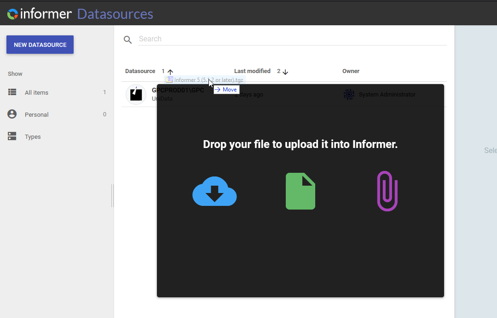
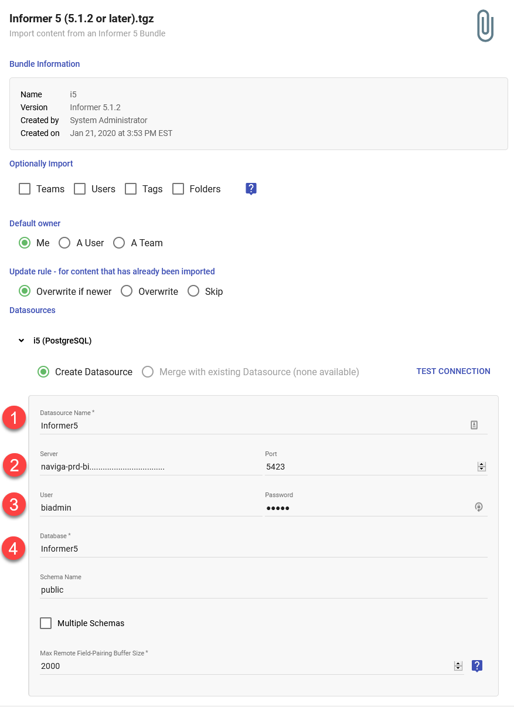
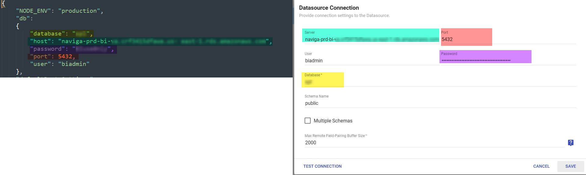
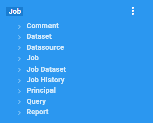
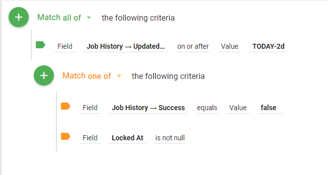

## Setting up Informer Postgres Database as Datasource

This Datasource will provide you with metadata about the Reports, Datasets and Jobs that you have created within Informer.  

One common use for this data is to track Jobs and if they are successful.  You can setup a dataset (in a job) to run every day and send you an email when a job fails or hangs. [Here is a sample](#job-status-dataset)

> NOTE: The information below is for **Informer 5.1.2 or greater only**

Download the following TGZ file to your hard drive:

**<a target="_blank" href="/downloads/Informer5--5.1.2OrLater.tgz">Informer5--5.1.2OrLater.tgz</a>**

This file has all the information needed to create the Datasource, mappings, and sample Datasets.

Once downloaded, navigate to the **Datasource** page within Informer.

Simply drag and drop the downloaded _tgz_ file onto this page:

You will then be presented with a dialog where you can enter the new Datasource information.

1. **Datasource Name** - Can be anything, but Informer5 makes sense.
2. **Server and Port** - You will need to get this information from whoever setup the Informer instance. There is a **config.json** file that will be on the server with this information, usually found in `C:\Entrinsik\Informer5`
3. **User and Password** - You will need to get this information from whoever setup the Informer instance.
4. **Database** - You must use **Informer5**

Then click **Save** and the Informer5 Datasource will be created along with all the mappings and nine sample Datasets.

To keep things organized, go to the Datasets page and find the nine Datasets just created, they will be found by looking for ones with the Datasource of "Informer5".

Create a new Folder called **Informer_System** and move these nine Datasets into it.

### Job Status Dataset

This a Job Status sample Dataset, it is pretty easy to build your own, but here is a sample one.

**<a target="_blank" href="/downloads/job-status.tgz">Sample Job Status Dataset Bundle</a>**

A few things to note about how the relationship between these tables.  The most useful relationship is between the Job and Job History mappings.

There should be one row for every job in the **Job** mapping which then links to the **Job History** mapping, which will have one row for EVERY time the job was run, hence the name history.  Most of the fields in the **Job** mapping do not change over time.  For example, the **StartOn** field is NOT when a job starts running, but is the date when the job was originally configured.

The **Job History** mapping gets a new row every time the Job runs, but it is updated at the "end" of the Job, whether it ends in success or failure.   This means that it is difficult to find jobs that are hung and never finish.  

The best way to do this is to look at the **Job.LockedAt** field.  This field gets set to a date when the job starts running and indicates that it is locked, hence it shouldn't be changed (it is locked).  The changes are held until the job finishes and then applied to the Job.

Since the Job History mapping has the data in it that we are looking for like the *success* flag, and we really only care about recent runs of the job, you will want to add criteria that filters your report by fields in the Job History mapping.  Things like the following:

- Updated At - This was the last time that the job was Updated
- Success - Boolean - true or false. 

>  NOTE: The above fields are updated when the job finishes running.

Here is a sample criteria that might be used:

This criteria will pull any job that has a history with an updated date of the current date minus two days.  This means that the job must have FINISHED in the last two days to be included.  From those results, we then look for jobs that EITHER were NOT successful OR still have a LockedAt date.  We are looking at the Locked At date because if it is not empty, then we can assume the Job is locked (or it is still running).

> NOTE: If you have a Job that runs on a weekly basis, you may need to adjust the first criteria for the Updated Date.
