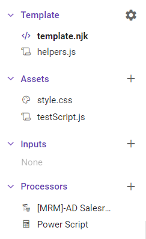
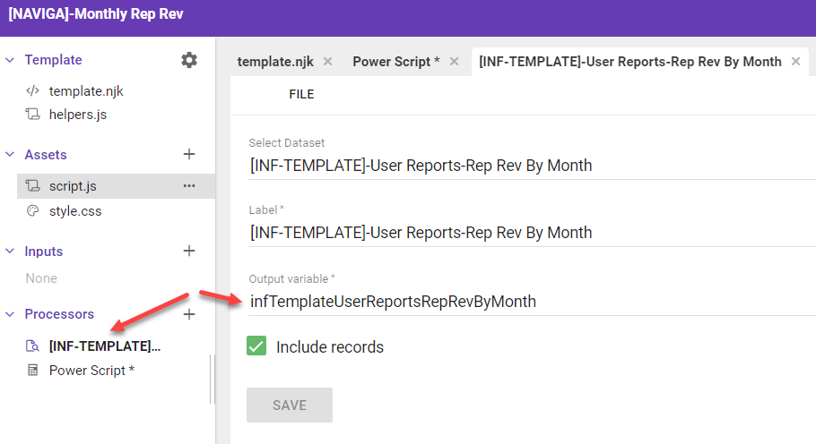
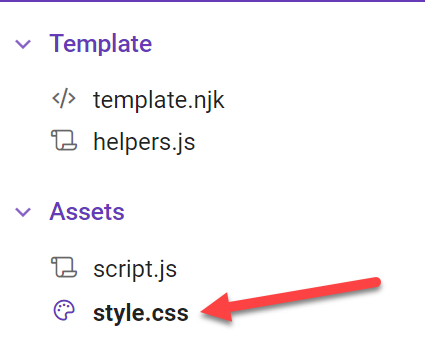

A Template is customizable format for viewing and exporting data. Using HTML for the layout, you can create different formats for displaying your data, including mail merge letters, itemized invoices, calendars, and more.

Informer uses a templating language called [Nunjucks](https://mozilla.github.io/nunjucks/) to inject data into placeholders in the completed HTML Template.

Templates can be viewed as a webpage or exported to PDFs for easy sharing.

> NOTE: In version 5.4 of Informer, Templates are still an **Experimental** feature. Use at your own risk!

## Parts of a Template

As with any HTML file, there are a number of other files that can play a role in the formatting and building of the template file.

Here is a view of these parts within the Informer Template Editor:



The core file is the `template.njk` file. This contains the main HTML for the the template.

The `helpers.js` file is always included from Entrinsik. It allows you to create functions, etc to enhance your template.

> NOTE: The functions in the helpers.js file can accept and return values, but cannot run `console.log` or `alert` functions.

**Assets**

The **Assets** section contain any additional files that you want to include in your template file. The `style.css` file is created and included by default.

The `testScript.js` is a sample that I created. In contract to the helpers.js file, you CAN run `console.log` and `alert` functions from asset JS files.

If you have a JavaScript file you want include in your template, you add the following line to your \<head\> section:

`<script type="text/javascript" src="{{ url('testScript.js')}}"></script>`

**Inputs**

The **Inputs** section will allow you to create prompts for any of the Processors that accept inputs.

**Processors**

The **Processors** section is where you declare the Ad Hoc Reports and/or Datasets that will be used in the template.

You can also include Powerscripts that will act on the data coming from the processors.

## Context

The context is a JSON formatted set of information seen on the lower right hand side of the Template Editor.

Everything in the context is available to be shown in your template. You access it using JavaScript Object Notation.

Here is the basic structure of the Context:

```json
{
  "user": { ... },
  "session": { ... },
  "inputs": {},
  "mrmAdSalesreps": {
    "query": { ... },
    "records": [
      {
        "campaignId": "6709",
        "repName": "Frank Repman",
        "salesreps_assoc_repName": "Frank Repman"
      },
      ...
    ]
  }
}
```

The `user`, `session`, and `input` are standard items that are present in all templates. The `mrmAdSalesreps` is a dataset that I added to the Processors sections.

The **important** piece that you will be using in your templates is the `records` array. It is just that, all the records returns by the query.

In you template to access the first record you would:

```html
<div>{{ mrmAdSalesreps.records[0].repName }}</div>
```

Since records is an Array, you would need to call out which record you wanted.

However, as you will see, using the Nunjucks syntax, you will be able to **loop** over the records, making it easier to access all of the records.

## Powerscript Processor

In the **Processors** section, you can also add one or more Powerscripts.  These Powerscripts do have access to **lodash** and **moment**, but you DO NOT have access to the **$local** or **$record** objects.  This is because the Processor Powerscript is run only ONCE before the Nunjucks template is rendered.

> console.log does not work in the Powerscript.

What you do have access to inside the Powerscript is the **$ctx** object, which gives you access to the whole **Context** object.

You could loop over all of the returned records and modify them as you see fit.

Here is an example of looping through the records and removing any record from period 2020-12:

```javascript
$ctx.infTemplateUserReportsRepRevByMonth.records = $ctx.infTemplateUserReportsRepRevByMonth.records.map(record => {
    if (record.period !== '2020-12') {
        return record;
    }
}).filter(el => el)
```

Another useful tool for the Powerscript area is to create **helper functions** and add them to the context object.

For example, if you want to format a revenue field, you could create the following in your Powerscript:

```javascript
$ctx.intlFormatNum = (num) => {
    
    const formatConfig = {
        style: "currency",
        currency: "USD", 
        minimumFractionDigits: 2,
        currencyDisplay: "symbol",
    };
    const enNumberFormatter = new Intl.NumberFormat("en-EN", formatConfig);
    return enNumberFormatter.format(num)
}
```

The above will create a function on your Context object that you can access in your Nunjucks template.  Notice the `{{intlFormatNum(record.RepNetByDate_Total)}}`

```html
<div style="display: flex; justify-content: space-between">
    <div>{{ record.repName}}</div>
    <div>{{intlFormatNum(record.RepNetByDate_Total)}}</div>
</div>
```


## Template Syntax

The Templating engine being used is [Nunjucks](https://mozilla.github.io/nunjucks/) by Mozilla. It is best to read their documentation for full information. This guide will review the basics needed to get information formatted.

The first thing to understand is that the Nunjucks template has access to **everything** on the Context object.  The first item of interest on the Context object is the actual data from your Processors.  

When you click on a Processor, you will get access to information panel.  The **Output variable** is the name of this processor on the Context object.



To access the records from the above Processor, you would use the following syntax:

```html
<body>
  <!-- Access an informational field on the process object  -->
  {{ infTemplateUserReportsRepRevByMonth.name }}
  
  <!-- Access a single record/field on the records array -->
  {{ infTemplateUserReportsRepRevByMonth.records[0].repName }}
  
  <!-- Since records is an Array we can use a for loop and access each array entry -->
  
  	<div>{{ record.repName}} </div>
  
</body>
```


**Sample Template**

```html
<!DOCTYPE html>
<html lang="en">

<head>
    <meta charset="UTF-8">
    <link rel="stylesheet" href="{{ url('style.css')}} ">
    <script type="text/javascript" src="{{ url('testScript.js')}}"></script>

<body>
    <div class="container">
        <div class="header">
            <div>Logo Holder</div>
            <div>Custom Info</div>
        </div>
        <div>{{ user.displayName }}- {{session.os}}</div>


        <div> {{ mrmAdSalesreps.query.name}}</div>
        
        <div
            style="margin-bottom: 2px; display: flex; flex-direction: row; justify-content: space-between; width: 80%; border: 1px solid black">
            <div> {{ rep.repName}}</div>
            <div> {{ rep.Rep_Total}} </div>
        </div>
        
        <script>
        {# function from a js file in the Assets area #}
            testFunction('{{rep.repName}}');
        </script>
        
        
        {{ myFunction() }}
    </div>
    <script>
        testFunction();
        console.log('{{ sampleVariable }}');
    </script>

</body>

</html>
```

### Looping and Totaling

THis i


```html
<!DOCTYPE html>
<html lang="en">

<head>
    <meta charset="UTF-8">
    <link rel="stylesheet" href="{{ url('style.css')}} ">

</head>
<body>
    <div>{{infTemplateUserReportsRepRevByMonth.name}}</div>
   <!-- Loop through records in Dataset processor -->
    
  
		<!-- Use an if statement and nunjucks variable to determine if a new
      period has started.  If so print out period header.
      NOTE: the data must be sorted by period for this to work
     -->
	    
  	  	
    		<h2 class="header">{{record.period}}</h2>
	    
  
  		<div class="row">
    	    <div>{{ record.repName}}</div>
      	  <div>{{intlFormatNum(record.RepNetByDate_Total)}}</div>
	    </div>
    

</body>
</html>
```


## Inject Data into JavaScript Assets

The scenario is that you want to access the data that is stored in Context within your own JavaScript scripts in the Assets section.

You will find that if you try to send and Object or Array from within a `script` tag, you will just get the string `[object, object]`.

### Option 1

The workaround is to create a couple of filter functions in the **helpers.js** file that will stringify the array or object:

**helpers.js**

```Javascript
function stringifyData(data) {
    return JSON.stringify(data)
}
```

Then when you pass your data to your function use the following syntax:

**template.njk**

```html
<html>
  <script>
    createChart("{{ mrmAdSalesreps.records | stringifyData | safe }}");
  </script>
</html>
```

Lastly, within the function that you call with this data, you must parse the stringified data back into a JavaScript "Object".

**Assets/chart.js**

```javascript
function createChart(dataIn) {
    chartData = JSON.parse(dataIn)
    ....
}
```

### Option 2

The other option is to stringify the data via a Powerscript and store in the context. Then you can skip the `stringify` filter step.

This will create a new context entry called myRecords.

```javascript
$ctx.myRecords = JSON.stringify($ctx.mrmAdSalesreps.records);
```

You will still need to run the `safe` filter and parse the data:

```html
<html>
  <script>
    createChart(JSON.parse()'{{ myRecords | safe }}'))
  </script>
</html>
```

## Styling Your Template

When styling your template, you could use inline styles or CSS classes.  The preferred method is with CSS classes.

Usually CSS Classes will come from another file with a `.css` extension that is linked to the main HTML file.

With Informer Templates, you will do this by creating an **Asset** called `style.css`.  



You can write all of your classes in this file, BUT, you still need to link this file into your main `template.njk` file.

We do this with the following `link` line in the html `head` section.

```html
<head>
    <meta charset="UTF-8">
    <link rel="stylesheet" href="{{ url('style.css')}} ">
</head>
```

### Tailwind CSS

Another way to style your template is to use the [Tailwind CSS library](https://tailwindcss.com/).  

To use this library, you will need to use their CDN and add it to your `head` section of the template file.

```html
<head>
    <meta charset="UTF-8">
    <link rel="stylesheet" href="{{ url('style.css')}} ">
    <script src="https://cdn.tailwindcss.com"></script>
</head>
```

:::tip

You can use both tailwind and a Style CSS document to style your template.

:::

