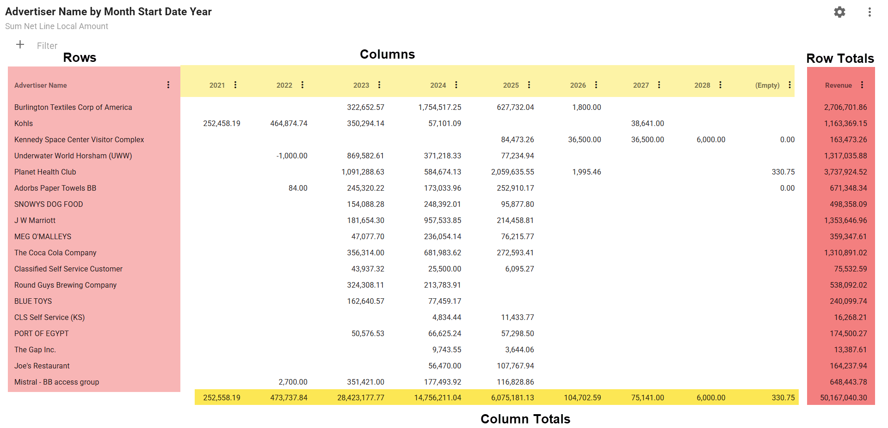
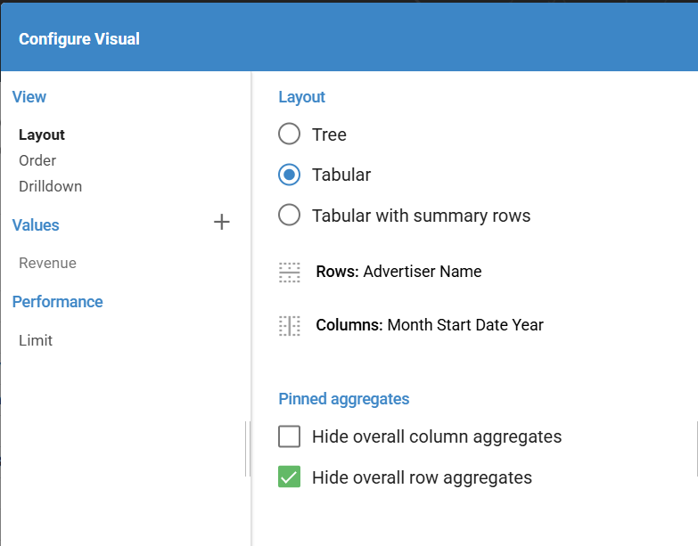
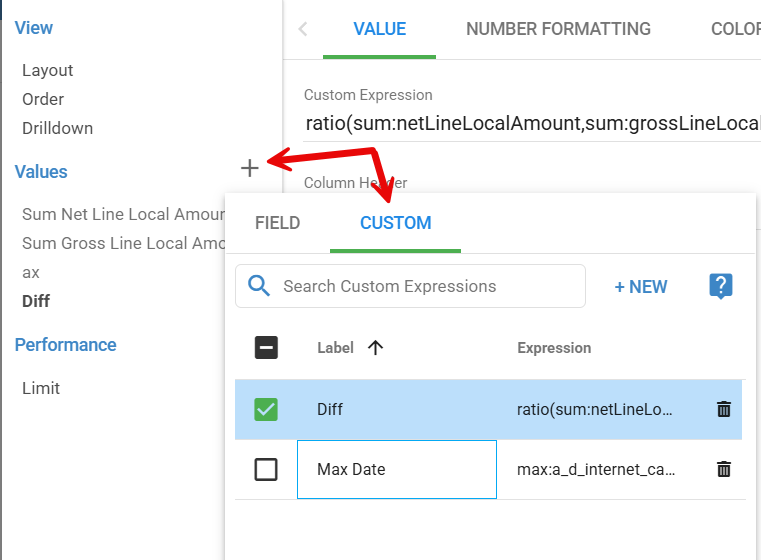
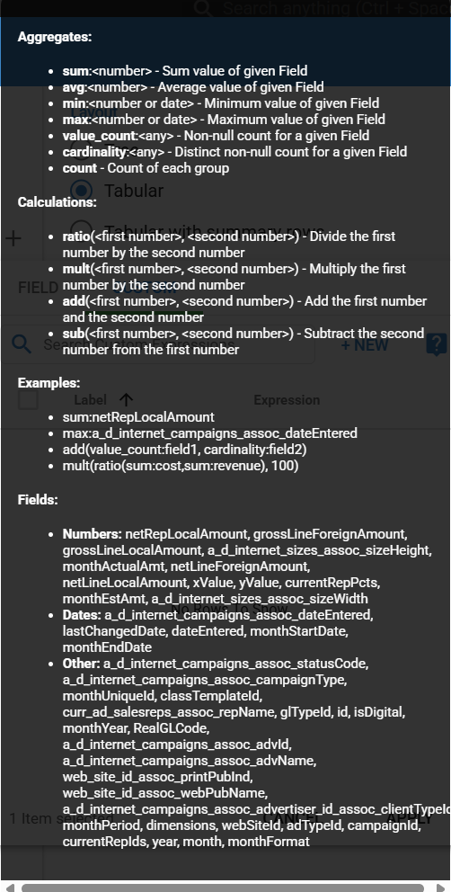
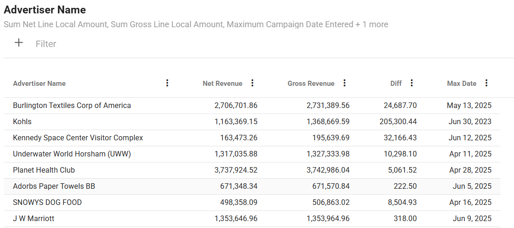

## Pivot Tables

Pivot tables are pretty straight forward.  You add Rows, Columns and Values.

Here are how those items map to the final Pivot table.

You add rows and columns to the pivot table by selecting the fields from the Rows and Columns selectors in the Configure Visual dialog.

The "Layout" section allows you to choose either 

- Tree - This option will allow you to expand and collapse your rows if you have multiple fields chosen.
- Tabular - The fields you have chosen for your rows will be always expanded.
- Tabular with summary rows - Similar to Tabular with the addition of Summary rows added.

### Pivot Table Limit Setting in Entrinsik Informer

In Entrinsik Informer, the **Limit** setting under the **Performance** section controls the number of rows and columns displayed in a pivot table. By default, it is set to 100 columns and 500 rows.

#### Row Limit Impact

The row limit is critical when your pivot table uses a field with many unique values (e.g., "Advertiser" as the row field). If your dataset contains more unique values than the row limit (e.g., over 500 unique Advertisers), the pivot table will only display the first 500 unique values encountered in the dataset. This truncation affects the pivot table's output but **does not** impact the accuracy of the **grand total**, which reflects the entire dataset.

**Key Considerations**

- **Exporting to CSV**: If you export the pivot table to CSV, the output will include only the displayed rows (e.g., the first 500 Advertisers). Summing the values in the CSV will not match the dataset's total, as it excludes data beyond the limit.
- **Sorting by Values**: When sorting by a value (e.g., Revenue), the sort is applied only to the limited set of rows (e.g., the first 500 Advertisers). This means you won’t see the true top performers if the dataset contains more unique values than the limit.

#### Recommendation

To ensure accurate results, adjust the **Limit** setting to accommodate all unique values in your row field. For example, if your dataset has 1,000 unique Advertisers, set the row limit to 1,000 or higher.

### Custom Values

Custom values is a new feature release in Informer v2025.1.0. It adds a much needed feature that allows you code in a value using multiple fields in your dataset.

An example would be if you had Net Revenue and Gross Revenue columns in your dataset and you wanted to get a difference between those columns.

You create custom values by choosing the CUSTOM tab when adding values.

Creating these Custom values is a bit tedious.  Using the "?" button will be helpful as it lists the available field names that you can use in your calculations.

We are going to create two example custom fields:

- Diff - Difference between the Net and Gross revenue amounts
- Max Date - The Max Start Date for our aggregation.

First, we will look at the "?" (help information):

This help sections gives us some examples of the syntax and also the actual Field names that we can use in our calculations.

We have options for **Aggregations** and **Calculations**.  Here is a list:

**Aggregates:**

- **sum:<number>** – Sum value of given Field
- **avg:<number>** – Average value of given Field
- **min:<number or date>** – Minimum value of given Field
- **max:<number or date>** – Maximum value of given Field
- **value\_count:<any>** – Non-null count for a given Field
- **cardinality:<any>** – Distinct non-null count for a given Field
- **count** – Count of each group

**Calculations:**

- **ratio(<first number>, <second number>)** – Divide the first number by the second number
- **mult(<first number>, <second number>)** – Multiply the first number by the second number
- **add(<first number>, <second number>)** – Add the first number and the second number
- **sub(<first number>, <second number>)** – Subtract the second number from the first number

First, we need to decide what kind of **aggregation** we are going to do.  For our Gross minus Net Revenue calculation, we will use the **sum** aggregation.  But we don't just want to sum the values, we want the difference between them.  This means we will need to pass our **sum aggregations** to a *calculation function*.  From the list above, **sub** is the one we need.

**Diff** calculation:

`sub(sum:netLineLocalAmount,sum:grossLineLocalAmount)`

This is telling Informer to aggregate by whatever rows are showing in the Pivot table and sum each of the fields.  Then subtract them from each other.

For our Max Date, we just need to aggregate using the max aggregation keyword:

**Max Date** calculation:

`max:a_d_internet_campaigns_assoc_dateEntered`

Make sure you have the checkbox checked next to each custom calculation you want shown.

Here is the final pivot table:

